---
title: كائن يحادث
level: Scratch 1
language: ar-DZ
stylesheet: scratch
embeds: "*.png"
materials: ["Club Leader Resources/.*"]
...

# مقدمة { .intro }

سوف تتعلم كيف تبرمج كائنا يتحدث من تصميمك الخاص

<div class="scratch-preview">
  <iframe allowtransparency="true" width="485" height="402" src="http://scratch.mit.edu/projects/embed/138539895/?autostart=false" frameborder="0"></iframe>
  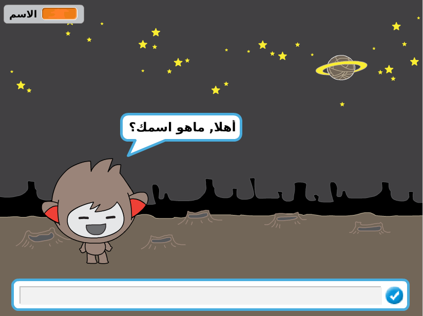
</div>

# المرحلة الأولى:شخصية الكائن  { .activity }

## قائمة النشاطات { .check }

+ قبل البدأ ينبغي عليك اختيار الشخصية.
	+ ماهو اسمها?
	+ اين تعيش?
	+ هل هي سعيدة؟صارمة؟مضحكة؟ أم صديقة؟

+  ابدأ مشروع سكراتش جديد و احذف شخصية القط ليكون مشروعك فارغا.يمكنك ايجاد محرر لسكراتش أونلاين على<a href="http://jumpto.cc/scratch-new">jumpto.cc/scratch-new</a>.

+ اختر أحد هذه الكائنات و أضفها لمشروعك:

	

+   اختر خلفية تناسب الكائن الذي اخترته.يمكنك اختيار ماتشاء, اليك مثالا عن ذلك

	

## اخفظ مشروعك { .save }

# المرحلة الثانية: كائن يتحدث { .activity }

الآن وقد اخترت الشخصية لنجعلها تتكلم.

## قائمة النشاطات { .check }

+انقر على الكائن و أضف البرمجة التالية:

	```blocks
		when this sprite clicked
		ask [أهلا، ماهو اسمك ؟] and wait
		say [خير الأسامي !] for (2) secs
	```

+ انقر على الكائن لتجربته عندمايسألك عن اسمك اكتبه في الخانة الواقعة في أسفل الشاشة.

	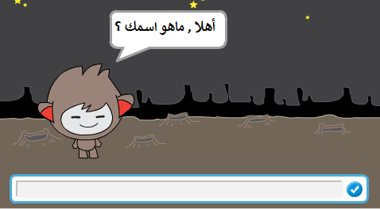

+ الكائن يرد عليك 'خير الأسامي !' كل مرة . حاول تعديل رد الكائن،يمكنك استعمال اجابة المستخدم (الذي هو أنت في هذه الحالة) لهذا الغرض .عدل برنامجك ليبدو مثل هذا:
	```blocks
		عند نقر هذا الكائن
		ask [أهلا، ماهو اسمك ] and wait
		قل (اربط [Hi] (الإجابة)) لمدة (2) ثانية
	```

	كي تنشئ القطعة الأخيرة يلزمك سحب القطعة الخضراء 'اربط' ثم
	وضعها داخل القطعة 'قل'.مثل التالي
	
	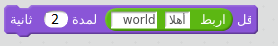

	يمكنك الآن تغيير النص الاجنبي الى 'أهلا'و سحب القطعة الزرقاء 'الاجابة'++ ستجدها في جزء العمليات و ادخالها الى النص               `world`.
	
         
	 
	

+ جرب هذا برنامجك الجديد .هل يعمل كما توقعت ؟ هل تستطيع اصلاح المشاكل التي تراها؟ (تلميح: حاول الاضافة في مكان  معين!)هاه

+ ربما تريد أن تحفظ اسم المستخدم في متغير , كي يتسنى لك استعماله مرة أخرى .أنشئ متغيرا جديدا اسمه 'الاسم'{.blockdata} .اذا نسيت كيف تقوم بذلك طالع على برنامج البالون ليساعدك.

+ المعلومات التي أدخلتها من قبل يتم حفظها في متغير خاص 'الاجابة'-- .اذهب الى قسم التحسس و انقر على خانة التحقق بجوار قطعة 'الاجابة'-- .قيمة هذه 'الاجابة'-- سوف تظهر في أعلى يسار المنصة . 

+ عند انشاءك المتغير, تأكد أن برمجة كائنك تبدو كالتالي : 
	```blocks
		when this sprite clicked
		ask [أهلا, ماهو اسمك؟] and wait
		set [name v] to (الاجابة)
		say <join [أهلا ] (الاسم)> for (2) secs
	```

+ لدى تجرتك لبرنامجك مجددا , سوف تلاحظ أن الاجابة حفظت في المتغير 'الاسم'-- و سوف يظهر في أعلى يسار المنصة.الان من المفروض أن  المتغير 'الاسم'-- يحمل نفس القيمة كالتي في 'الاجابة'-- .انظر :


	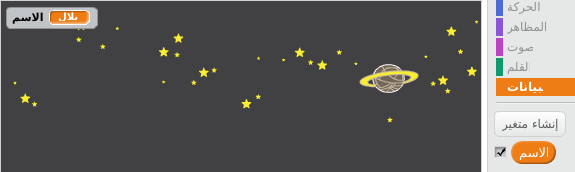

	ان كنت ترغب في اخفائه عن منصتك ,انقر على العلامة بجانب اسم المتغير تجده في قسم البيانات لاخفائهم . 
	
## احفظ مشروعك { .save }

## تحدي: أسئلة اظافية { .challenge }

 برمج كائنك المحادث ليسأل أسئلة أخرى .هل بإمكانك حفظ الاجابة في متغير ؟ 


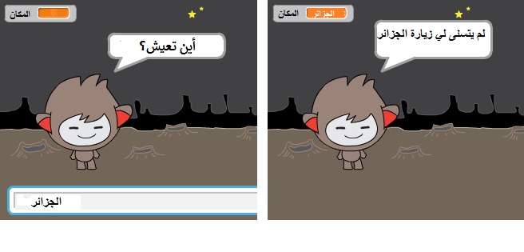

## احفظ مشروعك { .save }

# المرحلة الثالثة: اتخاذ القرارات { .activity }

بإمكانك برمجة كائنك المحادث ليقرر ما سيفعله, على حسب رد المستخدم

## قائمة النشاطات { .check }

+ هيا نجعل كائنك المحادث ليسأل المسختدم حيث يجيبه ب'نعم' أو 'لا', لكن بإمكانك تغير السؤال اذا أردت

	```blocks
		when this sprite clicked
		ask [أهلا , ماهو اسمك ؟] and wait
		set [name v] to (الاجابة)
		say <join [أهلا ] (namee)> for (2) secs
		ask <join [هل أنت على مايرام؟ ] (name)> and wait
		if ((answer)=[نعم]) then
			say [هذا جيد جدا!] for (2) secs
		end
	```

	لاحظ أنك الآن حفظت اسم المستخدم في متغير,بامكانك استعماله كما تريد و عدة مرات أيضا.

+ 'لتجربت البرنامج بنجاح, تحتاج لترجبته مرتين-واحدة بلا و الأخرى بنعم.من المفروض أن تتلقى الرد من الكائن 'اذا'-- أجبته ب'نعم . 

+ مشكلة كائنك أنه لا يرد على الاجابة ب 'لا'.يمكنك اصلاحه من خلال تغيير القطعة 'اذا'-- 'الى اذا/وإلا'-- حتى يبدو برنامجك متل الآتي:  

	```blocks
		when this sprite clicked
		ask [أهلا , ما هو اسمك؟] and wait
		set [الاسم] to (answer)
		say <join [أهلا  ] (name)> for (2) secs
		ask <join [هل أنت على ما يرام ! ] (name)> and wait
		if ((answer)=[نعم]) then
			say [هذا جيد جدا؟] for (2) secs
		else
			say [أووو لا !] for (2) secs
		end
	```

+ اذا جربت برنامجك ,سوف ترى الآن أنك تحصل على الرد اذا أجبت ب نعم أو لا .من المفترض أن كائنك المحادث سيرد ب هذا جيد جدا  

	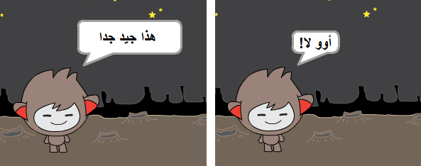

+ بإمكانك ادخال أي برمجة داخل القطعة 'اذا'-- أو 'وإلا'--,ليس فقط البرمجة التي تجعله يتكلم .على سبيل المثال, باستطاعتك تغيير مظهر الكائن كي تتوافق مع الاجابة .

	اذا ألقيت نظرة على المظاهر لكائنك المحادث,سوف تجد أنه يملك عدة مظاهر.أيظا يمكنك دائما اظافة مظاهر أخرى.
	

	

	يمكنك استعمال هته المظاهر كجزء من استجابة الكائن لك , من خلال اظافتك للبرمجة التالية:
	

	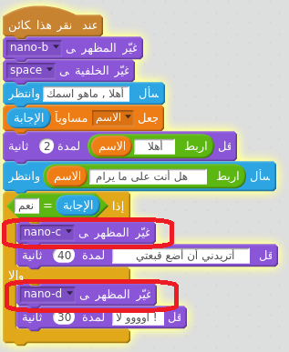

+ جرب برنامجك ,من المفروض أن ترى وجه الكائن قد تغير على حسب اجابتك.


	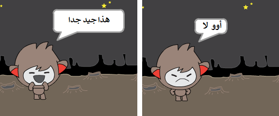

## احفظ ملفك { .save }

## تحدي: قرارات اظافية { .challenge }

 برمج كائنك ليسأل سؤالا آخر ليجيبك ب 'نعم' أو 'لا' .هل بامكانك جعل كائنك يرد لك باجابة ؟

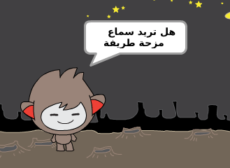

## احفظ مشروعك { .save }

# المرحلة الرابعة : تغيير الموقع { .activity }

بامكانك أيضا برمجة كائنك لتغيير موقعه.

## قائمة النشاطات { .check }

+ اضف خلفية اخرى لمنصتك, خلفية 'القمر' على سبيل المثال

	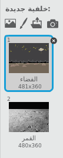

+ الآن يمكنك تغيير موقعه باضافتك لهذه البرمجة لكائنك:

	```blocks
		اسأل [أنا ذاهب الى القمر, هل تود الذهاب معي] وانتظر
		<(الإجابة) = [yes]> إذا
		   غيّر الخلفية إلى [moon v]
		end
	```

+  يتوجب عليك أيضا أن تجعل كائنك المتحدث في الفضاء الخارجي لدى تكلمك معه .اضف هذه القطعة البرمجية فوق باقي القطع:

	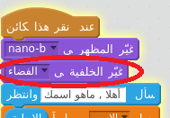

+ تفقد برنامجك و أجب ب نعم عندما يسألك اذا تريد الذهاب معه الى القمر.من المفترض أن ترى موقع الكائن قد تغير.

	

+ هل كائنك المتحدث سيغر مكانه اذا اجبته ب 'لا' ؟

+ بامكانك أيضا اضافة هذة القطعة البرمجية'اذا ,لجعل كائنك يفز 4 مرات اذا كانت الاجابة ب 'نعم' كالآتي:

	```scratch
	repeat (4)
		change y by (10)
		wait (0.1) secs
		change y by (-10)
		wait (0.1) secs
	end
	```

	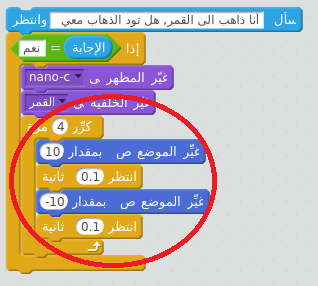

+ جرب كائنك المتحدث مجددا .هل يقفز عندما  تجيبه ب 'نعم'؟

## احفظ مشروعك { .save }

## تحدي: صمم كائنك المتحدش الخاص {.challenge}
 استخدم ما تعلمته لانهاء كائنك الخاص . اليك بعض الافكار :


عند انتهائك من انشاء مشروعك الخاص , اخبر أصدقائك.هل أعجبهم مشروعك ؟ هل تعرفو عل أية أخطاء فيه ؟ 

## احفظ مشروعك { .save }
