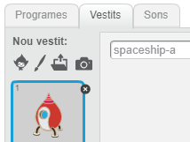
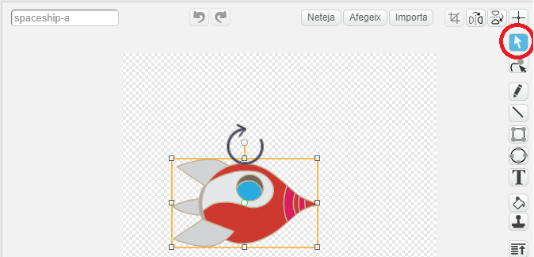
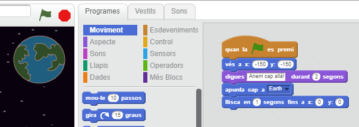
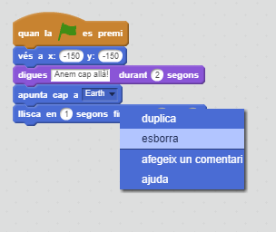
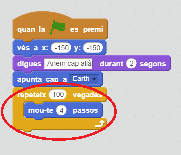
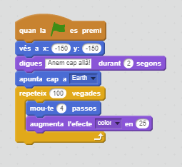
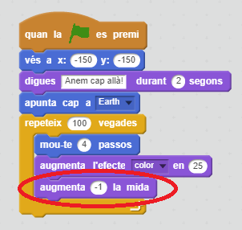
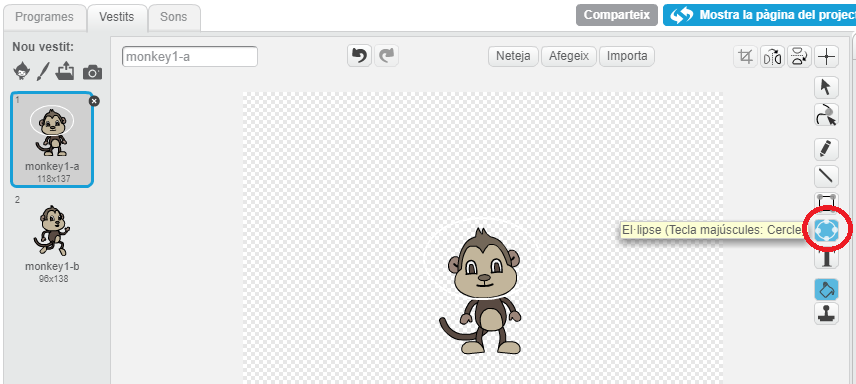
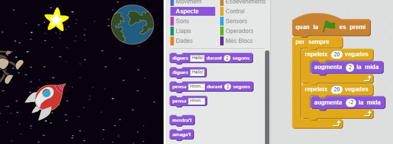

---
title: Perduts a l'espai
level: Scratch 1
language: ca-ES
stylesheet: scratch
embeds: "*.png"
materials: ["Recursos per els caps de Club/*.*"]
...

# Introducció { .intro }

A continuació aprendràs a programar la teva pròpia animació!

<div class="scratch-preview">
  <iframe allowtransparency="true" width="485" height="402" src="http://scratch.mit.edu/projects/embed/26818098/?autostart=false" frameborder="0"></iframe>
  
</div>

# Pas 1: Animar una nau espacial { .activity .new-page}

Farem una nau espacial que voli cap a la Terra!

## Llista de tasques de l'activitat { .check }

+ Crea un projecte nou a l'Scratch, i esborra el personatge gat perquè et quedi el projecte buit. Pots trobar l'editor d'Scratch en línia a <a href="http://jumpto.cc/scratch-new">jumpto.cc/scratch-new</a>.

+ Afegeix els personatges "Spaceship" (Nau espacial) i "Earth" (Terra) a l'escenari. A més a més, hauràs d'afegir el fons "Stars" (Estrelles) al teu escenari. El teu escenari s'hauria d'assemblar a aquest:

	

+ Fes clic al nou personatge de la nau espacial, i selecciona la pestanya "Vestits".

	

+ Utilitza l'eina amb la icona de la fletxa per seleccionar la imatge. Després clica el petit cercle per fer girar la imatge, fes-la girar fins que la nau estigui de costat.

	

+ Afegeix el programa següent al personatge de la nau espacial:

	

	Canvia els números de dins dels blocs perquè el programa sigui exactament igual a la imatge anterior.

+ Si fas clic a sobre el programa per executar-lo, hauries de veure com parla la nau, gira i es mou cap al centre de l'escenari.

	

	La posició de la pantalla `x:(0) y:(0)` {.blockmotion} és el centre de l'escenari. La posició `x:(-150) y:(-150)` {.blockmotion} està a la part inferior esquerra de l'escenari, i una la posició `x:(150) y:(150)` {.blockmotion} està a prop de la part superior dreta.

	

	Si necessites saber les coordenades d'una posició concreta dins de l'escenari, mou el ratolí a la posició que vulguis saber i apunta't les coordenades que apareixen a sota l'escenari.

	

+ Prova la teva animació fent clic a la bandera verda de sobre l'escenari.

	

## Repte: Millora la teva animació {.challenge}
Pots canviar els números del programa de la teva animació, de tal manera que:
+ la nau espacial es mogui fins a tocar la Terra?
+ la nau espacial es mogui més lentament fins a la Terra?

Hauràs de canviar els números del bloc següent:

```blocks
	llisca en (1) segons fins a x:(0) y:(0)
```

## Desa el teu projecte { .save }

# Pas 2: Animar fent servir bucles { .activity .new-page }

Una altra manera d'animar la nau espacial és dir-li que es mogui distàncies petites, moltes vegades.

## Llista de tasques de l'activitat { .check }

+ Elimina el bloc `llisca` {.blockmotion} del teu programa clicant el bloc amb el botó dret i seleccionant "esborra". També pots esborrar el programa arrosegant-lo de la zona de Programes a la zona on es troben els blocs de codi.

	

+ Una vegada hagis eliminat el bloc anterior, en el seu lloc, afegeix aquest programa:

	

	El bloc `repeteix` {.blockcontrol} es fa servir per repetir alguna cosa moltes vegades, i també es coneix com un __bucle__.

+ Si cliques la bandera verda per provar aquest programa nou, veuràs que la nau fa gairebé el mateix que abans.

+ Pots afegir més blocs al teu bucle, per fer coses molt interessants. Afegeix el bloc `augmenta l'efecte color en 25` {.blocklooks} (de la secció "Aspecte") a dins del bucle, para canviar el color de la nau espacial repetidament a mesura que es mou:

	

+ Clica la bandera verda per veure la teva nova animació.

	

+ També pots fer que la teva nau espacial es faci més petita a mesura que es mogui cap a la Terra.

	

+ Prova la teva animació. Què passa si cliques la bandera verda per segona vegada? La teva nau espacial torna a començar amb la mida correcta? Pots fer servir aquest bloc per fixar la teva animació:

	```scratch
	        fixa la mida a (100)%
	```

## Desa el teu projecte { .save }

# Pas 3: Mico flotant { .activity .new-page }

Ara afegirem un mico que està perdut a l'espai, a la teva animació!

## Llista de tasques de l'activitat { .check }

+ Afegeix el personatge "Monkey" (mico) de la galeria.

	

+ Si cliques el teu nou personatge i després vas a "Vestits", podràs editar l'aspecte del teu mico. Fes clic a l'eina "El·lipse" i dibuixa un casc espacial blanc al voltant del cap del mico.

	

+ A continuació fes clic a "Programes", i afegeix aquest programa al teu mico perquè giri lentament (i en cercles) per sempre:

	```blocks
        quan la ⚑ es premi
        per sempre
           gira ↻ (1) graus
        fi
	```

	El bloc `per sempre` {.blockcontrol} és un altre bucle, però en aquest cas, és un bucle que no s'acaba mai.

+ Clic a la bandera verda per provar el teu mico. Hauràs de clicar el botó d'aturar el programa (al costat de la bandera verda) per acabar aquesta animació.

	

# Pas 4: Asteroides que reboten { .activity .new-page }

A continuació afegirem algunes roques espacials que flotin a la teva animació.

## Llista de tasques de l'activitat { .check }

+ Afegeix el personatge "Rocks" (roca) a la teva animació.

	

+ Afegeix aquest programa a la teva roca, per fer que reboti per tot l'escenari:

	```scratch
        quan la ⚑ es premi
        apunta cap a [Earth v]
        per sempre
           mou-te (2) passos
           rebota en tocar una vora
        fi
	```

+ Clica la bandera verda per provar la teva roca. Rebota per tot l'escenari?

# Pas 5: Estrelles que brillen { .activity .new-page }

Ara combinarem bucles per fer una estrella que brilli.

## Llista de tasques de l'activitat { .check }

+ Afegeix el personatge "Star" (Estrella) a la teva animació

	

+ Afegeix aquest programa a la teva estrella:

	

+ Clica la bandera verda per provar l'animació de l'estrella. Què fa aquest programa? Doncs, l'estrella es fa una mica més gran 20 vegades i després es fa una mica més petita 20 vegades, fins a arribar a la seva mida original. Aquests 2 bucles estan dins d'un bucle `per sempre` {.blockcontrol}, perquè així l'animació es repeteixi sempre.

## Desa el teu projecte { .save }

## Repte: Crea la teva pròpia animació {.challenge}
Atura la teva animació espacial, clica a "Fitxer" i després a "Nou", per començar un projecte nou.

Fes servir el que has après en aquest projecte per crear la teva pròpia animació. Pot ser qualsevol cosa que vulguis, però intenta que l'animació concordi amb l'escenari. Aquí et donem alguns exemples:


## Desa el teu projecte { .save }

## Community Contributed Translation { .challenge .pdf-hidden }

This project was translated by Laia Albó from Codeclubcat. Our amazing translation volunteers help us give children around the world the chance to learn to code.  You can help us reach more children by translating a Code Club project via [Github](https://github.com/CodeClub/curriculum_documentation/blob/master/contributing.md) or by getting in touch with us at hello@codeclubworld.
