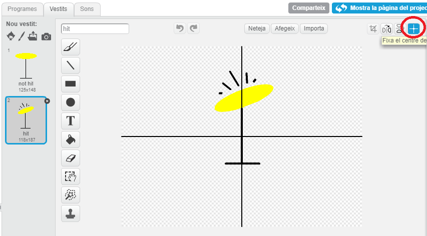

---
title: Grup de Rock — Notes pels Caps de Club
language: ca-ES
embeds: "*.png"
materials: [""]
...

#Introducció
En aquest projecte, la classe veurà com afegir so i música als seus projectes. A més a més, aprendrà a canviar els vestits i programar els seus personatges.

#Recursos
Per realitzar aquest projecte cal utilitzar Scratch 2, que es pot trobar en línia [jumpto.cc/scratch-on](http://jumpto.cc/scratch-on) o bé, es pot descarregar des de [jumpto.cc/scratch-off](http://jumpto.cc/scratch-off) i utilitzar-se sense estar connectat a Internet.

La versió completa d'aquest projecte es pot trobar a <a href="http://scratch.mit.edu/projects/26741186/#editor">online</a>, o es pot descarregar fent clic a l'enllaç 'Descarregar Materials del projecte', que conté:

+ RockBand.sb2

#Objectius d'aprenentatge
+ Personatges;
+ Vestits;
+ Blocs de codi seqüencial;
+ Esdeveniments;
+ So i música.

#Reptes
+ "Millorar el teu tambor" – Canviar sons del teu personatge i afegir esdeveniments;
+ "Canviar de vestit a la cantant" – afegir i controlar els vestits del teu personatge;
+ "Crear el teu propi grup" – utilizar el que s'ha après per crear instruments nous.

#Preguntes freqüents
+ Al crear personatges nous, és possible que es moguin de lloc al fer-los clic a sobre, quan canvien de vestit. Això és degut a que els dos vestits no estan centrats al mateix punt.

	Per solucionar-ho, fes clic a "Fixa el centre del vestit", en ambdós personatges, i assegura't que estiguin centrats en el mateix punt.

	

+ A Linux, és possible que no funcioni l'opció de clicar el botó dret per eliminar un personatge. Si això passa, manté la tecla de les majúsucles presionada i clica amb el botó esquerre del ratolí per veure el menú que permet eliminar el personatge.
