---
title: Grup de Rock
level: Scratch 1
language: ca-ES
stylesheet: scratch
embeds: "*.png"
materials: ["Club Leader Resources/*.*"]
...

# Introducció { .intro }

En aquest projecte aprendràs a programar els teus propis instruments musicals!

<div class="scratch-preview">
  <iframe allowtransparency="true" width="485" height="402" src="http://scratch.mit.edu/projects/embed/26741186/?autostart=false" frameborder="0"></iframe>
  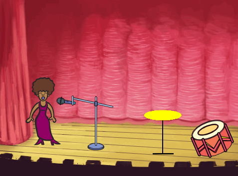
</div>

# Pas 1: Personatges { .activity }

Per poder començar a animar, necessites afegir alguna "cosa" per animar. A l'Scratch, aquestes “coses” es diuen __personatges__.

## Llista de tasques de l'activitat { .check }

+ Per començar, obre l'editor d'Scratch. Pots trobar-lo a <a href="http://jumpto.cc/scratch-new">jumpto.cc/scratch-new</a>. Aquest és el seu aspecte:

	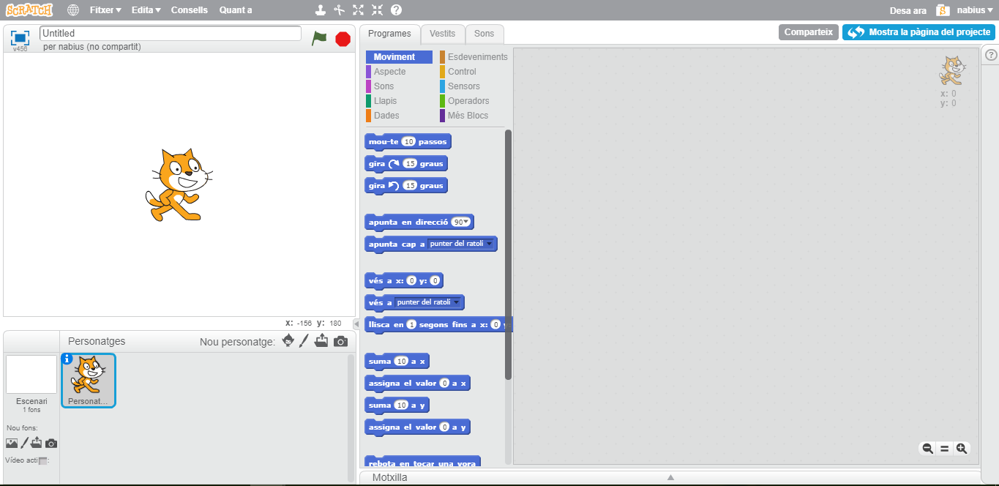

+ El personatge gat que veus és la mascota d'Scratch. Elimina'l fent un clic amb el botó dret del ratolí i després un altre clic a “esborra”.

	

+ Després, clica a “Tria un personatge de la galeria” per obrir la llista de tots els personatges d'Scratch.

	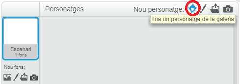

+ Baixa fins que trobis el personatge d'un tambor. Selecciona un tambor i clica a “D'acord” per afegir-lo al teu projecte.

	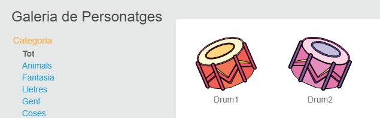

+ Fes un clic a la icona d'“encongeix”, i després fes clic al tambor unes quantes vegades per fer-lo més petit.

	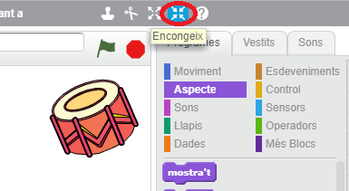

## Desa el teu projecte { .save }

Posa-li un nom al teu projecte escrivint a la casella de text de la part de dalt de l'escenari.

Després, fes un clic a "Fitxer" i "Desa ara" per guardar el teu projecte.

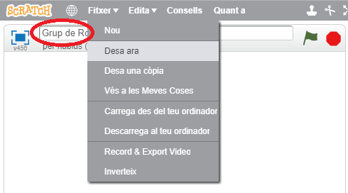

# Pas 2: L'escenari { .activity }

L' __escenari__ és la zona que es troba a l'esquerra, i és on el teu projecte prendrà vida. Imagina't que és la zona on es fa l'actuació, com en un escenari real!

## Llista de tasques de l'activitat { .check }

+ En aquests moments, l'escenari és de color blanc i sembla molt avorrit! Afegirem un nou fons per l'escenari clicant a “Tria un fons de la galeria”.

	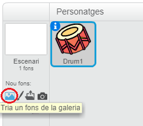

+ A la part esquerra, clica el menú "Interiors" i selecciona un fons d'escenari. Quan l'hagis escollit, fes clic al botó "D'acord".

	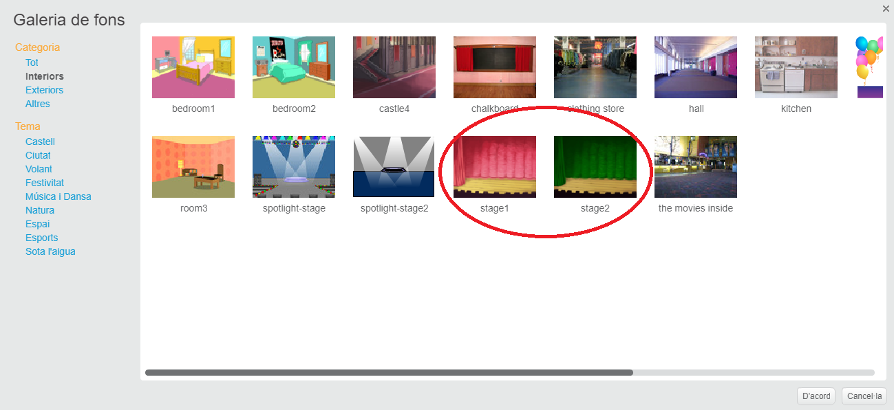

+ Ara el teu escenari s'hauria d'assemblar a aquest:

	

# Pas 3: Crear un tambor { .activity }

En aquest pas, programarem el teu tambor perquè soni quan el toquis.

## Llista de tasques de l'activitat { .check }

+ Pots trobar els blocs de codi a la pestanya "Programes", veuràs que tenen diferents colors!

	Fes clic al personatge tambor i després arrosega aquests dos blocs a la zona de programes de la dreta, assegurant-te que estiguin connectats (ben junts, com si fossin peces de lego):

	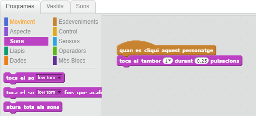

+ Clica el tambor per provar el teu nou instument!

+ També pots canviar l'aspecte del teu tambor quan el cliquin, creant un vestit nou. Fes clic a la pestanya "Vestits", i veuràs la imatge del tambor.

	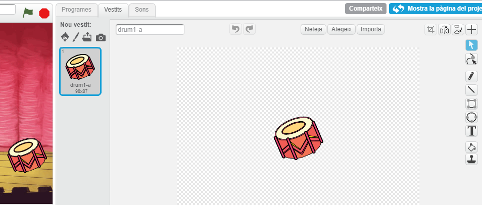

+ Fes clic amb el botó dret del ratolí sobre el vestit i selecciona "duplica" per fer una còpia del vestit.

	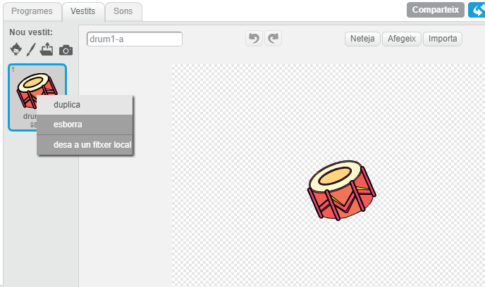

+ Clica el nou vestit (que es diu "tambor 2"), selecciona l'eina de "línia" i dibuixa línies perquè sembli que el tambor estigui fent sons.

	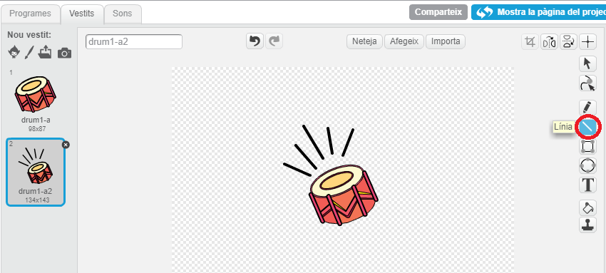

+ Ara mateix els noms dels dos vestits del tambor no són gaire útils. Canvia els noms dels 2 vestits a "sense tocar" i "tocant" escrivint el nom nou per a cada vestit al requadre de text.

	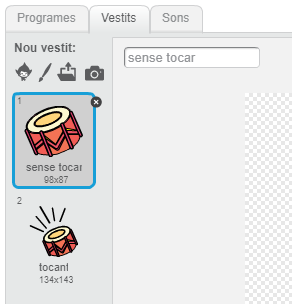

+ Ara que ja tens 2 vestits diferents pel teu tambor, pots escollir quin vestit es mostra! afegeix aquests dos blocs de codi al teu tambor:

	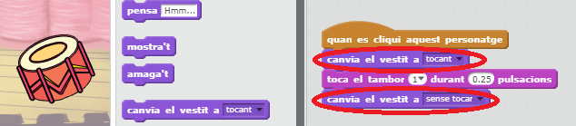

	El bloc de codi per canviar de vestit és al menú "Aspecte" {.blocklooks}.

+ Prova el teu tambor. Quan el cliques, hauria de semblar que algú el toca!

## Desa el teu projecte { .save }

##Repte: Millorar el teu tambor { .challenge }

+ Pots canviar el so que fa el teu tambor quan el cliques?

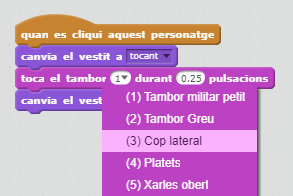

+ Pots fer que el tambor soni també quan es premi la tecla "espai"? necessitaràs aquest bloc del menú "Esdeveniments" {.blockevents}:

```scratch
	quan la tecla espai es premi
```

Pots copiar el programa que ja tens fent clic sobre seu amb el botó dret del ratolí i seleccionant "duplica".

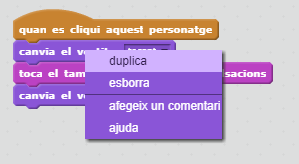

## Desa el teu projecte { .save }

# Pas 4: Crea una cantant { .activity .new-page }

Afegim una cantant al teu grup!

## Llista de tasques de l'activitat { .check }

+ Afegeix 2 personatges més al teu escenari: una cantant i un micròfon.

	

+ Per fer que la teva cantant canti, necessitaràs afegir un so al teu personatge. Assegura't d'haver seleccionat la cantant, fes clic a la pestanya "Sons" i clica la icona "Tria un so de la galeria":

	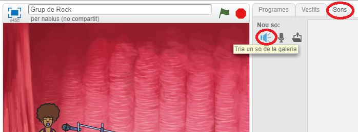

+ Si cliques el menú "Veus" de l'esquerra, podràs escollir un so adequat per a la teva cantant.

	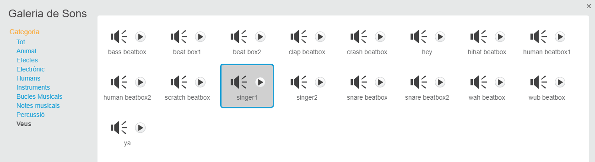

+ Ara que ja has afegit el so, pots afegir el codi següent a la teva cantant:

	```scratch
		quan es cliqui aquest personatge
		toca el so singer1 fins que acabi
	```

+ Prova la teva cantant per assegurar-te de que canta quan li fas clic a sobre.

## Desa el teu projecte { .save }

##Repte: Canviar el vestit de la cantant { .challenge }
Pots fer que sembli que la teva cantant canta quan la cliques? Si necessites ajuda, pots fer servir les instruccions que has fet servir abans per fer el mateix amb el tambor.


No t'oblidis de provar que el teu programa nou funciona!

## Desa el teu projecte { .save }

##Repte: Crear el teu propi grup musical { .challenge }
Utilitza el que has après en aquest projecte per crear el teu propi grup musical! Pots crear l'instrument que vulguis, però fixa't en els sons i els instruments que tens disponibles a les galeries de sons i personatges per afagar algunes idees.

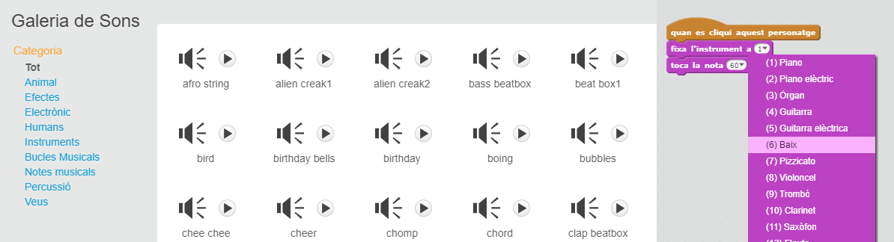

Tot i així, els teus instruments no tenen perquè ser lògics. Per exemple, pots crear un piano fet de magdalenes!


Pots fer servir personatges que ja existeixen o bé pots dibuixar els teus propis personatges!

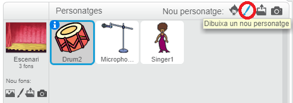

Si tens un micròfon pots gravar els teus propis sons o, fins i tot, fer servir una càmera web per tocar els instruments!

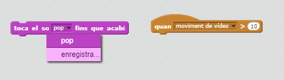

## Desa el teu projecte { .save }

## Community Contributed Translation { .challenge .pdf-hidden }

This project was translated by Laia Albó from Codeclubcat. Our amazing translation volunteers help us give children around the world the chance to learn to code.  You can help us reach more children by translating a Code Club project via [Github](https://github.com/CodeClub/curriculum_documentation/blob/master/contributing.md) or by getting in touch with us at hello@codeclubworld.