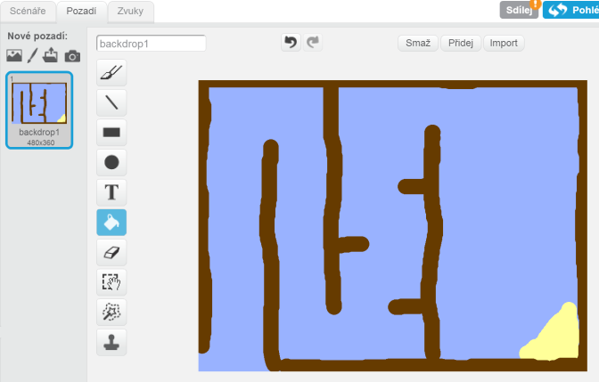
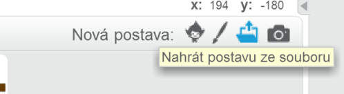
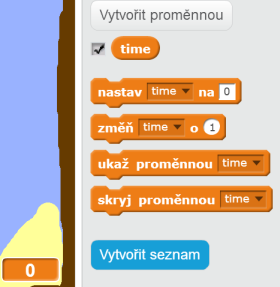

---
title: Závod lodí
level: Scratch 1
language: cs-CZ
stylesheet: scratch
embeds: "*.png"
materials: ["Club Leader Resources/*","Project Resources/*"]
...

# Úvod { .intro }

Naučíš se jak vytvořit hru, ve které budeš používat myš k navigaci loďky na opuštěný ostrov.

<div class="scratch-preview">
  <iframe allowtransparency="true" width="485" height="402" src="http://scratch.mit.edu/projects/embed/63957956/?autostart=false" frameborder="0"></iframe>
  
</div>

# Krok 1: Naplánování hry { .activity }

## Seznam úkolů { .check }

+ Vytvoř si nový projekt a smaž kočičku, takže tvůj projekt bude prázdný. Online editor můžeš nalézt zde: <a href="http://jumpto.cc/scratch-new">jumpto.cc/scratch-new</a>.

+ Naplánuj si tvůj level hry. Klikni na Scénu a na záložku "Pozadí". Měl(a) bys přidat:
	+ Dřevo, kterému se bude loďka vyhýbat;
	+ Opuštěný ostrov, na kterém má loďka přistát.

	Tady je obrázek, jak by měla tvoje hra vypadat:

	 

# Krok 2: Ovládání loďky { .activity }

## Seznam úkolů { .check }

+ Pokud ti dal vedoucí klubu adresář se soubory, klikni na 'Nahrát postavu ze souboru' a vyber obrázek 'boat.png'. Měl bys zmenšit obrázek a vložit ho na startovní pozici.

	

	Pokud obrázek nemáš, můžeš si loďku nakreslit!

+ Abys mohl(a) ovládat loďku myší, přidej tento kód:

	```blocks
		po kliknutí na ⚑
		natoč se směrem (0 v)
		skoč na pozici x: (-190) y: (-150)
		opakuj dokola
			natoč se k [ukazatel myši v]
			posuň se o (1) kroků
		end
	```

+ Vyzkoušej loďku tak, že klikneš na zelenou vlaječku a budeš hýbat myší. Plave loďka za myší?

	

+ Co se stane, když loďka doplave ke kurzoru myši?

	Abys tomuto chování zabránil(a), musíš přidat blok `když` {.blockcontrol} tak, aby se loďka pohybovala jen když je dále než 5 pixelů od myši.

    ```blocks
		po kliknutí na ⚑
		natoč se směrem (0 v)
		skoč na pozici x: (-190) y: (-150)
		opakuj dokola
            když ((vzdálenost od [ukazatel myší v]) > [5]) tak
                natoč se k [ukazatel myši v]
                posuň se o (1) kroků
            end
		end
	```

+ Vyzkoušej znovu tvoji loďku, zda byl problém vyřešen.

## Ulož projekt { .save }

# Krok 3: Havárie! { .activity .new-page }

Nyní může vaše loďka proplouvat dřevěnýma bariérama! Pojďme to opravit.

## Seznam úkolů { .check }

+ Budeš potřebovat dva "kostýmy" pro tvoji loďku, jeden normální, a jeden pro loďku po nárazu. Zduplikuj kostým tvojí loďky a nazvi je 'normal' (normální) a 'hit' (náraz).

+ Klikni na kostým 'hit' a vyber nástroj 'Select' abys loďku rozdělil(a) na kousky a ty různě natoč. Upravt loďku tak, aby vypadala jako po nárazu.

	

+ Přidej tento kód k tvojí loďce do bloku `opakuj dokola` {.blockcontrol}, tak aby loďka narazila, jakmile se dotkne hnědého dřeva:

	```blocks
		když <dotýká se barvy [#603C15]?> tak
			změň kostým na [hit v]
			říkej [Neeee!] příštích (1) sekund
			změň kostým na [normal v]
			natoč se směrem (0 v)
			skoč na pozici x: (-215) y: (-160)
		end
	```

	Tento kód je ve smyčcce `opaku dokola` {.blockcontrol}, takže tvůj kód trvale kontroluje, zda nedochází k nárazu loďky.

+ Také musíš zajistit, aby loďka začínala nenabouraná - kostým 'normal'.

+ Nyní, když loďka dopluje ke dřevu, měla by narazit a objevit se znovu na začátku.

	

## Ulož projekt { .save }

## Výhra! {.challenge}
Přidej další blok s podmínkou `když` {.blockcontrol} do kódu loďky tak, aby hráč vyhrál, když se dostane na ostrov.

Když se loďka dostane na žlutý ostrov měla by říci 'YEAH!' a hra se zastaví. K tomu potřebuješ následující kód:

```blocks
	říkej [YEAH!] příštích (1) sekund
	zastav [vše v]
```


## Ulož projekt { .save }

## Zvukové efekty {.challenge}
Nyní můžeš přidat zvukové efekty pro náraz nebo pro konec hry. Stejně tak můžeš přidat hudbu na pozadi. (v projektu 'Rock Band' se naučíš jak).

## Ulož projekt { .save }

# Krok 4: Závod na čas { .activity }

Přidej do hry časovač proto, aby se hráč snažil dostat do cíle co nejrychleji.

## Seznam úkolů { .check }

+ Přidej proměnnou nazvanou `time` {.blockdata} na scénu. Můžeš také změnit její vzhled, pokud chceš vědět jak, podívejte se na projekt 'Lovci duchů'.

	

+ Přidej tento kód na tvoji  __scénu__, tak aby se počítal čas, dokud loďka nedopluje na ostrov:

	```blocks
		po kliknutí na ⚑
		nastav [time v] na [0]
		opakuj dokola
			čekej (0.1) sekund
			změň [time v] o (0.1)
		end
	```

+ To je ono! Vyzkoušej hru a uvidíš jak rychlý dokážeš být!

	

## Ulož projekt { .save }

# Krok 5: Překážky a bonusy { .activity }

Nyní je hra moc jednoduchá - přidáme pár věcí, aby byla zajímavější.

## Seznam úkolů { .check }

+ Jako první přidáme 'zrychlovače'. Nakresli do tvojí hry několik bílých šipek.

	

+ Nyní je potřeba přidat do cyklu `opakuj dokola` {.blockcontrol} pár říkazů tak, aby se loďka posunula rychleji o 2 _extra_ kroky, když najede na zryychlovač.

	```blocks
		když <dotýká se barvy [#FFFFFF]?> tak
			posuň se o (3) kroků
		end
	```

+ Můžeš také přidat otáčivou bránu, které se musí loďka vyhnout:

	

	Ujisti se, že má stejnou barvu jako dřevěné bariéry.

+ Nastavt střed brány.

	

+ Přidej kód k bráně tak, aby so otáčela pomalu stále dokola v bloku `opakuj dokola` {.blockcontrol}.

+ Vyzkoušej si hru. Nyní by se měla objevit brána, která se otáčí a které se musíš vyhnout.

	

## Ulož projekt { .save }

## Výzva: více překážek! {.challenge .new-page}
Přidej více překážek, tady je pár nápadů:

+ Můžeš přidat zelený sliz, který hráče zpomalí. Použij blok `čekej` {.blockcontrol}:

```blocks
	čekej (0.01) sekund
````


+ Přidej pohyblivé objekty jako jsou plovoucí polena nebo žraloci!


Tyto bloky ti pomůžou:

```blocks
	posuň se o (1) kroků
	když narazíš na okraj, odraž se
````

Pokud není objekt hnědý, musíš přidat následující kód k loďce:

```blocks
	když <  <dotýká se barvy [#603C15]?> nebo <dotýká se [žralok v]?> > tak
	end
```

## Ulož projekt { .save }

## Výzva: Více lodí! {.challenge .new-page}
Zkusíš změnit hru na závod mezi dvouma hráči?

+ Zduplikuj loďku, přejmenuj ji na 'Player 2' a změň barvu.


+ Změň startovací pozici pro druhou loďku změnou kódu:

```blocks
	skoč na pozici x: (-190) y: (-150)
```

+ Smaž kód pro kontrolu loďky myší:

```blocks
	když < (distance to [mouse-pointer v]) > [5] > tak
		natoč se k [mouse-pointer v]
		posuň se o (1) kroků
	end
```

...a nahraď ho kódem pro kontrolu pomocí šipek na klávesnici.

Toto je kód pro posun loďky dopředu:

```blocks
	když < key [up arrow v] pressed? > tak
		posuň se o (1) kroků
	end
```

Také budeš potřebovat kód pro otočení loďky - `otoč se` {.blockmotion} když stiskneš levou a pravou šipku.

## Ulož projekt { .save }

## Více levelů! {.challenge .new-page}
Zkus přidat více pozadí, a umožni je hráči přepínat.

```blocks
	klávesa [mezerník v] stisknuta
	změn pozadí na [další pozadí v]
```

## Ulož projekt { .save }
