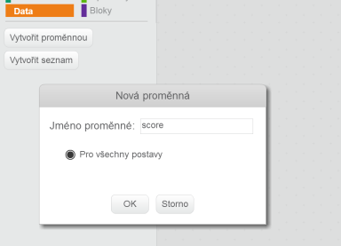
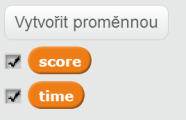
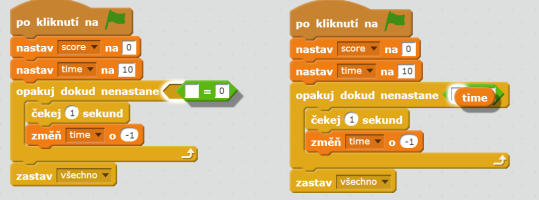
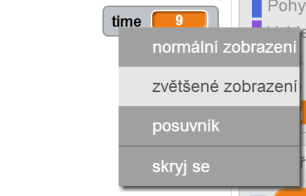

---
title: Lovci duchů
level: Scratch 1
language: cs-CZ
stylesheet: scratch
embeds: "*.png"
materials: ["Club Leader Resources/*"]
...

## Poznámka: { .challenge .pdf-hidden }
Projekt 'Balónky' byl přesunut do sekce [Další Scratch projekty](http://projects.codeclub.org.uk/cs-CZ/03_scratch_bonus/index.html).

# Úvod { .intro }

Chystáme se udělat hru s chytáním duchů!

<div class="scratch-preview">
  <iframe allowtransparency="true" width="485" height="402" src="http://scratch.mit.edu/projects/embed/60787262/?autostart=false" frameborder="0"></iframe>
  
</div>

# Step 1: Animace ducha { .activity }

## Seznam úkolů { .check }

+ Vytvoř si nový projekt a smaž kočičku, takže tvůj projekt bude prázdný. Online editor můžeš nalézt zde: <a href="http://jumpto.cc/scratch-new">jumpto.cc/scratch-new</a>.

+ Přidej sprajt s duchem a vhodné kulisy.

	

+ Přidej následující kód k duchovi, aby se opakovaně objevoval a mizel:

	```blocks
		when flag clicked
		forever
			hide
			wait (1) secs
			show
			wait (1) secs
		end
	```

+ Otestuj ducha kliknutím na zelenou vlajku.

## Ulož projekt { .save }

# Step 2: Náhodný pohyb ducha { .activity }

Chytit tohoto ducha je velmi lehké, protože se nepohybuje!

## Seznam úkolů { .check }

+ Místo zústáváni ve stejné pozici, můžeš nechat Scratch vybírat náhodnou pozici koordinátů x a y. Přidej blok `go to` {.blockmotion} k duchovi tak, aby to vypadalo následovně:

	```blocks
		when flag clicked
		forever
			hide
			wait (1) secs
			go to x:(pick random (-150) to (150)) y:(pick random (-150) to (150))
			show
			wait (1) secs
		end
	```

+ Otestuj ducha znovu, měl by se ukazovat pokaždé na jiném místě.

## Ulož projekt { .save }

## Výzva: Více náhody {.challenge}
Zkus anstavit ducha tak, aby čekal pomocí bloku `wait` {.blockcontrol} náhodnou dobu před objevením. Použij blok `set size` {.blocklooks} , aby měl duch pokaždé jinou velikost.

## Ulož projekt { .save }

# Step 3: Chytání duchů { .activity }

Pojďme dovolit hráči chytat duchy!

## Seznam úkolů { .check }

+ Přidej následující kód:

	```blocks
		when this sprite clicked
		hide
	```

+ Vyzkoušej projekt. Můžeš chytat duchy jakmile se objeví? Pokud je to těžké, spusť hru na celé obrazovce pomocí tohoto tlačítka:

	

## Výzva: Přidání zvuků { .challenge }
Přidej zvuk tak, aby hrál, když chytneš ducha.

## Ulož projekt { .save }

# Step 4: Přidání skóre { .activity .new-page }

Udělejme to zajímavějším přidáním počítání skóre.

## Seznam úkolů { .check }

+ Pro uchování skóre hráče potřebuješ místo, kam ho uložíš. Proměnná - __variable__ - je takové místo pro uschování dat, která se mohou měnit, jako je například skóre.

	Pro vytvoření nové proměnné klikni na záložku 'Scripts', vyber `Data` {.blockdata} a klikni na 'Make a Variable'.

	

	Napiš 'score' jako jméno proměnné, ujisti se že bude dostupná pro všechny sprajty (zaškrtnout 'For all sprites') a klikni 'OK'. Pak budeš mít možnost používat bloky pro práci s touto proměnnou - `score` {.blockdata}.

	

	Skóre uvidíš v levém horním rohu scény.

	

+ Po startu hry je nutné skóre vynulovat.

	```blocks
	when flag clicked
	set [score v] to [0]
	```

+ Jakmile chytneš ducha je potřeba svednout skóre o jeden bod:

	

+ Spusť projekt znovu a otestuj jestli se skóre počítá správně.

## Ulož projekt { .save }

# Step 5: Přidání časovače { .activity }

Hru můžeš udělat mnohem zajímavější, když dáš hráči jen 10 vteřin na to, aby chytltolik duchů, kolik zvládne.

## Seznam úkolů { .check }

+ Použij jinou proměnnou pro uschování zbývajícího času. Klikni na scénu a přidej proměnnou 'time':

	

+ Takto by měl časovač pracovat:

	+ Časovač by měl začít na 10 vteřinách;
	+ Časovač by měl odpočítávat po vteřině;
	+ Hra by se měla zastavit, když časovač dosáhne 0.

	Tady je kód, který to udělá, ten přidejte do vaší __scény__:

	```blocks
		when flag clicked
		set [time v] to [10]
		repeat until <(time) = [0]>
			wait (1) secs
			change [time v] by (-1)
		end
		stop [all v]
	```

	Tady vidíš jak přidat blok `repeat until`{.blockcontrol}`time`{.blockdata}`= 0`{.blockoperators} :

	

+ Přesuň proměnnou 'time' do pravého rohu scény. Můžeš kliknout pravým tlačítkem myši na proměnnou a vybrat 'large readout' abys změnil(a), jak bude proměnná s časem vypadat.

	

+ Požádej kamaráda o otestování hry. Kolika bodů dosáhne? Pokud je hra moc lehká tak můžeš:

	+ Dát hráči míň času;
	+ Nechat duchy zobrazovat se méně často;
	+ Zmenšit duchy.

	Otestuj hru několikrát, dokud nejsi spokojený(á) s obtížností.

## Ulož projekt { .save }

## Výzva: Více objektů {.challenge}
Můžeš přidat do hry více objektů?


Nad přidávanými objekty musíš zapřemýšlet:

+ Jak je velký?
+ Bude se objevovat častěji než duchové nebo ne?
+ Jaký zvuk bude vydávat při chycení?
+ Jak hodně bodů přidá nebo ubere?
+ Použiješ objekty které přidají či uberou čas?

## Ulož projekt { .save }
