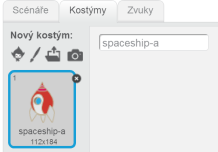
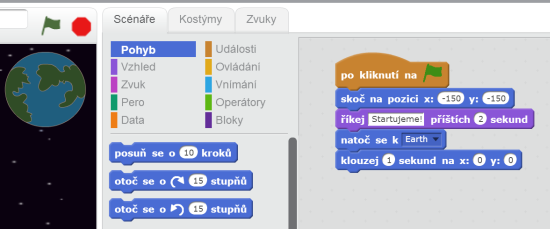
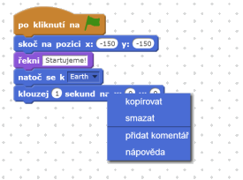
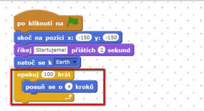
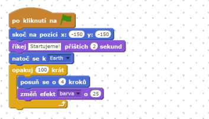
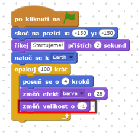
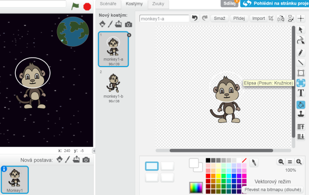
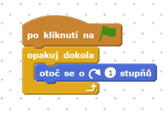
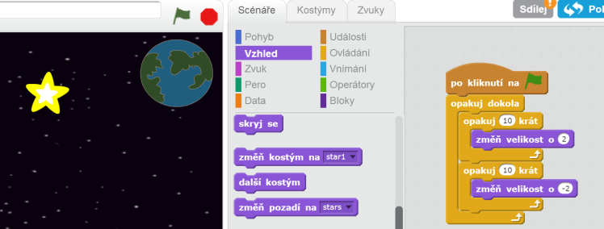

---
title: Ztracen ve vesmíru
level: Scratch 1
language: cs-CZ
stylesheet: scratch
embeds: "*.png"
materials: ["Club Leader Resources/*"]
...

# Úvod { .intro }

Dnes se naučíš, jak dělat svoje animace!

<div class="scratch-preview">
  <iframe allowtransparency="true" width="485" height="402" src="http://scratch.mit.edu/projects/embed/26818098/?autostart=false" frameborder="0"></iframe>
  
</div>

# Step 1: Animace vesmírné lodi { .activity .new-page}

Pojďme udělat raketu, která letí k zemi!

## Seznam úkolů { .check }

+ Vytvoř nový Scratch projekt a vymaž postavu kočky tak, aby byl prázdný. Scratch Editor najdeš tady <a href="http://jumpto.cc/scratch-new">jumpto.cc/scratch-new</a>.

+ Přidej postavy 'Spaceship' a 'Earth' na scénu. Také můžeš přidat kulisu hvězd - 'Stars'. Takhle by měla tvoje scéna vypadat:

	

+ Klikni na postavu rakety a pak na záložku 'Kostýmy'.

	

+ Použij nástroj 'šipka' abys vybral obrázek. Potom klikni na kruhovou rukojeť a posouvej ji tak aby jsi otočil(a) raketu na stranu.

	

+ Přidej k raketě tento kód:

	

	Změň čísla v blocích přesně tak, jak je vidíš na obrázku.

+ Když vše otestuješ, měl(a) bys vidět raketu, která se otáčí k zemi a míří ke středu scény.

	

	Pozice `x:(0) y:(0)` {.blockmotion} je centrum scény. Pozice `x:(-150) y:(-150)` {.blockmotion} je vlevo dole a pozice `x:(150) y:(150)` {.blockmotion} je vpravo nahoře.

	

	Pokud potřebuješ vědět jaké jsou koordináty bodu na scéně, přesuň myš na tuto pozici a poznač si koordináty zobrazené pod scénou.

	

+ Vyzkoušej si animaci kliknutím na zelenou vlajku.

	

## Výzva: vylepšení animace {.challenge}
Změn parametry (čísla) v kódu tak:
+ aby se raketa pohybovala dokud se nedotkne země
+ aby se raketa pohybovala pomaleji blíže k zemi

Musíš změnit tato čísla v blocích:

```blocks
	klouzej (1) sekund na x:(0) y:(0)
```

## Ulož projekt { .save }

# Step 2: Animace pomocí cyklů { .activity .new-page }

Jiný způsob jak animovat raketu je ten, že se bude pohybovat po malých kouscích víckrát za sebou.

## Seznam úkolů { .check }

+ Smaž blok `klouzej` {.blockmotion}, klikni praváým tlačítkem myši a vyber 'smazat'. Blok můžeš smazat tak, že ho přesuneš mimo oblast pro kód, zpět do oblasti pro bloky.

	

+ Jakmile blok odstraníš, přidej následující:

	

	Blok `opakuj` {.blockcontrol} se používá pro opakování a nazývá se __smyčka__.

+ Když klikneš na vlaječku, uvidíš, že raketa se pohybuje stejně jako před tím.

+ Do smyčky múžeš přidat více bloků a dělat zajímavé věci. Přidej blok `změň efekt barva o 25` {.blocklooks}do smyčky (ze sekce 'Looks'), aby se opakovaně menila barva rakety během pohybu:

	

+ Vyzkoušej novou animaci.

	

+ Zmenši loď jak se bude blížit k zemi.

	

+ Otestuj animaci. Co se stane, když klikneš na vlaječku podruhé? Startuje raketa ve správné velikosti? Použij tento blok abys to opravil(a):

	```scratch
	nastav velikost na (100) %
	```

## Ulož projekt { .save }

# Step 3: Létající opice { .activity .new-page }

Přidej do animace opici, která je ztracená ve vesmíru! 

## Seznam úkolů { .check }

+ Začni přidáním opice z knihovny postav.

	

+ Když klikneš na tvůj novou postavu s opicí a klikneš na záložku 'Kostýmy', můžeš uravit jak vypadá. Klikni na nástroj 'Elipsa' a nakresli bílou helmu okolo hlavy opice.

	

+ Klikni na 'Scénáře', a přidej opici následující kód tak, aby se točila navždy pomalu v kruzích:
	
    

	Blok `opakuj dokola` {.blockcontrol} je další smyčka, ale tentokrát nikdy nekončí.

+ Klikni na vlajku pro vyzkoušení opice. Abys animaci ukončil(a) musíš kliknout na červené tlačítko.

	

# Step 4: Odrážející se asteroidy { .activity .new-page }

Přidej několik letících vesmírných kamenů do animace.

## Seznam úkolů { .check }

+ Přidej postavu kámen - 'rock'.

	

+ Přidej následující kód ke kamenu, aby se na kraji scény odrazil:

	```scratch
	when flag clicked
	natoč se k [Earth v]
	opakuj dokola
		posuň se o (2) kroků
		když narazíš na okraj, odraž se
	```

+ Otestuj asteroid. Odráží se?

# Step 5: Svítící hvězdy { .activity .new-page }

Nakombinuj cykly a vytvoř svítící hvězdy.

## Seznam úkolů { .check }

+ Přidej postavu 'star'

	

+ Přidej následující kód ke hvězdě:

	

+ Otestuj animaci. Co tento kód dělá? Správně, hvězda se dvacetkrát zvětší a zase změnší. Jsou tam dvě smyčky uvnitř smyčky `opakuj dokola` {.blockcontrol} aby se animace nezastavila.

## Ulož projekt { .save }

## Výzva: Udělej si vlastní animaci {.challenge}
Zastav animaci a klikni na 'Soubor' potom na 'Nový', pro vytvoření nového projektu.

Použij co jsi se naučil(a) pro vytvoření vlastní animace. Může to být cokoliv. Tady máš pár příkladů:


## Ulož projekt { .save }
