---
title: Rocková skupina
level: Scratch 1
language: cs-CZ
stylesheet: scratch
embeds: "*.png"
materials: ["Club Leader Resources/*"]
...

# Úvod { .intro }

V tomto projektu se naučíš jak naprogramovat vlastní hudební nástroje!

<div class="scratch-preview">
  <iframe allowtransparency="true" width="485" height="402" src="http://scratch.mit.edu/projects/embed/26741186/?autostart=false" frameborder="0"></iframe>
  
</div>

# Krok 1: Postavy { .activity }

Před tím, než začneš oživovat objekty, musíš nějaké přidat. Ve Scratchi se tyto objekty nazývají __postavy__. 

## Seznam úkolů { .check }

+ Jako první otevři Scratch editor. Online Scratch editor najdeš tady: <a href="http://jumpto.cc/scratch-new">jumpto.cc/scratch-new</a>. Vypadá nějak takto:

	

+ Postava kočky, kterou vidíš je maskot Scratche. Té se pro tentokrát zbavíš tak, že na ni klikneš pravým tlačítkem a klikneš na 'smazat'.

	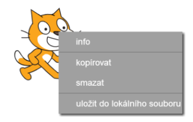

+ Dále klikni na 'Vybrat postavu z knihovny', aby se ti zobrazil seznam postav.

	

+ Skroluj dolů dokud nenajdeš buben. Klikni na něj a dále klikni na 'OK', tím ho přidáš do projektu.

	

+ Klikni na ikonku 'Zmenši', a pak několikrát na postavu s bubnem, pro zmenšení.

	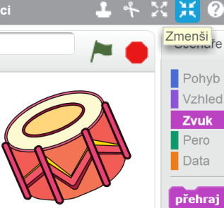

## Ulož projekt { .save }

Dej programu název vepsáním do textového pole vlevo nahoře.

Pak stiskni 'Soubor' a potom 'Uložit aktuální stav' pro uložení projektu.


# Krok 2: Scéna { .activity }

__Scéna__ je oblast nalevo, kde obživne tvůj projekt. Je to něco jako jeviště v divadle.

## Seznam úkolů { .check }

+ V tento okamžik je scéna bílá a vypadá docela nudně. Přidáme proto 'pozadí' kliknutím na 'Vybrat pozadí z knihovny'.

	

+ Klikni na kategorii 'Uvnitř' nalevo, a potom klikněte na "stage1" a 'OK'.

	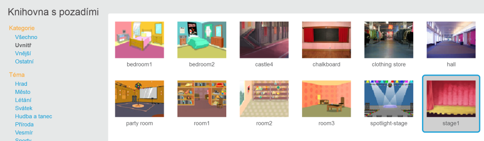

+ Tvoje scéna by nyní měla vypadat takto:

	

# Step 3: Tvorba bubnu { .activity }

Naprogramujeme buben aby vydával zvuk, když na něj klikneš.

## Seznam úkolů { .check }

+ Na záložce 'Scénáře' najdi bloky kódu, které jsou rozlišené podle barviček. 

	Klikni na postavu bubnu a potom přetáhni tyto dva bloky do oblasti pro kód vpravo, tak aby byly spojené dohromady (jako Lego kostky):

	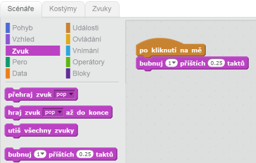

+ Klikni na buben, abys vyzkoušel(a) tvůj nový nástroj!

+ Můžeš také změnit jak vypadá bubdem, když na něj klikneš a to pomocí kostýmu. Klikni na záložku 'Kostýmy' a tam uvidíš obrázek bubnu.

	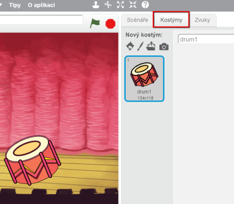

+ Klikni pravým tlačítkem na kostým a vyber 'kopírovat', pro vytvoření kopie.

	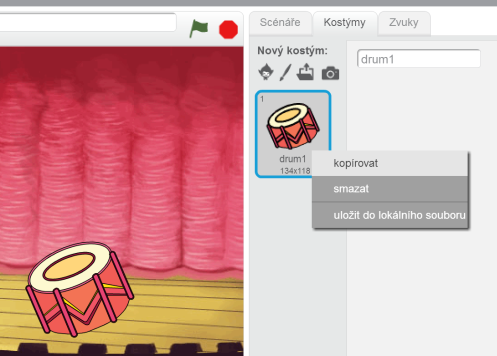

+ Klikni na nový kostým (nazvaný 'drum2') a vyber nástroj pro kreslení čar a nakresli čáry, tak aby to vypadalo, že buben vydává zvuky.

	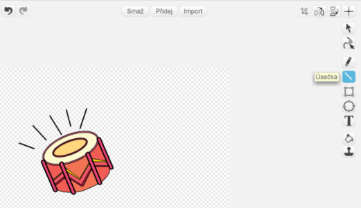

+ Jména kostýmů pro postavu bubnu nejsou nyní moc popisující, tak je přejmenuj na 'hraje' a 'nehraje' vepsáním jména do textového pole.

	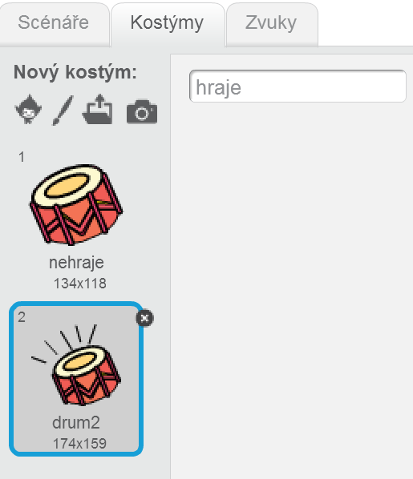

+ Nyní máš pro buben dva různé kostýmy a můžeš s vybrat, který se zobrazí. Přidej tyto dva bloky kódu k bubnu:

	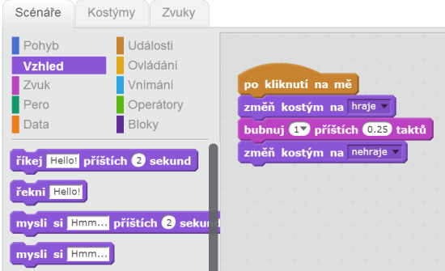

	Bloky pro změnu kostýmu najdeš v sekci `Vzhled` {.blocklooks}.

+ Vyzkoušej buben. Po kliknutí by měl měnit vzhled a hrát.

## Ulož projekt { .save }

##Výzva: Vylepšení bubnu { .challenge }

+ Zkusíš změnit zvuk který buben vydává?

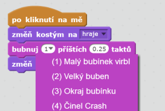

+ Zkus upravit buben tak, aby hrál při stisknutí mezerníku. Budeš potřebovat tento blok `událost` {.blockevents}:

```blocks
	po stisku klávesy [space v]
```

Existující kód můžeš zkopírovat tak, že klikneš pravým tlačítkem myši a vybereš 'duplicate'.


## Ulož projekt { .save }

# Step 4: Vytvoření zpěvačky { .activity .new-page }

Přidej zpěvačku do tvé skupiny!

## Seznam úkolů { .check }

+ Přidej na scénu další dvě postavy: zpěvačku a mikrofon.

	

+ Před tím, než naučíš zpěvačku zpívat, potřebuješ přidat zvuk k postavě. Ujisti se že máš vybranou zpěvačku, pak klikni na záložku 'Zvuky' a klikni na 'Vybrat zvuk z knihovny':

	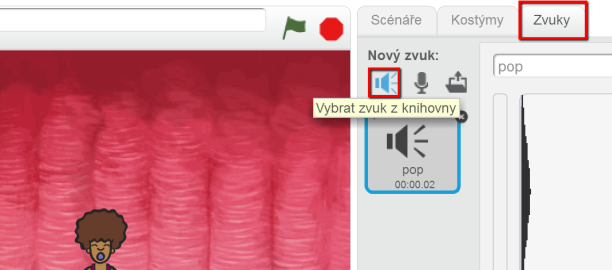

+ Když klikneš vlevo na 'Hlasy', můžeš potom vybrat zvuk a přidat ho k postavě.

	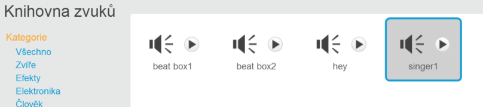

+ Nyní po přidání zvuku přidej následující kód ke zpevačce:

	```blocks
		po kliknutí na mě
		hraj zvuk [singer1 v] až do konce
	```

+ Klikni na zpěvačku aby ses ujistil(a), že zpívá.

## Ulož projekt { .save }

##Vývza: Změň zpěvačce kostým { .challenge }
Můžeš upravit zpěvačku tak, aby vypadala, že zpívá po kliknutí? Pokud nevíš jak, udělej to stejně jako u bubnu.


Nezapomeň vyzkoušet jestli tvůj nový kód funguje!

## Ulož projekt { .save }

##Výzva: Vytvoř si svoji hudební skupinu { .challenge }
Pomocí toho co jsi se již naučil(a) si vytovř svoji skupinu! Můžeš vytvořit jakýkoliv nástroj - podívej se do galérie na dostupné postavy a zvuky.


Tvoje nástroje nemusí mít smysl. Například můžeš udělat piáno z mufinů!


Tak jak používáš existující postavy, můžes si nakreslit vlastní.


Pokud máš mirkofon, tak si nahraj vlastní zvuk, nebo můžeš použít kameru na spouštění nástrojů!

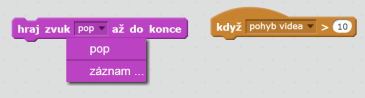

## Ulož projekt { .save }
