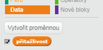
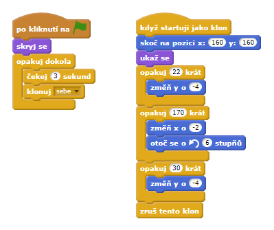
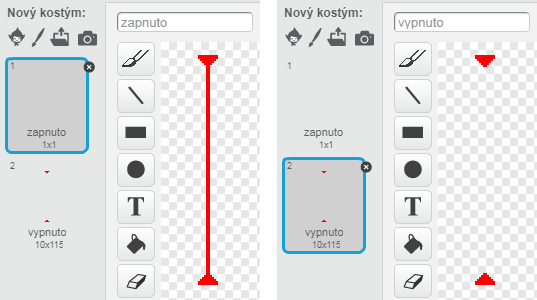
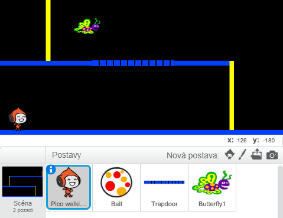
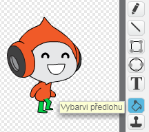

---
title: Dodgeball
level: Scratch 2
language: en-GB
stylesheet: scratch
embeds: "*.png"
materials: ["Club Leader Resources/*","Project Resources/*"]
...

# Introduction { .intro }

In this project you'll learn how to create a platform game, in which you have to dodge the moving balls and reach the end of the level.

<div class="scratch-preview">
  <iframe allowtransparency="true" width="485" height="402" src="http://scratch.mit.edu/projects/embed/39740618/?autostart=false" frameborder="0"></iframe>
  
</div>

# Step 1: Character movement { .activity }

Let's start by creating a character that can move left and right, as well as climb up poles.

## Activity Checklist { .check }

+ Start a new Scratch project, and delete the cat sprite so that your project is empty. You can find the online Scratch editor at <a href="http://jumpto.cc/scratch-new">jumpto.cc/scratch-new</a>.

+ For this project, you should have a 'Project Resources' folder, containing the background image you'll need. Make sure that you can find this folder, and ask your club leader if you can't find it.

	

+ Add the image 'background.png' as a new stage backdrop, or draw your own! If you're drawing your own level, just make sure that the poles and the floors are different colours, and that there's a door (or something similar) that your player has to reach. Here's how your project should look:

	

+ Add a new sprite, which will be your character. It's better if you choose a sprite with multiple costumes, so that you can make it look as though it's walking.

	

+ Let's use the arrow keys to move your character around. When the player presses the right arrow, you want your character to point right, move a few steps and change to the next costume:

	```blocks
		when flag clicked
		forever
			if <key [right arrow v] pressed? > then
				point in direction (90 v)
				move (3) steps
				next costume
			end
		end
	```

+ Test out your character by clicking the flag and then holding down the right arrow key. Does your player move to the right? Does your character look like they are walking?

	

+ To move your character to the left, you'll need to add another `if` {.blockcontrol} block inside your `forever` {.blockcontrol} loop, which moves your character to the left. Remember to test your new code, to make sure that it works!

+ To climb a pole, your character should move up slightly whenever the up arrow is pressed and they're touching the correct colour. Add this code inside your character's `forever` {.blockcontrol} loop:

	```blocks
		if < <key [up arrow v] pressed?> and <touching color [#FFFF00]?> > then
			change y by (4)
		end
	```

+ Test your character - can you climb the yellow poles and get to the end of your level?

	

## Save your project { .save }

## Challenge: Completing the level {.challenge}
Can you add more code to your character, so that they say something `if` {.blockcontrol} they get to the brown door?


## Save your project { .save }

# Step 2: Gravity and jumping { .activity }

Let's make your character move more realistically, by adding gravity and allowing them to jump.

## Activity Checklist { .check }

+ You may have noticed that your character can walk off a platform into mid-air. Try to walk off of a platform and see what happens.

	

+ To fix this, let's add gravity to your game. Create a new variable called `gravity` {.blockdata}. You can hide this variable from your stage if you want to.

	

+ Add this new code block, which sets the gravity to a negative number, and then uses this to repeatedly change your character's y-coordinate.

	```blocks
		when flag clicked
		set [gravity v] to [-4]
		forever
			change y by (gravity)
		end
	```

+ Click the flag, and then drag your character to the top of the stage. What happens? Does the gravity work as you expected?

	

+ Gravity shouldn't move your character through a platform or a pole! Add an `if` {.blockcontrol} block to your code, so that the gravity only works when your character is in mid-air. The gravity code should now look like this:

	```blocks
		when flag clicked
		set [gravity v] to [-4]
		forever
			if < not < <touching color [#0000FF]?> or <touching color [#FFFF00]?> > > then
				change y by (gravity)
			end
		end
	```

+ Test the gravity again. Does your character stop when they are on a platform or a pole? Can you walk off the edge of platforms to the level below?

	

+  Let's also make your character jump when the player presses the space bar. One very easy way to do this is to move your character up a few times, using this code:

	```blocks
		when [space v] key pressed
		repeat (10)
			change y by (4)
		end
	```

	As gravity is constantly pushing your character down by 4 pixels, you need to choose a number greater than 4 in your `change y by (4)` {.blockmotion} block. Change this number until you're happy with the height your character jumps.

+ If you test out this code, you'll notice that it works, but the movement isn't very smooth. To make jumping look smoother, you'll need to move your character by smaller and smaller amounts, until they're not jumping anymore.

+ To do this, create another variable called `jump height` {.blockdata}. Again, you can hide this variable if you prefer.

+ Delete the jumping code you added to your character, and replace it with this code:

	```blocks
		when [space v] key pressed
		set [jump height v] to [8]
		repeat until < (jump height) = [0] >
			change y by (jump height)
			change [jump height v] by (-0.5)
		end
	```

	This code moves your character up by 8 pixels, then 7.5 pixels, then 7 pixels, and so on, until your character has finished jumping. This makes jumping look much smoother.

+ Change the starting value of your `jump height` {.blockdata} variable and test it until you're happy with the height your character jumps.

## Save your project { .save }

## Challenge: Improved jumping {.challenge}
Your character is able to jump whenever the spacebar is pressed, even if they're already in mid-air. You can test this by just holding down the spacebar. Can you fix this, so that your character can only jump `if` {.blockcontrol} they're touching a blue platform?

## Save your project { .save }

# Step 3: Dodging balls { .activity .new-page}

Now that you've got your character moving around, let's add some balls for your character to avoid.

## Activity Checklist { .check }

+ Create a new ball sprite. You can choose any type of ball you like.

	

+ Resize your ball, so that your character can jump over it. Try jumping over the ball to test it. 

	

+ Add this code to your ball:

	

	This code creates a new ball clone every 3 seconds. Each new clone moves along the top platform.

+ Click the flag to test this out.

	

+ Add more code to your ball sprite, so that they move across all 3 platforms.

	

+ Finally, you'll need code for when your character gets hit by a ball! Add this code to your ball sprite:

	```blocks
		when I start as a clone
		forever
			if < touching [Pico walking v]? > then
				broadcast [hit v]
			end
		end
	```

+ You'll also need to add code to your character, to move back to the start when they're hit:

	```blocks
		when I receive [hit v]
		point in direction (90 v)
		go to x: (-210) y: (-120)
	```	

+ Test out your character and see if they go back to the start when they've been hit by a ball.

## Save your project { .save }

## Challenge: Random balls {.challenge}
The balls your character has to dodge all look the same, and always appear every 3 seconds. Can you improve them, so that they:

+ don't all look the same?
+ appear after a random amount of time?
+ are a random size?


## Save your project { .save }

# Step 4: Lasers! { .activity .new-page}

Let's make your game a little harder to complete, by adding lasers!

## Activity Checklist { .check }

+ Add a new sprite to your game, called 'Laser'. It should have 2 costumes, called 'on' and 'off'.

	

+ Place your new laser anywhere you like, between 2 platforms.

	

+ Add code to your laser, to make it switch between the 2 costumes.

	```blocks
		when flag clicked
		forever
			switch costume to [on v]
			wait (2) secs
			switch costume to [off v]
			wait (2) secs
		end
	```

	If you prefer, you can `wait` {.blockcontrol} a `random` {.blockoperators} amount of time between costume changes.

+ Finally, add code to your laser, so that the 'hit' message is broadcast when the laser touches your character. This code will be the same as the code you added to your ball sprite.

	You don't need to add any more code to your character - they already know what to do when they get hit!

+ Test out your game to see if you can get past the laser. Change the `wait` {.blockcontrol} times in your code if the lasers are too easy or too hard.

## Challenge: More obstacles {.challenge}
If you think your game is still too easy, you can add more obstacles to your level. You can add anything you like, but here are some ideas:

+ A flying killer butterfly;
+ Platforms that appear and disappear;
+ Falling tennis balls that must be avoided.



You could even create more than one backdrop, and move to the next level when your character reaches the brown door:

```blocks
	if <touching color [#714300]?> then
		switch backdrop to [next backdrop v]
		go to x: (-210) y: (-120)
		wait (1) secs
	end
```

## Save your project { .save }

## Challenge: Improved gravity {.challenge}
There's one other small bug in your game: gravity doesn't pull your character downwards if _any_ part of it is touching a blue platform - even it's head! You can test this out by climbing most of the way up a pole and then moving to the left.


Can you fix this bug? To do this, you need to give your character different coloured trousers (on _all_ costumes)...



...and then replace the code: 

```blocks
	< touching color [#0000FF]? >
```

with:

```blocks
	< color [#00FF00] is touching [#0000FF]? >
```

Remember to test your improvements to make sure you've fixed the bug!

## Save your project { .save }

## Challenge: More lives {.challenge}
Can you give your player 3 `lives` {.blockdata}, instead of just sending them back to the beginning each time? Here's how your game could work:

+ Your player starts with 3 lives;
+ Whenever your player gets hit, one life is lost and they go back to the start;
+ If there are no lives left, the game ends.

## Save your project { .save }
