---
title: Paměť
level: Scratch 2
language: cs-CZ
stylesheet: scratch
embeds: "*.png"
materials: ["Club Leader Resources/*"]
...

## Komunitní projekt { .challenge .pdf-hidden }
Tento projekt vytvořil Erik se svou dcerou Ruth. Pokud chcete přispět svým nápadem, [přidejte se k nám na Githubu](https://github.com/CodeClub).

# Úvod { .intro }

Tentokrát vytvoříme počítačovou hru! Postava ve scéně bude měnit barvy, úkolem hráče bude zapamatovat si barvy a zopakovat je ve správném pořadí. Kdo vydrží nejdéle, vyhrává!

<div class="scratch-preview">
  <iframe allowtransparency="true" width="485" height="402" src="http://scratch.mit.edu/projects/embed/34874510/?autostart=false" frameborder="0"></iframe>
  
</div>

# Část 1: Náhodné barvy { .activity }

Nejdřív je třeba vytvořit postavu, která bude měnit barvy.

## Postup { .check }

+ Vytvoř nový projekt ve Scratchi a smaž kocoura tak, aby byl projekt prázndý. Webový scratch editor najdeš na <a href="http://jumpto.cc/scratch-new">jumpto.cc/scratch-new</a>.

+ Vyber si pozadí scény a postavu. Postava nemusí být člověk, ale musí ji být jednoduché přemalovat na jinou barvu (musí mít kostýmy).

	

+ V naší hře budeme používat čísla zastupující jednotlivé barvy:

	+ 1 = červená;
	+ 2 = modrá;
	+ 3 = zelená;
	+ 4 = žlutá.

	Dej svojí postavě 4 různě barevné kostýmy, pro kažou zmíněnou barvu jeden (zkopíruj kostým a/nebo mu v editoru změň barvu). Zkontroluj, že jsou barvy kostýmů ve správném pořadí.

	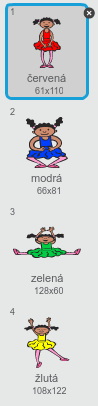

+ Pro náhodnou sekvenci budeš potřebovat __seznam__. Seznam je jednoduše proměnná, která si pamatuje více hodnot __v určitém pořadí__. Vytvoř novou proměnnou (Data - Vytvořit seznam), která se bude jmenovat `sekvence` {.blockdata}. Seznam bude potřeba pouze pro postavu, zaklikni tedy volbu 'Jen pro tuto postavu'.

	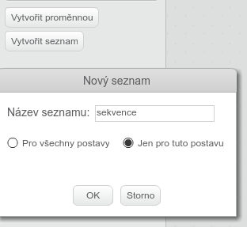

	Teď by měl být vidět prázdný seznam ve scéně vlevo nahoře a k tomu spoustu nových bloků pro použití se seznamem.

	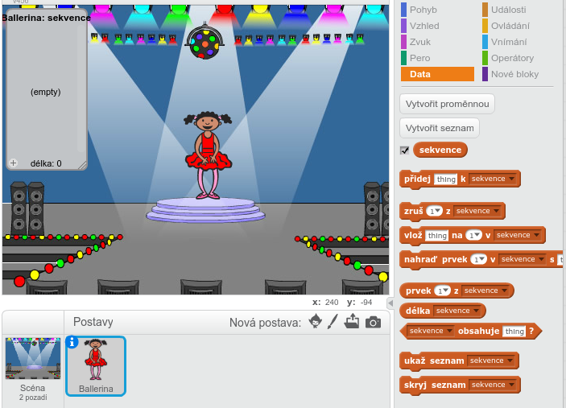

+ Přidej k postavě následující blok kódu. Tím se k seznamu přidá náhodné číslo (také se přepne obleček), to se opakuje celkem 5 krát, jednou za vteřinu:

	```blocks
    po kliknutí na ⚑
    zruš (všechno v) z [sekvence v]
    opakuj (5) krát
       přidej (náhodné číslo od (1) do (4)) k [sekvence v]
       změň kostým na (prvek (poslední v) z [sekvence v])
       čekej (1) sekund
    end
	```

	Všimni si, že se začne tím, že se seznam vyprázdní.

## Výzva: Přidej zvuk {.challenge}
Spusť projekt několikrát za sebou. Všimni si, že se občas stane, že to samé číslo je vybrané dvakrát (nebo víckrát) za sebou, takže je těžší si to správně zapamatovat. Dokážeš zahrát zvuk bubnu pokaždé, když se postavě změní kostým?

Dokážeš nechat zahrát různý zvuk bubnu, podle toho, jaké náhodné číslo bylo vybráno? Bude to _velmi_ podobné kódu na změnu kostýmu.

## Ulož svůj projekt { .save }

# Část 2: Zopakování sekvence { .activity }

Přidejme 4 tlačítka, která bude hráč mačkat, aby zopakoval sekvenci, kterou si zapamatoval.

## Postup { .check }

+ Přidej do projektu 4 "postavy" bubnů, které budou sloužit, jako tlačítka. Nastav každému z nich jednu z našich 4 barev.

	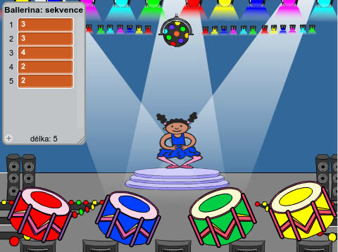

+ Když se klikne na červený buben, je třeba vyslat zprávu postavě, aby věděla, že bylo zmáčknuté čerené tlačítko. Přidej následující kus kódu k červenému bubnu:

	```blocks
    po kliknutí na mě
    rozešli všem [červená v]
	```

+ Když postava zprávu obdrží, musí zkontrolovat, že je na prvním místě v seznamu číslo 1 (to znamená, že je to červená). Pokud ano, odstraní ze seznamu první prvek, protože hráč uhádl správně. Pokud ne, tak je konec hry!

	```blocks
    po obdržení zprávy [červená v]
    když <(prvek (1 v) z [sekvence v]) = [1]> tak
       zruš (1 v) z [sekvence v]
    jinak
       říkej [Konec hry!] příštích (1) sekund
       zastav [všechno v]
    end
	```

+ Teď můžeš přidat efekt zablikáním světel, když je seznam prázdný, to znamená, že všechno bylo uhodnuto správně. Přidej tento blok kódu na konec skriptu `when flag clicked` {.blockevents} u postavy:

	```blocks
    čekej dokud nenastane <(délka [sekvence v]) = [0]>
    rozešli všem [výhra v] a čekej
	```

+ Klikni do scény a přidej následující kód, pozadí pak bude měnit barvu, když hráč vyhrál.

	```blocks
    po obdržení zprávy [výhra v]
    přehraj zvuk [drum machine v]
    opakuj (50) krát
       změň efekt [barva v] o (25)
       čekej (0.1) sekund
    end
    zruš grafické efekty
	```

## Výzva: Vytvoř zbylá tlačítka {.challenge}
Zopakuj zmíněný postup i pro modré, zelené a žluté tlačítko. Jaký kód zůstane stejný a jaký se musí pro každé tlačítko upravit?

Také můžeš přidat pro každé tlačítko zvuk.

Nezapomeň pokažé úpravě kód spustit a otestovat! Dokážeš si zapamatovat sekvenci 5 barev? Je sekvence po každé jiná?

## Ulož svůj projekt { .save }

# Část 3: Obtížnost { .activity .new-page }

Doteď si hráč musel zapamatovat 5 po sobě jdoucích barev. Pojďme hru vylepšit tak, že se bude zvyšovat počet barev k zapamatování.

## Postup { .check }

+ Vytvoř novou proměnnou `body` {.blockdata}.

	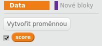

+ Hodnotu `body` {.blockdata} použijeme k určení délky sekvence, kterou si hráč musí zapamatovat. Na začátek nastavíme body (a tím déklu sekvence) na hodnotu 3. Přidej tento kód na začátek bloku `po kliknutí na ⚑` {.blockevents} u tvé postavy:

	```blocks
    nastav [body v] na [3]
	```

+ Místo současné neměnné délky 5 teď chceme, aby `body` {.blockdata} určovaly déklu sekvence. Změň smyčku `opakuj` {.blockcontrol} u své postavy (vytváření sekvence) na:

	```blocks
    opakuj (body) krát
    end
	```

+ Pokud budou všechny barvy uhodnuty správně, přidáme jeden bod, tím prodloužíme sekvenci.

	```blocks
    změň [body v] o (1)
	```

+ Ještě musíš přidat nekonečnou smyčku `opakuj dokola` {.blockcontrol} kolem kódu pro generování sekvence, tak aby se vytvořila sekvence pro každou úroveň obtížnosti. Takhle by měl vypadat tvůj kód u postavy:

	```blocks
    po kliknutí na ⚑
    nastav [body v] na [3]
    opakuj dokola
       zruš (všechno v) z [sekvence v]
       opakuj (body) krát
          přidej (náhodné číslo od (1) do (4)) k [sekvence v]
          změň kostým na (prvek (poslední v) z [sekvence v])
          čekej (1) sekund
       end
       čekej dokud nenastane <(délka [sekvence v]) = [0]>
       rozešli všem [výhra v] a čekej
       změň [body v] o (1)
    end
	```

+ Zavolej kamarády, ať přijdou vyzkoušet tvou hru. Nezapomeň schovat okno seznamu `sekvence` {.blockdata} než začnou hrát!

## Ulož svůj projekt { .save }

# Část 4: Bodový rekord { .activity }

Pojďme body ukládat, abys mohl soutěžit s jinými hráči.

## Postup { .check }

+ Do projektu přidej 2 proměnné, nazveme je `rekord` {.blockdata} a `jméno` {.blockdata}.

+ Pokaždé, když hra skončí (hráč zmáčknul špatné tlačítko), zkontroluj, jestli nahrané body nejsou vyšší, než to, co máme uložené. Pokud ano, ulož body jako rekord a ulož také jméno hráče. Tady je, jak by měl vypadat skript u tvého červeného tlačítka:

	```blocks
    po obdržení zprávy [červená v]
    když <(prvek (1 v) z [sekvence v]) = [1]> tak
       zruš (1 v) z [sekvence v]
    jinak
       říkej [Konec hry!] příštích (1) sekund
       když <(body) > (rekord)> tak
          nastav [rekord v] na (body)
          ptej se [Rekord! Jak se jmenuješ?] a čekej
          nastav [name v] na (odpověď)
       end
       zastav [všechno v]
    end
	```

+ Tento kód musíš také vložit ke zbývajícím 3 tlačítkům! Všimnul(a) sis, že kód pro 'Konec hry' je stejný u všech 4 tlačítek?

	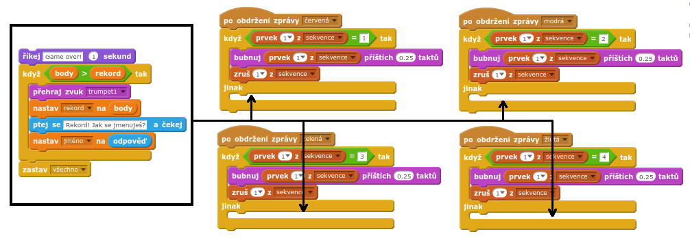

+ Když se rozhodneš upravit část kódu, jako třeba zvuk nebo nápis 'Konec hry', budeš to muset udělat 4-krát! To může být otrava a ztráta spousty času.

	Místo toho si raději vytvoříme vlastní blok a použijeme ho v našem projektu. Klikni na `Nové bloky` {.blockmoreblocks} a potom 'Vytvořit blok'. Tento nový blok nazveme 'Konec hry'.

	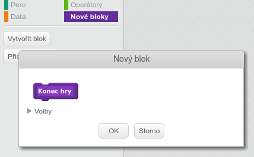

+ Zkopíruj kód z větve `jinak` {.blockcontrol} z bloku u červeného tlačítka do nového bloku:

	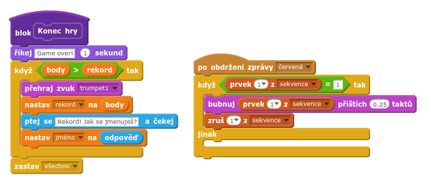

+ Právě jsi vytvořil(a) novou _funkci_ nazvanou `Konec hry` {.blockmoreblocks}, Kterou můžeš použít, kdekoliv budeš potřebovat. Přetáhni nový blok `Konec hry` {.blockmoreblocks} do kódu všech 4 tlačítek.

	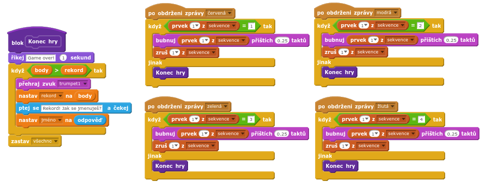

+ Teď přidej zvuk, který zazní, když se zmáčkne špatné tlačítko. Tentokrát stačí přidat kód _pouze jednou_ do bloku `Konec hry` {.blockmoreblocks} a už ne 4-krát samostatně, hurá!

	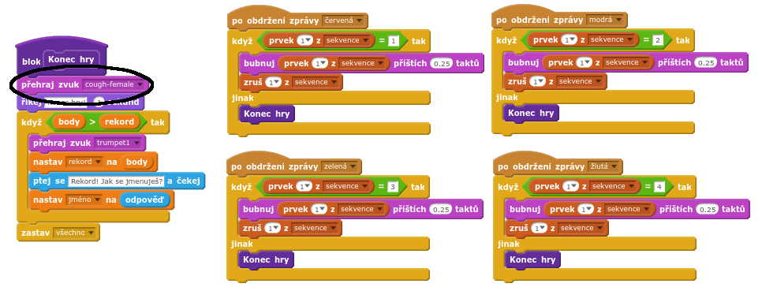

## Výzva: Vytvoření více bloků {.challenge}
Všimnul(a) sis nějaké další části kódu, která je stejná u všech 4 tlačítek?

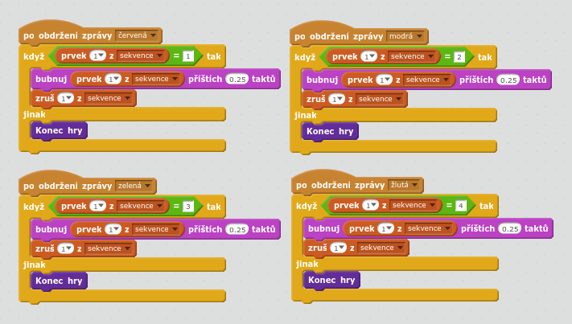

Dokážeš udělat další nový blok, který budou tlačítka používat?

## Ulož svůj projekt { .save }

## Výzva: Jiný kostým {.challenge}
Všimnul(a) sis, že hra začíná s postavou ukazující jednu barvu a také, že když hráč zadává sekvenci, zůstává zobrazená poslední barva?

Dokážeš přidat postavě další, čistě bílý kostým, který se ukáže na začátku hry a během toho, co se hráč snaží zadat sekvenci?

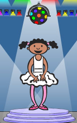

## Ulož svůj projekt { .save }

## Výzva: Obtížnost {.challenge}
Dokážeš nechat hráče zvolit mezi 'easy mode' (pouze červený a modrý buben) a 'normal mode' (všechny 4 bubny)?

Klidně můžeš přidat 'hard mode', který bude s 5. bubnem!

## Ulož svůj projekt { .save }
