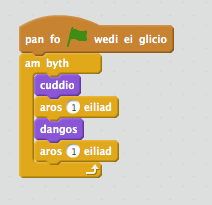
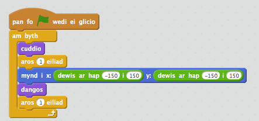
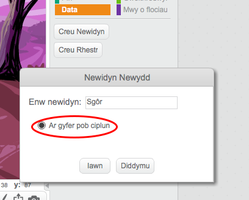
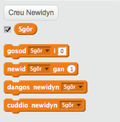
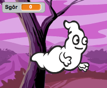
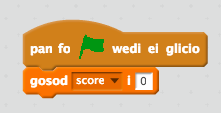
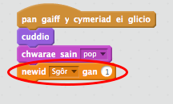
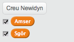
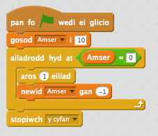
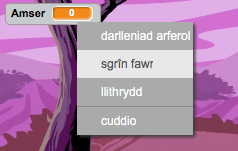

---
title: Ghostbusters
level: Scratch 1
language: cy-GB
stylesheet: scratch
embeds: "*.png"
materials: ["Club Leader Resources/*"]
...

# Cyflwyniad { .intro }

Rwyt ti am wneud gêm i ddal ysbrydion!

<div class="scratch-preview">
  <iframe allowtransparency="true" width="485" height="402" src="https://scratch.mit.edu/projects/embed/60787262/?autostart=false" frameborder="0"></iframe>
  
</div>

# Cam 1: Animeiddio ysbryd { .activity }

## Rhestr wirio'r weithgaredd { .check }

+ Dechreua brosiect Scratch newydd, a galli di ddileu y ciplun o'r gath fel bod dy brosiect yn wag. Galli di ddod o hyd i'r golygydd Scratch yma <a href="http://jumpto.cc/scratch-new" target="_blank">jumpto.cc/scratch-new</a>.

+ Ychwanega ciplun ysbryd newydd, a chefndir llwyfan addas.

	

+ Ychwanega y côd yma i dy ysbryd, fel ei fod yn ail-adrodd ymddangos a diflannu;

	

+ Profa côd yr ysbryd, trwy glicio ar y faner werdd.

## Arbeda dy brosiect { .save }

# Cam 2: Ysbrydion ar hap { .activity }

Mae dy ysbryd yn hawdd iawn i'w ddal, gan nad yw e'n symud!

## Rhestr wirio'r weithgaredd { .check }

+ Yn lle aros yn yr un man, mae modd i ti adael i Scratch ddewis cyfesurynnau ar hap yn lle.  Ychwanega bloc 'mynd i' {.blockmotion} i gôd yr ysbryd, fel ei fod yn edrych fel hyn:

	

+ Profa'r ysbryd eto, ac fe ddylse ti sylwi ei fod yn ymddangos mewn lle gwahanol bob tro.

## Arbeda dy brosiect { .save }

## Her: Mwy o ddigwyddiadau ar hap {.challenge}
Wyt ti'n gallu gwneud i dy ysbryd 'aros' {.blockcontrol} amser ar hap cyn ymddangos? Wyt ti'n gallu defnyddio y bloc 'gosod maint' {.blockcontrol} i wneud i dy ysbryd fod yn faint ar hap bob tro mae'n ymddangos?

## Arbeda dy brosiect { .save }

# Cam 3: Dal ysbrydion { .activity }

Beth am adael i'r chwareuwr ddal ysbrydion!

## Rhestr wirio'r weithgaredd { .check }

+ I ganiatau i'r chwareuwr ddal ysbryd, ychwanega'r côd yma:

	```blocks
		pan caiff y cymeriad ei glicio
		cuddio
	```

+ Profa dy brosiect. Alli di ddal ysbrydion os ydynt yn ymddangos? Os ydy e'n anodd i ddal ysbrydion, mae modd chwarae y gêm ar sgrin llawn trwy glicio ar y botwm yma:

	

## Her: Ychwanegu sŵn { .challenge }
Wyt ti'n gallu gwneud sŵn bob tro mae'r ysbryd yn cael ei ddal?

## Arbeda dy brosiect { .save }

# Cam 4: Ychwanegu sgôr { .activity .new-page }

Beth am wneud pethau yn fwy diddorol trwy gadw sgôr.

## Rhestr wirio'r weithgaredd { .check }

+ I gadw sgôr y chwareuwr, mae angen lle i'w roi e. Mae _newidyn_ yn fan i gadw data sydd yn newid, fel sgôr.

	I greu newidyn newydd, clicia ar y tab 'Sgriptiau', dewisa 'Data' {.blockdata} yna clica 'Creu Newidyn'

	

	Teipia 'Sgôr' fel enw y newidyn, gan wneud yn siwr ei fod ar gael ar gyfer pob ciplun, a clicia 'Iawn' i'w greu.  Fyddi di yn gweld llawer o flociau côd mae modd defnyddio gyda dy newidyn 'sgôr' {.blockdata}.

	

	Byddi di hefyd yn gweld y sgôr ar ochr top chwith y llwyfan.

	

+ Pan mae gêm newydd yn dechrau (wrth glicio'r faner), fe ddylse ti osod sgôr y chwareuwr i 0:

	

+ Pryd bynnag mae ysbryd yn cael ei ddal, mae angen i ti ychwanegu 1 i sgôr y chwareuwr:

	

+ Rheda dy raglen eto i ddal rhai ysbrydion.  Ydy dy sgôr yn newid?

## Arbeda dy brosiect { .save }

# Cam 5: Ychwanegu amserydd { .activity }

Rwyt ti'n gallu gwneud y gêm yn fwy diddorol, wrth roi 10 eiliad i dy chwareuwr i ddal cymaint o ysbrydion ag sy'n bosib.

## Rhestr wirio'r weithgaredd { .check }

+ Rwyt ti'n gallu defnyddio amrywiad arall i arbed yr amser sydd yn weddill. Clicia ar y llwyfan a chreu amrywiad newydd o'r enw 'amser':

	

+ Dyma sut ddylai'r amserydd weithio:

	+ Fe ddylai'r amserydd ddechrau ar 10 eiliad; 
	+ Fe ddylai'r amserydd gyfrif lawr bob eiliad; 
	+ Fe ddylai'r gêm ddod i ben pan mae'r amserydd yn cyrraedd 0.

	Dyma'r côd i wneud hyn, mae modd ychwanegu hwn i'r __llwyfan__:

	

	Dyma sut rwyt ti'n ychwanegu y côd 'ail-adrodd tan'{.blockcontrol}'amser'{.blockdata}'=0'{.blockoperators}:

	

+ Llusga y newidyn 'amser' i ochr dde y llwyfan.  Rwyt ti hefyd yn gallu defnyddio clic-dde ar y newidyn a dewis 'sgrin fawr' i newid sut mae'r amser yn cael ei ddangos.

	

+ Gofyna i ffrind brofi dy gêm.  Faint o bwyntiau mae nhw'n gallu sgorio? Os mae dy gêm di yn rhy hawdd, mae modd i ti:

	+ Rhoi llai o amser i'r chwareuwr;
	+ Gwneud i'r ysbryd ymddangos yn llai aml;
	+ Gwneud yr ysbryd yn llai.

	Profa dy gêm nifer o weithiau nes dy fod yn hapus ei fod y lefel cywir o anodd.

## Arbeda dy brosiect { .save }

## Her: Mwy o wrthrychau {.challenge}
Wyt ti'n gallu ychwanegu mwy o wrthrychau i dy gêm?


Bydd angen i ti feddwl am y gwrthrychau rwyt ti'n eu hychwanegu. Meddylia am:

+ Pa mor fawr yw e?
+ A fydd e'n ymddangos mwy neu llai aml na'r ysbrydion? 
+ Beth fydd e'n edrych/swnio fel pan fydd yn cael ei ddal? 
+ Faint o bwyntiau byddi di'n ennill (neu golli) am ei ddal? 

Os wyt ti angen help i ychwanegu gwrthrych arall, galli di ail-ddefnyddio'r camau uchod!

## Arbeda dy brosiect { .save }
