---
title: Ar Goll yn y Gofod
level: Scratch 1
language: cy-GB
stylesheet: scratch
embeds: "*.png"
materials: ["Club Leader Resources/*"]
...

# Cyflwyniad { .intro }

Rydych chi mynd i ddysgu sut i raglennu eich animeiddiad eich hunan!

<div class="scratch-preview">
  <iframe allowtransparency="true" width="485" height="402" src="https://scratch.mit.edu/projects/embed/26818098/?autostart=false" frameborder="0"></iframe>
  
</div>

# Cam 1: Animeiddio llong ofod { .activity .new-page}

Rydym am greu llong ofod sydd yn hedfan tuag at y Ddaear!

## Rhestr Wirio'r Weithgaredd { .check }

+ Cychwyna brosiect Scratch newydd, a dileu ciplun y gath fel bod eich prosiect yn wag.  Mae modd dod o hyd i'r golygydd Scratch arlein yma <a href="http://jumpto.cc/scratch-new" target="_blank">jumpto.cc/scratch-new</a>.

+ Ychwanega gipluniau 'Llong Ofod' a 'Daear' i dy lwyfan, yna cer ati i ychwanegu cefndir 'Sêr' i dy lwyfan.  Fe ddylai dy lwyfan nawr edrych fel hyn:

	

+ Gwasga ar giplun dy long ofod newydd, a gwasga'r tab 'Gwisgoedd'.

	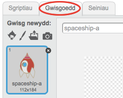

+ Defnyddia'r botwm dewis i ddethol y llun.  Yna gwasga ar y ddolen cylchdroi, i droi y llun tan ei fod ar ei ochr.

	

+ Ychwanega y côd yma i giplun dy long ofod:

	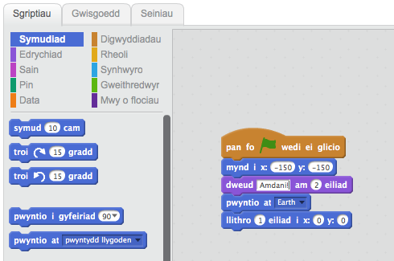

	Newida y rhifau yn y blociau côd, fel bod y côd union yr un peth â'r ddelwedd uchod.

+ Os gwnei di glicio ar y bloc côd, fe ddylst ti weld y llong ofod yn siarad, troi a symud tuag at ganol y llwyfan.

	

	Safle sgrin `x:(0) y:(0)` {.blockmotion} yw canol y llwyfan. Mae safle fel `x:(-150) y:(-150)` {.blockmotion} tuag at gwaelod chwith y llwyfan, ac mae safle fel `x:(150) y:(150)` {.blockmotion} yn agos i gornel top dde y llwyfan.

	

	Os oes angen i ti wybod cyfesur safle ar y llwyfan, symuda'r llygoden i'r safle yr hoffet ti a gwna nodyn o'r rhifau cyfesur, sydd i'w gweld o dan y llwyfan.

	

+ Profa dy animeiddiad, trwy wasgu ar y faner werdd uwchben y llwyfan.

	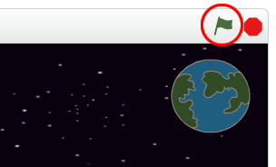

## Her: Perffeithio dy animeiddiad {.challenge}
Alli di newid y rhifau yn y côd animeiddio fel bod
+ Y llong ofod yn cyffwrdd y Ddaear?
+ Y llong ofod yn symud yn arafach tuag at y Ddaear?

Bydd angen i ti newid y rhifau yn y bloc yma:

```blocks
	llithro (1) eiliad i x:(0) y:(0)
```

## Arbed dy brosiect { .save }

# Step 2: Animeiddio gan ddefnyddio dolennu { .activity .new-page }

Ffordd arall o animeiddio'r llong ofod yw dweud wrtho i symud ychydig bach, nifer o weithiau.

## Rhestr wirio'r weithgaredd { .check }

+ Dileua y bloc llithro {.blockmotion} o'r côd, trwy ddefndyddio clic-dde ar y bloc a gwasgu 'dileu'. Mae hefyd modd i ti ddileu côd trwy ei lusgo o'r ardal sgript, yn ôl i ardal y blociau côd.

	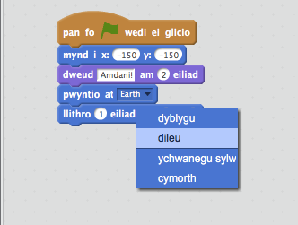

+ Unwaith i ti gael gwared ar y côd, ychwanega y côd yma yn ei le:

	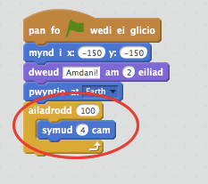

	Mae'r bloc 'ailadrodd' {.blockcontrol} yn cael ei ddefnyddio i ailadrodd rhywbeth llawer o weithiau, ac mae hefyd yn cael ei alw yn __ddolen__.

+ Os wyt ti'n gwasgu ar y faner i drio y côd newydd, fe wnei di weld ei fod yn gwneud yr un peth ag o'r blaen.

+ Mae modd i ti ychwanegu mwy o gôd i'r ddolen i wneud pethau diddorol. Ychwanega'r 
You can add more code to your loop, to do interesting things. Add the `change color effect by 25` {.blocklooks} block into the loop (from the 'Looks' section), to repeatedly change the colour of the spaceship as it moves:

	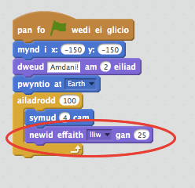

+ Gwasga'r faner i weld dy amineiddiad newydd.

	

+ Mae modd i ti hefyd wneud dy long ofod i fynd yn llai wrth iddo symud tuag at y Ddaear.

	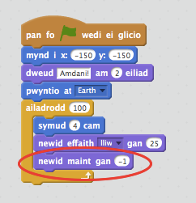

+ Profa dy amineiddiad.  Beth sy'n digwydd os wyt ti'n gwasgu ar y faner yr ail dro?  Ydy dy long ofod yn cychwyn y maint cywir?  Wyt ti'n gallu defnyddio y bloc yma i drwsio dy amineiddiad?

	```blocks
		gosod maint i (100)%
	```

## Arbeda dy brosiect { .save }

# Cam 3: Mwcni yn Arnofio { .activity .new-page }

Ewn ni ati i ychwanegu mwnci i dy amineiddiad, sydd ar goll yn y gofod!

## Rhestr wirio'r weithgaredd { .check }

+ Dechreua gan ychwanegu ciplun mwnci o'r llyfrgell.

	

+ Os wyt ti'n gwasgu ar fy fwnci newydd yna gwasgu 'Gwisgoedd', mae modd i ti chwarae gyda'r ffordd mae'r mwnci yn edrych.  Gwasga ar y teclyn 'Elips', a thynna llun helmet gofod gwyn o gwmpas pen y mwnci.

	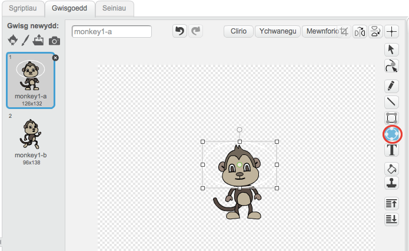

+ Nawr gwasga 'Sgriptiau' ac ychwanega y côd yma i'r mwnci, fel ei fod yn troi yn araf mewn cylch am byth:

	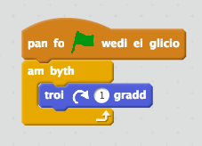

	Mae'r bloc 'Am Byth' {.blockcontrol} yn ddolen arall, ond y tro yma un sydd byth yn gorffan.

+ Gwasga'r faner i brofi dy fwnci.  Bydd angen i ti wasgu y botwm 'Stop' (drws nesaf i'r faner) i orffen yr amineiddiad yma.

	

# Step 4: Asteroid Sbonciog { .activity .new-page }

Beth am ychwanegu craig sydd yn arnofio i dy amineiddiad?

## Rhestr wirio'r weithgaredd { .check }

+ Ychwanega giplun 'craig' i dy amineiddiad.

	

+ Ychwanega'r côd yma i dy graig, i wneud iddo fownsio o gwmpas y llwyfan:

	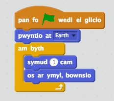

+ Gwasga'r faner i brofi dy graig. Ydy e'n bownsio o gwmpas y llwyfan?

# Cam 5: Sêr Disglair { .activity .new-page }

Awn ati i gyfuno dolenu i greu seren ddisglair.

## Rhestr wirio'r weithgaredd { .check }

+ Ychwanega giplun 'seren' i dy amineiddiad

	

+ Ychwanega'r côd yma i dy seren:

	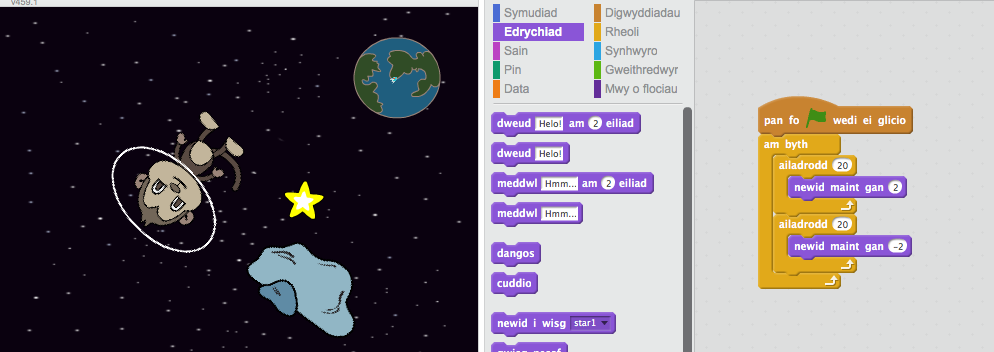

+ Gwasga'r faner i brofi amineiddiad y seren. Beth mae'r côd yn ei wneud? Mae'r seren yn mynd yn fwy 20 o weithiau, yna ychydig yn llai 20 o weithiau ac yn ôl i'w faint gwreiddiol.  Mae'r 2 ddolen yma yn rhan o orchymyn 'am byth', felly mae'r amineiddiad yn parhau i ailadrodd.

## Arbeda dy brosiect { .save }

## Her: Gwna amineddiad dy hunan {.challenge}
Stopia'r amineddiad gofod, gwasga ar 'Ffeil' a 'Newydd' i gychwyn prosiect newydd.

Defnyddia'r hyn rwyt ti wedi ei ddysgu yn y prosiect yma i wneud dy amineddiad dy hunan. Gall fod yn unrhywbeth hoffet ti, ond ceisia wneud dy amineddiad i fod gyda'r un gosodiad. Dyma rhai enghreifftiau:


