---
title: Band Roc
level: Scratch 1
language: cy-GB
stylesheet: scratch
embeds: "*.png"
materials: ["Club Leader Resources/*"]
...

# Cyflwyniad { .intro }

Yn y prosiect yma cei ddysgu sut i godio dy offerynau cerddorol dy hunan!

<div class="scratch-preview">
  <iframe allowtransparency="true" width="485" height="402" src="https://scratch.mit.edu/projects/embed/26741186/?autostart=false" frameborder="0"></iframe>
  
</div>

# Cam 1: Cipluniau { .activity }

Cyn i ti allu dechrau codio, bydd angen i ti ychwanegu 'rhywbeth' i godio. Yn Scratch, mae'r 'pethau' yma yn cael eu galw yn _giplun_.

## Rhestr wirio'r weithgaredd { .check }

+ Yn gyntaf, agora teclyn golygu Scratch. Mae modd dod o hyd i'r teclyn golygu Scratch arlein yma <a href="http://jumpto.cc/scratch-new" target="_blank">jumpto.cc/scratch-new</a>. Mae'n edrych fel hyn:

	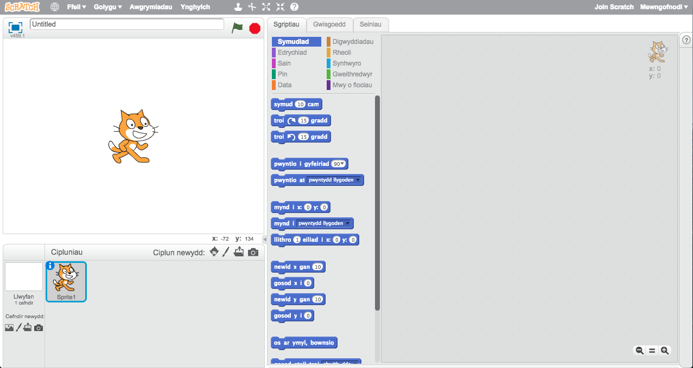

+ Masgot Scratch yw'r ciplun o'r gath y gweli di ar y sgrin. Dere i ni gael gwared ohono, trwy glicio ar y dde a gwasgu 'dileu'.

	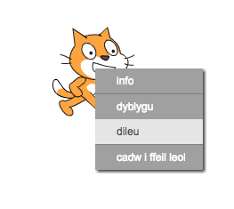

+ Nesaf, clicia 'Dewis ciplun o'r rhestr' i agor yr holl restr o gipluniau Scratch.

	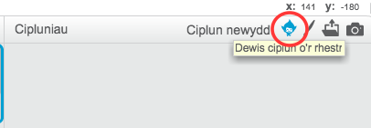

+ Cer i waelod y rhestr trwy sgrolio tan dy fod yn gweld ciplun o ddrwm. Clicia ar y drwm a gwasga 'Iawn' i'w ychwanegu i dy brosiect.

	

+ Clicia'r botwm 'lleihau', ac yna clicia ar y drwm cwpwl o weithiau i'w wneud yn llai.

	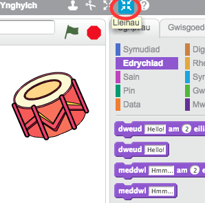

## Arbeda dy brosiect { .save }

Rho enw i dy brosiect, gan deipio un i'r blwch testun yn y gornel dop ar y chwith.

Clicia 'Ffeil' ac 'Arbed nawr' i gadw dy brosiect.

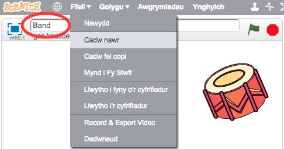

(Os nad oes gen ti gyfrif Scratch, galli di arbed copi o dy brosiect trwy ddewis 'Llwytho i'r cyfrifiadur' yn lle).

# Cam 2: Y Llwyfan { .activity }

Y __llwyfan__ yw'r ardal ar y chwith, a lle bydd dy brosiect yn dod yn fyw. Meddylia amdano fel ardal berfformio, yn union fel llwyfan go iawn!

## Rhestr wirio'r weithgaredd { .check }

+ Ar hyn o bryd, mae'r llwyfan yn wyn ac yn edrych yn eithaf diflas! Beth am ychwanegu cefndir i'r llwyfan, gan ddewis 'Dewis cefndir o'r rhestr'

	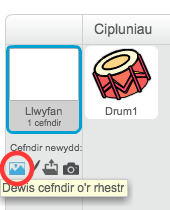

+ Dewisa 'Dan Do' ar y chwith, yna dewisa gefndir llwyfan a gwasga 'Iawn'.

	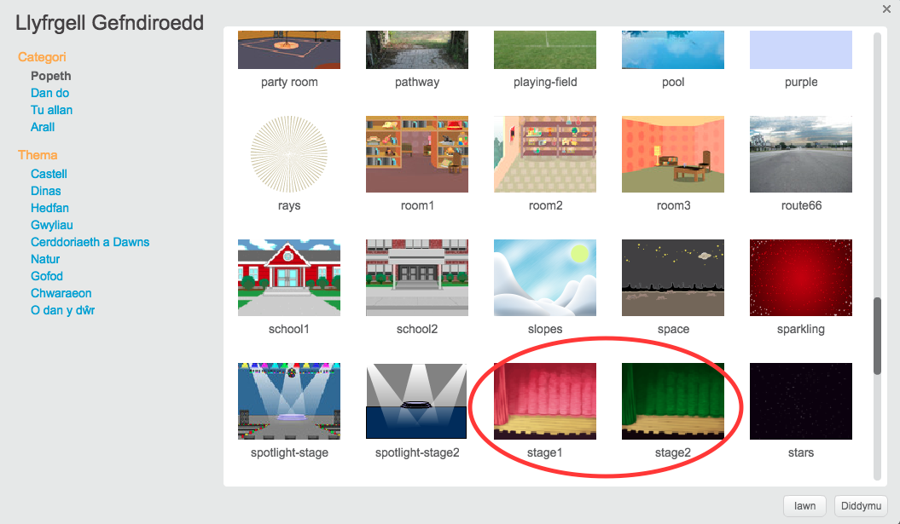

+ Fe ddylai dy lwyfan nawr edrych fel hyn:

	

# Cam 3: Gwneud Drwm { .activity }

Awn ati i godio dy ddrwm i wneud sŵn pan gaiff ei daro.

## Rhestr wirio'r weithgaredd { .check }

+ Fe wnei di ddod o hyd i'r blociau côd yn y tab 'Sgriptiau', ac mae gan bob un ei liw ei hunan!

	Clicia ar y ciplun drwm, yna llusga'r ddau floc yma i'r ardal codio ar y dde, gan wneud yn siwr eu bod wedi cysylltu gyda'i gilydd (fel blociau Lego):

	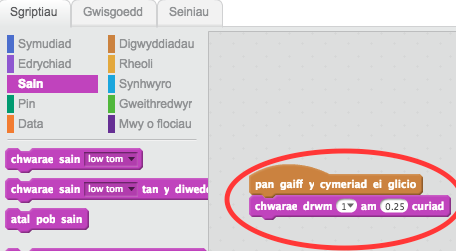

+ Clicia y drwm i drio dy offeryn newydd!

## Arbeda dy brosiect prosiect { .save }

##Her: Perffeithio dy ddrwm { .challenge }

+ Alli di newid y sŵn mae'r drwm yn ei wneud pan mae'n cael ei daro?

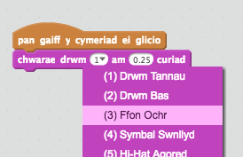

+ Alli di hefyd wneud i'r drwm wneud sŵn wrth wasgu'r bylchwr ar dy allweddell? Bydd angen i ti ddefnyddio'r bloc 'digwyddiadau' {.blockevents}:

```blocks
	pan fo bysell [bylchwr v] wedi ei wasgu
```

Mae modd i ti arbed y côd trwy glicio arno ar y dde a dewis 'dyblygu'

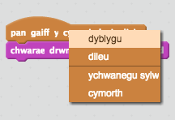

## Arbeda dy brosiect { .save }

# Cam 4: Gwneud Canwr { .activity .new-page }

Ewn ati i ychwanegu canwr i dy fand!

## Rhestr wirio'r weithgaredd { .check }

+ Ychwanega 2 giplun arall i dy lwyfan; canwr a meicraffon.

	

+ Cyn i ti allu wneud i dy ganwr ganu, bydd angen i ti ychwanegu sain i dy giplun.  Gwna yn siwr dy fod wedi dewis dy ganwr, yna clicia ar y tab 'Seiniau' a clicia 'Dewiswch sain o'r rhestr'.

	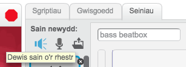

+ Os wnei di ddewis 'Lleisiau' o'r ochr chwith, bydd modd i ti ddewis sain perthnasol i ychwanegu i'r ciplun.

	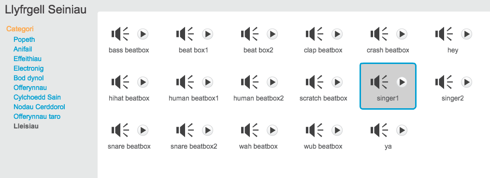

+ Nawr bod y sain wedi ychwanegu, galli di ychwanegu'r côd yma i'r canwr:

	```blocks
		pan caiff y cymeriad ei glicio
		chwarae sain [singer1 v] tan y diwedd
	```

+ Clicia ar dy ganwr, i sicrhau ei bod yn canu pan wyt ti'n clicio.

## Arbeda dy brosiect { .save }

# Cam 5: Gwisgoedd { .activity .new-page }

Ewn ati i wneud dy ganwr i edrych fel ei bod yn canu!

## Rhestr wirio'r weithgaredd { .check }

+ Galli di hefyd newid sut mae ciplun dy ganwr yn edrych trwy greu gwisg newydd. Dewisa'r tab 'Gwisgoedd', ac fe weli di lun o'r canwr.

	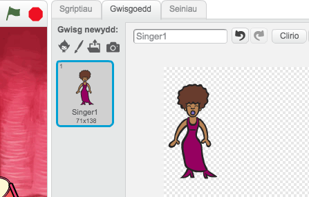

+ Dewisa clic-dde ar y wisg, a clicia 'dyblygu' i greu copi o'r wisg.

	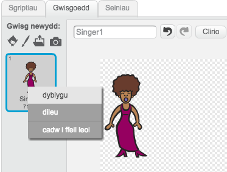

+ Clicia ar y wisg newydd (o'r enw 'Singer2') a dewisa y teclyn llinell i lunio llinellau i wneud hi edrych fel bod y canwr yn gwneud sŵn.

	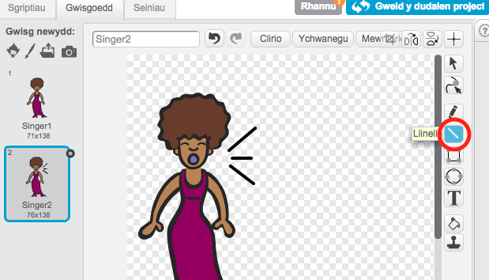

+ Nid yw enwau'r gwisgoedd yn llawer o gymorth ar hyn o bryd. Ail-enwa y 2 wisg i 'ddim yn canu' ac 'yn canu' wrth deipio enw newydd pob gwisg yn y blwch testun.

	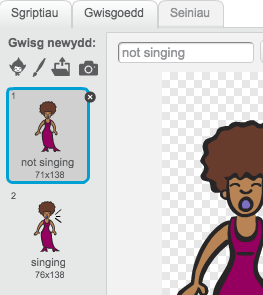

+ Nawr bod gyda ti 2 wisg gwahanol i dy ganwr, galli di ddewis pa wisg sydd yn cael ei arddangos! Ychwanega y 2 floc yma i dy ganwr:

	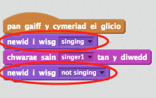

	Mae'r côd ar gyfer newid y wisg yn yr adran `Edrychiad` {.blocklooks}.

+ Profa dy ganwr.  Pan wyt ti yn clicio arni, fe ddylai dy ganwr edrych fel ei bod yn canu!

##Her: Newid edrychiad dy ddrwm { .challenge }
Alli di wneud i dy ddrwm edrych fel ei fod yn cael ei daro?  Os oes angen cymorth, galli di ddefnyddio'r cyfarwyddiadau i newid gwisg dy ganwr uchod.


Cofia brofi i weld os yw y côd newydd yn gweithio!

## Arbeda dy brosiect { .save }

##Her: Gwneud band dy hunan { .challenge }
Defnyddia yr hyn rwyt ti wedi ei ddysgu yn y prosiect yma i wneud dy fand dy hunan! Galli di greu unrhyw offerynau yr hoffet ti, ond edrycha ar y synau ac offerynau i gael rhai syniadau.

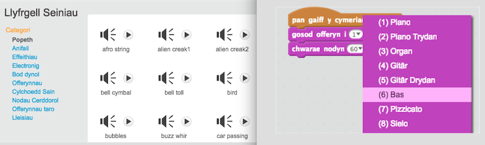

Does dim rhaid i dy offerynau fod yn rhai call cofia. Er enghraifft, galli di wneud piano yn defnyddio myffins!


Yn ogystal â chipluniau sydd yn bodoli yn barod, mae modd i ti greu rhai dy hunan.

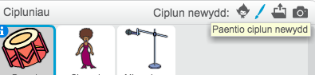

Os oes gyda ti feicraffon galli di recordio dy synau dy hunan, neu galli di hyd yn oed ddefnyddio gwe-gamera i daro dy offerynnau!

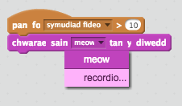

## Arbeda dy brosiect { .save }
