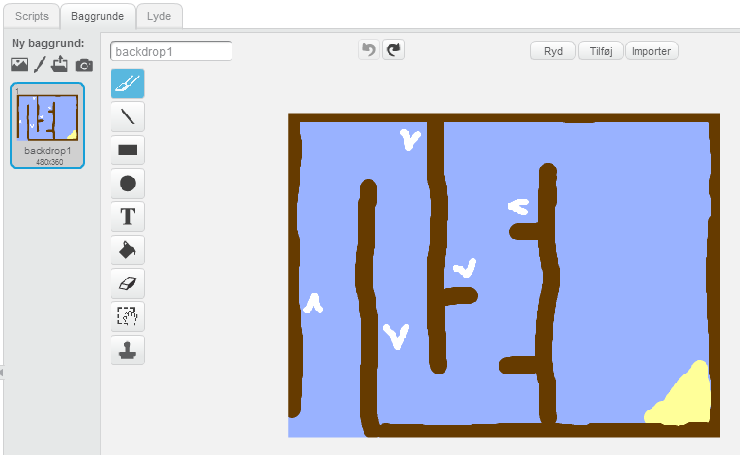
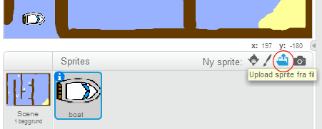
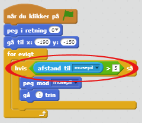
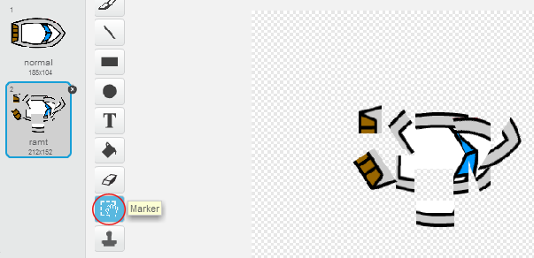
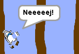
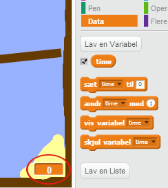
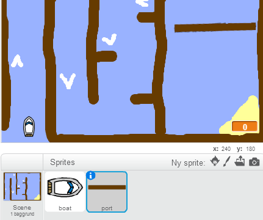
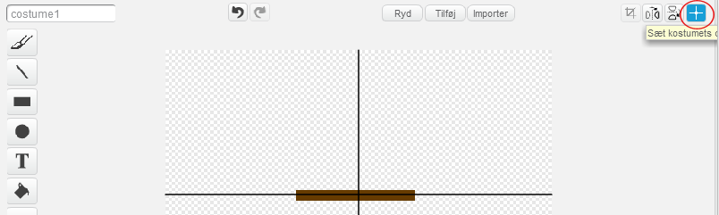
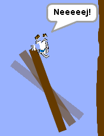
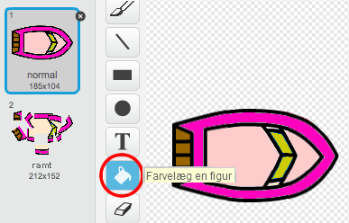

---
title: Bådsejlads
level: Scratch 1
language: da-DK
stylesheet: scratch
embeds: "*.png"
materials: ["Klubleder Ressourcer/*.*","Projekt Ressourcer/*.*"]
...

# Introduktion { .intro }

Du skal lære hvordan du laver et spil, hvor man bruger musen til at styre en båd til en øde ø.

<div class="scratch-preview">
  <iframe allowtransparency="true" width="485" height="402" src="http://scratch.mit.edu/projects/embed/63957956/?autostart=false" frameborder="0"></iframe>
  
</div>

# Trin 1: Planlæg dit spil { .activity }

## Arbejdsliste { .check }

+ Start et nyt Scratch projekt og slet kattespriten så dit projekt står tomt. Du kan finde Scratch redigeringsprogrammet online på <a href="http://jumpto.cc/scratch-new">jumpto.cc/scratch-new</a>.

+ Klik på din scene baggrund og planlæg dit niveau. Du bør tilføje:
	+ Træ som din båd skal undgå; 
	+ En øde ø som din båd skal nå.

	Sådan skal dit spil se ud:

	 

# Trin 2: At kontrollere båden { .activity }

## Arbejdsliste { .check }

+ Hvis din instruktør har givet dig en 'Projekt Ressourcer' mappe, så klik på 'Upload sprite fra fil' og tilføj 'boat.png' billedet. Du bør formindske din sprite og stille den i sin start position.

	

	Hvis du ikke har boat.png billedet, så kan du i stedet tegne din egen båd! 

+ Du skal kontrollere båden med din mus. Tilføj denne kode til din båd:

```blocks 
		når du klikker på ⚑
		peg i retning (0 v)
		gå til x:(-190) y:(-150)
		for evigt
  				 peg mod [musepil v]
  			 gå (1) trin
		end 
```  

+ Afprøv din båd ved at klikke på flaget og flyt på musen. Sejler båden mod musen? 

	

+ Hvad sker der hvis båden når hen til musemarkøren? 

	For at forhindre dette er du nødt til at føje en `hvis` {.blockcontrol} blok til din kode, således at båden kun bevæger sig hvis den befinder sig mere end 5 pixels fra båden.

		

+ Afprøv din båd igen og tjek om problemet er løst. 

## Gem dit projekt { .save }

# Trin 3: Sammenstød! { .activity .new-page } 

Din båd er i stand til at sejle gennem træbarriererne! Lad os finde en løsning.

## Arbejdsliste { .check }

+ Du får brug for 2 kostumer til din båd- et normalt kostume og et kostume beregnet til når båden styrter sammen. Kopiér dit båds kostume og navngiv dem 'normal' og 'ramt'. 

+ Klik på dit 'ramt' kostume, og vælg 'Marker' redskabet til at tage nogle bidder af din båd og rotér dem rundt. Få din båd til at se ud som om, den er styrtet sammen.

	

+ Tilføj denne kode til din båd indeni `for evigt` {.blockcontrol} loopen, således at den styrter sammen, når den rører hvilken som helst form for brune træstykker:

```blocks 
			hvis <berører farven [#603C15]?> så
   			skift kostume til [ramt v]
   			sig [Noooooo!] i (1) sekunder
   			skift kostume til [normal v]
   			peg i retning (0 v)
   			gå til x:(-215) y:(-160)
		end
``` 

Denne kode ligger indeni `for evigt` {.blockcontrol} loopen, så din kode bliver ved med at tjekke om din båd er stødt sammen med noget.
	
+ Sørg også for at din båd altid starter ud med at se ud som 'normal'.   

+ Hvis du nu prøver at sejle gennem en barriere af træ, så bør du se at din båd styrter sammen og bevæger sig tilbage til start. 

	

## Gem dit projekt { .save }

## Udfordring: Du vinder! {.challenge}
Kan du tilføje en ny `hvis` {.blockcontrol} erklæring til koden for din båd, således at spilleren vinder, når de ankommer til den øde ø? 

Når båden ankommer til den gule øde ø, så skal den sige 'YEAH!', og spillet skal stoppe. Du får brug for denne kode:

```blocks
	sig [YEAH!] i (1) sekunder
	stop [alle v]
``` 


## Gem dit projekt { .save }

## Udfordring: Lydeffekter {.challenge}
Kan du tilføje lydeffekter til dit spil til når båden styrter sammen eller den når øen tilsidst? Du kan faktisk også tilføje noget baggrundsmusik (tag et kig på det tidligere 'Rockband' projekt, hvis du har brug for hjælp). 

## Gem dit projekt { .save }

# Trin 4: Tidstælling { .activity }

Lad os tilføje et stopur til dit spil, så spilleren skal nå hen til den øde ø så hurtigt som muligt.

## Arbejdsliste { .check }

+ Tilføj en ny variabel du kalder `time` {.blockdata} til din scene. Du kan også ændre, hvordan din nye variabel vises. Hvis du har brug for hjælp, så tag et kig på 'Balloons' projektet.

	

+ Tilføj denne kode til din __scene__, således at dit stopur tæller op til tidspunktet, hvor din båd når hen til den øde ø:

```blocks 
		når du klikker på ⚑
		sæt [time v] til [0] 
		for evigt
   			vent (0.1) sekunder
   				ændr [time v] med (0.1)
		end 
```  

+ Det var det! Afprøv dit spil og se hvor hurtigt du kan nå hen til den øde ø!

	

## Gem dit projekt { .save }

# Trin 5: Forhindringer og power-ups { .activity } 

Spillet er _alt_ for nemt - lad os tilføje nogle ting og gøre det mere spændende.

## Arbejdsliste { .check }

+ Lad os først tilføje nogle 'forstærkninger' til dit spil, som kan gøre din båd hurtigere. Redigér din scene baggrund og tilføj nogle hvide forstærkningspile.

	

+ Nu kan du tilføje noget kode til din båds `for evigt` {.blockcontrol} loop, således at den flytter sig 2 _ekstra_ trin, når den rører en hvid forstærkning.

```blocks 
	hvis <berører farven [#FFFFFF]?> så 
   	  gå (3) trin
	end 
``` 

+ Du kan også tilføje en svingende port, som din båd skal undgå. Tilføj en ny sprite du kalder 'port', der ser således ud:

	

	Sørg for at portens farve er den samme farve som de øvrige træbarrierer. 

+ Centrér port spriten.

	

+ Tilføj en kode til din port, som får den til at svinge langsomt `for evigt` {.blockcontrol}.

+ Afprøv dit spil. Du bør nu have en svingende port, som du skal undgå.

	

## Gem dit spil { .save }

## Udfordring: Flere forhindringer! {.challenge .new-page}
Kan du tilføje nogle flere forhindringer til dit spil? Her er nogle idéer:

+ Du kunne tilføje noget grønt slim til din baggrund, som gør spilleren langsommere, når de rører ved det. Til dette kan du bruge en `vent` {.blockcontrol} blok:

```blocks
	vent (0.01) sekunder
````


+ Du kan også tilføje en genstand, der bevæger sig, fx en træstamme eller en haj! 


Disse blokke kan måske hjælpe dig:

```blocks
		gå (1) trin
		hop tilbage ved kanten
```` 

Hvis din nye genstand ikke er brun, så skal du tilføje dette til din båds kode:

```blocks
	hvis <  <berører farven [#603C15]?> eller <berører [haj v]?> > så
	end
``` 

## Gem dit projekt { .save }

## Udfordring: Flere både! {.challenge .new-page}
Kan du forme spillet, så det bliver til et racerløb mellem 2 spillere?

+ Kopiér din båd, omdøb den 'Spiller 2' og ændr dens farve.



+ Lav Spiller 2's start position om ved at ændre denne kode: 

```blocks
	gå til x:(-190) y:(-150)
```

+ Slet koden, som bruger musen til at kontrollere båden:

```blocks
	hvis <(afstand til [musepil v]) > [5]> så
   		peg mod [musepil v]
   		gå (1) trin
	end 
```

...og erstat den med en kode, der kontrollerer båden ved hjælp af piletasterne.

Du skal bruge denne kode til at flytte båden fremad:

```blocks
	hvis <trykket på tasten [pil opad v]?> så 
   		gå (1) trin
	end 
```

Du får også brug for en kode, som kan `dreje` {.blockmotion} båden, når der trykkes på venstre og højre piletast. 

## Gem dit projekt { .save }

## Udfordring: Flere niveauer! {.challenge .new-page}
Kan du lave nogle flere baggrunde og gøre det muligt for spilleren at vælge mellem forskellige niveauer?
```blocks
	når du trykker på [mellemrum v]
    næste baggrund
``` 
## Gem dit projekt { .save } 
 
