---
title: ChatBot
level: Scratch 1
language: da-DK
stylesheet: scratch
embeds: "*.png"
materials: ["Klubleder Ressourcer/*.*"]
...

# Introduktion { .intro }

Nu skal du lære hvordan du programmerer din egen talende robot! 

<div class="scratch-preview">
  <iframe allowtransparency="true" width="485" height="402" src="http://scratch.mit.edu/projects/embed/26762091/?autostart=false" frameborder="0"></iframe>
  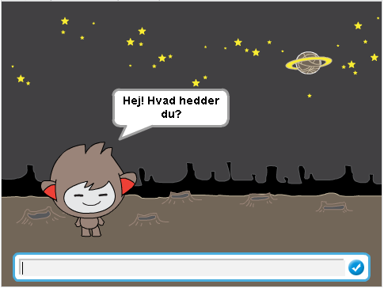
</div>

# Trin 1: Din chatbot { .activity }

## Arbejdsliste { .check }

+ Inden du begynder at lave din egen chatbot, så skal du beslutte dig for hvilken personlighed den skal have.
	+ Hvad er dens navn?  
	+ Hvor bor den?
	+ Er den glad? alvorlig? sjov? genert? venlig?


+ Start et nyt Scratch projekt, og slet katte-spriten så dit projekt står tomt. Du kan finde Scratch redigeringsprogrammet online på <a href="http://jumpto.cc/scratch-new">jumpto.cc/scratch-new</a>.

+ Vælg en af disse sprite-figurer, og tilføj den til dit projekt:

	

+ Vælg en baggrund som passer til din chatbot. Du kan vælge hvad du har lyst til, men her er et eksempel:
 
    
 
## Gem dit projekt { .save }

# Trin 2: En talende chatbot { .activity }

Nu hvor du har en chatbot med sin egen personlighed, så lad os programmere den til at snakke med dig.

## Arbejdsliste { .check }

+ Klik på din chatbot og tilføj denne kode:

```blocks 
		når denne sprite klikkes
		bed om [Hej! Hvad hedder du?] og vent
		sig [Sikke et dejligt navn!] i (2) sekunder
```  
 
+ Klik på din chatbot for at afprøve den. Efter du er blevet spurgt om dit navn, så indtast det i boksen i bunden af scenen. 

	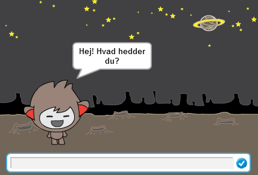

+ Din chatbot svarer blot `sikke et dejligt navn!` hver gang. Du kan gøre din chatbots svar personlig ved at bruge brugerens svar. Ændr koden for din chatbot-sprite, så den ser således ud:

```blocks 
	    når denne sprite klikkes
		bed om [Hej! Hvad hedder du?] og vent
		sig <[Hej] tilkobles (svar)> i (2) sekunder
``` 

For at lave den sidste blok skal du først slæbe en grøn `tilkobles` {.blockoperators} blok hen på `sig` {.blocklooks} blokken.  

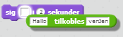

Du kan så ændre teksten `Hallo` til `Hej`, og slæbe den lyseblå `svar` {.blocksensing} blok (fra 'Registrering' sektionen) hen på teksten `verden`.

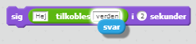

+ Afprøv dit nye program. Virker det som du forventede? Kan du løse eventuelle problemer? (Hint: du kan prøve at tilføje et mellemrum et sted!)  

+ Måske du gerne vil opbevare brugerens navn i en variabel, så du kan bruge det senere. Lav en ny variabel du kalder `navn` {.blockdata}. Hvis du har glemt hvordan du gør, så kan 'Balloons' projektet hjælpe dig.

+ Den information, som du har indtastet, opbevares allerede i en speciel variabel, vi kalder `svar` {.blocksensing}. Gå til blokkene under Registrering og klik på svar blokken og sæt et flueben. Den gældende værdi i `svar` {.blocksensing} bør da vises oppe i venstre hjørne af scenen.
 
+ Når du har lavet din nye variabel, så sørg for at koden for din chatbot ser således ud: 

```blocks 
		når denne sprite klikkes
		bed om [Hej! Hvad hedder du?] og vent
		sæt [navn v] til (svar)
		sig <[Hej] tilkobles (navn)> i (2) sekunder
```  
 
+ Hvis du tester dit program igen, så vil du se, at svaret er opbevaret i `navn` {.blockdata} variablen, og vises i øverste venstre hjørne af scenen. `navn` {.blockdata} variablen bør nu indeholde samme værdi som `svar` {.blocksensing} variablen.

	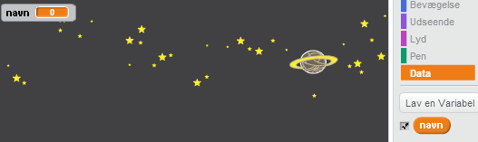

	Hvis du foretrækker ikke at se variablerne på din scene, så skjul dem ved at klikke og fjerne fluebenene ud for variablernes navne under 'Scripts' fanen.

## Gem dit projekt { .save }

## Udfordring: Flere spørgsmål { .challenge }

Programmér din chatbot til at stille et andet spørgsmål. Kan du opbevare svaret i en variabel?

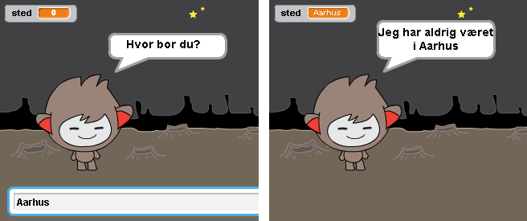

## Gem dit projekt { .save }

# Trin 3: Lav beslutninger { .activity }

Du kan programmere din chatbot til at tage beslutninger baseret på brugerens respons.

## Arbejdsliste { .check }

+ Lad os få din chatbot til at stille brugeren et spørgsmål som rækker til et `ja` eller `nej` svar. Her er et eksempel, men du kan ændre spørgsmålet, hvis du har lyst: 

```blocks 
		når denne sprite klikkes
		bed om [Hej! Hvad hedder du?] og vent
		sæt [navn v] til (svar)
		sig <[Hej] tilkobles (navn)> i (2) sekunder
		bed om <[Er du OK] tilkobles (navn)> og vent
		hvis ((svar) = [ja]) så
  			 sig [Det er godt at høre!] i (2) sekunder
		end 
```  

Læg mærke til, at nu hvor du har gemt brugerens navn i en variabel, så kan du bruge det så meget du har lyst til.

+ For at teste programmet ordenligt, så skal du teste det to gange - én gang, hvor du taster `nej` som dit svar, og én gang hvor du taster `ja`. Du bør kun få en respons fra din chatbot `hvis` {.blockcontrol} du svarer `ja`.

+ Problemet med din chatbot er, at den ikke giver et svar hvis brugeren svarer `nej`. Dette kan du løse ved at ændre `hvis` {.blockcontrol} blokken til en `hvis/ellers` {.blockcontrol} blok, sådan at din kode nu ser således ud:

```blocks 
		når denne sprite klikkes
		bed om [Hej! Hvad hedder du?] og vent
		sæt [navn v] til (svar)
		sig <[Hej] tilkobles (navn)> i (2) sekunder
		bed om <[Er du OK] tilkobles (navn)> og vent
		hvis ((svar) = [ja]) så 
  		 	sig [Det er godt at høre!] i (2) sekunder
		ellers 
   			sig [Åh nej!] i (2) sekunder
		end
``` 

+ Hvis du tester din kode, så vil du se at du nu får et svar, når du svarer `ja` eller `nej`. Din chatbot bør besvare `ja` med `Det er godt at høre!` og besvare alt andet med `Åh nej!`, hvis du ikke taster `ja`. 

	

+ Du kan putte hvilken som helst kode indeni en `hvis` {.blockcontrol} eller `ellers` {.blockcontrol} blok, ikke kun kode som får din chatbot til at tale. Du kan fx også skifte chatbottens kostume så det matcher dens svar.  

Hvis du tager et kig på din chatbots kostumer, så vil du måske se at der er flere end én. (Hvis ikke, så kan du altid tilføje flere selv!) 


Du kan bruge disse kostumer, som del af din chatbots respons, ved at tilføje denne kode:

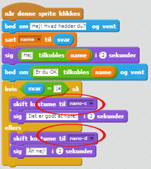

+ Afprøv dit program. Nu bør se at chatbottens ansigt ændrer sig afhængig af, hvilket svar du giver. 

	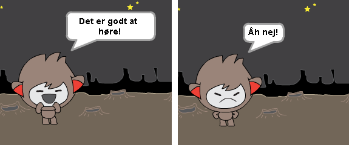

## Gem dit projekt { .save }

## Udfordring: Flere beslutninger { .challenge }

Programmér din chatbot til at stille et andet spørgsmål - et spørgsmål med et `ja` eller `nej` svar. Kan du få din chatbot til at respondere på dit svar?

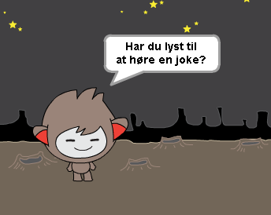

## Gem dit projekt { .save }

# Trin 4: Ændre sted { .activity }

Du kan også programmere din chatbot til at ændre hvor den befinder sig.

## Arbejdsliste { .check }

+ Tilføj en anden baggrund til din scene, for eksempel 'moon' (måne) baggrunden.
  
	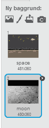

+ Du kan nu programmere din chatbot til at ændre dens omgivelser ved at tilføje denne kode til din chatbot:

```blocks
    	bed om [Jeg skal op til månen. Vil du med?] og vent
		hvis ((svar) = [ja]) så 
   		skift baggrund til [moon v]  
		end 
``` 

+ Du er også nødt til at sørge for, at din chatbot er udenfor, når du begynder at tale med den. Tilføj denne kode til begyndelsen af koden til din chatbot:

	

+ Test dit program og svar `ja` når du bliver spurgt, om du har lyst til at tage med på månen. Du bør se at chatbottens omgivelser har ændret sig.
 
	

+ Ændrer din chatbots omgivelser sig, hvis du taster `nej`? Hvad hvis du taster `Jeg er ikke sikker`?

+ Du kan også tilføje denne kode til din `hvis` {.blockcontrol} blok for at få din chatbot til at hoppe op og ned 4 gange hvis svaret er `ja`:

```scratch 
		gentag (4) gange
   			ændr y med (10)
   			vent (0.1) sekunder
   			ændr y med (-10)
   			vent (0.1) sekunder
		end
```  
	
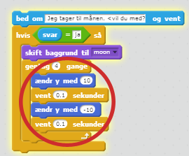

+ Test din kode igen. Hopper din chatbot op og ned, når du svarer `ja`?

## Gem dit projekt { .save }

## Udfordring: Lav din egen chatbot {.challenge}
Brug hvad du har lært indtil videre til at færddiggøre din interaktive robot. Her er nogle idéer: 
 
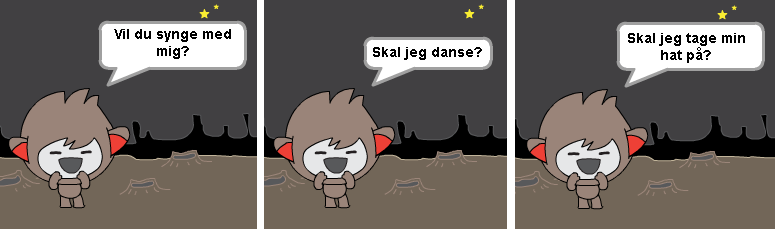

Når hvor du har lavet din chatbot færdig, så få dine venner til at føre en samtale med den! Kan de lide personligheden? Oplevede de nogen problemer? 

## Gem dit projekt { .save }
