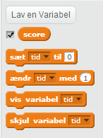
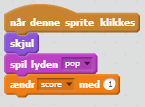
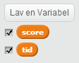
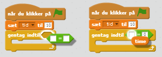
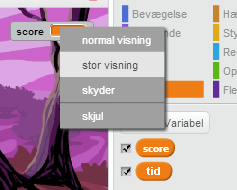

---
title: Ghostbusters
level: Scratch 1
language: da-DK
stylesheet: scratch
embeds: "*.png"
materials: ["Klubleder Ressourcer/*.*"]
...

# Introduktion { .intro }

Du skal lave et fangelegsspil med spøgelser! 

<div class="scratch-preview">
  <iframe allowtransparency="true" width="485" height="402" src="http://scratch.mit.edu/projects/embed/60787262/?autostart=false" frameborder="0"></iframe>
  
</div>

# Step 1: Animere et spøgelse { .activity }

## Arbejdsliste { .check }

+ Start et nyt Scratch projekt, og slet katte spriten så dit projekt står tomt. Du kan finde Scratch redigeringsprogrammet online på <a href="http://jumpto.cc/scratch-new">jumpto.cc/scratch-new</a>. 

+ Tilføj en ny spøgelses sprite og en passende baggrund. 

	

+ Tilføj denne kode til dit spøgelse så det gentagne gange kommer frem og forsvinder:  

	```blocks
		når du klikker på ⚑
 		for evigt
   			skjul
   			vent (1) sekunder
   			vis
   			vent (1) sekunder  
		end 
	``` 
 
+ Test koden af dit spøgelse ved at klikke på det grønne flag.

## Gem dit projekt { .save }

# Trin 2: Tilfældige spøgelser { .activity }

Dit spøgelse er ret let at fange for det bevæger sig ikke! 

## Arbejdsliste { .check } 

+ Frem for at blive i samme position kan du lade Scratch vælge tilfældige x og y koordinater i stedet. Tilføj en `gå til` {.blockmotion} blok til koden af dit spøgelse, så den ser således ud:

	```blocks
		når du klikker på ⚑
		for evigt
		   skjul
		   vent (1) sekunder
		   gå til x:(vælg tilfældigt mellem (-150) og (150)) y:(vælg tilfældigt mellem (-150) og (150))
		   vis
		   vent (1) sekunder
		end 
	```
 
+ Test dit spøgelse igen og du bør se at det dukker op et forskelligt sted hver gang.

## Gem dit projekt { .save }

## Udfordring: Mere tilfældighed {.challenge}
Kan du få dit spøgelse til at `vente` {.blockcontrol} et tilfældigt antal gange før det kommer frem? Kan du bruge `sæt størrelsen` {.blocklooks} blokken til at få dit spøgelse til at være en tilfældig størrelse hver gang det kommer frem? 
## Gem dit projekt { .save }

# Trin 3: Fang spøgelser { .activity }

Lad os give spilleren mulighed for at fange spøgelser!

## Arbejdsliste { .check }

+ For at give spilleren mulighed for at fange spøgelser, så tilføj denne kode:

	```blocks
		når denne sprite klikkes
		skjul
	``` 

+ Test dit projekt. Kan du fange spøgelserne når de kommer frem? Hvis du synes det er svært at fange spøgelserne, så kan du spille spillet i fuldskærm ved at trykke på denne knap:

	

## Udfordring: Tilføj en lyd { .challenge }
Kan du lave en lyd hver gang der fanges et spøgelse? 

## Gem dit projekt { .save }

# Trin 4: Tilføj en score { .activity .new-page }

Lad os gøre det hele lidt mere spændende ved at lave en pointoptælling (score).

## Arbejdsliste { .check }

+ For at holde øje med en spillers score har du brug for et sted, hvor du kan opbevare den. En __variabel__ er et sted, hvor du kan opbevare data som kan ændre sig, ligesom en score.

	For at lave en ny variabel, klik på 'Scripts' fanebladet, vælg `Data` {.blockdata} og klik så på 'Lav en Variabel'.

	

	Tast 'score' i navnet på variablen, sørg for at den er tilgængelig for alle sprites og klik 'OK' for at lave den. Herefter kan du se en del kodeblokke som kan bruges sammen med din `score` {.blockdata} variabel.

	

	Du vil også se scoren oppe i venstre hjørne af scenen. 

	

+ Når et nyt spil startes (ved at klikke på flaget), bør du sætte spillerens score til 0: 

	```blocks
	når du klikker på ⚑
	sæt [score v] til [0]
	```  

+ Når der fanges et spøgelse skal du tilføje 1 til spillerens score: 

	

+ Kør dit program igen og fang nogle spøgelser. Ændrer din score sig? 

## Gem dit projekt { .save }

# Trin 5: Tilføj en timer { .activity }

Du kan gøre dit spil mere interessant ved kun at give spilleren 10 sekunder til at fange så mange spøgelser som muligt.

## Arbejdsliste { .check }

+ Du kan bruge en anden variabel til at opbevare den øvrige tid som er tilbage. Klik på scenen og lav en ny variabel, som du kalder 'time':

	

+ Din timer bør fungere således: 

	+ Timeren bør starte ud med 10 sekunder;
	+ Timeren bør tælle ned hvert sekund;
	+ Spillet bør stoppe når timeren når ned på 0.

	Her er den kode du skal bruge, og som du kan tilføje til din __scene__:

	```blocks
		når du klikker på ⚑
		sæt [time v] til [10]
		gentag indtil <(time) = [0]>
   		vent (1) sekunder
   		ændr [time v] med (-1)
	end
	stop [alle v]
	``` 
 
	Sådan tilføjer du din `gentag indtil`{.blockcontrol}`time`{.blockdata}`= 0`{.blockoperators} kode:

	

+ Slæb din 'time' variabel viser til højre side af scenen. Du kan også højreklikke på variabel viseren og vælge 'stor visning' for at ændre hvordan timeren vises.

	

+ Få en ven til at afprøve dit spil. Hvor mange point kan de score? Hvis dit spil er for nemt, så kan du: 

	+ Give spilleren mindre tid;
	+ Få spøgelserne til at vise sig færre gange
	+ Lave spøgelserne mindre.

	Afprøv dit spil et par gange indtil du er tilfreds med sværhedsgraden. 

## Gem dit projekt { .save }

## Udfordring: Flere objekter {.challenge}
Kan du tilføje andre objekter til dit spil?


Du bør tænke over hvilke objekter du tilføjer. Tænk på: 

+ Hvor stort er det?
+ Skal det dukke op flere eller færre gange end spøgelserne?  
+ Hvordan skal det se ud, og lyde, når det fanges?  
+ Hvor mange point bliver der scoret (eller tabt) når det fanges?  

Hvis du har brug for hjælp til at tilføje et nyt objekt, kan du genbruge trinene ovenfor! 
## Gem dit projekt { .save }
