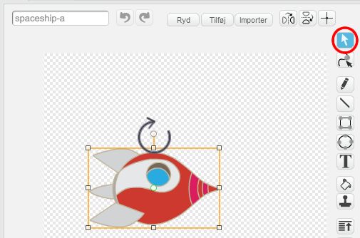

---
title: Rumfart — Noter til ledere af kodeklub
language: da-DK
embeds: "*.png"
materials: [""] 
...

#Introduktion:
I dette projekt skal børnene lære at kombinere kodeblokke med henblik på at lave en simpel animation.

#Ressourcer
Du bør benytte Scratch 2 til dette projekt. Scratch 2 kan tilgås online via [jumpto.cc/scratch-on](http://jumpto.cc/scratch-on) og kan også downloades fra  [jumpto.cc/scratch-off](http://jumpto.cc/scratch-off) og bruges offline.

Du kan finde en færdig version af dette projekt <a href="http://scratch.mit.edu/projects/26818098/#editor">online</a>, og det kan også downloades ved at klikke på linket 'Download Project Materials', som indeholder:  

+ LostInSpace.sb2

Der findes også en version af dette projekt, hvor de eksterne ressourcer er loadede i forvejen. Denne version er tilgængelig online på [jumpto.cc/space-resources](http://jumpto.cc/space-resources), eller i projektmaterialerne, der kan downloades, og som indeholder:

+ LostInSpaceResources.sb2 

#Læringsmål
+ Loops:
	+ `Gentag` {.blockcontrol} loops;
	+ `For evigt` {.blockcontrol} loops.

#Udfordringer
+ "Forbedr din animation" - ændre tallene i et kort program; 
+ "Lav din egen animation" - anvende din læring til at lave en ny animation.

#Ofte Stillede Spørgsmål
+ Børnene skal huske at 'nulstille' position, størrelse eller øvrige effekter for deres sprite i begyndelsen af deres animation. Dette opnåes nemt ved at tilføje nogle af følgende blokke til begyndelsen af deres animationer:

```blocks
	gå til x:(0) y:(0)
```

```blocks
	sæt størrelsen til (100)%
```

```blocks
	fjern grafiske effekter
```

+ 'Rumskib' spriten vil bevæge sig sidelæns medmindre det roteres 90 grader med uret. At rotere rumskibet er del af instruktionerne i projektet, men en ny sprite kan erstatte rumskibet, hvis der opstår problemer.

	
