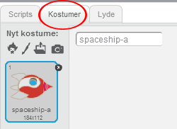
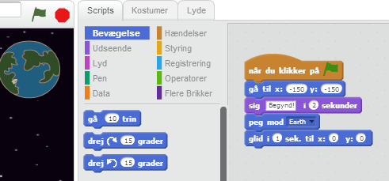
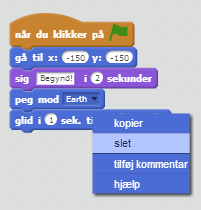
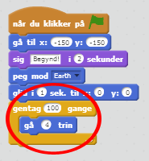
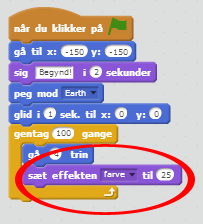
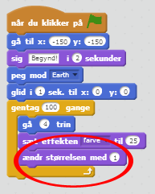
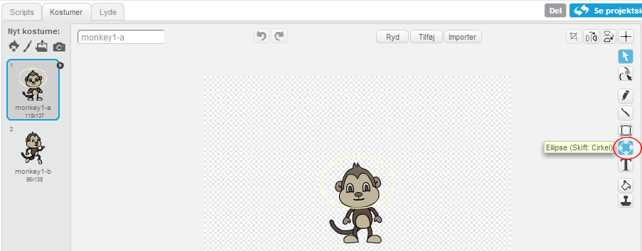

---
title: Rumfart
level: Scratch 1
language: da-DK
stylesheet: scratch
embeds: "*.png"
materials: ["Klubleder Ressourcer/*.*"]
...

# Introduktion { .intro }

Nu skal du lære hvordan du programmerer din egen animation!

<div class="scratch-preview">
  <iframe allowtransparency="true" width="485" height="402" src="http://scratch.mit.edu/projects/embed/26818098/?autostart=false" frameborder="0"></iframe>
  
</div>

# Trin 1: Animér et rumskib { .activity .new-page}

Lad os lave et rumskib som flyver mod Jorden!

## Arbejdsliste { .check }

+ Start et nyt Scratch projekt og slet katte spriten, så dit projekt er tomt. Du kan finde et online Scratch redigeringsprogram på <a href="http://jumpto.cc/scratch-new">jumpto.cc/scratch-new</a>.

+ Tilføj 'Spaceship' og 'Earth' sprites til din scene. Tilføj også 'Stars' baggrunden til din scene. Sådan bør din scene se ud:

	

+ Klik på din nye rumskibs sprite, og klik så på 'Kostumer' fanebladet.

	

+ Brug pileredskabet til at vælge dit billede. Klik så på roteringshåndtaget og rotér dit billede indtil det ligger på siden.

	

+ Tilføj denne kode til din rumskibs sprite:

	

	Ændr tallene i kodeblokkene, så koden er præcis den samme som på ovenstående billede.

+ Hvis du klikker på kodeblokkene for at køre koden, bør du se rumskibet dreje og flytte sig mod midten af scenen.

	

	Skærmpositionen `x:(0) y:(0)` {.blockmotion} betegner midten af scenen. En position som `x:(-150) y:(-150)` {.blockmotion} ligger mod scenens venstre bund, og en position som `x:(150) y:(150)` {.blockmotion} er tæt på scenens højre top.

	

	Hvis du har brug for at vide din scenes koordinater, flyt pilen til din ønskede position, og notér koordinaterne som vises under scenen.

	

+ Test din  nye animation ved at klikke på det grønne flag lige over scenen.

	

## Udfordring: Forbedr din animation {.challenge} 
Kan du ændre tallene i din animationskode således at:
+ Rumskibet flytter sig indtil det rører Jorden?
+ Rumskibet flytter sig mere langsomt mod Jorden?

Du skal ændre tallene i denne blok:

```blocks
	glid (1) sek. til x:(0) y:(0)
```

## Gem dit projekt { .save }

# Trin 2: Animere ved brug af loops { .activity .new-page }

En anden måde du kan animere dit rumskib på er ved at fortælle det, at det skal flytte sig en lille smule, mange gange.

## Arbejdsliste { .check }

+ Slet `glid` {.blockmotion} blokken fra din kode ved at højreklikke på blokken og klik 'Slet'. Du kan også slette din kode ved at trække den ud af script området og tilbage til området med kodeblokkene. 
 
	

+ Når du har fjernet din kode, tilføj denne kode i stedet:

	

	`Gentag` {.blockcontrol} blokken bruges til at gentage noget mange gange, og kendes også som et __loop__.

+ Hvis du klikker på flaget for at afprøve denne nye kode, så vil du se den faktisk gør det samme som før.

+ Du kan tilføje mere kode til dit loop for at gøre nogle spændende ting. Tilføj `ændr effekten farve med 25` {.blocklooks} blokken til loop'en (fra 'Udseende' sektionen) for gentagne gange at ændre farven på dit rumskib, når det flytter sig:

	

+ Klik på flaget for at se din nye animation.

	

+ Du kan også lave dit rumskib mindre og mindre jo tættere den kommer på Jorden.
	

+ Afprøv din animation. Hvad sker der, hvis du klikker på flaget endnu en gang? Starter dit rumskib ud i den rigtige størrelse? Kan du bruge denne blok for at fikse din animation:

 
```scratch   
	sæt størrelsen til (100)%
```
 
## Gem dit projekt { .save } 
 
# Trin 3: Svævende Abe { .activity .new-page }

Lad os tilføje en abe, som er tabt ude i rummet, til din animation! 

## Arbejdsliste { .check }

+ Begynd med at tilføje abe spriten fra dit bibliotek (Monkey). 

	

+ Hvis du klikker på din nye abe sprite og derpå klikker 'Kostumer', kan du redigere hvordan din abe ser ud. Klik på 'Ellipse' redskabet og tegn en hvid rumhjelm omkring abens hoved.

	

+ Klik nu på 'Scripts', og tilføj denne kode til aben, så den langsomt roterer rundt i en cirkel for evigt:

```blocks 
		når du klikker på ⚑  
			for evigt 
   			drej ↻ (1) grader
		end
``` 

`For evigt` {.blockcontrol} blokken er endnu en loop, men denne gang er det en som aldrig stopper. 
 
+ Klik på flaget for at teste din abe. Du vil være nødt til at klikke på stop knappen (ved siden af flaget) for at afslutt animationen.

	

# Trin 4: Hårdtrammende Asteroider { .activity .new-page } 

Lad os tilføje nogle svævende rumsten til din animation.

## Arbejdsliste { .check }

+ Tilføj en 'sten' (Rocks) sprite til din animation.

	

+ Tilføj denne kode til din sten så den hopper omkring på scenen:

```scratch
		når du klikker på ⚑ 
		peg mod [Earth v] 
		for evigt
   			gå (2) trin
   			hop tilbage ved kanten
		end
``` 

+ Klik på flaget for at teste din sten. Hopper den rundt på scenen?  

# Trin 5: Skinnende Stjerner { .activity .new-page }

Lad os kombinere nogle loops for at lave en skinnende stjerne.

## Arbejdsliste { .check }

+ Tilføj en 'stjerne' (Star) sprite til din animation.

	

+ Tilføj denne kode til din stjerne:

	

+ Klik på flaget for at teste din stjerneanimation. Hvad gør koden? Stjernen er gjort en anelse større 20 gange, og er derefter gjort en anelse mindre 20 gange, tilbage til sin oprindelige størrelse. Disse 2 loops er indeni et `for evigt` {.blockcontrol} loop, så animationen bliver ved med at gentage sig selv.

## Gem dit projekt { .save }

## Udfordring: Lav din egen animation {.challenge}
Afslut din rum animation og klik på 'Fil' og dernæst 'Ny' for at starte et nyt projekt.

Brug hvad du har lært i dette projekt til at lave din egen animation. Det kan være hvad som helst du har lyst til, men prøv at tilpasse din animation med omgivelserne. Her er nogle eksempler:


## Gem dit projekt { .save }
