---
title: Tegnekasse
level: Scratch 1
language: da-DK
stylesheet: scratch
embeds: "*.png"
materials: ["Klubleder Ressourcer/*.*","Projekt Ressourcer/*.*"]
...

# Introduktion { .intro }

I dette projekt skal du lave dit eget tegneprogram! 

<div class="scratch-preview">
  <iframe allowtransparency="true" width="485" height="402" src="http://scratch.mit.edu/projects/embed/63473366/?autostart=false" frameborder="0"></iframe>
  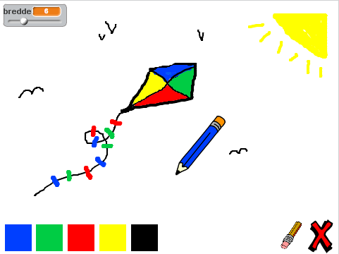
</div>

# Trin 1: Lav en blyant { .activity }

Lad os starte med at lave en blyant, som vi kan bruge til at tegne med på scenen.

## Arbejdsliste { .check }

+ Start et nyt Scratch projekt og slet katte-spriten så dit projekt står tomt. Du kan finde Scratch redigeringsprogrammet online på <a href="http://jumpto.cc/scratch-new">jumpto.cc/scratch-new</a>.

+ Tilføj blyant-spriten til dit projekt.

 

+ Klik på 'Kostumer' og slet 'pencil-b' kostumet.

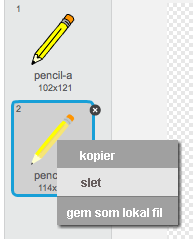 

+ Omdøb dit kostume til 'blyant-blå', og brug 'Farvelæg en figur' redskabet til at farve blyanten blå. 

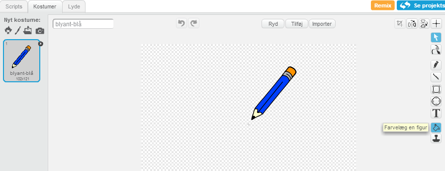 

+ Siden du bruger musen til at tegne, så skal du have blyanten til at følge musen `for evigt` {.blockcontrol}. Tilføj denne kode til din blyantssprite:

```blocks 
		når du klikker på ⚑
		for evigt 
  			 gå til [musepil v]
		end 
```  

+ Afprøv koden ved at klikke på flaget og dernæst flytte musen rundt på scenen. Virker det som du forventede? 

+ Har du lagt mærke til at det er midten af blyanten, og ikke spidsen af blyanten, som følger musemarkøren? 


Løs dette ved at klikke på 'blyant-blå' kostumet på din blyant-sprite, og klik på 'Sæt kostumets..'. 


+ Som du kan se er der et kryds over kostumet. Klik lige nedenfor blyantens spids for at sætte dette punkt til kostumets midte.


+ Klik på 'Scripts' fanen, og afprøv din blyant igen - fungerer den bedre end den gjorde før? 

+ Lad os nu få din blyant til at tegne `hvis` {.blockcontrol} der er blevet klikket med musen. Tilføj denne kode til din blyant-sprite. 

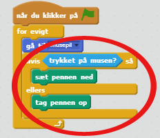	

+ Afprøv din kode igen. Og flyt denne gang din blyant rundt på scenen og hold museknappen nede. Kan du tegne med din blyant? 


## Gem dit projekt { .save }

# Trin 2: Farveblyanter { .activity }

Lad os tilføje nogle forskellige farveblyanter til dit projekt og give brugerne mulighed for at vælge mellem dem! 

## Arbejdsliste { .check }

+ Klik på din blyant-sprite og klik så på 'Kostumer' og kopiér dit 'blyant-blå' kostume.

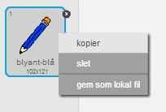

+ Omdøb dit nye kostume til 'blyant-grøn', og farv blyanten grøn.

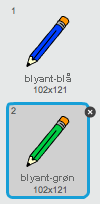

+ Lav to nye sprites, der skal bruges sådan, at man kan vælge den blå eller den grønne blyant.

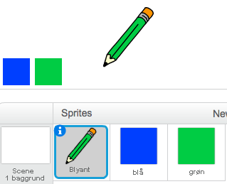

+ Når der klikkes på det grønne selektor ikon skal du `sende` {.blockevents} en meddelelse til blyantsspriten og fortælle den, at den skal ændre sit kostume og blyantsfarve.

Start med at tilføje denne kode til det grønne selektor ikon: 

```blocks 
		når denne sprite klikkes
		send [grøn v] til alle
```  

For at lave `send` {.blockevents} blokken skal du klikke på den nedadgående pil og vælge 'ny meddelelse...'.

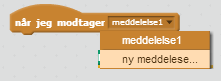

Du kan dernæst taste 'grøn' for at lave din meddelelse. 

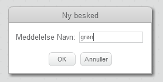

+ Du skal nu fortælle din blyant-sprite, hvad den skal gøre, når den modtager meddelelsen. Tilføj denne kode til din blyant-sprite: 

```blocks 
			når jeg modtager [grøn v]
			skift kostume til [blyant-grøn v]
			skift penfarve til [#00ff00]
``` 
 
For at sætte blyanten til at farve grøn, så klik på den farvede boks i `skift penfarve til` {.blockpen} blokken, og klik på det grønne __selektor__ ikon for at vælge grøn som din blyantsfarve. 

+ Du kan nu gøre det samme med ikonet for den blå blyant ved at tilføje denne kode til den blå selektor sprite:

```blocks 
		når denne sprite klikkes
		send [blå v] til alle
```  

...og tilføje denne kode til blyant-spriten:

```blocks 
		når jeg modtager [blå v]
		skift kostume til [blyant-blå v] 
		skift penfarve til [#0000ff]
```  
 
+ Til sidst skal du fortælle din blyant hvilket kostume og blyantsfarve der skal vælges, og ligeledes at skærmen skal ryddes når dit projekt startes. Tilføj denne kode til begyndelsen af din blyants `når du klikker på ⚑` {.blockevents} kode (inden `for evigt` {.blockcontrol} loopen):

```blocks 
		ryd  
		skift kostume til [blyant-blå v] 
		skift penfarve til [#0000ff] 
```  
 
Hvis du hellere vil, så kan du starte ud med en anden farveblyant! 

+ Afprøv dit projekt. Kan du skifte mellem blå og grønne blyanter?


## Gem dit projekt { .save }

# Trin 3: At lave fejl { .activity .new-page }

Nogle gange opstår der nogle fejl, så lad os tilføje en 'ryd' knap og et viskelæder til vores projekt!

## Arbejdsliste { .check }

+ Lad os tilføje en knap for at rydde scenen. Tilføj 'X-block' bogstavet til din scene og farv bogstavet rødt.

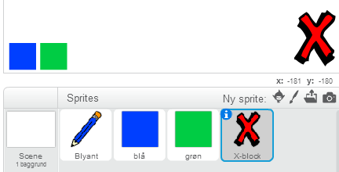

+ Tilføj denne kode til din nye annullér knap, som rydder scenen, når der klikkes på knappen. 

```blocks 
		når denne sprite klikkes
		ryd
```  

Læg mærke til at du ikke behøver sende en meddelelse for at rydde scenen, for det kan hvilken som helst sprite gøre!   

+ Du kan også lave et viskelæder. Hvis din instruktør har givet dig en 'Projekt Ressourcer' mappe, så klik på 'Upload kostume fra fil' og tilføj 'eraser.svg' billedet.

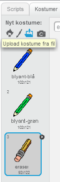
	
Hvis du ikke har eraser.svg billedet, så bare lav en ny hvid blyant i stedet for! 

+ Du bør også tilføje viskelæderbilledet som en ny sprite, så du både har viskelæderet som et kostume til din blyant-sprite og som en sprite for sig selv. Din scene bør se således ud: 


+ Du kan derefter tilføje en kode til din viskelæder-sprite for at fortælle blyanten, at den skal skifte over til et viskelæder. 

```blocks 
		når denne sprite klikkes
		send [viskelæder v] til alle
```  

+ Når blyanten modtager denne meddelelse, så kan du lave et viskelæder ved at udskifte blyantskostumet til viskelæderet, og skifte blyantsfarven til at være samme farve som scenen! 

```blocks 
		når jeg modtager [viskelæder v]
		skift kostume til [viskelæder v]
		skift penfarve til [#FFFFFF] 
``` 

+ Afprøv dit projekt for at se, om du kan rydde og viske ud på scenen.


+ Der er nogle problemer med blyanten - du kan tegne hvor som helst på scenen, også nær _selektor_ ikonerne!  


For at løse dette problem bliver du nødt til at fortælle blyanten, at der kun skal tegnes hvis der klikkes med musen _og_ hvis musens y-position er større end -110 (`musens y-position`{.blocksensing}`> -120` {.blockoperators}). Ændr din blyants `hvis` {.blockcontrol} erklæring til at se således ud:

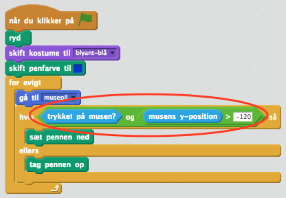

+ Test dit projekt; nu burde du ikke kunne tegne nær selektor ikonerne.


## Gem dit projekt { .save }

# Trin 4: Ændre bredden på din blyant { .activity .new-page } 

Lad os give brugeren mulighed for at tegne ved brug af en række forskellige blyantsstørrelser.

## Arbejdsliste { .check }

+ Start med at tilføje en ny variabel, som du kalder 'bredde'. Hvis du er usikker på, hvordan du gør det, så kan 'Balloons' projektet hjælpe dig. 

+ Tilføj denne linje _inden i_ `for evigt` {.blockcontrol} loopen af koden til din blyant:

```blocks 
		skift penstørrelse til (bredde)
``` 

Bredden på din blyant sættes nu repetitivt til værdien af din 'bredde' variabel. 

+ Du kan ændre det opbevarede tal i denne variabel ved at højreklikke på din variabel (på scenen) og klikke på 'skyder'. 

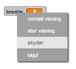

Nu kan du så glide skyderen, under variablen, for at ændre dets værdi.

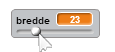

+ Afprøv dit projekt og se om du kan modificere blyantens bredde. 


Hvis foretrækker, så kan du sætte en tilladt minimum og maksimum værdi på 'bredden'. Højreklik på din variabel igen og klik på 'sæt skyderen til min og maks'. Sæt minimum og maksimum værdierne til noget mere fornuftigt, såsom 1 og 20.

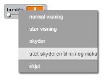

Bliv ved med at afprøve din 'bredde'-variabel indtil du er tilfreds.

## Gem dit projekt { .save }
 
## Udfordring: Genveje { .challenge }

Kan du lave tasteturgenveje til dine kommandoer? For eksempel:

+ b = skift til blå blyant
+ g = skift til grøn blyant
+ v = skift til viskelæder
+ r = ryd skærmen

Du kan ovenikøbet tillade brugeren at ændre blyantsbredden med piletasterne! 

## Gem dit projekt { .save }

## Udfordring: Flere blyanter { .challenge }
Kan du tilføje røde, gule og sorte blyanter til dit tegneprogram? Du kan finde alle de billeder, du har brug for i din 'Ressourcer' mappe. Husk at tilføje tasteturgenveje til disse nye blyanter! 

Kan du bruge dine blyanter til at tegne et billede? 


