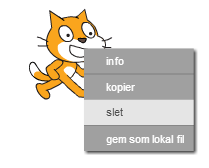
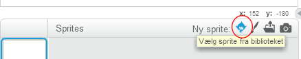
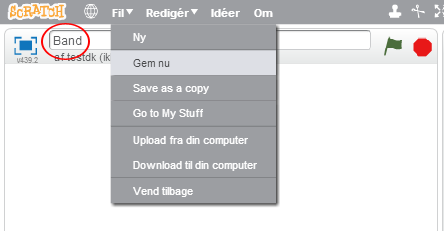
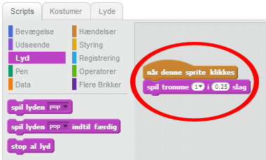
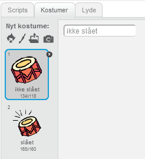
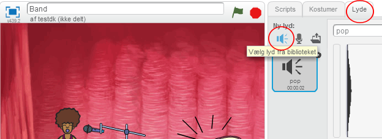
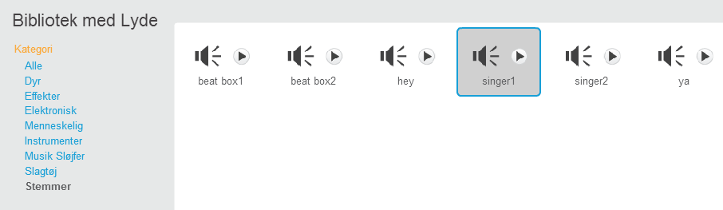
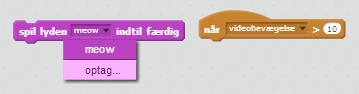

---
title: Rock Band
level: Scratch 1
language: da-DK
stylesheet: scratch
embeds: "*.png"
materials: ["Klubleder Ressourcer/*.*"]
...

# Introduktion { .intro }

I dette projekt vil du lære hvordan du kan kode dit eget musikinstrument!

<div class="scratch-preview">
  <iframe allowtransparency="true" width="485" height="402" src="http://scratch.mit.edu/projects/embed/26741186/?autostart=false" frameborder="0"></iframe>
  
</div>

# Trin 1: Sprites { .activity }

Før du kan begynde at animere skal du tilføje en "ting" som du kan animere. I Scratch kaldes disse 'ting' for __sprites__. 

## Arbejdsliste { .check }

+ Start med at åbne Scratch redigeringsprogrammet. Du kan finde online versionen af Scratch programmet på <a href="http://jumpto.cc/scratch-new">jumpto.cc/scratch-new</a>. Det ser således ud:

	

+ Katte spriten, som du kan se, er Scratch maskotten. Lad os fjerne den ved at højreklikke og derpå klikke på 'slet'.

	

+ Klik derefter på 'Vælg sprite fra biblioteket' for at åbne en liste over alle sprites i Scratch.

	

+ Scroll ned indtil du ser en tromme sprite. Klik på trommen og klik på 'OK' for at tilføje den til dit projekt.

	

+ Klik på 'Formindsk' ikonet, og klik derefter på trommen et par gange for at gøre den mindre.

	

## Gem dit projekt { .save }

Tildel dit program et navn ved at indtaste et navn i tekstboksen ovenover Scenen.

Du kan så klikke på 'Fil' og dernæst  'Gem nu' for at gemme dit projekt.



# Trin 2: Scenen { .activity }

__Scenen__ er området til venstre, hvor dit projekt får liv. Tænk på det som et opvisningområde, ligesom en rigtig scene!

## Arbejdsliste { .check }

+ Ligenu er scenen hvid og ser temmelig kedelig ud! Lad os tilføje en baggrund til scenen ved at klikke på 'Vælg baggrund fra biblioteket'.

	

+ Klik på 'Indendørs' til venstre og klik på en scene baggrund og klik 'OK'.

	

+ Din scene bør nu se således ud:

	

# Trin 3: Lav en tromme { .activity }

Lad os kode din tromme så den laver en lyd, når man slår på den.

## Arbejdsliste { .check }

+ Du kan finde kodeblokkene under 'Scripts' fanen, og de er alle farvekodede!

	Klik på tromme spriten og træk så disse 2 blokke ind i kodeområdet til højre, og sikr dig at de er forbundne (ligesom legoklodser):

	

+ Klik på trommen for at afprøve dit nye instrument!

+ Du kan også ændre udseendet på din tromme, når den klikkes på ved at lave et nyt kostume. Klik på 'Kostumer' fanebladet, og du vil se tromme billedet.

	

+ Højreklik på kostumet og klik 'Kopier' for at lave en kopi af kostumet.

	

+ Klik på det nye kostume (som hedder 'drum2') og vælg dernæst linje værktøjet og tegn nogle linjer, så det ser ud som om trommen laver en lyd.

	

+ Navnene på kostumerne er ikke særlig hjælpsomme ligenu. Omdøb de 2 kostumenavne til 'ikke slået' og 'slået' ved at taste de nye navne på kostumerne i tekstboksen.

	

+ Nu hvor du har 2 forskellige kostumer til din tromme, kan du vælge hvilket kostume der vises! Tilføj disse 2 blokke til din tromme:

	

	Kodeblokken man skal bruge for at ændre kostumer ligger i `Udseende` {.blocklooks} sektionen.

+ Afprøv din tromme. Når du klikker på den bør din tromme nu se ud som om, den er blevet slået på!

## Gem dit projekt { .save }

##Udfordring: Forbedr din tromme { .challenge } 

+ Kan du ændre den lyd, som din tromme laver, når man klikker på den?


+ Kan du også få din tromme til at lave en lyd, når man trykker på mellemrumstasten? Du skal bruge denne `Hændelser` {.blockevents} blok:

```blocks
	når du trykker på [mellemrum v]
```

Du kan kopiere din eksisterende kode ved at højreklikke på den og klikke 'kopier'.


## Gem dit projekt { .save }

# Trin 4: Lav en sanger { .activity .new-page }

Lad os tilføje en sanger til dit band!

## Arbejdsliste { .check }

+ Tilføj yderligere 2 sprites til din scene; en sanger og en mikrofon.

	

+ Før du kan få din sanger til at synge skal du tilføje en lyd til din sprite. Sørg for at du har valgt en sanger, klik derefter på 'Lyde' fanebladet, og klik 'Vælg lyd fra biblioteket':

	

+ Hvis du klikker på 'Stemmer' i venstre side kan du da vælge en passende lyd, som du kan tilføje til din sprite.

	

+ Nu hvor du har tilføjet en lyd kan du tilføje følgende kode til din sanger:

```blocks
		når denne sprite klikkes
        spil lyden [singer1 v] indtil færdig
```

+ Klik på din sanger for at sikre dig at hun synger, når man klikker på hende.

## Gem dit projekt { .save }

##Udfordring: Ændr din sangers kostume { .challenge }
Kan du få din sanger til at se ud som om hun synger, når man klikker på hende? Hvis du har brug for hjælp kan du benytte ovenstående instruktioner omkring, hvordan man laver en tromme.


Husk at afprøve hvordan din nye kode virker!

## Gem dit projekt { .save }

##Udfordring: Lav dit eget band { .challenge }
Brug det du har lært i dette projekt til at lave dit eget band! Du kan skabe hvilket som helst instrument du ønsker, men kig på de tilgængelige lyde og instrumenter for at få nogle idéer.


Dine instrumenter behøver dog ikke at give mening. Du kan for eksempel lave et klaver, som består af muffins!


Lige så vel som du kan bruge allerede tilgængelige sprites, så kan du også tegne dine egne sprites.


Hvis du har en mikrofon kan du optage dine egne lyde, og du kan faktisk også bruge et webcam til at slå på dine instrumenter!



## Gem dit projekt { .save }
