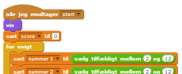
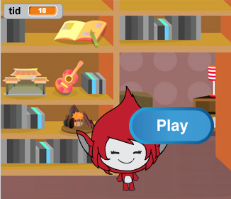
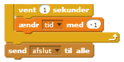
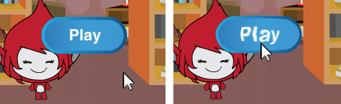
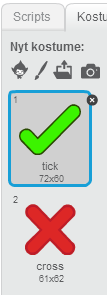
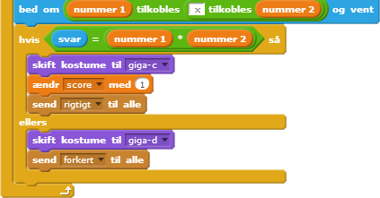
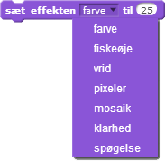
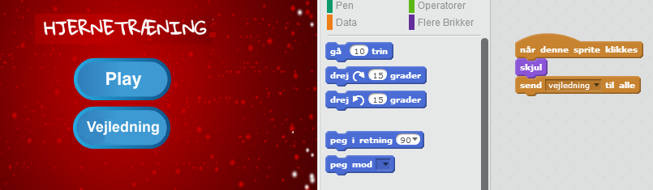

---
title: Hjernetræning
level: Scratch 2
language: da-DK
stylesheet: scratch
embeds: "*.png"
materials: ["Klubleder Ressourcer/*.*"] 
...

# Introduktion { .intro }

I dette projekt skal du lære, hvordan du laver et tidsbaseret quizprogram, hvor du har 30 sekunder til at svare rigtigt på så mange spørgsmål som muligt. 

<div class="scratch-preview">
  <iframe allowtransparency="true" width="485" height="402" src="http://scratch.mit.edu/projects/embed/42225768/?autostart=false" frameborder="0"></iframe>
  
</div>

# Trin 1: At lave spørgsmålene { .activity }

Lad os starte med at lave nogle tilfældige spørgsmål, som spilleren skal svare på.

## Arbejdsliste { .check }

+ Start et nyt Scratch projekt og slet katte-spriten, så dit projekt står tomt. Du kan finde Scratch redigeringsprogrammet online på <a href="http://jumpto.cc/scratch-new">jumpto.cc/scratch-new</a>.

+ Vælg en figur og en baggrund til dit spil. Du kan vælge lige hvad du har lyst til! Her er et eksempel:

		

+ Lav 2 nye variabler du kalder `nummer 1` {.blockdata} og `nummer 2` {.blockdata}. Disse variabler vil så opbevare de to tal, der skal ganges sammen.  

	

+ Tilføj følgende kode for at sætte begge disse variabler til et `tilfældigt` {.blockoperators} tal mellem 2 og 12.

```blocks 
		når du klikker på ⚑
		sæt [nummer 1 v] til (vælg tilfældigt mellem (2) og (12))
		sæt [nummer 2 v] til (vælg tilfældigt mellem (2) og (12)) 
```  
 
+ Derefter kan du efterspørge et svar fra spilleren og give dem besked, om de har svaret rigtigt eller forkert.

```blocks 
		når du klikker på ⚑
		sæt [nummer 1 v] til (vælg tilfældigt mellem (2) og (12))
		sæt [nummer 2 v] til (vælg tilfældigt mellem (2) og (12))
		bed om ((nummer 1) tilkobles ([x] tilkobles (nummer 2))) og vent
		hvis <(svar) = ((nummer 1) * (nummer 2))> så 
   sig [ja! :)] i (2) sekunder
		ellers
   sig [nej :(] i (2) sekunder
	end
		end 
``` 

+ Afprøv dit projekt ved at svare rigtigt og forkert på henholdsvis 2 spørgsmål.

+ Tilføj en `for evigt` {.blockcontrol} loop rundt om koden, så spilleren stilles en masse spørgsmål.

+ Lav et stopur på scenen som tæller ned ved at benytte en variabel du kalder `tid` {.blockdata}. 'Balloons' projektet indeholder instruktioner i at lave et stopur (trin 6), hvis du har brug for hjælp!

+ Afprøv dit projekt igen - du bør være i stand til at fortsætte med at stille spørgsmål indtil tiden løber ud.

## Gem dit projekt { .save }

## Udfordring: Ændre kostumer {.challenge}
Kan du ændre din figurs kostume, så den reagerer på spillerens svar? 

  

## Udfordring: Tilføj en score {.challenge}
Kan du tilføje en score til dit spil? Du kan tilføje et point for hvert korrekte svar. Hvis du vil være lidt besværlig, så kan du ovenikøbet nulstille din spillers score, hvis de svarer forkert på et spørgsmål! 

## Gem dit projekt { .save }

# Trin 2: Flere spil { .activity .new-page}

Lad os tilføje en 'play' knap til dit spil, så du kan spille flere gange. 

## Arbejdsliste { .check }

+ Lav en ny 'Play' knap sprite, som din spiller skal klikke på for at starte et nyt spil. Du kan enten tegne den selv eller redigere en sprite fra Scratch biblioteket. 
 
	  

+ Tilføje denne kode til din nye knap.

```blocks 
		når du klikker på ⚑
		vis

		når denne sprite klikkes 
		skjul
		send [start v] til alle
``` 
 
Koden viser play knappen, når dit projekt starter op. Når der klikkes på knappen skjules den, og den udsender så en meddelelse som starter spillet. 

+ Du skal redigere koden til din figur, sådan at spillet starter når den modtager `start` {.blockevents} meddelelsen, og ikke når der klikkes på flaget. 

	Erstat `når du klikker på ⚑` {.blockevents} koden med `når jeg modtager start` {.blockevents}. 

	  

+ Klik på det grønne flag, og klik så på din nye play knap for at teste det. Du bør se at spillet ikke starter før der klikkes på knappen. 

+ Lagde du mærke til at stopuret begynder, når der klikkes på flaget, og ikke når spillet starter? 

	

	Kan du løse dette problem?

+ Klik på scenen og erstat `stop alle` {.blockcontrol} brikken med en `afslut` {.blockevents} meddelelse.

	  

+ Nu kan du så tilføje en kode til din knap, så den vises igen efter hvert spil. 

```blocks 
	når jeg modtager [afslut v] 
	vis  
```   
+ Du skal også få din figur til at stoppe med at stille spørgsmål efter hvert spil: 

```blocks 
	når jeg modtager [afslut v]
	stop [andre script i sprite v]	 
	 
```  
+ Afprøv din play knap ved at spille et par spil. Du bør så lægge mærke til, at play knappen vises efter hvert spil. For at gøre afprøvningen nemmere, så kan du forkorte hvert spil, så det kun varer nogle få sekunder. 

```blocks    
	sæt [tid v] til [10] 
``` 
+ Du kan ovenikøbet ændre, hvordan knappen ser ud, når musen føres over den. 

```blocks
	når du klikker på ⚑
	vis
	for evigt
   		hvis <berører [musepil v]?> så
      	sæt effekten [fiskeøje v] til (30)
   		ellers
      	sæt effekten [fiskeøje v] til (0)
   	end
end
``` 	



## Gem dit projekt { .save }

## Udfordring: Startskærm {.challenge}
Kan du tilføje en anden baggrund til din scene, som bliver startskærmen for dit spil? Du kan bruge `når jeg modtager start` {.blockevents} og `når jeg modtager [afslut v] ` {.blockevents} brikkerne til at skifte mellem baggrunde.

Du kan også vise og skjule din figur, og dette gælder faktisk også for dit stopur. Du skal bruge disse brikker: 

```blocks
 	vis variabel [tid v]
```
```blocks
	skjul variabel [tid v]
```


## Gem dit projekt { .save }

# Trin 3: Tilføj grafik { .activity .new-page}

I stedet for at din figur bare siger `ja! :)` eller `nej :(` til spilleren, så lad os tilføje noget grafik, som fortæller spilleren hvordan de klarer sig.

+ Lav en ny sprite, som du kalder 'resultat', og som indeholder både et fluebens- og et krydskostume. 

	  

+ Ændr koden til din figur, så den udsender `rigtigt` {.blockevents} og `forkert` {.blockevents} meddelelser i stedet for at fortælle spilleren, hvordan de har klaret sig.

	

+ Nu kan du bruge disse meddelelser til at vise 'fluebens' -eller 'kryds' kostumet. Tilføj denne kode til din nye resultat-sprite: 

		 

+ Afprøv dit spil igen. Du bør se et flueben, når du svarer rigtigt på et spørgsmål, og et kryds, når du svarer forkert! 

	

+ Har du lagt mærke til at koden for `når jeg modtager rigtigt` {.blockevents} og `når jeg modtager forkert` {.blockevents} næsten er identiske? Lad os lave en funktion, som gør det lettere for dig at lave ændringer i din kode.

Vælg din resultat-sprite og klik så på `Flere Brikker` {.blockmoreblocks} og dernæst `Skab en Brik`. Lav en ny funktion du kalder `animer` {.blockmoreblocks}.

  

+ Nu kan du tilføje animationskoden til din nye animationsfunktion, og så bruge funktionen to gange: 

	   

+ Hvis du ønsker at vise fluebenet og krydset lidt længere tid ad gangen, så skal du blot lave én ændring i din kode. Prøv det! 
 
+ I stedet for bare at vise og skjule fluebent og krydset, så kan du ændre din animationsfunktion, sådan at grafikken forsvinder lidt efter lidt.

```blocks 
	definer [object Object]
        sæt effekten [spøgelse v] til (100)
        vis
        gentag (25) gange
    	ændr effekten [spøgelse v] med (-4) 
    	end 
	skjul
```  
 
## Gem dit projekt { .save }

## Udfordring: Forbedret animation {.challenge}
Kan du forbedre animationen af din grafik? Du kan fx kode fluebenet og krydset, så de både forsvinder og kommer frem lidt efter lidt. Du kan også benytte andre seje effekter:

    

## Gem dit projekt { .save }

## Udfordring: Lyd og musik {.challenge}
Kan du tilføje lydeffekter og musik til dit spil? Eksempelvis:

+ Afspille en lyd når spilleren svarer rigtigt eller forkert på et spørgsmål; 
+ Tilføje en tikkende lyd til dit stopur som tæller ned; 
+ Afspille en lyd, når tiden er gået;

```blocks 
	spil tromme (10 v) i (0.1) slag 
``` 

+ Du kan også vælge at afspille musik i en loop (hvis du ikke er sikker på hvordan du gør, så kan trin 4 i 'Rockband' projektet hjælpe dig). 

## Gem dit projekt { .save }

## Udfordring: Kapløb til 10 point {.challenge}
Kan du ændre spillet så spillerne kan se hvor hurtigt de kan svare rigtigt på 10 spørgsmål, i stedet for at de skal svare på så mange spørgsmål som muligt på 30 sekunder? 

Du skal kun ændre koden til dit stopur. Kan du se hvilke ændringer der skal til?

```blocks
	når jeg modtager [start v]
    	sæt [tid v] til (30)
    	gentag indtil <(tid) = [0]>
  	vent (1) sekunder 
  	ændr [tid v] med (-1) 
    end
send [afslut v] til alle
``` 
 
## Gem dit projekt { .save }

## Udfordring: Skærm med brugervejledning {.challenge}
Kan du tilføje en skærm, som viser en vejledning til dit spil? Du får brug for en 'Vejlednings' knap og en anden baggrund. 

    

Måske du også skal bruge en 'Tilbage' knap som fører tilbage til hovedmenuen.  

```blocks
	send [hovedmenu v] til alle
```

## Gem dit projekt { .save }
