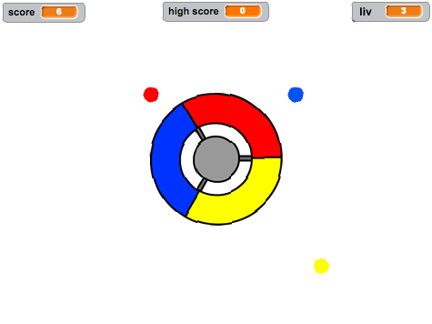
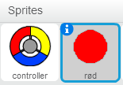
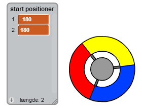
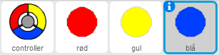
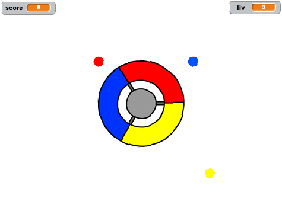
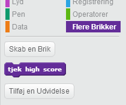
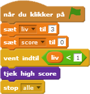

---
title: Fang Prikkerne
level: Scratch 2
language: da-DK
stylesheet: scratch
embeds: "*.png"
materials: ["Klubleder Ressourcer/*.*", "Projekt Ressourcer/*.*"]
beta: true
...

# Introduktion { .intro }

I dette projekt skal du lære, hvordan du laver et spil, hvor du skal matche farvede prikker med den tilsvarende farvede del af styreenheden. 

<div class="scratch-preview">
  <iframe allowtransparency="true" width="485" height="402" src="http://scratch.mit.edu/projects/embed/44942820/?autostart=false" frameborder="0"></iframe>
  
</div>

# Trin 1: Lav en styreenhed { .activity } 

Lad os starte med at lave en styreenhed (controller), som skal bruges til at samle prikker. 

## Arbejdsliste { .check }

+ Start et nyt Scratch projekt og slet kattespriten, så dit projekt står tomt. Du kan finde Scratch redigeringsprogrammet online på <a href="http://jumpto.cc/scratch-new">jumpto.cc/scratch-new</a>.

+ Hvis din instruktør har givet dig en 'Ressourcer' mappe, så klik på 'Upload sprite fra fil' og tilføj 'controller.svg' billedet. Flyt spriten til midten af scenen.

	
	
Hvis du ikke har billedet, så kan du selv tegne en! 
	
+ Drej din styeenhed til højre, når der trykkes på højre piletast:   

```blocks
		når du klikker på ⚑ 
			for evigt
   			hvis <trykket på tasten [højrepil v]?> så
      drej ↻ (3) grader
   end
end
```
+ Afprøv din styreenhed -- den bør nu dreje til højre.

## Gem dit projekt { .save }

## Udfordring: Drej til venstre {.challenge}  
Kan du få din styreenhed til at dreje til venstre, når der trykkes på venstre piletast? 

## Gem dit projekt { .save }

# Trin 2: Saml prikker { .activity } 

Lad os tilføje nogle prikker, som spilleren skal samle sammen med deres styreenhed. 

## Arbejdsliste { .check }

+ Lav en ny sprite ved navn 'rød'. Spriten skal være en lille, rød prik.  

	

+ Tilføj dette script til din 'rød'e sprite prik for at lave en ny klon af din prik med få sekunders mellemrum:

```blocks 
		når du klikker på ⚑
		vent (2) sekunder
		for evigt
   			opret klon af [mig selv v]
  			 vent (vælg tilfældigt mellem (5) og (10)) sekunder
		end
``` 
 
+ Når hver klon er oprettet skal den komme frem i en af de 4 hjørner af scenen.

	

Til dette formål skal du først lave en ny listevariabel, som du kalder `start positioner` {.blockdata} og så klikke på `(+)` for at tilføje værdierne `-180` og `180`.



+ Du kan bruge disse 2 listeemner til at vælge et tilfældigt hjørne af scenen. Tilføj denne kode til 'prik' spriten, således at hver ny klon bevæger sig til et tilfældigt hjørne, og dernæst bevæger sig langsomt mod styreenheden.

```blocks 
		når jeg starter som klon
		gå til x:(punkt (random v) på [start positioner v]) y:(punkt (random v) på [start positioner v])
		peg mod [controller v]
			vis
			gentag indtil <berører [controller v]?>
   		gå (1) trin
	end
``` 

Ovenstående kode vælger enten `-180` eller `180` for x _og_ y positionerne, hvilket betyder at hver ny klon starter i et hjørne af scenen. 

+ Afprøv dit projekt. Du skulle gerne se en masse røde prikker dukke frem fra hver af de 4 hjørner af skærmen, og som langsomt bevæger sig mod styreenheden. 

	

+ Lav 2 nye variabler, som du kalder `liv` {.blockdata} og `score` {.blockdata}.

+ Tilføj en kode til din scene for at sætte `liv` {.blockdata} til 3 og `score` {.blockdata} til 0 i begyndelsen af spillet.

+ Du skal tilføje din kode i slutningen af din røde priks `når jeg starter som klon` {.blockcontrol} kode, sådan at enten 1 bliver tilføjet til spillerens `score` {.blockdata} hvis farverne matcher, eller 1 trækkes fra spillerens `liv` {.blockdata} hvis farverne ikke matcher.

```blocks 
		gå (5) trin
			hvis <berører farven [#FF0000]?> så
   		 ændr [score v] med (1)
   		 spil lyden [pop v]
	ellers
   		ændr [liv v] med (-1) 
   		spil lyden [laser1 v]
	end
	slet denne klon
```  
 
+ Tilføj denne kode til slutningen af scriptet til din scene, således at spillet slutter, når spilleren mister alle sine liv:

```blocks 
		vent indtil <(liv) < [1]> 
		stop [alle v]
```  

+ Afprøv dit spil for at sikre dig, at koden virker som forventet. 

## Gem dit projekt { .save }

## Udfordring: Flere prikker {.challenge}
Kopiér din sprite prik, 'rød', to gange, og døb de to nye sprites 'gul' og 'blå'. 



Redigér dine sprites (inklusive deres kode), sådan at hver farvede prik skal matche deres tilsvarende farve på styreenheden. Husk at afprøve dit projekt, og sørg for at du får point og taber liv på de rigtige tidspunkter, og at dit spil hverken er for nemt eller for svært! 



## Gem dit projekt { .save }

# Trin 3: Forøg sværhedsgraden { .activity .new-page} 

Lad os lave spillet sværere jo længere spilleren overlever ved langsomt at reducere den tid der går mellem at prikkerne dukker frem. 
 
## Arbejdsliste { .check }

+ Lav en ny variabel med navnet `forsinkelse` {.blockdata}.

+ Lav et nyt script på din scene, som sætter forsinkelsen til et højt tal, og som så langsomt reducerer den tid, der forsinkes med. 

```blocks 
		når du klikker på ⚑
        sæt [forsinkelse v] til (8)
        gentag indtil <(forsinkelse) = (2)>
            vent (10) sekunder
            ændr [forsinkelse v] med (-0.5)
		end 
```  
 
Læg mærke til at dette minder en del om, hvordan en timer virker!  

+ Du kan også bruge `forsinkelse` {.blockdata} variablen i scriptene til dine røde, gule og blå prikker. Fjern koden, som venter et tilfældigt antal sekunder mellem at lave kloner, og erstat den med din nye `forsinkelse` {.blockdata} variabel:

```blocks 
		vent (forsinkelse) sekunder
``` 

+ Afprøv din nye `forsinkelse` {.blockdata} variabel, og læg mærke til om forsinkelserne mellem prikkerne langsomt reduceres. Virker dette for alle de 3 farvede prikker? Registrerer du at værdien af `forsinkelse` {.blockdata} variablen reduceres? 

## Gem dit projekt { .save }

## Udfordring: Hurtigt bevægende prikker {.challenge}
Kan du forbedre dit spil ved at tilføje en `fart` {.blockdata} variabel, sådan at prikkerne starter med at bevæge sig 1 skridt ad gangen, og hvor hastigheden bliver hurtigere og hurtigere? Dette fungerer meget på samme måde som `forsinkelse` {.blockdata} variablen, vi benyttede ovenfor, og brug gerne koden til at hjælpe dig på vej.

## Gem dit projekt { .save }

# Trin 4: High score { .activity }

Lad os gemme high scoren, så spillerne kan følge med i, hvordan de klarer sig.

## Arbejdsliste { .check }

+ Lav en ny variabel, som du kalder `high score` {.blockdata}.

+ Klik på din scene, og lav en ny brik (Flere Brikker), som du kalder `tjek high score` {.blockmoreblocks}.

	

+ Tilføj din nye brik umiddelbart før slutningen af spillet. 

	

+ Tilføj en kode til din brik for at opbevare den nuværende `score` {.blockdata} som vores `high score` {.blockdata} `hvis` {.blockcontrol} det er den højeste score indtil videre:

```blocks 
		definer [object Object]
        hvis <(score) > (high score)> så
            sæt [high score v] til (score)
        end
``` 
 
+ Test den kode, som du har tilføjet. Afprøv dit spil for at sikre dig at din `high score` {.blockdata} opdateres korrekt.

## Gem dit projekt { .save }

## Udfordring: Forbedr dit spil! {.challenge}
Kan du kommer i tanker om nogle ting, der kan forbedre dit spil? Du kan for eksempel lave specielle prikker, som: 

+ fordobler din score;
+ gør prikkerne langsommere;
+ skjuler alle andre prikker på skærmen!

## Gem dit projekt { .save }

## Udfordring: Spilmenu {.challenge}
Kan du tilføje en menu (med knapper) til dit spil? Du kan tilføje en vejledningsskærm eller en separat skærm, som viser high scoren. 'Hjernetræning' projektet kan hjælpe dig, hvis du får brug for hjælp. 
