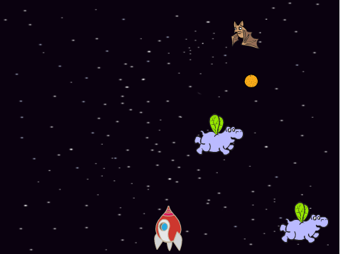
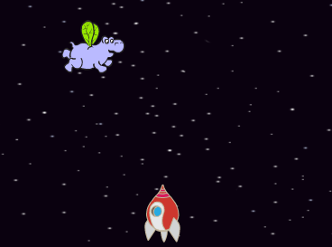
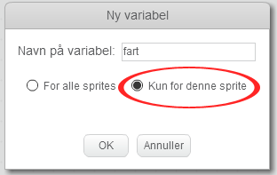
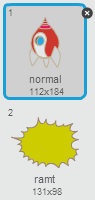

---
title: Bekrig Klonerne
level: Scratch 2
language: da-DK 
stylesheet: scratch
embeds: "*.png" 
materials: ["Klubleder Ressourcer/*.*"] 
beta: true
...

## Projekt skabt ved hjælp af brugerbidrag { .challenge .pdf-hidden }
Dette projekt er lavet i samarbejde med Erik. Hvis du har lyst til at bidrage med dit eget projekt, så [kontakt os på Github](https://github.com/CodeClub).

# Introduktion { .intro }

I dette projekt skal du lære, hvordan du laver et spil, hvor du skal redde Jorden fra monstre i rummet.

<div class="scratch-preview">
  <iframe allowtransparency="true" width="485" height="402" src="http://scratch.mit.edu/projects/embed/46018140/?autostart=false" frameborder="0"></iframe>
  
</div>

# Trin 1: Lav et rumskib { .activity }

Lad os lave et rumskib, som kan forsvare Jorden! 

## Arbejdsliste { .check }

+ Start et nyt Scratch projekt og slet kattespriten, så dit projekt står tomt. Du kan finde Scratch redigeringsprogrammet online på <a href="http://jumpto.cc/scratch-new">jumpto.cc/scratch-new</a>.

+ Tilføj 'stars' baggrunden og 'Spaceship' spriten til dit projekt. Formindsk rumskibet og flyt det mod bunden af scenen.

	

+ Tilføj noget kode som flytter dit rumskib til venstre, når venstre piletast trykkes ned. Du skal bruge disse blokke: 

```blocks 
		når du klikker på ⚑
		for evigt
   		hvis <trykket på tasten [venstrepil v]?> så 
      ændr x med (-4)
   		end
	end  
``` 
 
+ Tilføj en kode som flytter dit rumskib til højre, når højre piletast trykkes ned.

+ Afprøv dit projekt og se, om du kan styre dit rumskib med piletasterne.

## Gem dit projekt { .save }

# Trin 2: Lyn { .activity }

Lad os give rumskibet mulighed for at affyre lyn! 

## Arbejdsliste { .check }

+ Tilføj 'Lightning' spriten fra Scratch biblioteket. Klik på spritens kostume og vend lynet på hovedet. 

	

+ Når spillet starter bør lynene være skjult indtil rumskibet affyrer dem. 

```blocks 
		når du klikker på ⚑
		skjul
``` 

+ Tilføj følgende kode **til rumskibet** for at lave et nyt lyn, når der trykkes på mellemrumstasten.

```blocks 
		når du klikker på ⚑
		for evigt
   		hvis <trykket på tasten [mellemrum v]?> så
      		opret klon af [Lightning v]
   		end
	end 
``` 
 
+ Hver gang der laves en ny klon, så bør dens placering starte med at være samme sted som rumskibet, hvorefter den så bevæger sig opad på scenen, indtil den rører kanten. Tilføj følgende kode **til lynspriten**:

```blocks 
		når jeg starter som klon
		gå til [Spaceship v]
		vis
		gentag indtil <berører [kant v]?>
   			ændr y med (10)
		end
	slet denne klon 
```  

Kommentar: Vi flytter den nye klon hen til rumskibet imens det stadig er skjult, og før vi så viser det. Det ser lidt bedre ud. 

+ Afprøv dine lyn ved at trykke på mellemrumstasten.

## Gem dit projekt { .save }

## Udfordring: Løs Lynene {.challenge}
Hvad sker der, hvis du bliver ved med at holde mellemrumstasten nede? Kan du løse dette ved at bruge en `vent` {.blockcontrol} blok?

## Gem dit projekt { .save }

# Trin 3: Flyvende Rum-flodheste { .activity }

Lad os tilføje en masse flyvende rum-flodheste, som prøver på at ødelægge dit rumskib.

## Arbejdsliste { .check }  

+ Lav en ny sprite ud fra 'Hippo1' billedet i Scratch biblioteket.

	

+ Sæt dens rotation udelukkende mod ventre, og tilføj følgende kode for at skjule spriten, når vi starter spillet: 

```blocks 
		når du klikker på ⚑
		skjul
```  

+ Lav en ny sprite ved navn `fart` {.blockdata}, som er beregnet kun til flodhestespriten. 

	

Du ved når du har gjort det rigtigt, fordi navnet på variablen vil så vises ved siden af spriten på denne måde: 

	

+ Følgende kode laver en ny flodhest med nogle sekunders mellemrum. **Scenen** er et godt sted at give liv til denne kode: 

```blocks 
		når du klikker på ⚑
		for evigt
   			vent (vælg tilfældigt mellem (2) og (4)) sekunder
   			opret klon af [Hippo1 v]
		end
```  
 
+ Når en ny flodhesteklon begynder, så få den til at bevæge sig rundt på scenen (i tilfældig hastighed), indtil den bliver ramt af et lyn. Tilføj denne kode **til flodhest** spriten:

```blocks 
		når jeg starter som klon
		sæt [fart v] til (vælg tilfældigt mellem (2) og (4))
		gå til x:(vælg tilfældigt mellem (-220) og (220)) y:(150)
		vis
		gentag indtil <berører [lightning v]?>
   			gå (fart) trin
   			drej ↻ (vælg tilfældigt mellem (-10) og (10)) grader
   			hop tilbage ved kanten
			end
		slet denne klon	
	end
``` 
 
+ Afprøv koden til din flodhest. Du skulle gerne se en ny flodhest vise sig med nogle sekunders mellemrum, og at de hver især bevæger sig i deres eget tempo.

	 

+ Afprøv dine lyn. Forsinder flodhesten, hvis du rammer en af dem?

+ Vi skal få dit rumskib til at eksplodere, når en flodhest rører dit rumskib! Sørg først for at dit rumskib har 2 kostumer, henholdsvis et 'normal' og 'ramt' kostume.

	

	Rumskibets 'ramt' kostume kan laves ved at importere 'Sun' billedet fra Scratch biblioteket, og ved at bruge 'farvelæg en figur' redskabet til at ændre farven. 

	

+ Tilføj denne kode til dit rumskib, så det skifter kostume, når det kolliderer med en flyvende flodhest: 

```blocks 
		når du klikker på ⚑
		for evigt
   			skift kostume til [normal v]
   			vent indtil <berører [Hippo1 v]?>
   			skift kostume til [ramt v]
   			send [ramt v] til alle
   			vent (1) sekunder
		end
```  
 
+ Har du lagt mærke til, at du har udsendt en 'ramt' meddelelse i ovenstående kode? Du kan bruge denne meddelelse til at få alle flodhestene til at forsvinde, når rumskibet bliver ramt. 

	Tilføj denne kode til din flodhest:

```blocks 
		når jeg modtager [ramt v]
		slet denne klon
``` 
 
+ Afprøv koden ved at starte et nyt spil, hvor du rammer ind i en flodhest. 

	

## Gem dit projekt { .save }

## Udfordring: Liv og Score {.challenge}
Kan du tilføje en `liv` {.blockdata}, `score` {.blockdata} og måske ovenikøbet en `highscore` {.blockdata} til dit spil? 'Fang Prikkerne' projektet kan hjælpe dig.

## Gem dit projekt { .save }

# Trin 4: Frugt Flagermus! { .activity }

Lad os lave en frugtflagermus, som smider appelsiner mod dit rumskib. 

## Arbejdsliste { .check }

+ Lav først en ny flagermussprite, som `går` {.blockmotion} henad scenen øverst oppe `for evigt` {.blockcontrol}. Husk at afprøve din kode.

	

+ Hvis du kigger på flagermusens kostume, så vil du se, at den allerede har 2:

	

	Benyt `næste kostume` {.blocklooks} blokken for at få flagermusen til at flagre med sine vinger, når den bevæger sig.

+ Lav en ny 'Orange' sprite (appelsin) fra Scratch biblioteket.
 
	
 
+ Tilføj en kode til din flagermus, så den laver en ny appelsinklon med få sekunders mellemrum. 

```blocks 
		når du klikker på ⚑
		for evigt
   			vent (vælg tilfældigt mellem (5) og (10)) sekunder
   			opret klon af [Orange v]
		end
```  
 
+ Klik på din appelsinsprite og tilføj denne kode for at få hver appelsinklon til at falde ned fra flagermusen mod rumskibet: 

```blocks 
		når du klikker på ⚑
		skjul

		når jeg starter som klon
		gå til [Bat1 v]
		vis
		gentag indtil <berører [kant v]?>
   			ændr y med (-4)
		end
		slet denne klon

		når jeg modtager [ramt v]
		slet denne klon
```  
 
+ Du skal ændre koden til din rumskibssprite, så du er ramt, hvis du rører en flodhest eller en appelsin:

```blocks 
		vent indtil <<berører [Hippo1 v]?> eller <berører [Orange v]?>>
```  

+ Afprøv dit spil. Hvad sker der, hvis du bliver ramt af en appelsin, som falder ned?

## Gem dit projekt { .save }

# Trin 5: Game over { .activity }

Lad os tilføje en 'game over' besked i slutningen af spillet.

## Arbejdsliste { .check }

+ Hvis du ikke allerede har gjort det, så lav en ny variabel, som du kalder `liv` {.blockdata}. Dit rumskib bør starte med at have 3 liv, og så  miste et liv, når det kolliderer med en fjende. Dit spil bør slutte, når du ikke har flere liv tilbage. Hvis du har brug for hjælp, så kan du tage et kig på 'Fang Prikkerne' projektet. 

+ Tegn en ny sprite ved navn 'Game Over' ved at bruge Tekst redskabet. 

	

+ Udsend en `game over` {.blockevents} meddelelse på din scene, lige inden spillet slutter. 

```blocks 
		send [game over v] til alle og vent
``` 

+ Tilføj denne kode til din 'Game Over' sprite, sådan at meddelelsen vises i slutningen af spillet: 

```blocks 
		når du klikker på ⚑
		skjul

		når jeg modtager [game over v]
		vis
```  

Fordi du har brugt en `send [game over] og vent` {.blockevents} blok på din scene, så venter den med at afslutte spillet indtil 'Game Over' spriten er blevet vist. 

+ Afprøv dit spil. Hvor mange point kan du få? Kan du komme i tanker om nogle ting, som kan forbedre dit spil, hvis det enten er for nemt eller for svært?   

## Gem dit projekt { .save }

## Udfordring: Forbedr dit spil {.challenge}
Hvilke forbedringer kan du lave? Her er nogle idéer:

+ Tilføj helbredspakker som du kan samle for at få ekstra liv;


+ Tilføj nogle sten som svæver rundt, og som dit rumskib skal undgå: 
	


+ Vis flere fjender, når din score når til 100.  

```blocks
	vent indtil <(score) = [100]>
```

## Gem dit projekt { .save }
