---
title: Skab Din Egen Verden
level: Scratch 2
language: da-DK
stylesheet: scratch
embeds: "*.png"
materials: ["Klubleder Ressourcer/*.*","Projekt Ressourcer/*.*"]
...

# Introduktion { .intro }

I dette projekt skal du lære, hvordan du laver dit eget 'åben verden' eventyrsspil.

<div class="scratch-preview">
  <iframe allowtransparency="true" width="485" height="402" src="http://scratch.mit.edu/projects/embed/34248822/?autostart=false" frameborder="0"></iframe>
  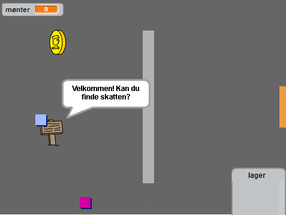
</div>

# Trin 1: Programmér din spiller { .activity }

Lad os starte med at lave en spiller, som kan bevæge sig rundt i din verden.

## Arbejdsliste { .check }

+ Start et nyt Scratch projekt og slet katte-spriten, så dit projekt står tomt. Du kan finde Scratch redigeringsprogrammet online på <a href="http://jumpto.cc/scratch-new">jumpto.cc/scratch-new</a>.

+ Til dette projekt bør du have en 'Projekt Ressourcer' mappe, som indeholder alle de billeder, du skal bruge. Sørg for at du kan finde denne mappe, og spørg din instruktør, hvis du ikke kan finde den.


+ Tilføj 'room1.png' som din nye scenebaggrund, og billedet 'player.png' som en ny sprite. Hvis du ikke har disse billeder, så kan du selv tegne dem! Dit projekt bør se således ud: 

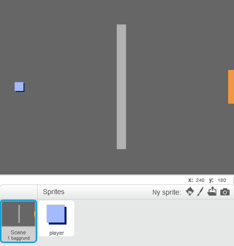  

+ Lad os bruge piletasterne til at bevæge spilleren rundt med. Når spilleren trykker på 'op' piletasten, så skal spilleren bevæge sig fremad ved at ændre dens y koordinat. Tilføj denne kode til din sprite (spilleren):

```blocks  
	når du klikker på ⚑  
	for evigt 
   		hvis <trykket på tasten [pil opad v]?> så 
      	ændr y med (2) 
   	end 
end 
``` 
 
+ Afprøv din spiller ved at klikke på flaget og trykke på 'op' piletasten. Bevæger din spiller sig fremad?


+ For at flytte spilleren til venstre, så skal du tilføje endnu en `hvis` {.blockcontrol} blok til din spiller, som ændrer x koordinatet:

```blocks 
	når du klikker på ⚑ 
	for evigt 
   	hvis <trykket på tasten [pil opad v]?> så 
      ændr y med (2) 
   	end 
  	hvis <trykket på tasten [venstrepil v]?> så 
      ændr x med (-2)
   	end 
end 
``` 
 
## Udfordring: Bevægelse i alle fire retninger {.challenge}
Kan du tilføje noget mere kode til din spiller, så den kan bevæge sig opad, nedad, til højre og venstre? Brug koden, som du allerede har lavet, til at hjælpe dig! 

## Gem dit projekt { .save }

+ Afprøv din spiller igen - du vil nok lægge mærke til at den kan gå gennem de lysegrå vægge.


+ For at løse dette, skal vi flytte spilleren, men derefter flytte den tilbage, hvis den rører en lysegrå væg. Du skal bruge denne kode:  

```blocks 
	når du klikker på ⚑ 
	for evigt 
   	hvis <trykket på tasten [pil opad v]?> så 
      	ændr y med (2)  
     hvis <berører farven [#BABABA]?> så 
         ændr y med (-2) 
      	end  
   	end 
end  
``` 
 
Læg mærke til at den nye `hvis`{.blockcontrol}`berører farven`{.blocksensing} blok ligger _indeni_ `hvis`{.blockcontrol}`trykket på tasten [pil opad]`{.blocksensing} blok.  

+ Afprøv denne nye kode ved at bevæge dig langs væggen - du bør ikke kunne gå opad og ind i den.  


+ Lad os gøre det samme for venstre piletast og flytte spilleren tilbage, hvis den rører en væg. Din kode for din spiller bør indtil videre se sådan ud: 

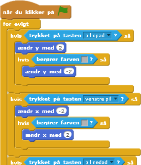  

## Udfordring: Redigér din spillers bevægelse {.challenge}
Tilføj en kode til din spiller, så du ikke kan gå gennem vægge i nogen som helst retning. Brug koden, som du allerede har lavet, til at hjælpe dig! 

## Gem dit projekt { .save }

# Trin 2: Programmér din verden { .activity } 

Lad os give spilleren mulighed for at gå gennem døre, der fører ind til andre rum! 

## Arbejdsliste { .check }

+ Tilføj yderligere 2 baggrunde til din scene ('room2.png' og 'room3.png'), således at du har 3 baggrunde i alt. Sørg for at de er i den rigtige rækkefølge - dette vil være til gavn senere.


+ Du får brug for en ny variabel, som vi kalder rum `rum` {.blockdata}, for at holde styr på hvilket rum spilleren befinder sig i.

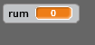

+ Når spilleren rører den orange dør i det første rum, så bør næste baggrund vises, og spilleren skal flytte tilbage til venstre side af scenen. Her er den kode, som du skal bruge - den skal ligge indeni spillerens `for evigt` {.blockcontrol} loop: 

```blocks 
	hvis <berører farven [#F2A24A]?> så 
   	skift baggrund til [næste baggrund v] 
   	gå til x:(-200) y:(0) 
   		ændr [rum v] med (1) 
	 end 
```  
 
+ Tilføj denne kode til _begyndelsen_ af koden til din spiller (før `for evigt` {.blockcontrol} loopen) for at sikre dig, at alt nulstilles, når man klikker på flaget:  

```blocks 
	sæt [rum v] til (1) 
	gå til x:(-200) y:(0) 
	skift baggrund til [rum1 v] 
``` 
 
+ Klik på flaget og flyt din spiller gennem den orange dør. Bevæger din spiller sig hen til den næste skærm? Ændrer `rum` {.blockdata} variablen sig til 2?

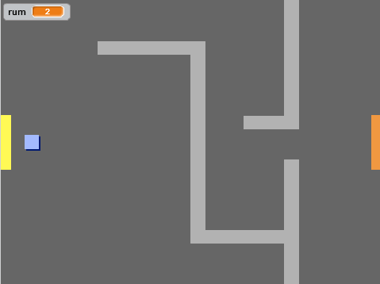

## Udfordring: Gå til det forrige rum {.challenge}
Kan du få din spiller til at gå til det forrige rum, når den rører en gul dør? Husk, denne kode ligner _meget_ den kode, som du allerede har tilføjet da du fik spilleren til at flytte sig til næste rum.   

## Gem dit projekt { .save }

# Trin 3: Skilte { .activity }

Lad os tilføje nogle skilte til din verden for at guide din spiller på rejsen. 

## Arbejdsliste { .check }

+ Upload billedet 'sign.svg' som en ny sprite, og omdøb den 'velkomstskilt'.

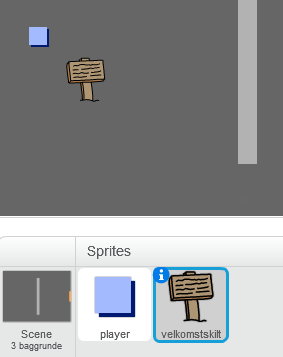  

+ Skiltet skal kun være synligt i rum 1, så lad os tilføje noget kode til skiltet, så vi er sikre på, at det er det, som er gældende:

```blocks 
	når du klikker på ⚑ 
	for evigt 
   	hvis <(rum) = [1]> så 
      	vis    
   	ellers  
      	skjul  
   	end 
end 
``` 
 
+ Afprøv dit skilt ved at bevæge dig mellem de forskellige rum. Dit skilt bør kun være synligt i rum 1. 
 
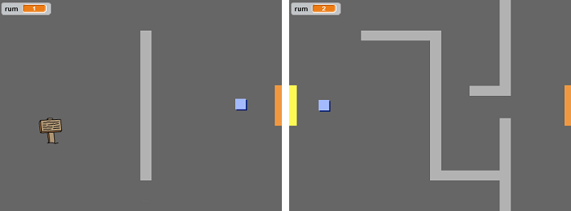  
 
+ Et skilt er ikke til megen nytte, hvis den ikke afsender en besked! Lad os tilføje noget mere kode (i en anden blok) for at vise en meddelelse, hvis spilleren rører skiltet:  

```blocks  
	når du klikker på ⚑ 
		for evigt 
   	hvis <berører [player v]?> så 
      	sig [Velkommen! Kan du finde skatten?]  
  	ellers 
      	sig [] 
   	end 
end 
```   
+ Afprøv dit skilt - du bør nu se en besked, når spilleren rører skiltet. 

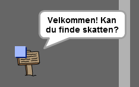  

## Gem dit projekt { .save }

## Udfordring: Skat! {.challenge}
Kan du tilføje en skattekiste-sprite ved at bruge billedet 'chest.svg'? Skattekisten bør være placeret i rum 3 og sige 'Godt gået!', når spilleren rører den.  

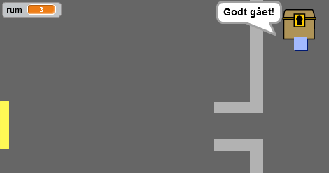  

## Gem dit projekt { .save }

# Trin 4: Folk { .activity }

Lad os tilføje nogle andre folk til din verden, som din spiller kan interagere med. 

## Arbejdsliste { .check }

+ Tilføj en ny person-sprite ved at bruge billedet 'person.png'.

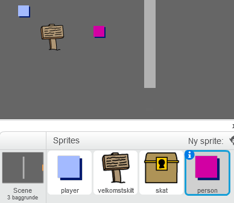  

+ Tilføj denne kode, så personen taler til din spiller. Denne kode ligner meget den kode, som du føjede til dit skilt: 

```blocks 
	når du klikker på ⚑ 
	gå til x:(-200) y:(0) 
	for evigt 
   		hvis <berører [player v]?> så 
        sig [Var du klar over at du kan gå gennem orange og gule døre?] 
   		ellers 
      	sig []   
   	end 
end 
``` 
 
+ Du kan også give din person mulighed for at flytte sig ved at bruge disse to blokke: 

```blocks 
	gå (1) trin 
	hop tilbage ved kanten 
```  

Din person opfører sig forskelligt, afhængigt af om du placerer koden indeni `for evigt` {.blockcontrol} loopen eller indeni `hvis` {.blockcontrol} blokken. Afprøv begge muligheder for at se, hvad du foretrækker.

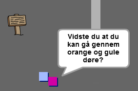  

+ Har du lagt mærke til at din person vender på hovedet? Stop dette ved at klikke på spritens informationsikon, og klik så på prikken for at ændre rotationsstilen.   

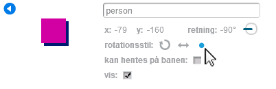  

## Udfordring: Forbedr din person {.challenge}
Kan du tilføje noget kode til din nye person, så den kun vises i rum 1? Sørg for at afprøve din nye kode! 

## Gem dit projekt { .save }

+ Du kan også tilføje nogle patruljerende fjender, som afslutter spillet, hvis spilleren rører dem. Tilføj en ny fjende-sprite, og ændr rotationsstilen, ligesom du gjorde med person-spriten. 

+ Tilføj noget kode til din fjende, så den kun viser sig i rum 2. 

+ Du skal også tilføje noget kode for at flytte fjenden og for at afslutte spillet, hvis fjenden rører spilleren. Det er lettets at gøre i seperate kodeblokke. Koden til din fjende bør se således ud: 

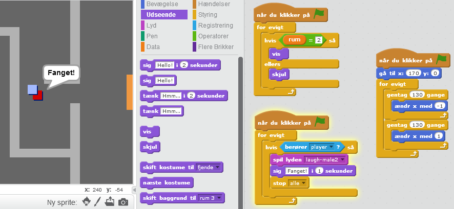  

+ Afprøv dit spil og sørg for at: 
	+ Den kun er synlig i rum 2;
	+ Den patruljerer rummet;
	+ Spillet slutter hvis spilleren rører den.

## Gem dit projekt { .save }

## Udfordring: Flere fjender {.challenge}
Kan du lave en anden fjende i rum 3, som patruljerer op og ned gennem hullet i væggen? 


## Gem dit projekt { .save }

# Trin 5: Saml mønter { .activity }

## Arbejdsliste { .check }

+ Tilføj en ny variabel, som du kalder `mønter` {.blockdata} til dit projekt.

+ Tilføj en ny mønt-sprite til dit projekt.

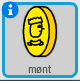

+ Tilføj en kode til din mønt, så den kun vises i rum 1.

+ Tilføj en kode til din mønt-sprite, så der tilføjes 1 til dine `mønter` {.blockdata} når de er blevet samlet op:

```blocks 
	når du klikker på ⚑ 
    vent indtil <berører [player v]?> 
    ændr [mønter v] med (1) 
    stop [andre script i sprite v] 
    skjul 
``` 
 
Koden `stop andre script i sprite` {.blockcontrol} er nødvendig for at stoppe mønterne fra at blive vist i rum 1, efter de er blevet samlet op.   

+ Du skal også sætte din `mønter` {.blockdata} variabel til 0 i begyndelsen af spillet. 

+ Afprøv dit projekt - når du samler mønten bør scoren ændres med 1.

## Udfordring: Flere mønter {.challenge}
Kan du tilføje flere mønter til dit spil? De kan fx være i forskellige rum, og nogle af mønterne kunne måske ovenikøbet være bevogtet af patruljerende fjender.

# Trin 6: Døre og nøgler { .activity }

## Arbejdsliste { .check }

+ Lav en ny sprite fra dit 'key-blue.svg' billede. Udskift din scene til baggrund 3, og placér nøglen et sted, hvor den er svær at nå hen til!  

 

+ Sørg for at din nøgle kun er synlig i rum 3.

+ Lav en ny listevariabel, som du kalder for `lager` {.blockdata}. Det er så her, hvor du opbevarer alle de genstande, som din spiller samler ind.  

+ Koden til at opsamle nøglen ligner meget den kode, som du brugte til at samle mønter. Forskellen er, at det er nøglen du tilføjer til dit lager. 

```blocks 
	når du klikker på ⚑ 
    vent indtil <berører [player v]?> 
    tilføj [blå nøgle] til [lager v] 
    stop [andre script i sprite v] 
    skjul 
``` 
 
+ Afprøv din nøgle for at se, om du kan indsamle den og tilføje til dit lager. Husk at tilføje en kode til din scene for at tømme dit lager fra begyndelsen. 

```blocks 
	slet (alle v) fra [lager v] 
``` 

+ Lav en ny sprite fra dit 'door-blue.png' billede, og placér din blå dør henover hullet mellem de to vægge.

	

+ Tilføj en kode til din dør, så den kun er synlig i rum 3.

+ Du skal skjule din blå dør for at tillade spilleren at komme ind, når du har den blå nøgle i dit lager.

```blocks 
	når du klikker på ⚑ 
    vent indtil <[lager v] indeholder [blå nøgle]> 
    stop [andre script i sprite v] 
    skjul 
```  
 
+ Afprøv dit projekt, og find ud af om du kan indsamle den blå nøgle for at åbne døren! 

## Gem dit projekt { .save }

## Udfordring: Lav din egen verden {.challenge}
Nu kan du fortsætte med at skabe din egen verden. Her er nogle idéer:
 
+ Ændr omgivelserne og grafikken i dit spil; 
+ Tilføj lyd og musik til dit spil;
+ Tilføj flere folk, fjender, skilte og mønter;
+ Tilføj røde og gule døre, som skal bruge hver deres nøgle for at blive åbnet;
+ Tilføj flere rum til din verden;
+ Tilføj andre nyttige genstande til dit spil;

+ Benyt mønter til at lokke information ud af andre folk; 

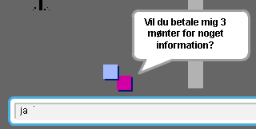  

+ Du kan ovenikøbet tilføje nordlige og sydlige døre, sådan at spilleren kan bevæge sig rundt mellem rummene i alle 4 retninger. Forestil dig et 3x3 gitter, hvis du for eksempel har 9 rum. Du kan så tilføje 3 til rumnummeret for at bevæge dig 1 niveau ned.  

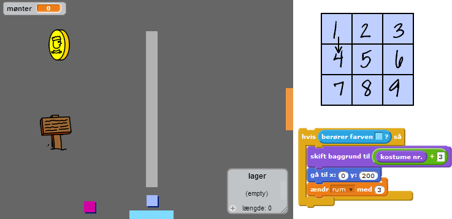  

## Gem dit projekt { .save }

