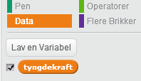
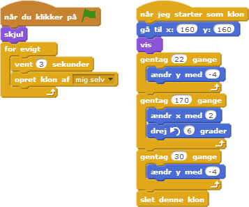
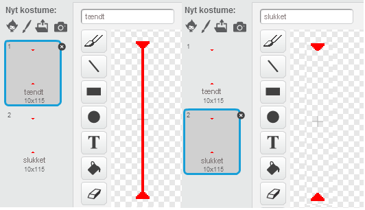
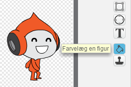

---
title: Høvdingebold
level: Scratch 2
language: dk-DK
stylesheet: scratch
embeds: "*.png"
materials: ["Klubleder Ressourcer/*.*","Projekt Ressourcer/*.*"]
...

# Introduktion { .intro } 

I dette projekt skal du lære, hvordan du laver et platformsspil, hvor du skal undgå at blive ramt af boldene og nå til slutningen af niveauet.  

<div class="scratch-preview">
  <iframe allowtransparency="true" width="485" height="402" src="http://scratch.mit.edu/projects/embed/39740618/?autostart=false" frameborder="0"></iframe>
  
</div>

# Trin 1: Bevægelse af figuren { .activity }

Lad os begynde med at lave en figur, som kan bevæge sig til venstre og højre samt klatre op ad stolper. 

## Arbejdsliste { .check }

+ Start et nyt Scratch projekt og slet kattespriten, så dit projekt står tomt. Du kan finde Scratch redigeringsprogrammet online på <a href="http://jumpto.cc/scratch-new">jumpto.cc/scratch-new</a>.

+ Til dette projekt bør du have en 'Projekt Ressourcer' mappe, som indeholder det baggrundsbillede du skal bruge. Sørg for at du kan finde denne mappe, og spørg din instruktør, hvis du ikke kan finde den.

	

+ Tilføj 'background.png' billedet som din nye scenebaggrund, eller tegn din egen! Hvis du tegner dit eget niveau, så sørg for at stolperne og gulvene er forskellige farver, og at der er en dør (eller lignende), som din spiller skal nå. Sådan bør dit projekt se ud:
 
	

+ Tilføj en ny sprite som bliver din figur. Det er bedst hvis du vælger en sprite, som har flere kostumer, sådan at du kan få det til at se ud som om den går. 

	

+ Lad os bruge piletasterne til at få din figur til at bevæge sig rundt. Når spilleren trykker på højre piletast skal din karakter pege mod højre og bevæge sig nogle trin fremad og ændre til det næste kostume:

```blocks 
		når du klikker på ⚑
			for evigt
   			hvis <trykket på tasten [højrepil v]?> så
      	peg i retning (90 v) 
      	gå (3) trin 
      næste kostume
   end
end

``` 
 
+ Afprøv din figur ved at klikke på flaget og dernæst holde højre piletast ned. Bevæger din spiller sig til højre? Ser det ud som om din figur bevæger sig?   

	

+ For at bevæge din figur til venstre skal du tilføje endnu en `hvis` {.blockcontrol} blok inden i din `for evigt` {.blockcontrol} loop, som får din figur til at bevæge sig til venstre. Husk at afprøve din nye kode, så du er sikker på at det virker!  

+ For at kravle opad en stolpe skal din figur bevæge sig en lille smule, når der bliver trykket på Op piletasten og den rører den rigtige farve. Tilføj denne kode indeni din figurs `for evigt` {.blockcontrol} loop:

```blocks 
		hvis <<trykket på tasten [pil opad v]?> og <berører farven [#FFFF00]?>> så
   			ændr y med (4)
		end
``` 
 
+ Afprøv din figur - kan du kravle opad de gule stolper og nå til enden af dit niveau?  

	

## Gem dit projekt { .save } 

## Udfordring: Fuldende niveauet {.challenge}
Kan du tilføje noget mere kode til din figur, så den siger noget `hvis` {.blockcontrol} den når hen til den brune dør?


## Gem dit projekt { .save }

# Trin 2: Tyngdekraft og at hoppe { .activity } 
 
Lad os få din figur til at bevæge sig mere realistisk ved at tilføje tyngdekraft og gøre det muligt for den at hoppe.

## Arbejdsliste { .check }

+ Måske du har lagt mærke til at din figur kan gå væk fra en platform og midt ud i luften. Prøv at gå ud over en platform og se hvad der sker.

	

+ Lad os tilføje noget tyngdekraft til dit spil for at løse det. Lav en ny variabel du kalder `gravity` {.blockdata}. Du kan skjule denne variabel fra din scene, hvis du foretrækker det. 

	 

+ Tilføj denne nye kodeblok der sætter tyngdekraften til et negativt tal og så benytter dette til, igen og igen, at gentage din figurs y-koordinat.

```blocks 
		når du klikker på ⚑
		sæt [gravity v] til [-4]
		for evigt
   			ændr y med (gravity)
		end
``` 
 
+ Klik på flaget og slæb din figur til toppen af scenen. Hvad sker der? Virker tyngdekraften som du forventede? 

	

+ Tyngdekraften bør ikke flytte din figur gennem en platform eller en stolpe! Tilføj en `hvis` {.blockcontrol} blok til din kode, således at tyngdekraften kun virker, hvis din figur befinder sig midt i luften. Koden for tyngdekraften bør nu se således ud:

```blocks 
	når du klikker på ⚑
	sæt [gravity v] til [-4]
		for evigt
   			hvis <ikke <<berører farven [#0000FF]?> eller <berører farven [#FFFF00]?>>> så
      ændr y med (gravity)
   end
end
``` 

+ Afprøv tyngdekraften igen. Stopper din figur, når den er på en platform eller en stolpe? Kan du gå ud over kanten til en platform og komme til niveauet nedenunder? 

	

+  Lad os også få din figur til at hoppe, når spilleren trykke på mellemrumstasten. Dette kan du nemt gøre ved at bevæge din figur op et par gange ved at bruge denne kode: 
 
```blocks 
		når du trykker på [mellemrum v]
		gentag (10) gange
   			ændr y med (4)
		end
``` 
 
	Siden tyngdekraften hele tiden skubber din figur ned med 4 pixels, så skal du vælge et tal, som er større end 4 i din `ændr y med (4)` {.blockmotion} blok. Ændr dette tal indtil du er tilfreds med den højde, som din figur hopper.  

+ Hvis du afprøver din kode, så vil du se at den virker, men bevægelserne er ikke særlig jævne. For at udjævne hoppene skal du flytte din figur et mindre og mindre stykke, indtil den ikke hopper mere. 

+ Hertil skal du bruge en anden variabel du kalder `jump height` {.blockdata}. Igen kan du skjule denne variabel, hvis du foretrækker det.
 
+ Slet den hoppekode du tilføjede til din figur og erstat den med denne kode:

```blocks 
		når du trykker på [mellemrum v]
		sæt [jump height v] til [8]
		gentag indtil <(jump height) = [0]>
   			ændr y med (jump height)
   			ændr [jump height v] med (-0.5)
	end
``` 
 
	Denne kode flytter din figur op med 8 pixels, dernæst med 7.5 pixels, så 7 pixels og så fremdeles, indtil din figur er færdig med at hoppe. Dette får hopningen til at se meget mere jævn ud.

+ Ændr startværdien af din `jump height` {.blockdata} variabel og afprøv det indtil du er tilfreds med, hvor højt din figur hopper. 

## Gem dit projekt { .save }

## Udfordring: Forbedrede hop {.challenge}
Din figur kan hoppe uanset hvornår der trykkes på mellemrumstasten, selv hvis den allerede befinder sig ude i luften. Dette kan du afprøve ved at holde mellemrumdstasten nede. Kan du finde en løsning så din figur kun kan hoppe `hvis` {.blockcontrol} den rører en blå platform?

## Gem dit projekt { .save }

# Trin 3: Undvige bolde { .activity .new-page}

Nu hvor du kan bevæge din figur rundt, så lad os tilføje nogle bolde, som din figur skal undvige. 

## Arbejdsliste { .check }

+ Lav en ny bold sprite. Du kan vælge hvilken som helst type bold, som du har lyst til.

	

+ Tilpas størrelsen på din bold så din figur kan hoppe over den. Prøv at hoppe over bolden for at afprøve det. 

	

+ Tilføj denne kode til din bold:

	

	Koden laver en ny klon af bolden hvert 3. sekund. Hver ny klon bevæger sig langs den øverste platform. 

+ Klik på flaget for at afprøve det.

	

+ Tilføj noget mere kode til din bold sprite, så boldene bevæger sig rundt på alle 3 platforme. 

	

+ Her tilsidst skal du bruge en kode til når din figur bliver ramt af en bold! Tilføj denne kode til din bold sprite: 

```blocks 
		når jeg starter som klon
		for evigt
   			hvis <berører [Pico walking v]?> så
      	send [ramt v] til alle 
   end
end
``` 

+ Du skal også tilføje denne kode til din figur for at flytte tilbage til start, når den bliver ramt:

```blocks  
		når jeg modtager [ramt v]
			peg i retning (90 v)
		gå til x:(-210) y:(-120) 
```	 
 
+ Afprøv din figur og se om den går tilbage til start, når den bliver ramt af en bold. 

## Gem dit projekt { .save }

## Udfordring: Tilfældige bolde {.challenge}
Boldene som din figur skal undgå ser alle ens ud, og de kommer alle frem hvert 3. sekund. Kan du forbedre dem sådan at:  

+ de ikke ser ens ud alle sammen?
+ de kommer frem efter en tilfældig mængde af tid?
+ er en tilfældig størrelse?


## Gem dit projekt { .save }

# Trin 4: Lasere! { .activity .new-page}

Lad os gøre spillet en smule sværere at fuldføre ved at tilføje nogle lasere! 

## Arbejdsliste { .check }

+ Tilføj en ny sprite til dit spil som du kalder 'Laser'. Den bør have to kostumer, 'on' og 'off'.

	

+ Placer din nye laser hvor end du ønsker, mellem 2 platforme.

	

+ Tilføj denne kode til din laser, sådan at det skifter mellem de 2 kostumer.

```blocks 
		når du klikker på ⚑
		for evigt
   			skift kostume til [tændt v]
   			vent (2) sekunder
   			skift kostume til [slukket v]
  		 vent (2) sekunder
end
``` 
 
	Hvis du foretrækker kan du `vente` {.blockcontrol} et `tilfældigt` {.blockoperators} antal gange mellem skift af kostume.

+ Tilsidst skal du tilføje en kode til din laser så 'hit' meddelelsen sendes, når laseren rører din figur. Koden vil være den samme som den kode du tilføjede til din bold sprite. 

	 Du beøhver ikke tilføje mere kode til din figur - den ved allerede hvad den skal gøre, når den bliver ramt!

+ Afprøv dit spil for at se, om du kan komme forbi laserne. Ændr `vent` {.blockcontrol} tiderne i din kode, hvis laserne er for nemme eller for svære.

## Udfirdring: Flere forhindringer {.challenge}
Hvis du stadig synes, at dit spil er for nemt, så kan du tilføje flere forhindringer til dit niveau. Du kan tilføje hvad som helst, men her er nogle idéer: 

+ En flyvende dræbersommerfugl;
+ Platforme som dukker frem og forsvinder;
+ Tennisbolde som falder ned og som du skal undgå.


Du kan ovenikøbet lave mere end én baggrund og rykke til næste niveau, når din figur når hen til den brune dør:  

```blocks
	hvis <berører farven [#714300]?> så
   		skift baggrund til [næste baggrund v]
   		gå til x:(-210) y:(-120)
   		vent (1) sekunder
end 
``` 
 
## Gem dit projekt { .save }

## Udfordring: Forbedret tyngdekraft {.challenge}
Der er en anden lille bug i dit spil: _Uanset hvilken del_ af din figur, som rører en blå platform (selv dens hoved) trækker tyngdekraften ikke din figur nedad! Dette kan du afprøve ved at kravle opad en stolpe det meste af vejen, og dernæst flytte til venstre. 


Kan du løse dette bug? Til det formål skal du give din figur nogle bukser i forskellige farver (på _alle_ kostumerne)...



...og så erstatte denne kode: 

```blocks
	berører farven [#0000FF]?
```

med:

```blocks
	berører [#00FF00] farven [#0000FF]?
```

Husk at teste dine forbedringer for at være sikker på, at du har fixet vores bug! 

## Gem dit projekt { .save }

## Udofrdring: Flere liv {.challenge}
Kan du tildele spilleren 3 `liv` {.blockdata}, istedet for bare at sende dem tilbage til begyndelsen hver gang? Således bør dit spil fungere:

+ Din spiller starter med 3 liv; 
+ Når din spiller bliver ramt, tabes der et liv og de går tilbage til start;
+ Hvis der ikke er flere liv tilbage slutter spillet.

## Gem dit projekt { .save }
