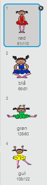
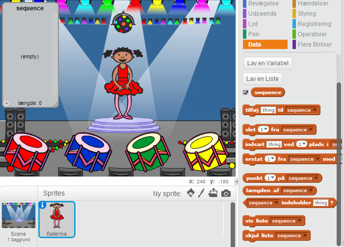
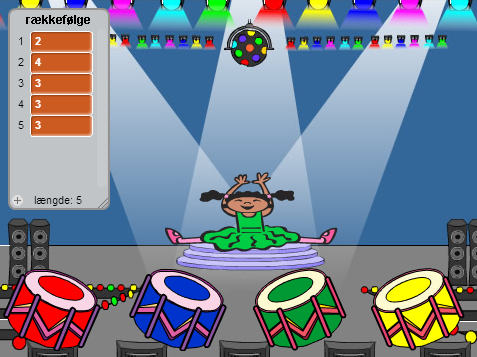
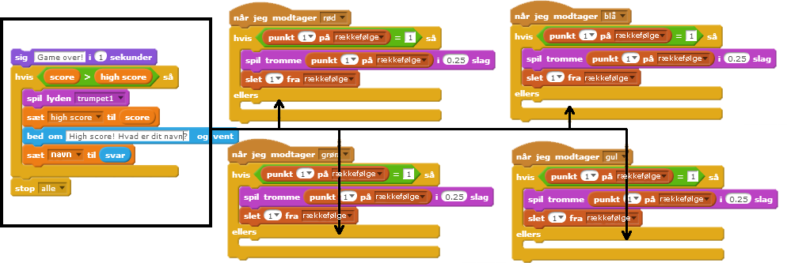
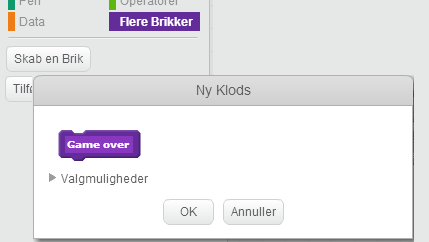
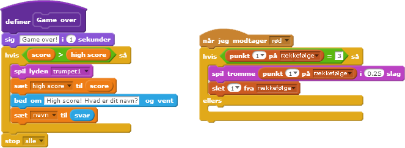
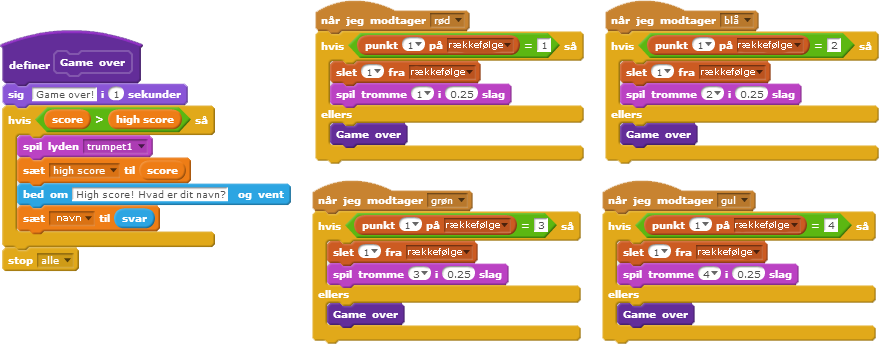
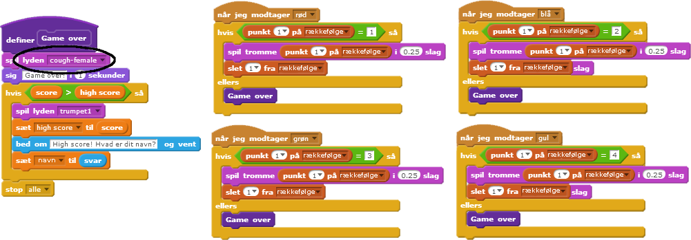
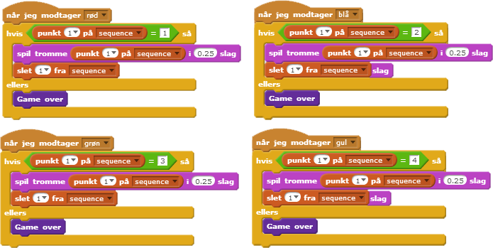

---
title: Hukommelsesspil
level: Scratch 2
language: da-DK
stylesheet: scratch
embeds: "*.png"
materials: ["Klubleder Ressourcer/*.*"] 
...

## Projekt skabt ved hjælp af brugerbidrag { .challenge .pdf-hidden }
Dette projekt er lavet sammen med Erik og hans datter Ruth. Hvis du har lyst til at bidrage med dit eget projekt, så [kontakt os på Github](https://github.com/CodeClub).

# Introduktion { .intro }

I dette projekt skal vi lave et hukommelsesspil, hvor du skal huske og gentage en rækkefølge af tilfældige farver!

<div class="scratch-preview">
  <iframe allowtransparency="true" width="485" height="402" src="http://scratch.mit.edu/projects/embed/34874510/?autostart=false" frameborder="0"></iframe>
  
</div>

# Trin 1: Tilfældige farver { .activity }

Lad os først lave lave en figur, som kan ændre sig til en tilfældig rækkefølge af farver, som spilleren skal huske.

## Arbejdsliste { .check }

+ Start et nyt Scratch projekt og slet kattespriten, så dit projekt står tomt. Du kan finde Scratch redigeringsprogrammet online på <a href="http://jumpto.cc/scratch-new">jumpto.cc/scratch-new</a>.

+ Vælg en figur og en baggrund. Din figur behøver ikke være en person, men den skal være i stand til at vise forskellige farver.

	

+ I dit spil skal du bruge et forskelligt nummer, som repræsenterer hver enkel farve:

	+ 1 = rød;
	+ 2 = blå;
	+ 3 = grøn;
	+ 4 = gul.

Giv din figur 4 forskellige farvekostumer, en for hver af de 4 ovenstående farver. Sørg for at dine farvede kostumer ligger i den rigtige rækkefølge.

	

+ Du skal oprette en _liste_ for at lave en tilfældig rækkefølge. En liste er blot en variabel, som opbevarer en stor mængde data __i ordnet rækkefølge__. Lav en liste som du kalder `sequence` {.blockdata}. Da det kun er din figur, som skal se denne liste, så kan vi også klikke på 'Kun for denne sprite'.

	

Nu bør du se din tomme liste øverst til venstre af din scene samt en del nye brikker, der bruger lister.

	   

+ Tilføj denne kode til din figur for at tilføje et tilfældigt nummer til din liste (og for at vise det korrekte kostume) 5 gange:

```blocks 
	når du klikker på ⚑
	slet (alle v) fra [sequence v]
	gentag (5) gange	
   	tilføj (vælg tilfældigt mellem (1) og (4)) til [sequence v] 
   	skift kostume til (punkt (last v) på [sequence v])
   	vent (1) sekunder 
end
``` 

Sørg også for at du har tømt listen til at starte med. 

## Udfordring: Tilføj lyd {.challenge}
Afprøv dit projekt et par gange. Du vil måske lægge mærke til at det samme nummer vælges to (eller flere) gange i træk, hvilket gør rækkefølgen sværere at huske. Kan du lave en trommelyd hver gang figuren skifter kostume? 

Kan du få en anden trommelyd frem afhængig af det tilfældige nummer, som vælges? Dette vil være _meget_ lignende den kode, som ændrer figurens kostume.

## Gem dit projekt { .save }

# Trin 2: Gentagelse af rækkefølgen { .activity }

Lad os tilføje 4 knapper så spilleren kan gentage den rækkefølge, de har husket på.

## Arbejdsliste { .check }

+ Tilføj 4 sprites til dit projekt, som bliver knapperne. Redigér dine 4 sprites, således der er 1 for hver af de 4 farver.

	

+ Når der klikkes på den røde tromme skal du udsende en meddelelse til din figur og lade den vide, at der er blevet klikket på den røde knap. Tilføj denne kode til din røde tromme:

```blocks 
	når denne sprite klikkes
	send [rød v] til alle 
``` 

+ Når din figur modtager denne besked bør den tjekke om nummeret 1 befinder sig i starten af listen (hvilket betyder at rød er den næste farve i rækkefølgen). Hvis den er det, kan du fjerne nummeret fra listen, da det er blevet gættet korrekt. Ellers er spillet slut!

```blocks 
	når jeg modtager [rød v]
	hvis <(punkt (1 v) på [sequence v]) = [1]> så
   	slet (1 v) fra [sequence v]
	ellers
   	sig [Game over!] i (1) sekunder
   	stop [alle v]
end
``` 
 
+ Du kan også vise nogle blinkende lys, når listen er tom, da dette betyder at hele rækkefølgen er gættet korrekt. Tilføj denne kode til slutningen af din figurs `når du klikker på ⚑` {.blockevents} script:

```blocks 
	vent indtil <(længden af [sequence v]) = [0]>
	send [won v] til alle og vent
``` 

+ Klik på din scene og tilføj denne kode således at baggrunden ændrer farve, når spilleren har vundet.

```blocks 
	når jeg modtager [won v] 
	spil lyden [drum machine v]
	gentag (50) gange
   	ændr effekten [farve v] med (25)
   	vent (0.1) sekunder
	end
	fjern grafiske effekter
```	

## Udfordring: Lav 4 knapper {.challenge}
Gentag trinene ovenfor med din blå, grønne og gule knap. Hvilken kode forbliver den samme, og hvilken kode ændrer sig for hver knap?

Du kan også tilføje lyde, når der trykkes på knapperne.  

Husk at afprøve den kode, du har tilføjet! Kan du lære en rækkefølge på 5 farver udenad? Er rækkefølgen forskellig fra gang til gang?  

## Gem dit projekt { .save }

# Trin 3: Flere niveauer { .activity .new-page }

Indtil videre skal spilleren kun huske på 5 farver. Lad os forbedre dit spil således at længden af rækkefølgen bliver større.

## Arbejdsliste { .check }

+ Lav en ny variabel du kalder `score` {.blockdata}. 

	  

+ Denne `score` {.blockdata} vil vi bruge til at bestemme længden af den rækkefølge, som spilleren skal huske på. Så til at starte med er scoren (og længden af rækkefølgen) 3. Tilføj denne kode til begyndelsen af `når du klikker på ⚑` {.blockevents} koden til din figur:

```blocks 
   sæt [score v] til [3]
``` 

+ I stedet for altid at lave en rækkefølge på 5 farver, så bruger du nu `score` {.blockdata} variablen til at bestemme længden på rækkefølgen. Ændr din figurs `gentag` {.blockcontrol} loop (til at lave rækkefølgen) til:

```blocks 
	gentag (score) gange
	end
``` 

+ Hvis rækkefølgen gættes rigtigt bør du tilføje 1 til scoren for at forlænge længden af rækkefølgen. 

```blocks 
	ændr [score v] med (1)
``` 

+ Til sidst skal du tilføje en `for evigt` {.blockcontrol} loop rundt om koden, så der laves en ny rækkefølge (i rækkefølgen) for hvert niveau. Sådan bør koden for din figur se ud:    

```blocks 
	når du klikker på ⚑ 
	sæt [score v] til [3]
	for evigt
   	slet (alle v) fra [sequence v] 
   	gentag (score) gange
      	tilføj (vælg tilfældigt mellem (1) og (4)) til [sequence v] 
        skift kostume til (punkt (sidste v) på [sequence v])
        vent (1) sekunder 
   	end
   	vent indtil <(længden af [sequence v]) = [0]>
   	send [won v] til alle og vent
   	ændr [score v] med (1) 
    end
``` 
 
+ Få dine venner til at afprøve dit spil. Husk at skjule `sequence` {.blockdata} listen, før de begynder at spille! 

## Gem dit projekt { .save }

# Trin 4: High score { .activity } 

Lad os gemme en high score så du kan spille mod dine venner.

## Arbejdsliste { .check }

+ Tilføj 2 nye variabler til dit projekt, som du kalder `high score` {.blockdata} og `navn` {.blockdata}.

+ Hver gang spillet slutter (ved tryk på den forkerte knap) skal du undersøge om spillerens score er højere end den nuværende high score. Hvis den er det skal du gemme scoren som en high score og opbevare spillerens navn. sådan bør din røde knap se ud:

```blocks 
	når jeg modtager [rød v]
	hvis <(punkt (1 v) på [sequence v]) = [1]> så
   	slet (1 v) fra [sequence v]
	ellers
   	sig [Game over!] i (1) sekunder
   	hvis <(score) > (high score)> så
      	sæt [high score v] til (score)
      	bed om [High score! Hvad er dit navn?] og vent
      	sæt [navn v] til (svar)
   	end
   	stop [alle v]
    end
``` 
 
+ Du er også nødt til at tilføje denne nye kode til de 3 andre knapper! Har du lagt mærke til at 'Game over' koden i hver af de 4 knapper er præcis den samme?

	  

+ Hvis du nogensinde får brug for at ændre noget i denne kode, fx tilføje en lyd eller ændre 'Game over!' beskeden, så bliver du nødt til at ændre den 4 gange! Det kan godt være lidt irriterende og kan føles som spild af tid.

I stedet kan du definere dine egne brikker og genbruge dem i dit projekt! Her skal du klikke på `Flere Brikker` {.blockmoreblocks}, og dernæst 'Skab en Brik'. Kald denne nye brik 'Game over'.

	  

+ Tilføj `ellers` {.blockcontrol} kodeblokken fra den røde knap til den nye blok, som kommer frem: 

	  

+ Nu har du lavet en ny _funktion_ der hedder `Game over` {.blockmoreblocks}, som du kan bruge, hvor du ønsker. Slæb din `Game over` {.blockmoreblocks} blok over på de 4 scripts for knapperne.

	  

+ Tilføj nu en lyd når der trykkes på den forkerte knap. Du kan nøjes med at tilføje denne kode _én gang_ i `Game over` {.blockmoreblocks} blokken som du lavede, og ikke 4 forskellige gange! 

	  

## Udfordring: Lav flere brikker {.challenge} 
Lægger du mærke til noget andet kode, som er den samme for alle 4 knapper? 



Kan du lave endnu en brik, som bruges af hver knap?  

## Gem dit projekt { .save }

## Udfordring: Et andet kostume {.challenge}
Har du lagt mærke til at dit spil begynder med, at din figur viser en af de 4 farver, og at den altid viser den sidste farve i rækkefølgen imens spilleren gentager rækkefølgen? 

Kan du tilføje et andet hvidt kostume til din figur, som vises i starten af dit spil, og når spilleren prøver at kopiere rækkefølgen? 


## Gem dit projekt { .save }

## Udfordring: Sværhedsgrad {.challenge}
Kan du gøre det muligt for spilleren at vælge mellem 'begynder' niveau (hvor kun den røde og den blå tromme bruges) og 'normal' (som bruger alle 4 trommer)? 

Du kunne faktisk også tilføje en 'øvet' version, som benytter en femte tromme!

## Gem dit projekt { .save }
