---
title: Luftballons
level: Scratch 1
language: de-DE
stylesheet: scratch
embeds: "*.png"
materials: ["Club Leader Resources/*.*"]
base: https://github.com/CodeClub/scratch-curriculum/blob/7f103592928e9ff0251c401fd6cfe78596737494/en-GB/Term%201/Balloons/Balloons.md
translators: Carole Roth, Gianluca D'Amico, Marco D'Amico
reviewers: Patrick, Ingrid
status: free to review
...

# Einführung { .intro }

Wir wollen ein Spiel machen, bei dem man Luftballons platzen lässt!

<div class="scratch-preview">
	<iframe allowtransparency="true" width="485" height="402" src="http://scratch.mit.edu/projects/embed/26745384/?autostart=true" frameborder="0"></iframe>
	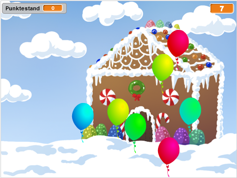
</div>

# Schritt 1: Ballon animieren { .activity }

## Arbeitsschritte { .check }

+ Starte ein neues Scratch-Projekt und lösche die Katzenfigur, so dass das Projekt leer ist. Du kannst den online Scratch-Editor hier finden: <a href="http://jumpto.cc/scratch-new">jumpto.cc/scratch-new</a>.

+ Füge eine neue Ballonfigur hinzu und wähle einen passenden Hintergrund für die Bühne.

	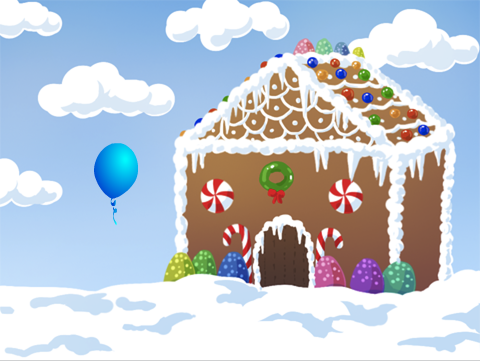

+ Gib deinem Luftballon diesen Code, so dass er auf dem Bildschirm hin und her fliegt:

	```blocks
		Wenn die grüne Flagge angeklickt
		gehe zu x:(0) y:(0)
		setze Richtung auf (45 v)
		wiederhole fortlaufend
			gehe (1) er-Schritt
			pralle vom Rand ab
		Ende
	```

+ Teste deinen Ballon. Bewegt er sich zu langsam? Ändere die Zahlen in dem Code, wenn du ihn schneller machen möchtest.

+ Hast du denn auch bemerkt, dass dein Ballon sich umdreht, wenn er den Bühnenrand berührt? 

	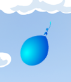

	Luftballons bewegen sich aber nicht so! Um das zu verbessern, klicke auf die Ballonfigur und dann auf das blaue `i` {.blockmotion}.

	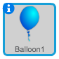
	
	In dem „Drehmodus“-Bereich, klicke auf den Punkt um die Drehung des Ballons zu stoppen.

	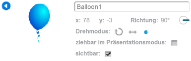

+ Teste dein Programm erneut, um zu sehen, ob das Problem behoben ist.

## Speichere dein Projekt { .save }

# Schritt 2: Zufallszahlen { .activity }

## Arbeitsschritte { .check }

+ Mit dem Code, den du jetzt hast, wird dein Ballon immer am selben Platz starten und sich in dieselbe Richtung bewegen. Klicke ein paar Mal auf die Flagge, um dein Programm zu testen. Du wirst sehen, dass es immer dasselbe tut.

+ Anstatt jedes Mal die gleiche x- und y-Position zu benutzen, kannst du Scratch auch zufällige Zahlen wählen lassen. Ändere den Code deines Ballons, so dass es so aussieht:

	```blocks
		Wenn die grüne Flagge angeklickt
		gehe zu x:(Zufallszahl von (-150) bis (150)) y:(Zufallszahl von (-150) bis (150))
		setze Richtung auf (45 v)
		wiederhole fortlaufend
			gehe (1) er-Schritt
			pralle vom Rand ab
		Ende
	```

+ Wenn du die grüne Flagge einige Male anklickst, wird dir auffallen, dass dein Ballon jedes Mal von einem anderen Platz aus startet.

+ Du kannst sogar eine Zufallszahl benutzen, um eine beliebige Ballonfarbe zu bekommen:

	```blocks
		ändere [Farbe v]-Effekt um (Zufallszahl von (0) bis (200))
	```

	

	Was passiert, wenn du diesen Code am Anfang deines Programms einfügst? Ändert sich etwas, wenn du ihn statt dessen in die `wiederhole fortlaufend`{.blockcontrol}-Schleife setzt? Was hast du lieber?
	
## Speichere dein Projekt { .save }

## Herausforderung: Mehr Zufälligkeit {.challenge}
Kannst du deinen Ballon in eine beliebige Richtung (zwischen -90 und 180 Grad) abfliegen lassen?

## Speichere dein Projekt { .save }

# Schritt 3: Lasse den Ballon platzen { .activity .new-page }

Erlaube nun dem Spieler, den Luftballon platzen zu lassen!

## Arbeitsschritte { .check }

+ Klicke auf deine Ballonfigur und dann auf „Kostüme“. Du kannst alle anderen Kostüme löschen und nur ein Ballonkostüm übrig lassen. Füge dann ein neues Kostüm hinzu, indem du auf „Neues Kostüm zeichnen“ klickst. Nenne es „Knallen“ und male eine Explosion.

	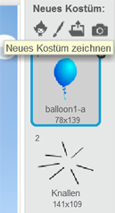

+ Versichere dich, dass dein Ballon zum richtigen Kostüm wechselt, wenn das Spiel beginnt. Dein Code sollte nun so aussehen:

	```blocks
		Wenn die grüne Flagge angeklickt
		wechsle zu Kostüm [balloon1-a v]
		setze Richtung auf (Zufallszahl von (-90) bis (180))
		gehe zu x:(Zufallszahl von (-150) bis (150)) y:(Zufallszahl von (-150) bis (150))
		ändere [Farbe v]-Effekt um (Zufallszahl von (0) bis (200))
		wiederhole fortlaufend
			gehe (1) er-Schritt
			pralle vom Rand ab
		Ende
	```

+ Um dem Spieler zu erlauben den Ballon platzen zu lassen, füge diesen Code hinzu:

	```blocks
		Wenn ich angeklickt werde
		wechsle zu Kostüm [Knallen v]
		spiele Klang [pop v]
	```

+ Teste dein Projekt. Kannst du den Ballon abschießen? Funktioniert es wie erwartet? Du kannst diesen Code noch verbessern: Beim Anklicken des Ballons soll er das „Knallen“-Kostüm für kurze Zeit anzeigen und danach verschwinden. Du kannst all das machen, indem du deinen Code nach `Wenn ich angeklickt werde` {.blockevents} so umänderst:

	```blocks
		Wenn ich angeklickt werde
		wechsle zu Kostüm [Knallen v]
		spiele Klang [pop v]
		warte (0.3) Sek.
		verstecke dich
	```

+ Da der Luftballon sich versteckt, wenn er angeklickt wird, musst du ebenfalls einen `zeige dich`{.blocklooks}-Block am Anfang von dem `Wenn die grüne Flagge angeklickt`{.blockevents}-Ereignis einfügen.

+ Versuche den Ballon nochmal zum Platzen zu bringen, damit du siehst, ob es funktioniert. Wenn du es schwierig findest, den Luftballon zum Platzen zu bringen, ohne ihn hin und her zu ziehen, kannst du das Spiel auch im Vollbildschirmmodus spielen, indem du diesen Knopf drückst:

	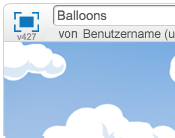

## Speichere dein Projekt { .save }

# Schritt 4: Punkte zählen { .activity }

Wir werden das Spiel jetzt interessanter machen, indem wir die Punkte zählen.

## Arbeitsschritte { .check }

+ Um den Punktestand festzuhalten, brauchst du einen Platz, wo du ihn notieren kannst. Eine „Variable“ ist ein solcher Platz, an dem du Daten abspeichern kannst. Diese Daten (wie zum Beispiel die Punktezahl) dürfen sich auch ändern. Darum heißen _„Variablen“_ auch so.
	
	Um eine neue Variable zu erstellen, klicke zuerst auf „Skripte“, dann auf den Bereich `Daten` {.blockdata}, und wähle dann „Neue Variable“.

	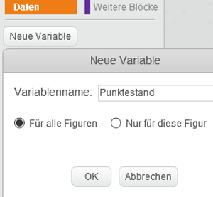

	Gib „Punktestand“ als Variablennamen ein. Vergewissere dich, dass die Variable für alle Figuren zur Verfügung steht und klicke auf „OK“, um sie zu erstellen. Du wirst anschließend eine Menge neuer Code-Blöcke sehen, die mit deiner `Punktestand`{.blockdata}-Variable verwendet werden können.
	
	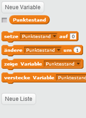

	Du wirst die Variable auch oben links auf der Bühne sehen.

	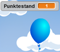

+ Wenn ein neues Spiel anfängt, d.h. wenn du die grüne Flagge anklickst, willst du den Punktestand des Spielers auf 0 zurücksetzen. Füge diesen Block oberhalb vom `Wenn die grüne Flagge angeklickt`{.blockevents}-Code hinzu:

	```blocks
	setze [Punktestand v] auf [0]
	```

+ Immer wenn ein Ballon platzt, musst du 1 zum Punktestand hinzurechnen:

	```blocks
		Wenn ich angeklickt werde
		wechsle zu Kostüm [Knallen v]
		spiele Klang [pop v]
		warte (0.3) Sek.
		ändere [Punktestand v] um (1)
		verstecke dich
	```

+ Starte dein Programm erneut und klicke auf den Ballon. Ändert sich dein Punktestand?

## Speichere dein Projekt { .save }

# Schritt 5: Viele Ballons { .activity .new-page }

Nur einen Ballon platzen zu lassen reicht nicht, also lass uns viele Luftballons hinzufügen!

Ein einfacher Trick viele Ballons zu bekommen, ist, mit der rechten Maustaste auf die Ballonfigur zu klicken und „Duplizieren“ zu wählen. Dies ist in Ordnung, wenn du nur ein paar Ballons benötigst. Was aber, wenn du 20 oder 100 Ballons brauchst? Willst du wirklich so oft „Duplizieren“?

## Arbeitsschritte { .check }

+ Ein besserer Weg, viele Ballons zu bekommen, ist es die Ballonfigur zu _klonen_.

	Ziehe deinen Code (ohne den `Punktestand`{.blockdata}-Block) aus dem `Wenn die grüne Flagge angeklickt`{.blockevents}-Ereignis heraus. Lösche ihn aber nicht und füge stattdessen einen neuen Code hinzu, um den Ballon 20-mal zu klonen.

	Du kannst nun den Code, den du gerade verschoben hast, zu einem neuen `Wenn ich als Klon entstehe`{.blockcontrol}-Ereignis (aus dem Bereich „Steuerung“) hinzufügen. Du solltest ebenfalls den `verstecke dich`{.blocklooks}-Block in dem `Wenn ich angeklickt werde`{.blockevents}-Ereignis durch `lösche diesen Klon`{.blockcontrol} ersetzen.
	
	Dein Code sollte nun so aussehen: 

	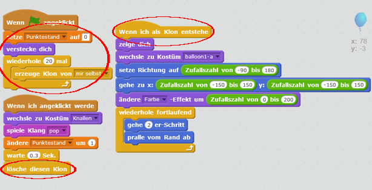

+ Teste dein Projekt! Wenn du jetzt die Flagge anklickst, wird sich der Hauptballon verstecken und sich dann 20-mal klonen. Jeder der 20 Klone wird ziellos über den Bildschirm wandern, so wie bisher. Probiere mal, die 20 Luftballons platzen zu lassen!

## Speichere dein Projekt { .save }

# Schritt 6: Einen Timer hinzufügen { .activity .new-page }

Du kannst dein Spiel auch interessanter gestalten, indem du dem Spieler nur 10 Sekunden Zeit gibst, um so viele Ballons wie möglich platzen zu lassen.

## Arbeitsschritte { .check }

+ Du kannst eine andere Variable benutzen, um die restliche Zeit zu speichern. Klicke auf die Bühne und erstelle eine neue Variable mit dem Namen „Zeit“:

	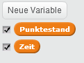

+ So soll der Timer funktionieren:

	+ Der Timer soll 10 Sekunden dauern;
	+ Der Timer soll jede Sekunde herunter zählen;
	+ Das Spiel soll enden, wenn der Timer 0 erreicht hat.

	Hier ist der Code, um dies zu tun. Du kannst ihn zu deiner _Bühne_ hinzufügen:

	```blocks
		Wenn die grüne Flagge angeklickt
		setze [Zeit v] auf [10]
		wiederhole bis <(Zeit) = [0]>
			warte (1) Sek.
			ändere [Zeit v] um (-1)
		Ende
		stoppe [alles v]
	```

	Um den Block `wiederhole bis`{.blockcontrol}`Zeit`{.blockdata}`= 0`{.blockoperators} zu erstellen, musst du zuerst einen grünen `=` {.blockoperators} in dein `wiederhole bis` {.blockcontrol} einfügen:

	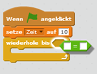

	Anschließend kannst du deine `Zeit`{.blockdata}-Variable in den `=`{.blockoperators}-Block ziehen:

	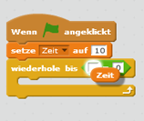

+ Verschiebe die Anzeige der `Zeit`{.blockdata}-Variable auf die rechte Seite der Bühne. Du kannst die Anzeige auch doppelklicken, um die Darstellung der Zeit zu verändern.

+ Teste dein Spiel. Wie viele Punkte kannst du erzielen? Wenn dein Spiel zu einfach ist, dann kannst du:

	+ Deinem Spieler weniger Zeit geben
	+ Mehr Ballons hinzufügen
	+ Die Ballons schneller bewegen
	+ Die Ballons kleiner gestalten

	Teste dein Spiel bis du mit dem Schwierigkeitsgrad zufrieden bist.

## Speichere dein Projekt { .save }

## Herausforderung: Mehr Objekte {.challenge}
Kannst du noch andere Objekte hinzufügen? Zum Beispiel gute Objekte, wie Donuts, die dir jede Menge Punkte einbringen. Oder böse Objekte, wie zum Beispiel Fledermäuse, die dir Punkte abziehen.


Du musst über die Objekte, die du hinzufügst, nachdenken. Überlege dir:

+ Wie viele Objekte wird es geben?
+ Wie groß ist das Objekt? Wie bewegt es sich fort?
+ Soll es schneller oder langsamer als die Ballons sein?
+ Wie viele Punkte wirst du erzielen oder verlieren, wenn du darauf klickst?
+ Wie wird es aussehen, wenn es angeklickt wird?

Wenn du beim Hinzufügen anderer Objekte Hilfe brauchst, dann schau dir die Schritte weiter oben an!

## Speichere dein Objekt { .save }
