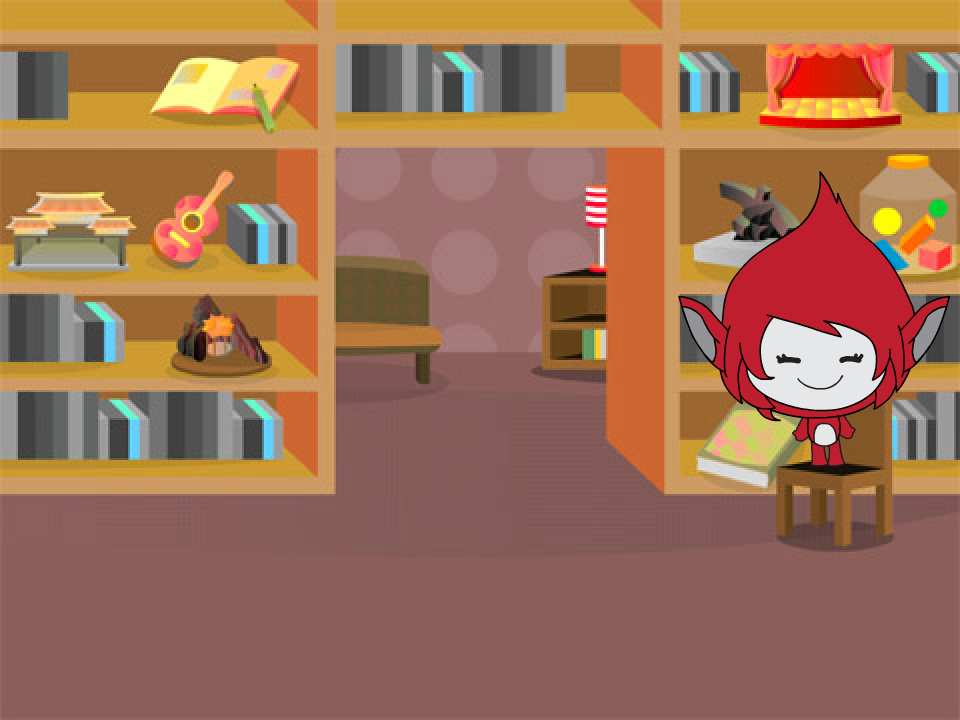
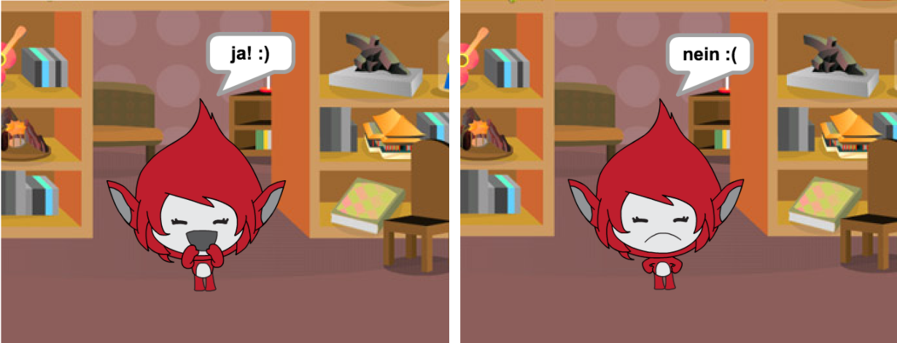
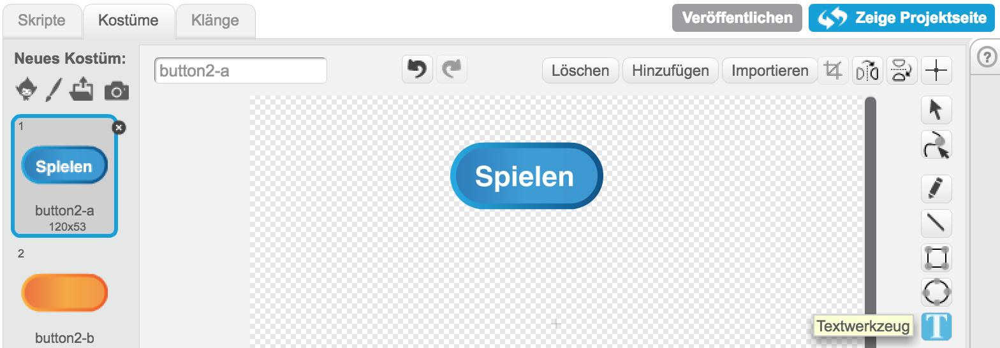
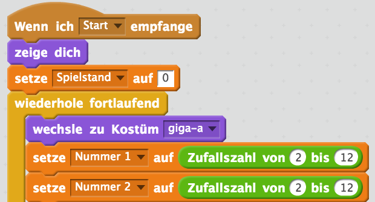
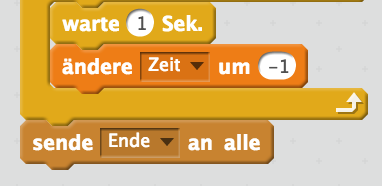
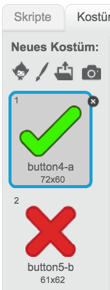
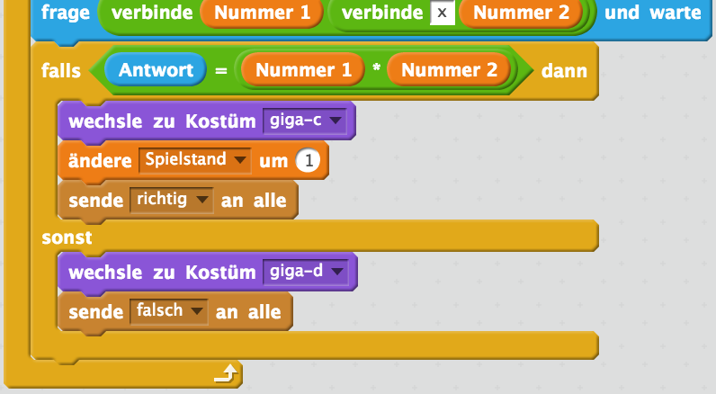
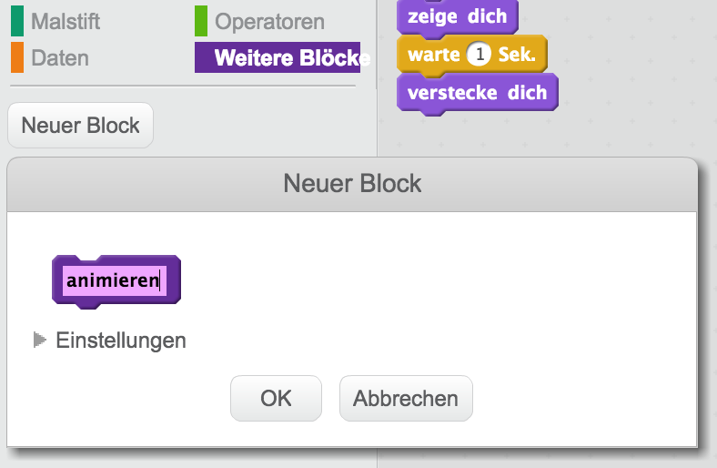

---
title: Gehirnjogging
level: Scratch 2
language: de-DE
stylesheet: scratch
embeds: "*.png"
materials: ["Club Leader Resources/*"]
...

# Einführung { .intro }

In diesem Projekt wirst Du erfahren, wie man ein Denkspiel erstellt, bei dem der Spieler innerhalb von 30 Sekunden so viele richtige Antworten wie möglich geben muss.

<div class="scratch-preview">
  <iframe allowtransparency="true" width="485" height="402" src="http://scratch.mit.edu/projects/embed/42225768/?autostart=false" frameborder="0"></iframe>
  
</div>

# Schritt 1: Fragen ausdenken { .activity }

Lass uns damit anfangen, dass wir dem Spieler Fragen stellen, die er beantworten muss.

## Arbeitsschritte { .check }

+ Starte ein neues Scratch-Projekt und lösche die Katzenfigur, so dass Dein Projekt leer ist. Du findest das Scratch-Bearbeitungsprogramm online auf <a href="http://jumpto.cc/scratch-new">jumpto.cc/scratch-new</a>.

+ Wähle eine neue Figur, sowie den passenden Bühnenhintergrund aus. Du kannst nehmen, was Du möchtest! Hier ist ein Beispiel:

		

+ Erstelle 2 neue Variablen namens `Nummer 1` {.blockdata} und `Nummer 2` {.blockdata}. Diese Variablen werden die 2 Nummern beinhalten, die miteinander multipliziert werden müssen.

	

+ Füge Deinem Charakter einen Code hinzu, um diesen beiden Variablen eine `Zufallszahl` {.blockoperators} zwischen 2 und 12 zu vergeben.

	```blocks
		Wenn die grüne Flagge angeklickt
		setze [Nummer 1 v] auf (Zufallszahl von (2) bis (12))
		setze [Nummer 2 v] auf (Zufallszahl von (2) bis (12))
	```

+ Danach kannst Du den Spieler nach der Antwort fragen und ihm mitteilen, ob er richtig lag.

	```blocks
		Wenn die grüne Flagge angeklickt
		setze [Nummer 1 v] auf (Zufallszahl von (2) bis (12))
		setze [Nummer 2 v] auf (Zufallszahl von (2) bis (12))
		frage (verbinde (Nummer 1) (verbinde [x] (Nummer 2))) und warte
		falls <(Antwort) = ((Nummer 1) * (Nummer 2))> dann
		   sage [ja! :)] für (2) Sek.
		sonst
		   sage [nein :(] für (2) Sek.
		Ende
	```

+ Teste das gesamte Projekt, indem Du die Frage einmal richtig und einmal falsch beantwortest.

+ Rahme diesen Code mit einer `wiederhole fortlaufend` {.blockcontrol} Schleife ein, so dass dem Spieler viele Fragen aufeinander gestellt werden.

+ Erstelle eine Stoppuhr auf der Bühne, indem Du die Variable namens `Zeit` {.blockdata} hinzufügst. Das 'Ballons' Projekt enthält eine Anleitung zum Erstellen einer Stoppuhr (in Schritt 6), wenn Du etwas Hilfe hierfür benötigst!

+ Teste erneut Dein Projekt - es sollte Dir möglich sein fortlaufend Fragen zu stellen, bis die Stoppuhr abgelaufen ist. 

## Speichere Dein Projekt { .save }

## Herausforderung: Kostüme verändern {.challenge}
Kannst Du das Kostüm Deiner Figur so anpassen, dass es sich passend zu den Antworten des Spielers verändert?



## Herausforderung: Einen Spielstand hinzufügen {.challenge}
Kannst Du Deinem Spiel einen Spielstand hinzufügen? Du kannst dem Zähler bei jeder richtigen Antwort einen Punkt hinzufügen. Wenn Du ein bisschen gemein sein möchtest, kannst Du den Spielstand jedesmal auf 0 zurücksetzen, sobald der Spieler eine falsche Antwort gegeben hat!

## Speichere Dein Projekt{ .save }

# Schritt 2: Mehrere Spiele { .activity .new-page}

Lass uns Deinem Spiel einen 'Start'-Knopf hinzufügen, damit Du das Spiel wiederholen kannst.

## Arbeitsschritte { .check }

+ Erstelle eine neue 'Start'-Knopf-Figur, die der Spieler anklicken wird, sobald er ein neues Spiel beginnen möchte. Du kannst die Figur entweder selbst zeichnen oder eine Figur aus der Scratch-Bibliothek wählen.

	

+ Füge Deinem neuen Knopf diesen Code hinzu:

	```blocks
		Wenn die grüne Flagge angeklickt
		zeige dich

		Wenn ich angeklickt werde
		verstecke dich
		sende [start v] an alle
	```

	Dieser Code zeigt den Start-Knopf an, sobald Dein Projekt sich öffnet. Sobald der Knopf angeklickt wird, wird er direkt verborgen und versendet eine Nachricht, die das Spiel starten lässt. 

+ Du wirst den Code Deiner Figur so anpassen müssen, dass das Spiel dann startet, wenn die Nachricht 'Start' {.blockevents} empfangen wird und nicht dann, wenn die Flagge angeklickt worden ist.

	Ersetze den `Wenn die grüne Flagge angeklickt` {.blockevents} Code mit `Wenn ich Start erhalte` {.blockevents}.

	

+ Klicke erst auf die Flagge und dann den neuen Start-Knopf, um den Code zu testen. Du solltest feststellen, dass das Spiel erst beim Klick auf den Start-Knopf startet.

+ Ist Dir aufgefallen, dass die Stoppuhr startet sobald die Flagge und nicht sobald der Start-Knopf angeklickt worden ist? 

	

	Kannst Du das Problem beheben?

+ Klicke auf die Bühne und ersetze den 'Stoppe alles' {.blockcontrol} Block mit einer `Ende` {.blockevents}-Nachricht.

	

+ Du kannst nun dem Knopf einen Code hinzufügen, um ihn am Ende eines Spieles wieder erscheinen zu lassen.

	```blocks
		Wenn ich [Ende v] empfange
		zeige dich
	```

+ Du musst deine Figur auch so programmieren, dass sie aufhört Fragen zu stellen, sobald das Spiel beendet ist:

	```blocks#
		Wenn ich [Ende v] empfange
		stoppe [andere Skripte der Figur v]
	```

+ Teste Deinen Spiele-Knopf, indem Du einige Spiele nacheinander spielst. Du solltest feststellen, dass der Start-Knopf nach jedem beendeten Spiel erscheint. Um das Testen zu vereinfachen, kannst Du die Spielzeit auf einige Sekunden verkürzen.

	```blocks
		setze [Zeit v] auf [10]
	```

+ Du kannst sogar das Aussehen des Knopfes verändern, wenn der Spieler mit der Maus darüber geht.

	```blocks
		Wenn die grüne Flagge angeklickt
		zeige dich
		wiederhole fortlaufend
		   falls <wird [Mauszeiger v] berührt?> dann
		      setze [Fischauge v]-Effekt auf (30)
		   sonst
		      setze [Fischauge v]-Effekt auf (0)
		   Ende
		Ende
	```

	

## Speichere Dein Projekt { .save }

## Herausforderung: Startbildschrim {.challenge}
Kannst Deiner Bühne einen anderen Hintergrund hinzufügen, welcher Dein Startbildschirm sein wird? Du kannst die beiden Blöcke `Wenn ich Start erhalte` {.blockevents} und `Wenn ich Ende erhalte ` {.blockevents} benutzen, um zwischen den unterschiedlichen Hintergründen zu wechseln.


Du kannst auch die Figur und sogar die Stoppuhr anzeigen und verstecken, indem Du diese Blocks benutzt:

```blocks
	zeige Variable [Zeit v]
	```
	```blocks
	verstecke Variable [Zeit v]
```


## Speichere Dein Projekt { .save }

# Schritt 3: Graphiken hinzufügen { .activity .new-page}

Anstatt die Figur einfach nur `ja! :)` oder `nein :(` sagen zu lassen, möchten wir Graphiken hinzufügen, die den Spieler wissen lassen, wie er gerade abschneidet.

+ Erstelle eine neue Figur, die 'Ergebnis' heißt und ein 'Richtig' und 'Falsch' Kostüm enthält.

	

+ Verändere den Code Deiner Figur so, dass sie, anstatt dem Spieler zu sagen, ob er richtig lag, sie 'richtig` {.blockevents} und `falsch` {.blockevents} Nachrichten versendet.

	

+ Du kannst diese Nachrichten nun nutzen, um das 'Richtig'- oder das 'Falsch'-Kostüm anzuzeigen. Füge diesen Code der 'Ergebnis'-Figur hinzu:

		

+ Teste erneut Dein Spiel. Du solltest ein Häkchen immer dann sehen, wenn die Frage richtig beantwortet wurde. Das Kreuz sollte nur dann auftauchen, wenn der Spieler mit seiner Antwort falsch lag.

	

+ Ist Dir aufgefallen, dass der Code für `Wenn ich richtig erhalte` {.blockevents} und `Wenn ich falsch erhalte` {.blockevents} nahezu identisch ist? Lass uns eine Funktion erstellen, die es einfacher für Dich macht, Veränderungen an dem Code vorzunehmen.

	Klicke bei deiner 'Ergebnis'-Figur auf `Mehr Blöcke` {.blockmoreblocks} und dann auf 'Block erstellen'. Erstelle eine neue Funktion namens `animieren` {.blockmoreblocks}.

	

+ Du kannst den Animations-Code in Deine Animations-Funktion hinzufügen und dann die Funktion einfach zwei Mal benutzen:

	

+ Wenn Du nun das Häkchen oder das Kreuz für eine längere Zeit anzeigen lassen möchtest, musst Du nur eine einzige Änderung an dem Code vornehmen. Versuche es!

+ Anstatt das Häkchen und das Kreuz einfach nur auftauchen und verschwinden zu lassen, kannst Du die Funktion so anpassen, dass die Symbole langsam eingeblendet werden.

	```blocks
		Definiere [object Object]
		setze [Durchsichtigkeit v]-Effekt auf (100)
		zeige dich
		wiederhole (25) mal
		   ändere [Durchsichtigkeit v]-Effekt um (-4)
		Ende
		verstecke dich
	```

## Speichere Dein Projekt { .save }

## Herausforderung: Verbessere die Animation {.challenge}
Kannst Du die Animation Deiner Graphiken verbessern? Du könntest Deinen Code so verändern, dass das Richtig-Häkchen und das Falsch-Kreuz sowohl langsam eingeblendet, als auch langsam ausgeblendet werden. Oder Du könntest andere coole Effekte nutzen:


## Speichere Dein Projekt { .save }

## Herausforderung: Geräusche und Musik {.challenge}
Kannst Du dem Spiel Geräusche und Musik hinzufügen? Zum Beispiel:

+ Ein Geräusch abspielen, wenn der Spieler eine richtige oder falsche Antwort gegeben hat
+ Deiner Stoppuhr ein tickendes Geräusch geben
+ Eine Melodie abspielen, wenn die Zeit abgelaufen ist

	```blocks
		spiele Schlaginstrument (10 v) für (0.1) Schläge
	```

+ Du kannst auch konstant eine Musik in einer Schleife abspielen. Wenn Du Dir nicht sicher bist wie das gehst, hilft Dir das Projekt 'Rock Gruppe' auf die Sprünge.

## Speichere Dein Projekt { .save }

## Herausforderung: Das Rennen um die 10 Punkte {.challenge}
Kannst Du die Spielmechanik so verändern, dass der Spieler anstatt so viele Fragen wie möglich in 10 Sekunden beantworten, er so schnell wie möglich 10 Punkte erreichen muss?

Um dies zu tun, musst Du lediglich den Stoppuhr-Code verändern. Siehst Du, was verändert werden muss?

```blocks
		Wenn ich [Start v] empfange
		setze [Zeit v] auf (30)
		wiederhole bis <(Zeit) = [0]>
		   warte (1) Sek.
		   ändere [Zeit v] um (-1)
		Ende
		sende [Ende v] an alle
```

## Speichere Dein Projekt { .save }

## Herausforderung: Bildschirm mit Anleitungen {.challenge}
Kannst Du Deinem Spiel einen Bildschirm mit Anleitungen hinzufügen, die dem Spieler das Spiel erklären? Hierfür wirst Du einen 'Anleitung'-Knopf, sowie einen anderen Hintergrund benötigen.


Du könntest auch einen 'Zurück'-Knopf gebrauchen, um zum Hauptmenü zurückzukehren.

```blocks
	sende [Hauptmenü v] an alle
```

## Speichere Dein Projekt { .save }