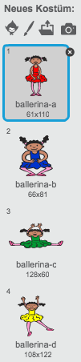
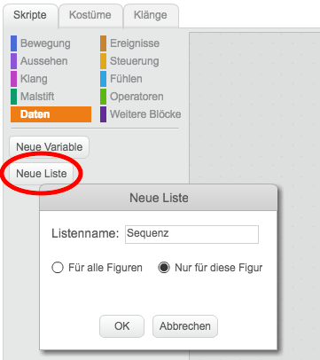
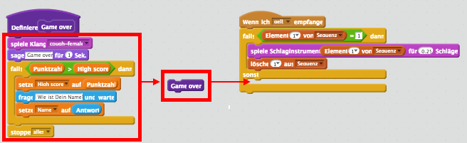
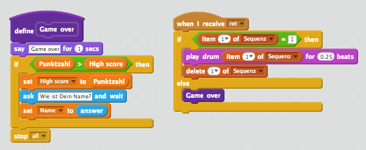
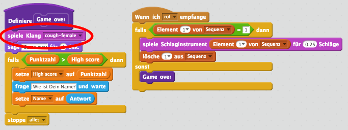
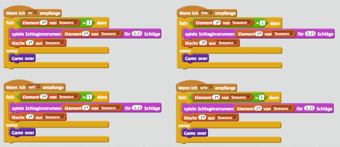
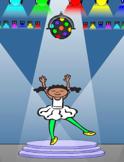

---
title: Speicher
level: Scratch 2
language: de-DE
stylesheet: scratch
embeds: "*.png"
materials: ["Club Leader Resources/*"]
...

## Gemeinschafts Beitrag Projekt { .challenge .pdf-hidden }
Dieses Projekt wurde mit Erik und seiner Tochter Ruth erstellt. Wenn sie um ein Projekt des eigenen Beitrag möchten, dann [müssen sie uns kontaktieren an Github](https://github.com/CodeClub).

# Einführung { .intro }

In dieses Projekt, finden Sie eine Speicher-spiel wo Sie eine Sequenz von zufällige Farben merken und wiederholen erstellen müssen!

<div class="scratch-preview">
  <iframe allowtransparency="true" width="485" height="402" src="http://scratch.mit.edu/projects/embed/34874510/?autostart=false" frameborder="0"></iframe>
  
</div>

# Schritt 1: Zufällige Farben { .aktivität}

Zuerst erstellen wir ein Zeichen, das in eine zufällige Reihenfolge der Farben für den Player ändern können, um zu merken.
## Aktivität Kontrollliste { .kontrolle }

+ Starten Sie ein neues Scratch projekt und löschen Sie die katze sprite, so dass ihr projekt leer ist.Sie können der Online Scratch Editor hier <a href="http://jumpto.cc/scratch-new">jumpto.cc/scratch-new</a> finden.

+ Wählen Sie einen Charakter und eine Kulisse. Dein Charakter muss nicht eine Person sein, aber es muss in der Lage, um verschiedene Farben zu zeigen.

	

+ Im Spiel werden Sie eine andere Nummber verwenden, um jede Farbe darzustellen:

	+ 1 = rot;
	+ 2 = blau;
	+ 3 = grün;
	+ 4 = gelb.

	Geben Sie ihren Charakter 4 verschiedenen Farbkostüme,eine für jede der 4 Farben oberhalb. Stellen Sie sicher, dass Ihre farbigen Kostüme in der richtigen Reihenfolge sind.

	

+ Um eine Zufallfolge zuerstellen müssen Sie eine__Liste__ erstellen. Eine Liste ist nur eine Variable die vielen Daten __in Ordnung__ gespeichert werden. Erstellen Sie eine neue Liste namens `sequenz` {.blockdata}. Da nur deinen Charakter die Liste sehen muss, können wir auch auf 'Nur für dieses Sprite' klicken. 

	

	Sie sollten ihre leere Liste in der oberen linken Ecke ihrer Buhne jetzt sehen und auch viele neue Bausteine für die Verwendung von Listen.

	

+ Fügen sie diesen code, um ihren Charakter um eine Zufallszahl zu Ihrer Liste hinzufügen (und die richtige Kunen) 5-mal zeigen:

	```blocks
Wenn die grüne Flagge angeklickt
lösche (alles v) aus [sequence v]
wiederhole (5) mal
   füge (Zufallszahl von (1) bis (4)) zu [sequence v] hinzu
   wechsle zu Kostüm (Element (last v) von [sequence v])
   warte (1) Sek.
Ende
	```

	Beachten sie, dass sie auch die Liste zu beginnen geleert haben.

## Herausforderung: Hinzufügen von Sound {.herausforderung}
Testen Sie ihr Projekt ein paar mal. Stellen Sie möglicherweise fest , dass manchmal die gleiche Zahl zweimal (oder mehr) in einer Reihe ausgewählt machen die Folge schwerer zu merken. Können Sie es machen dass jedes Mal dass Zeichen ändert Kostüm einen Drum-Sound spielt? 

Können Sie ein anderes Drum-Sound spielen abhängig von der Zufallszahl ausgewählt? Dies wird _sehr_ ähnlich wie der Code, um den Charakter der Kostüm ändern werden sein.

## Speichern Sie Ihr Projekt { .save }

# Schritt 2: Wiederholen der Sequenz { .activity }

Fügen wir 4 Tasten , für den Spieler , um die Sequenz erinnerten sie habe wiederholen.

## Aktivität Kontrollliste { .check }

+ Hinzufügen 4 Sprites , um Ihr Projekt , die Tasten werden wird. Bearbeiten Sie Ihre 4 -Sprites , so dass es 1 für jede der 4 Farben.

	

+ Wenn die rote Trommel angeklickt  wird, müssen Sie eine Nachricht an deinen Charakter zu übertragen, sie wissen zu lassen, dass die rote Schaltfläche angeklickt  wurde. Fügen Sie diesen Code auf Ihre rote Trommel:

	```blocks
Wenn ich angeklickt werde
sende [red v] an alle
	```

+ Wenn dein Charakter diese Nachricht empfängt, sollten sie prüfen, ob die Nummer 1 ist am Anfang der Liste (was bedeutet, dass Rot die nächste Farbe in der Reihenfolge). Wenn ja, können Sie die Nummer aus der Liste zu entfernen, wie es richtig erraten worden. Ansonsten ist das Spiel vorbei!

	```blocks
Wenn ich [red v] empfange
falls <(Element (1 v) von [sequence v]) = [1]> dann
   lösche (1 v) aus [sequence v]
sonst
   sage [Game over!] für (1) Sek.
   stoppe [alles v]
Ende
	```

+ Sie könnten auch ein paar blinkende Lichter an, sobald die Liste leer ist, da es die gesamte Sequenz bedeutet, richtig erraten wurde . Fügen Sie diesen Code an das Ende deines Charakters `wenn Fahne geklickt` {.blockevents} Skript: 

	```blocks
warte bis <(Länge von [sequence v]) = [0]>
sende [won v] an alle und warte
	```

+ Klicken Sie auf Ihre Bühne, und diesen Code hinzufügen, um die Kulisse die Farbe wechseln lassen, sobald der Spieler gewonnen hat.

	```blocks
Wenn ich [won v] empfange
spiele Klang [drum machine v]
wiederhole (50) mal
   ändere [Farbe v]-Effekt um (25)
   warte (0.1) Sek.
Ende
schalte Grafikeffekte aus
	```

## Herausforderung: Erstellen von 4 Tasten {.challenge}
Wiederholen Sie diese Schritte für Ihre blauen, grünen und gelben Tasten. Welcher Code wird gleich bleiben, und die für jede Schaltfläche ändern wird ?

Sie können auch Geräusche, wenn die Tasten gedrückt werden hinzuzufügen.

Denken Sie daran, den Code, den Sie hinzugefügt haben, zu testen! Können Sie eine Folge von 5 Farben zu merken ? ist die Sequenz jedes Mal anders ?

## Speichern Sie Ihr Projekt { .save }

# Schritt 3: Mehrere Ebenen { .activity .new-page }

Bisher hat der Spieler nur zu 5 Farben erinnern. Lassen Sie Ihr Spiel zu verbessern, so dass die Länge der Folge erhöht .

## Aktivität Kontrollliste { .check }

+ Erstellen Sie eine neue Variable namens `Punktzahl` {.blockdata}.

	

+ Diese `Punktzahl` {.blockdata} wird verwendet, um auf der Länge der Folge hat der Spieler zu merken zu entscheiden. Also, um mit der Partitur (und die Sequenzlänge) beträgt 3 beginnen. Fügen Sie diese Code-Block an den Anfang Ihres `wenn Fahne geklickt` Zeichencode

	```blocks
setze [score v] auf [3]
	```

+ Anstatt immer die Schaffung einer Sequenz von 5 Farben, die Sie wollen nun die `Punktzahl` {.blockdata}, um die Sequenzlänge zu bestimmen. Ändern deines Charakters `wiederholen` {.blockcontrol} Schleife (für die Erstellung der Sequenz) , um: 

	```blocks
wiederhole (score) mal
Ende
	```

+ Wird die Reihenfolge richtig geraten , sollten Sie 1 zur Partitur hinzufügen , um die Länge der Sequenz zu erhöhen.

	```blocks
ändere [score v] um (1)
	```

+ Schließlich müssen Sie eine `auf ewig` {.blockcontrol} Schleife um den Code hinzufügen , um die Sequenz zu erzeugen , so dass eine neue Sequenz wird für jede Ebene erstellt. Dies ist, wie Sie Ihre Zeichencode aussehen sollte:

	```blocks
Wenn die grüne Flagge angeklickt
setze [score v] auf [3]
wiederhole fortlaufend
   lösche (alles v) aus [sequence v]
   wiederhole (score) mal
      füge (Zufallszahl von (1) bis (4)) zu [sequence v] hinzu
      wechsle zu Kostüm (Element (last v) von [sequence v])
      warte (1) Sek.
   Ende
   warte bis <(Länge von [sequence v]) = [0]>
   sende [won v] an alle und warte
   ändere [score v] um (1)
Ende
	```

+ Holen Sie sich Ihren Freunden zu testen Sie Ihr Spiel. Denken Sie daran , um die `sequenz` {.blockdata} Liste auszublenden, bevor sie es zu spielen! 

## Speichern Sie Ihr Projekt { .save }

# Schritt 4: High Score { .activity }

Speichern wir die hohe Punktzahl, so dass Sie gegen Ihre Freunde spielen kann.

## Aktivität Kontrollliste { .check }

+ Hinzufügen 2 neue Variablen zu Ihrem Projekt, genannt `High Score` {.blockdata} und `Namen` {.blockdata}. 

+ Wenn jemals das Spiel (durch Drücken der falschen Knopf) endet, müssen Sie prüfen, ob das Ergebnis des Spielers höher ist als die aktuelle High Score. Ist dies der Fall , müssen Sie die Punktzahl als die High Score zu speichern, und speichern Sie den Namen des Spielers. Hier ist, wie Sie Ihre roten Knopf aussehen sollte:

	```blocks
Wenn ich [red v] empfange
falls <(Element (1 v) von [sequence v]) = [1]> dann
   lösche (1 v) aus [sequence v]
sonst
   sage [Game over!] für (1) Sek.
   falls <(score) > (high score)> dann
      setze [high score v] auf (score)
      frage [High score! What is your name?] und warte
      setze [name v] auf (Antwort)
   Ende
   stoppe [alles v]
Ende
	```

+ Sie müssen diese neuen Code zu den anderen 3 Tasten zu schreiben! Haben Sie bemerkt, dass die 'Game over' Code in jedem der vier Tasten ist genau das gleiche?

	

+ Wenn Sie überhaupt benötigen eines dieser Code zu ändern, wie zum Beispiel das Hinzufügen eines Ton oder die Änderung der 'Game over!' Nachricht, würden Sie es 4 mal ändern müssen! Das könnte nervig werden, und viel Zeit verschwenden. 

+ Stattdessen können Sie eigene Bausteine zu definieren, und wiederverwenden, in Ihrem Projekt! Um dies zu tun, klicken `mehr Blöcke` {.blockmoreblocks}, und dann 'machen einen Block'. Namen Sie diese neuen Block 'Game over'.

	

+ Fügen Sie den Code aus dem `else` {.blockcontrol} Block von der roten Taste, um den neuen Block, das angezeigt wird: 

	

+ Sie haben nun eine neue _funktion_ namens `Game over` {.blockmoreblocks}, die Sie überall Sie verwenden können, hergestellt. Ziehen Sie Ihr neues `Game over` {.blockmoreblocks} Block auf die 4 -Skripte für die Schaltflächen .

	

+ Nun fügen Sie einen Sound für , wenn die falsche Taste gedrückt wird. Sie müssen diesen Code nur  _einmal_ im `Game over` {.blockmoreblocks} Block hinzufügen, die Sie gemacht , und nicht 4 separate mal schreiben!

	

## Herausforderung: Machen mehr Blöcke {.challenge}
Bemerken Sie einen anderen Code , der das gleiche für alle vier Tasten ist?



Können Sie eine andere benutzerdefinierte Block machen, die durch jede Taste verwendet wird?

## Speichern Sie Ihr Projekt { .save }

## Herausforderung: Ein weiteres Kostüm {.challenge}
Haben Sie bemerkt, dass Ihr Spiel beginnt mit deinem Charakter, die eine der 4 Farben zeigt, und dass sie die letzte Farbe angezeigt werden immer in der Reihenfolge, während der Player der Sequenz Wiederholen?

Können Sie ein anderes einfaches weißes Kostüm, um deinen Charakter hinzufügen, die zu Beginn des Spiels angezeigt wird, und wenn der Spieler versucht, die Sequenz zu kopieren?



## Speichern Sie Ihr Projekt { .save }

## Herausforderung: Schwierigkeitsgrad {.challenge}
Können Sie damit Ihre Spieler zwischen " Easy-Modus " ( mit nur die roten und blauen Schlagzeug) und " Normalbetrieb " (die alle 4 Trommeln verwendet ) wählen?

Man könnte sogar eine "harte" Modus hinzufügen, die Verwendung eines fünften Trommel macht!

## Speichern Sie Ihr Projekt { .save }

## Community Contributed Translation { .challenge .pdf-hidden }

This project was translated by Cat Handleigh. Our amazing translation volunteers help us give children around the world the chance to learn to code.  You can help us reach more children by translating a Code Club project via [Github](https://github.com/CodeClub/curriculum_documentation/blob/master/contributing.md) or by getting in touch with us at hello@codeclubworld.
