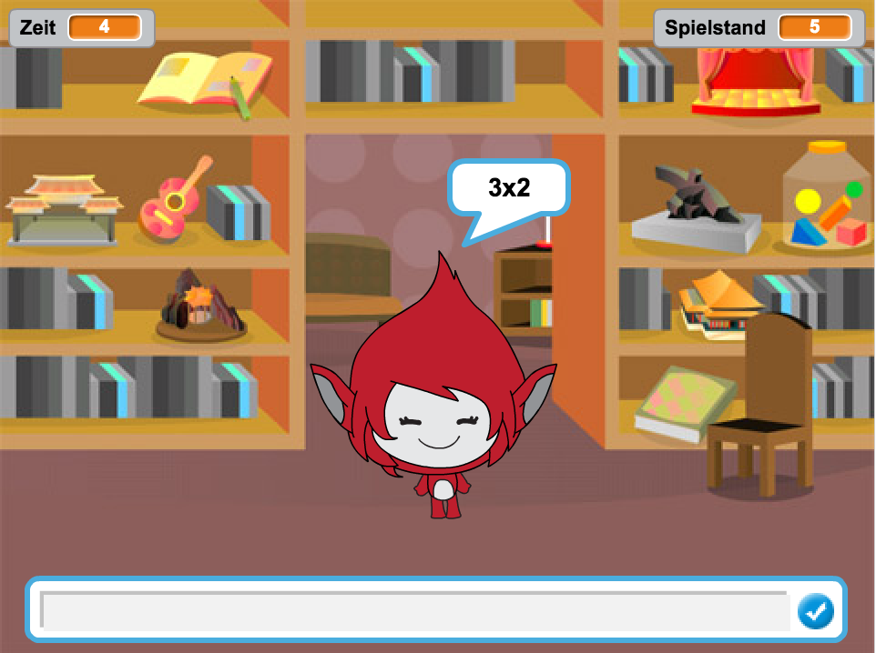
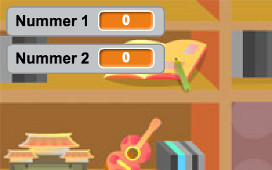
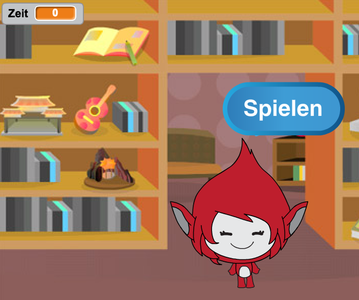
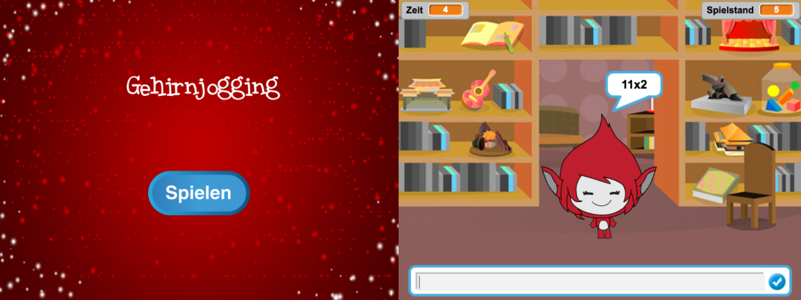
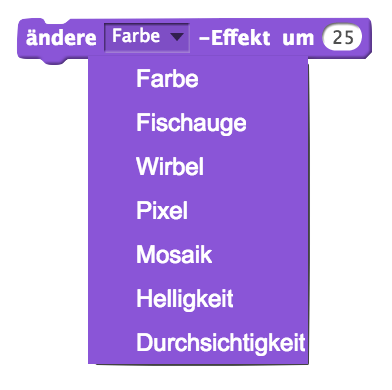

# Einführung { .intro }

In diesem Projekt lernst du, wie man ein Multiplikations-Quiz produziert, in dem man so viele Fragen wie möglich innerhalb von 30 Sekunden richtig beantworten musss.

<div class="scratch-preview">
  <iframe allowtransparency="true" width="485" height="402" src="https://scratch.mit.edu/projects/embed/42225768/?autostart=false" frameborder="0"></iframe>
  
</div>

# Schritt 1: Fragen zusammenstellen { .activity }

Lass uns damit beginnen, ein paar beliebig ausgewählte Fragen zusammenzustellen, die der Spieler beantworten muss.

## Aktivitäts-Checkliste { .check }

+ Starte ein neues Scratch Projekt und lösche das Katzen-Sprite, damit dein Projekt leer ist. Du findest den online Scratch Editor unter <a href="http://jumpto.cc/scratch-new" target="_blank">jumpto.cc/scratch-new</a>.

+ Wähle eine Spielfigur und einen Hintergrund für dein Spiel aus. Du kannst dir aussuchen, was du möchtest! Hier ist ein Beispiel:

	

+ Erstelle 2 neue Variablen namens `number 1` {.blockdata} (Zahl 1) und `number 2` {.blockdata} (Zahl 2). Diese Variablen speichern die beiden Zahlen, die miteinander multipliziert werden sollen.

	

+ Füge den Code zu deiner Spielfigur hinzu, um beide diese Variablen auf eine Zufallszahl `random` {.blockoperators} zwischen 2 und 12 einzustellen.

	```blocks
		Wenn die grüne Flagge angeklickt
		setze [number 1 v] auf (Zufallszahl von (2) bis (12))
		setze [number 2 v] auf (Zufallszahl von (2) bis (12))
	```

+ Du kannst dann den Spieler nach der Antwort fragen und ihn wissen lassen, ob er richtig oder falsch geantwortet hat.

	```blocks
		Wenn die grüne Flagge angeklickt
		setze [number 1 v] auf (Zufallszahl von (2) bis (12))
		setze [number 2 v] auf (Zufallszahl von (2) bis (12))
		frage (verbinde (number 1) (verbinde [x] (number 2))) und warte
		falls <(Antwort) = ((number 1) * (number 2))> dann
  			sage [Ja! :)] für (2) Sek.
		sonst
   			sage [Nein :(] für (2) Sek.
		Ende
	```

+ Teste dein Projekt vollständig, indem du eine Frage richtig und eine Frage falsch beantwortest.

+ Füge eine `forever` {.blockcontrol} (für immer) Schleife um diesen Code herum hinzu, damit dem Spieler viele Fragen gestellt werden.

+ Erstelle einen Countdown-Zähler in diesem Stadium, der eine Variable namens `time` {.blockdata} (Zeit) benutzt. Das 'Ghostbusters' Projekt beinhaltet Anweisungen darüber, wie man einen Zähler herstellt (in Schritt 5), falls du Hilfestellung benötigst!

+ Teste dein Projekt erneut: Du solltest jetzt in der Lage sein, weitere Fragen zu stellen, bis die Zeit abgelaufen ist.

## Projekt speichern { .save }

## Aufgabe: Kostüm ändern {.challenge}
Kannst du das Kostüm deiner Spielfigur ändern, sodass sie auf die Antwort des Spielers reagiert?


## Aufgabe: Eine Punktzahl hinzufügen {.challenge}
Kannst du deinem Spiel eine Punktzahl hinzufügen? Du kannst einen Punkt für jede korrekt beantwortete Frage hinzufügen. Wenn du gemein bist, könntest du auch die Punktzahl des Spielers wieder zurück auf 0 stellen, falls er eine Frage falsch beantwortet hat!

## Projekt speichern { .save }

# Schritt 2: Mehrfache Spiele { .activity .new-page}

Lass uns eine 'play' (spielen) Taste zu deinem Spiel hinzufügen, damit du es mehrmals spielen kannst.

## Aktivitäts-Checkliste { .check }

+ Erstelle ein neues 'Play' Sprite als Taste, welche dein Spieler klicken muss, um ein neues Spiel zu beginnen. Du kannst es entweder selbst zeichnen oder ein Sprite aus der Scratch Bibliothek bearbeiten.

	

+ Füge diesen Code zu deiner neuen Taste hinzu.

	```blocks
		wenn die Flagge geklickt wird
		zeigen

		wenn dieses Sprite geklickt wird
		verstecken
		[Start V] senden
	```

	Dieser Code zeigt die „Spiel“ Taste, wenn dein Projekt gestartet wird. Wenn die Taste geklickt wird, wird sie versteckt und sendet dann eine Meldung, die das Spiel starten wird.

+ Du musst den Code deiner Spielfigur bearbeiten, damit das Spiel beginnt, wenn die Figur die `start` {.blockevents} Startmeldung erhält und nicht erst wenn die Flagge geklickt wird.

	Ersetze den Code `when flag clicked` {.blockevents} (wenn Flagge geklickt wird) mit `when I receive start` {.blockevents} (wenn ich den Start erhalte).

	

+ Klicke die grüne Flagge und klicke auf deine neue Spieltaste, um es zu testen. Du solltest sehen können, dass das Spiel nicht startet, bis die Taste geklickt wird.

+ Hast du gemerkt, dass die Zeituhr erst startet, wenn die grüne Flagge geklickt wird und nicht, wenn das Spiel beginnt?

	

	Kannst du dieses Problem beheben?

+ Klicke auf das Stadium und ersetze den `stop all` {.blockcontrol} (alles stoppen) Block mit einer `end` {.blockevents} (beenden) Meldung.

	

+ Du kannst jetzt den Code zu deiner Taste hinzufügen, um sie bei Spielende erneut zu zeigen.

	```blocks
		Wenn ich [Ende v] empfange
		zeige dich
	```

+ Du musst auch deine Spielfigur beenden, damit sie keine weiteren Fragen bei Spielende stellt:

	```blocks
		Wenn ich [Ende v] empfange
		stoppe [andere Skripte der Figur v]
	```

+ Teste deine Spieltaste, indem du ein paar Spiele spielst. Du solltest jetzt merken können, dass die Spieltaste nach jedem Spiel angezeigt wird. Um das Testen leichter zu machen, kannst du jedes Spiel abkürzen, damit es nur ein paar Sekunden dauert.

	```blocks
		setze [time v] auf [10]
	```

+ Du kannst auch ändern, wie die Taste aussieht, wenn die Maus darüber gleitet.

	```blocks
		Wenn die grüne Flagge angeklickt
		zeige dich
		wiederhole fortlaufend
   		falls <wird [Mauszeiger v] berührt?> dann
      		setze [Fischauge v]-Effekt auf (30)
   		sonst
      		setze [Fischauge v]-Effekt auf (0)
   		Ende
	Ende
	```

	

## Projekt speichern { .save }

## Aufgabe: Start-Bildschirm {.challenge}
Kannst du einen weiteren Hintergrund zu deinem Stadium hinzufügen, welcher der Start-Bildschirm deines Spiels sein wird? Du kannst die `when I receive start` {.blockevents} (wenn ich den Start-Block erhalte) und `when I receive end` {.blockevents} (wenn ich den Beenden-Block erhalte) benutzen, um zwischen dem Hintergund hin- und herzuschalten.

Mit Hilfe dieser Blöcke kannst du deine Spielfigur entweder zeigen oder auch verstecken und sogar die Zeituhr entweder zeigen oder auch verstecken:

```blocks
zeige Variable [time v]
```
```blocks
verstecke Variable [time v]
```



## Projekt speichern { .save }

# Schritt 3: Grafik hinzufügen { .activity .new-page}

Anstatt, dass deine Spielfigur nur `yes! :)` (Ja!) oder `nope :(` (Nein) zum Spieler sagt, können wir jetzt Grafik hinzufügen, damit der Spieler weiß, wie es um ihn bestellt ist.

+ Erstelle ein neues Sprite namens 'Result' (Ergebnis), das Kostüme mit entweder einem 'tick' (Häkchen) oder einem 'cross' (Kreuz) enthält.

	

+ Ändere den Code deiner Spielfigur, damit du, statt nur dem Spieler mitzuteilen, welchen Punktestand er erreicht hat, ihm statt dessen auch die entsprechenden `correct` {.blockevents} (richtig) und `wrong` {.blockevents} (falsch) Meldungen senden kannst.

	

+ Du kannst jetzt diese Meldungen dazu benutzen, um entweder das 'tick' (Häkchen) oder das 'cross' (Kreuz) Kostüm anzuzeigen. Füge diesen Code zu deinem neuen 'Result' (Ergebnis) Sprite hinzu:

	

+ Teste dein Spiel erneut. Du solltest ein Häkchen sehen können, wannimmer du eine Frage richtig beantwortet hast und ein Kreuz, wannimer du eine Frage falsch beantwortet hast.

	

+ Hast du gemerkt, dass der Code für die `when I receive correct` {.blockevents} (wenn ich richtig geantwortet habe) und `when I receive wrong` {.blockevents} (wenn ich falsch geantwortet habe) Blöcke nahezu identisch ist? Lass uns eine Funktion erstellen, damit es leichter für dich ist, Änderungen an deinem Code vorzunehmen.

	Klicke `More Blocks` {.blockmoreblocks} (weitere Blöcke) auf deinem 'Result' (Ergebnis) Sprite und 'Make a Block' (Block herstellen), stelle dann einen weiteren Block her. Erstelle eine neue Funktion namens `animate` {.blockmoreblocks} (animieren).

	

+ Du kannst dann den Animationscode zu deiner neuen Animationsfunktion hinzufügen und dann die Funktion zweimal benutzen:

	

+ Jetzt brauchst du dann nur eine Veränderung an deinem Code vorzunehmen, wenn du das Häkchen oder das Kreuz für längere, bzw. kürzere Zeit anzeigen möchtest. Probier es mal!

+ Anstatt das Häkchen und das Kreuz entweder nur zu zeigen oder zu verstecken, kannst du auch die Animationsfunktion ändern, damit die Grafik eingeblendet wird.

	```blocks
		Definiere [object Object]
		setze [Durchsichtigkeit v]-Effekt auf (100)
		zeige dich
		wiederhole (25) mal
  		ändere [Durchsichtigkeit v]-Effekt um (-4)
		Ende
		verstecke dich
	```

## Projekt speichern { .save }

## Aufgabe: Verbesserte Animation {.challenge}
Kannst du die Animation deiner Grafik verbessern? Du könntest das Häkchen und das Kreuz so programmieren, dass sie ein- oder ausblenden. Oder du könntest andere coole Effekte benutzen:



## Projekt speichern { .save }

## Aufgabe: Sound und Musik {.challenge}
Kannst du Sound-Effekte und Musik zu deinem Spiel hinzufügen? Zum Beispiel:

+ Du könntest einen Sound spielen, wenn der Spieler eine Frage entweder richtig oder falsch beantwortet;
+ Du könntest einen tickenden-Uhr-Sound zu deinem Countdown-Zähler hinzufügen;
+ Du könntest einen Sound spielen, wenn die Zeit abgelaufen ist;

	```blocks
		spiele Schlaginstrument (10 v) für (0.1) Schläge
	```

+ Du kannst auch konstant Musik in einer Schleife spielen (wenn du nicht mehr genau weißt, wie das geht, wird dir Schritt 4 des 'Rock Band' Projekts hierbei als Erinnerungshilfe dienen).

## Projekt speichern { .save }

## Aufgabe: Wettrennen zu 10 Punkten {.challenge}
Kannst du dein Spiel ändern, damit (statt so viele Fragen wie möglich innerhalb von 30 Sekunden richtig zu beantworten) der Spieler sehen kann, wie schnell er 10 Fragen richtig beantworten kann?

Um dies zu tun brauchst du nur den Code deiner Zeituhr zu ändern. Kannst du sehen, was geändert werden muss?

```blocks
	Wenn ich [start v] empfange
	setze [time v] auf (30)
	wiederhole bis <(time) = [0]>
   		warte (1) Sek.
   		ändere [time v] um (-1)
	Ende
	sende [Ende v] an alle
```

## Projekt speichern { .save }

## Aufgabe: Anweisungsbildschirm {.challenge}
Kannst du einen Anweisungsbildschirm zu deinem Spiel hinzufügen und deinem Spieler mitteilen, wie das Spiel gespielt wird? Du brauchst eine 'Instructions' (Anweisungen) Taste und einen weiteren Stadium Hintergrund.


Du wirst eventuell auch eine 'Back' (Zurück) Taste benötigen, um wieder zum Hauptmenü zurückzugelangen.

```blocks
	sende [main menu v] an alle
```

## Projekt speichern { .save }
