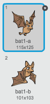
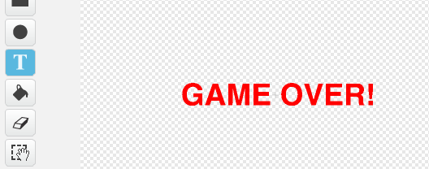
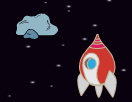

# Introduction { .intro }

In diesem Projekt lernst du, wie man ein Spiel erstellt, in dem du den Planet Erde vor Weltraummonstern retten musst.

<div class="scratch-preview">
  <iframe allowtransparency="true" width="485" height="402" src="https://scratch.mit.edu/projects/embed/46018140/?autostart=false" frameborder="0"></iframe>
  
</div>

# Schritt 1: Ein Raumschiff bauen { .activity }

Lass uns als erstes ein Raumschiff bauen, das die Erde verteidigen wird!

## Aktivitäts-Checkliste { .check }

+ Starte ein neues Scratch Projekt und lösche das Katzen- Sprite, damit dein Projekt leer ist. Du findest den online Scratch Editor unter <a href="http://jumpto.cc/scratch-new" target="_blank">jumpto.cc/scratch-new</a>.

+ Füge den 'stars' (Sterne) HIntergrund und das 'Spaceship' (Raumschiff) Sprite zu deinem Projekt hinzu. Schrumpfe dein Raumschiff und bewege es zum unteren Teil deines Bildschirms.

	

+ Füge den Code hinzu, um dein Raumschiff nach links zu bewegen, wenn die linke Pfeiltaste betätigt wird. Du musst diese Blöcke hierfür benutzen:

	```Blöcke
		wenn Flagge geklickt wurde
		für immer
			wenn <[linker Pfeil V] Taste gedrückt wurde?> dann
				x um (-4) ändern
			beenden
		beenden
	```

+ Füge den Code hinzu, um dein Raumschiff nach rechts zu bewegen wenn die rechte Pfeiltaste gedrückt wird.

+ Teste dein Projekt, um zu sehen, ob du dein Raumschiff mit den Pfeiltasten steuern kannst.

## Projekt speichern { .save }

# Schritt 2: Blitze { .activity }

Lass uns dem Raumschiff die Fähigkeit verleihen, Blitze abzufeuern!

## Aktivitäts-Checkliste { .check }

+ Füge das 'Lightning' (Blitze) Sprite von der Scratch Bibliothek hinzu.  Wenn das Spiel beginnt, sollten die Blitze erstmal versteckt bleiben bis das Raumschiff seine Laser-Kanonen feuert. Das Sprite muss viel kleiner und kopfüber sein. Füge den folgenden Code zum 'Lightning' (Blitze) Sprite hinzu.

	```Blöcke
		wenn grüne Flagge geklickt wurde
		verstecken
		Größe auf (25) % einstellen
		in Richtung (-90 V) zeigen	
	```


+ Füge den folgenden Code **to the Spaceship** (zum Raumschiff hinzu), um einen neuen Blitz zu erzeugen, wannimmer die Leertaste gedrückt wird.


	```Blöcke
		wenn Flagge geklickt wurde
		für immer
			wenn < [Leertaste V] Schlüssel gedrückt wird?> dann
				Klon von [Blitz V] erstellen
			beenden
		beenden
	```

+ Wannimmer ein neuer Klon erstellt wird, sollte er am gleichen Ort wie das Raumschiff beginnen und dann das Stadium hoch gehen bis er die Kante berührt. Füge den folgenden Code **to the Lightning sprite** (zum Blitze-Sprite hinzu):

	```Blöcke
		wenn ich als Klon beginne
		gehe zu [Raumschiff V]
		zeigen
		wiederholen bis < [Kante V] berührt wird ?>
			y um (10) ändern 
		beenden
		diesen Klon löschen
	```

Hinweis: Wir bewegen den neuen Klon zum Raumschiff hin, während es immer noch versteckt ist, ehe wir es dann zeigen. Das sieht schöner aus.

+ Teste deine Blitze, indem du die Leertaste drückst.

## Projekt speichern { .save }

## Aufgabe: Die Blitze ausbessern {.challenge}
Was passiert, wenn du die Leertaste gedrückt hältst? Kannst du einen `wait` {.blockcontrol} Block einschieben, um dies zu beheben?

## Projekt speichern { .save }

# Schritt 3: Fliegende Weltraum-Nilpfherde { .activity }

Lass uns jetzt ganz viele, fliegende Weltraum-Nilpferde, die versuchen, dein Raumschiff zu zerstören, hinzufügen.

## Aktivitäts-Checkliste { .check }

+ Erstelle ein neues Sprite vom 'Hippo1' (Nilpferd 1) Bild in der Scratch Bibliothek.

	

+ Stelle dessen Rotationsstil so ein, dass es sich nur links-rechts drehen kann und füge den folgenden Code hinzu, um das Sprite zu verstecken, wenn das Spiel beginnt:

	```Blöcke
		wenn Flagge geklickt wurde
		verstecken
	```

+ Erstelle eine neue Variable namens `speed` {.blockdata} (Geschwindigkeit), die nur für das Nilpferd- Sprite gedacht ist.

	

	Du wirst wissen, ob du es richtig gemacht hast, weil der Name für die Variable des Sprites daneben stehen wird:

	

+ Der folgende Code erzeugt alle paar Sekunden ein neues Nilpferd. **The Stage** (Das Stadium) ist ein guter Platz zur Aufbewahrung dieses Codes:

	```Blöcke
		wenn Flagge geklickt wurde
		für immer
			warten (zufällig (2) bis (4) Sek. wählen)
			Klon von [Nilpferd1 V] erstellen
		beenden
	```

+ Wenn jeder Nilpferd-Klon beginnt, lasse ihn sich (bei zufällig ausgewählter Geschwindigkeit) rund herum um das Stadium bewegen bis das Nilpferd vom Blitz getroffen wird. Füge diesen Code **to the hippo**  (zum Nilpferd) Sprite hinzu:

	```Blöcke
		wenn ich als Klon beginne
		[Geschwindigkeit V] auf (zufällig (2) bis (4) wählen) einstellen
		gehe zu x: (zufällig (-220) bis (220) wählen) y: (150)
		zeigen
		wiederholen bis < [Blitz V] berührt ?>
			(Geschwindigkeit) Schritte bewegen
			nach rechts gehen (zufällig (-10) bis (10) Grad wählen) 
			wenn an der Kante, abprallen
		beenden
		diesen Klon löschen
	```

+ Teste deinen Nilpferd-Code. Du solltest alle paar Sekunden einen neuen Nilpferd-Klon sehen können, jeder davon bewegt sich zu seiner eigenen Geschwindigkeit.

	

+ Teste deine Laser-Kanone. Wenn du ein Nilpferd triffst, verschwindet es dann?

+ Wenn ein Nilpferd dein Raumschiff berührt, müssen wir dein Raumschiff dazu bringen, dass es explodiert! Um dies zu erreichen, müssen wir als erstes gewährleisten, dass dein Raumschiff 2 Kostüme namens 'normal' (normal) und 'hit' (wurde getroffen) hat.

	

	Das 'hit' (wurde getroffen) Kostüm des Raumschiffs kann erstellt werden durch den Import des 'Sun' (Sonne) Bildes aus der Scratch Bibliothek und anschließend das 'Color a shape' (eine Form bemalen) Tool benutzen, um dessen Farbe zu ändern.

	

+ Füge diesen Code zu deinem Raumschiff hinzu, damit  es jedes Mal, wenn es mit einem fliegenden Nilpferd zusammenstößt, sein Kostüm ändert:

	```Blöcke
		wenn Flagge geklickt wurde
		für immer
			Kostüm ändern zu [Normal V]
			warten bis < [Nilpferd1 V] berührt>?
			Kostüm ändern zu [wurde getroffen V]
			[wurde getroffen V] senden
			(1) Sek. warten
		beenden
	```

+ Hast du bemerkt, dass du in dem o.g. Code eine 'hit' (wurde getroffen) Meldung gesendet hast? Du kannst diese Meldung benutzen, um alle Nilpferde verschwinden zu lassen, wenn das Raumschiff getroffen wurde.

	Füge diesen Code zu deinem Nilpferd hinzu:

	```Blöcke
		wenn ich [wurde getroffen V] erhalten habe
		diesen Klon löschen
	```

+ Teste diesen Code, indem du ein neues Spiel beginnst und mit einem Nilpferd kollidierst. 

	

## Projekt speichern { .save }

## Aufgabe: Leben und Punktzahl {.challenge}
Kannst du `lives` {.blockdata} (Leben), `score` {.blockdata} (Punktzahl) oder sogar eine `highscore` {.blockdata} (hohe Punktzahl) zu deinem Spiel hinzufügen? Du kannst das 'Catch the Dots' (Fang die Punkte) Projekt als Hilfestellung hierfür benutzen.

## Projekt speichern { .save }

# Schritt 4: Flughunde! { .activity }

Lass uns einen Flughund kreieren, der Orangen auf dein Raumschiff wirft.

## Aktivitäts-Checkliste { .check }

+ Lass uns als erstes ein neues Fledermaus-Sprite herstellen, das sich  `forever` {.blockcontrol} (für immer) über dem oberen Teil des Stadiums `move` {.blockmotion} (bewegt).  Denke daran, deinen Code zu testen!

	

+ Wenn du dir die Kostüme der Fledermaus ansiehst, wirst du sehen, dass sie bereits 2 hat:

	

	Benutze den `next costume` {.blocklooks} (nächstes Kostüm) Block, damit die Fledermaus mit den Flügeln schlägt, während sie sich bewegt.

+ Erstelle in der Scratch Bibliothek ein neues 'Orange' Sprite.

	


+ Füge den Code für deine Fledermaus hinzu, damit sie alle paar Sekunden einen neuen, orange-farbenen Klon herstellt.

	```Blöcke
		wenn Flagge geklickt wurde
		für immer
			warten (zufällig (5) bis (10) Sek. wählen)
			Klon von [Orange V] herstellen
		beenden
	```

+ Klicke auf dein orange-farbenes Sprite und füge diesen Code hinzu, damit jeder orange-farbene Klon das Stadium von der Fledermaus zum Raumschiff hin hinunterfällt:

	```Blöcke
		wenn Flagge geklickt wurde
		verstecken

		wenn ich als Klon beginne
		gehe zu [Fledermaus1 V]
		zeigen
		wiederholen bis <[Kante V] berührt?
			y um (-4) ändern
		beenden
		diesen Klon löschen

		wenn ich [wurde getroffen V] erhalten habe
		diesen Klon löschen
	```

+ In deinem Raumschiff-Sprite musst du deinen Code modifizieren, damit du getroffen wirst, wenn du ein Nilpferd oder eine Orange berührst:

	```Blöcke
		warten bis < <[Nilpferd1 V] berührt?> oder <[Orange V] berührt?>>
	``` 

+ Teste dein  Spiel. Was passiert, wenn du von einer herabfallenden Orange getroffen wirst?

## Projekt speichern { .save }

# Schritt 5: Game Over { .activity }

Lass uns eine 'game over' (Spiel-Ende) Meldung zum Ende des Spiel hinzufügen.

## Aktivitäts-Checkliste { .check }

+ Falls du es noch nicht getan hast, musst du jetzt eine neue Variable namens `lives` {.blockdata} (Leben) erstellen. Dein Raumschiff sollte mit 3 Leben starten und immer ein Leben verlieren, sobald es mit einem Feind zusammenstlößt. Dein Spiel sollte ebenfalls beendet werden, sobald du alle deine Leben verloren hast. Wenn du hierbei Hilfestellung benötigst, kannst nochmal in das 'Catch the Dots' (Fang die Punkte) Projekt schauen.

+ Zeichne ein neues Sprite namens 'Game Over' mit Hilfe des Text Tools.

	

+ Sende eine `game over` {.blockevents} Meldung in deinem Stadium kurz bevor das Spiel aus ist.

	```Blöcke
		[ Game Over V] senden und warten
	```

+ Füge diesen Code zu deinem 'Game Over' Sprite hinzu, damit die Meldung bei Spiel-Ende angezeigt wird:

	```Blöcke
		wenn Flagge geklickt wurde
		verstecken

		wenn ich [ Game Over V] erhalte
		zeigen
	```

	Weil du einen Block mit `broadcast [ Game over] and wait` {.blockevents} (Game Over und Warten Meldung) in deinem Stadium benutzt hast, wird es darauf warten, dass das 'Game Over' Sprite angezeigt wird, ehe das Spiel beendet wird.

+ Teste dein  Spiel. Wie viele Punkte kannst zu erzielen? Kannst du an Wege denken, dein Spiel zu verbessern, falls es zu einfach oder zu schwer sein sollte?

## Projekt speichern { .save }

## Aufgabe: Verbessere dein  Spiel {.challenge}
Welche Verbesserungen kannst du bei deinem Spiel vornehmen? Hier sind ein paar Ideen:

+ Füge ein paar Booster-Packs hinzu, die du sammeln kannst, um weitere Leben zu erhalten;


+ Füge frei-schwebende Meteoriten hinzu, denen dein Raumschiff ausweichen muss;
	


+ Lass noch mehr Feinde erscheinen, wenn deine Punktzahl auf 100 ansteigt.

```Blöcke
	warten bis <(Punktzahl) = [100]>
```

## Projekt speichern { .save }
