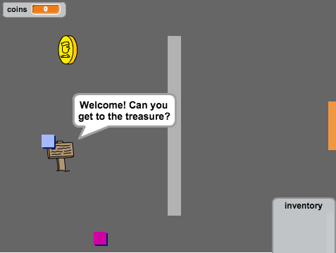
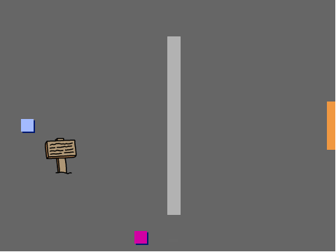
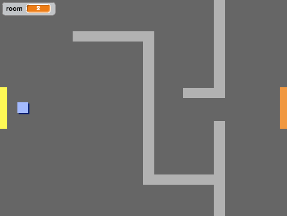
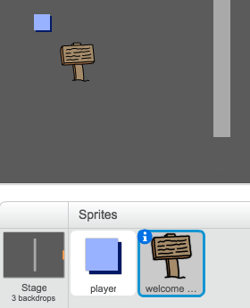
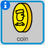

# Einführung { .intro }

In diesem Projekt lernst du, wie du dein eigenes Open-World Abenteuerspiel anfertigen kannst.

<div class="scratch-preview">
  <iframe allowtransparency="true" width="485" height="402" src="https://scratch.mit.edu/projects/embed/34248822/?autostart=false" frameborder="0"></iframe>
  
</div>

# Schritt 1: Programmiere deinen Spieler { .activity }

Lass uns damit beginnen, einen Spieler zu erstellen, der sich rund um deine Welt bewegen kann.

## Aktivitäts-Checkliste { .check }

+ Öffne das 'Create Your Own World' (Erstelle deine eigene Welt) Scratch Projekt online unter <a href="http://jumpto.cc/world-go" target="_blank">jumpto.cc/world-go</a> oder lade es von <a href="http://jumpto.cc/world-get" target="_blank">jumpto.cc/world-get</a> herunter und öffne es dann, wenn du den offline Editor benutzt.

	

+ Lass uns die Pfeiltasten benutzen, um den Spieler rund ums Spielfeld zu bewegen. Wenn der Spieler die Pfeil-hoch-Taste drückt, dann willst du, dass der Spieler nach oben geht, indem wir dessen y-Koordinaten ändern. Füge diesen Code zum `player` (Spieler) Sprite hinzu:

	```blocks
		Wenn die grüne Flagge angeklickt
		wiederhole fortlaufend
   			falls <Taste [Pfeil nach oben v] gedrückt?> dann
      			ändere y um (2)
   			Ende
		Ende
	```

+ Teste deinen Spieler, indem du auf die Flagge klickst und dann die Pfeil-hoch-Taste gedrückt hältst. Bewegt sich dein Spieler nach oben?

	

+ Um den Spieler nach links zu bewegen, musst du einen weiteren `if` {.blockcontrol} (wenn) Block zu deinem Spieler hinzufügen, welcher dann die x-Koordinaten ändert:

	```blocks
		Wenn die grüne Flagge angeklickt
		wiederhole fortlaufend
  			falls <Taste [Pfeil nach oben v] gedrückt?> dann
      			ändere y um (2)
   			Ende
   			falls <Taste [Pfeil nach links v] gedrückt?> dann
      			ändere x um (-2)
   			Ende
		Ende
	```

## Aufgabe: Sich in alle vier Richtungen bewegen {.challenge}
Kannst du noch mehr Code zu deinem Spieler hinzufügen, damit er sich nach oben, nach unten, nach links oder nach rechts bewegen kann. Benutze den Code, den du bereits hast, um dir hierbei zu helfen!

## Projekt speichern { .save }

+ Teste deinen Spieler erneut und du wirst sehen, dass er die Fähigkeit hat, durch die hellgrauen Wände durchzugehen.

	

+ Um dieses Problem zu beheben, musst du den Spieler bewegen, aber ihn dann zurück bewegen, wenn er eine hellgraue Wand berührt. Hier ist der Code den du brauchst:

	```blocks
		Wenn die grüne Flagge angeklickt
		wiederhole fortlaufend
   			falls <Taste [Pfeil nach oben v] gedrückt?> dann
      			ändere y um (2)
      			falls <wird Farbe [#BABABA] berührt?> dann
         			ändere y um (-2)
      			Ende
   			Ende
		Ende
	```

	Hast du gemerkt, dass der neue `if`{.blockcontrol} (wenn) `touching color`{.blocksensing} (Farbe berührt) Block sich _innerhalb_ des `if`{.blockcontrol} (wenn) `key [up arrow]`{.blocksensing} (Schlüssel [Pfeil hoch]) Blocks befindet?

+ Teste diesen neuen Code, indem du unter die Wand gehst (du solltest nicht in der Lage sein, in die Wand hoch zu gehen).

	

+ Lass uns das Gleiche für die linke Pfeiltaste tun, gehe zurück, wenn der Spieler eine Wand berührt. Hier ist, wie der Code für deinen Spieler bislang aussehen sollte:

	

## Aufgabe: Repariere die Bewegung deines Spielers {.challenge}
Füge Code zu deinem Spieler hinzu, damit er nicht in jede Richtung durch die Wand laufen kann. Benutze den Code, den du bereits hast, um dir hierbei zu helfen!

## Projekt speichern { .save }

# Schritt 2: Programmiere deine Welt { .activity }

Lass uns jetzt ermöglichen, dass der Spieler durch die Türen in ein anderes Zimmer gelangen kann!

## Aktivitäts-Checkliste { .check }

+ Dein Projekt enthält bereits den Hintergrund für weitere Zimmer:

	

+ Du brauchst eine neue 'for all sprites' (für alle Sprites) Variable namens `room` {.blockdata} (Zimmer), um mitverfolgen zu können, in welchem Zimmer sich der Spieler gerade aufhält. 

	

+ Wenn der Spieler die orange-farbene Tür im ersten Zimmer berührt, sollte der nächste Hintergrund angezeigt werden und der Spieler sollte sich zurück zur linken Seite des Stadiums bewegen. Hier ist der Code, den du hierfür brauchst: Er sollte innerhalb der `forever` {.blockcontrol} (für immer) Schleife des Spielers eingefügt werden:

	```blocks
		falls <wird Farbe [#F2A24A] berührt?> dann
   			wechsle zu Bühnenbild [nächstes Bühnenbild v]
   			gehe zu x:(-200) y:(0)
   			ändere [room v] um (1)
		Ende
	```

+ Füge diesen Code zum _Start_ deines Spieler-Codes hinzu, (vor der `forever` {.blockcontrol} (für immer) Schleife), um zu gewährleisten, dass alles wieder auf Null gestellt wird, wenn die Flagge angeklickt wird:

	```blocks
		setze [room v] auf (1)
		gehe zu x:(-200) y:(0)
		wechsle zu Bühnenbild [room1 v]
	```

+ Klicke die Flagge und bewege deinen Spieler über die orange-farbene Tür. Geht dein Spieler zum nächsten Bildschirm hinüber? Ändert sich die `room` {.blockdata} Zimmer-Variable zu 2?

	

## Aufgabe: Ins vorherige Zimmer gehen {.challenge}
Kannst du deinen Spieler ins vorherige Zimmer bewegen, wenn er eine gelbe Tür berührt? Denke daran, dass dieser Code _sehr_ ähnlich sein wird wie der Code, den du bereits hinzugefügt hast, um ins nächste Zimmer zu gelangen.

## Projekt speichern { .save }

# Schritt 3: Schilder { .activity }

Lass uns Schilder zu deiner Welt hinzufügen, um eine Wegweisung für deinen Spieler auf seiner Reise zu bereiten.

## Aktivitäts-Checkliste { .check }

+ Dein Projekt beinhaltet ein Willkommens- Schild Sprite:

	

+ Dieses Schild ist nur in Zimmer 1 sichtbar, lass uns jetzt noch weiteren Code zum Schild hinzufügen, um zu gewährleisten, dass dies passiert:

	```blocks
		Wenn die grüne Flagge angeklickt
		wiederhole fortlaufend
   			falls <(room) = [1]> dann
      			zeige dich
   			sonst
      			verstecke dich
   			Ende
		Ende
	```

+ Teste dein Schild, indem du zwischen den Zimmern hin- und hergehst. Dein Schild sollte nur in Zimmer 1 sichtbar sein.

	

+ Ein Schild nützt aber nicht viel, wenn nichts darauf steht! Lass uns weiteren Code (in einem separaten Block) hinzufügen, um eine Meldung anzuzeigen, wenn das Schild den Spieler berührt:

	```blocks
		Wenn die grüne Flagge angeklickt
		wiederhole fortlaufend
   			falls <wird [player v] berührt?> dann
      			sage [Willkommen! Kannst du den Schatz finden?]
   			sonst
      			sage []
   			Ende
		Ende
	```
+ Teste dein Schild und du solltest eine Meldung sehen können, wenn der Spieler es berührt.

	

## Projekt speichern { .save }

## Aufgabe: Schatz gefunden! {.challenge}
Klicke mit der rechten Maustaste auf das Schatzkisten-Sprite und wähle 'show' (zeigen). 

Kannst du es veranlassen, dass das Schatzkisten-Sprite nur in Zimmer 3 erscheint und dann 'Well done!' (Gut gemacht!) sagen, wenn der Spieler die Kiste berührt?


## Projekt speichern { .save }

# Schritt 4: Leute { .activity }

Lass uns weitere Leute zu deiner Welt hinzufügen zu denen dein Spieler Umgang hat.

## Aktivitäts-Checkliste { .check }

+ Füge diesen Code zum Personen-Sprite hinzu, sodass diese Person mit deinem Spieler spricht. Dieser Code ist sehr ähnlich zu dem Code, den du bereits zu deinem Schild hinzugefügt hast:

	```blocks
		Wenn die grüne Flagge angeklickt
		gehe zu x:(0) y:(-150)
		wiederhole fortlaufend
   			falls <wird [player v] berührt?> dann
      			sage [Wusstest du, dass du durch orange-farbene und gelb-farbene Türen gehen kannst?]
   			sonst
      			sage []
   			Ende
		Ende
	```

+ Du könntest deiner Person auch erlauben, sich zu bewegen, indem du diese beiden Blöcke benutzt:

	```blocks
		gehe (1) er-Schritt
		pralle vom Rand ab
	```

	Deine Person wird anders handeln, je nachdem, ob du diesen Code in der `forever` {.blockcontrol} (für immer)Schleife oder in dem `if` {.blockcontrol} (wenn) Block platzierst. Probier beides mal aus, um zu sehen, welches davon dir besser gefällt.

	

+ Hast du bemerkt, dass deine Person sich kopfüber dreht? Um dies zu stoppen, klicke auf das Informationssymbol (`i`{.blockmotion}) des Sprites und klicke auf den Punkt, um den Drehungsstil zu reparieren.

	

## Aufgabe: Verbessere deine Person {.challenge}
Kannst du weiteren Code zu deiner neuen Person hinzufügen, sodass sie nur in Zimmer 1 erscheint? Achte darauf, dass du deinen neuen Code testest!

## Projekt speichern { .save }

+ Du kannst auch ein paar patroullierende Feinde hinzufügen, die das Spiel automatisch beenden, wenn der Spieler sie berührt. Füge ein neues Feind-Sprite hinzu und ändere den Drehungsstil, genau so, wie du es mit dem 'person' Sprite getan hast.

+ Füge den Code zu deinem Feind hinzu, damit er nur in Zimmer 2 erscheint.

+ Du wirst auch Code hinzufügen müssen, um den Feind bewegen zu können und um das Spiel zu beenden, wenn der Feind den Spieler berührt. Es ist leichter, dies in separaten Code-Blöcken zu tun. Hier ist, wie dein Feind-Code aussehen sollte:

	

+ Teste deinen Feind, um sicher zu stellen, dass:
	+ er nur in Zimmer 2 sichtbar ist;
	+ er das Zimmer patroulliert;
	+ das Spiel endet, wenn der Spieler berührt wurde.

## Projekt speichern { .save }

## Aufgabe: Noch mehr Feinde {.challenge}
Kannst du einen weiteren Feind in Zimmer 3 hinzufügen, der durch die Spalte in der Wand auf- und ab marschiert?


## Projekt speichern { .save }

# Schritt 5: Münzen sammeln { .activity }

## Aktivitäts-Checkliste { .check }

+ Füge eine neue Variable namens `coins` {.blockdata} (Münzen) zu deinem Projekt hinzu.

+ Klicke mit der rechten Maustaste auf das 'coin' (Münzen) Sprite und wähle 'show' (zeigen). 



+ Füge den Code zu deiner Münze hinzu, sodass sie nur in Zimmer 1 erscheint.

+ Füge Code zu deinem Münzen-Sprite hinzu, um 1 zu deinen `coins` {.blockdata} (Münzen) hinzuzufügen, nachdem eine Münze eingesammelt wurde:

	```blocks
		Wenn die grüne Flagge angeklickt
		warte bis <wird [player v] berührt?>
		ändere [coins v] um (1)
		stoppe [andere Skripte der Figur v]
		verstecke dich
	```

	Der Code `stop other scripts in Sprite` {.blockcontrol} (andere Scripts in Sprite stoppen) wird benötigt, damit die Münze nicht länger in Zimmer 1 angezeigt wird, nachdem sie eingesammelt worden ist.

+ Du musst auch Code hinzufügen, um deine `coins` {.blockdata} (Münzen) Variable bei Spielbeginn auf 0 einzustellen.

+ Teste dein Projekt: Das Sammeln deiner Münzen sollte deine Punktzahl zu 1 ändern.

## Aufgabe: Weitere Münzen {.challenge}
Kannst du noch mehr Münzen zu deinem Spiel hinzufügen? Sie können in einem anderen Zimmer platziert werden und manche Münzen könnten sogar von den patroullierenden Feinden bewacht werden.

# Schritt 6: Türen und Schlüssel { .activity }

## Aktivitäts-Checkliste { .check }

+ Bearbeite das Kostüm des Schlüssel-Sprites, damit es blau ist. Klicke mit der rechten Maustaste auf das Schlüssel-Sprite und wähle 'show' (zeigen), damit es im Stadium erscheint. Schalte dein Stadium zu Hintergrund 3 und platziere den Schlüssel irgendwo hin, wo er schwierig zu erreichen ist!

 	

+ Achte darauf, dass dein Schlüssel nur in Zimmer 3 sichtbar ist.

+ Erstelle eine neue Listenvariable namens `inventory` {.blockdata} (Inventar). Dies wird der Ort sein, an dem du all die Gegenstände, die dein Spieler einsammelt, aufbewahrst, bzw. speicherst.

+ Der Code zum Einsammeln des Schlüssels ist sehr ähnlich wie der Code zum Einsammeln der Münzen. Der Unterschied ist, dass du den Schlüssel zu deinem Inventar hinzufügst.

	```blocks
		Wenn die grüne Flagge angeklickt
		warte bis <wird [player v] berührt?>
		füge [blue key] zu [inventory v] hinzu
		stoppe [andere Skripte der Figur v]
		verstecke dich
	```

+ Teste deinen Schlüssel, um zu sehen, ob du ihn einsammeln kannst und ob du ihn zu deinem Inventar hinzufügen kannst. Denke daran, den Code zu deinem Stadium hinzuzufügen und dein Inventar bei Spielbeginn zu leeren.

	```Blöcke
		(lösche (alles v) aus [inventory v]
	```

+ Platziere dein blaues Tür-Sprite quer über der Spalte in den beiden Wänden.

	

+ Füge Code zu deiner Tür hinzu, damit sie nur in Zimmer 3 sichtbar ist.

+ Du wirst auch deine blaue Tür verstecken müssen, damit dein Spieler daran vorbei gehen kann, nachdem du den blauen Schlüssel in deinem Inventar hast.

	```blocks
		Wenn die grüne Flagge angeklickt
		warte bis <[inventory v] enthält [blue key]>
		stoppe [andere Skripte der Figur v]
		verstecke dich
	```

+ Teste dein Projekt und schau, ob du den blauen Schlüssel einsammeln kannst, um die Tür zu öffnen!

## Projekt speichern { .save }

## Aufgabe: Erstelle deine eigene Welt {.challenge}
Du kannst jetzt fortfahren, deine eigene Welt zu erstellen. Hier sind ein paar Vorschläge:

+ Ändere dein Spielumfeld und deine Spielgrafik;
+ Füge Sound und Musik zu deinem Spiel hinzu;
+ Füge weitere Leute, sowie Feinde, Schilder und Münzen hinzu;
+ Füge rote und gelbe Türen hinzu, die ihre eigenen Schlüssel zum Öffnen benötigen;
+ Füge weitere Zimmer zu deiner Welt hinzu;
+ Füge andere, nützliche Gegenstände zu deinem Spiel hinzu;

+ Benutze Münzen, um Informationen von anderen Leuten zu erhalten;

	

+ Du könntest auch Türen im Norden und Süden hinzufügen, damit der Spieler in allen 4 Richtungen zwischen den Zimmern hin- und hergehen kann. Zum Beispiel: Wenn du 9 Zimmer hättest, könntest du sie als ein 3 x 3 Raster betrachten. Du kannst dann die Nummer 3 zur Zimmerzahl hinzufügen, um dich 1 Stufe herunter zu bewegen.

	

## Projekt speichern { .save }

