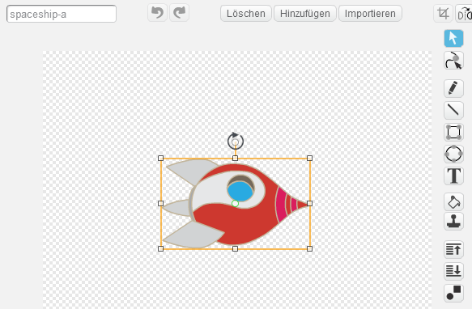
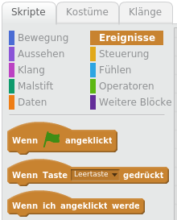

# Einleitung { .intro }

Du wirst lernen, deine eigene Computeranimation zu programmieren!

<div class="scratch-preview">
	<iframe allowtransparency="true" width="485" height="402" src="http://scratch.mit.edu/projects/embed/26818098/?autostart=true" frameborder="0"></iframe>
	
</div>

# Schritt 1: Figuren { .activity }

## Arbeitsschritte { .check }

+ Zuerst musst du sicherstellen, dass du Scratch geöffnet hast. Den online Scratch-Editor findest du auf <a href="http://jumpto.cc/scratch-new">jumpto.cc/scratch-new</a>. Es sollte ungefähr so aussehen:

	

+ Bevor du eine Animation anfangen kannst, musst du zuerst ein „Ding“ einfügen, das animiert werden soll. In Scratch werden diese „Dinge“ als „Figuren“ bezeichnet. Die Katze, die du siehst, ist eine Figur namens Felix, das Maskottchen von Scratch. Lass sie uns löschen, indem wir mit der rechten Maustaste auf die Katze klicken und „Löschen“ wählen.

	

+ Klicke als nächstes auf „Figur aus der Bibliothek wählen“, um eine Liste von allen Figuren zu sehen, die uns in Scratch zur Verfügung stehen.

	

+ Scrolle runter, bis du eine Figur in der Form eines Raumschiffes findest. Klicke auf das Raumschiff, um es zu deiner Animation hinzuzufügen.

	

+ Klicke auf die Raumschiff-Figur, und dann auf „Kostüme“.

	

+ Benutze das Pfeil-Werkzeug, um das ganze Bild auszuwählen. Ziehe dann an dem Griff über dem Bild, um es zu drehen, bis es auf der Seite liegt.

	

+ Du solltest jetzt ein großes Raumschiff auf deiner „Bühne“ sehen. Die „Bühne“ ist der Bereich auf der linken Seite, in dem deine Animation ablaufen wird. Stell dir vor, es wäre eine echte Theaterbühne! Du kannst das Raumschiff auf der Bühne hin- und herziehen, um es zu verschieben.

	Im Augenblick ist die Bühne weiss und sieht ziemlich langweilig aus! Lass uns einen Hintergrund hinzufügen, indem du auf das Symbol „Bühne“ klickst, und dann auf „Bühnenbild aus der Bibliothek wählen“.

	

+ Klicke auf der linken Seite auf „Weltraum“, dann auf den „Stars“-Hintergrund und dann auf „OK“, um deiner Bühne dieses Hintergrundbild zu geben.

	

	Deine Bühne sollte jetzt so aussehen:

	

##Herausforderung: Füge eine weitere Figur hinzu { .challenge }
Kannst du noch eine Figur zu deiner Bühne hinzuzufügen, damit es so aussieht? (Die Erde heißt „Earth“ in der Figurenbibliothek.)


#{ .new-page } 
## Speichere dein Projekt { .save }
Du solltest deine Arbeit regelmäßig abspeichern, damit sie nicht verloren geht. Gib zuerst deinem Programm einen Titel, indem du einen Namen in das Textfeld über der Bühne eintippst. Danach kannst du auf „Datei“ und dann auf „Jetzt speichern“ klicken.


Wenn du Scratch online benutzt, wird deine Arbeit in den Ordner „Sachen“ hinzugefügt, wenn du auf „Speichern“ klickst. Das ist ein Online-Ordner, auf den du von überall zugreifen kannst, sogar von zu Hause aus. Du kannst auf deine „Sachen“ zugreifen, indem du auf „Datei“, und dann auf „Meine Sachen“ klickst.


Hier findest du eine Liste von all deinen Projekten. Klicke auf „Schau hinein“, um deine Animation weiter zu bearbeiten.

Wenn du Scratch online benutzt, aber keinen Benutzernamen hast, dann kannst du auf „Herunterladen auf deinen Computer“ klicken, um dein Projekt dort abzuspeichern.

# Schritt 2: Deine Figuren animieren { .activity}

Jetzt, da du ein paar Figuren hast, lass uns Code hinzufügen, um sie zu animieren!

## Arbeitsschritte { .check }

+ Wir werden ein Skript für das Raumschiff erstellen, indem wir „Code-Bausteine“ benutzen, die wir von jetzt an „Blöcke“ nennen. Diese Code-Blöcke findest du im Bereich „Skripte“, und sie haben unterschiedliche Farben. Ziehe die 2 folgenden Blöcke in den Bereich „Skripte“ auf der rechten Seite und stelle sicher, dass sie verbunden sind (ähnlich wie bei Lego-Bausteinen).

	

	Ändere die Nummern der Code-Blöcke, so dass der Code genau der gleiche ist wie im Bild oben. Diesen Code solltest du hinzufügen:

	```blocks
		drehe dich zu [Earth v]
		gleite in (1) Sek. zu x:(0) y:(0)
	```

	Um den Block `drehe dich zu Earth` {.blockmotion} zu erstellen, musst du auf deinen Block klicken und dann auf den nach unten zeigenden Pfeil, um deine „Earth“-Figur auszuwählen.

	

+ Wenn du jetzt auf deine Code-Blöcke klickst, um deinen Code auszuprobieren, solltest du sehen, wie das Raumschiff sich in Richtung der Mitte der Bühne bewegt.

	

	Die Bildschirmposition `x:(0) y:(0)` {.blockmotion} entspricht der Mitte der Bühne. Eine Position wie etwa `x:(-150) y:(-150)` {.blockmotion} befindet sich am unteren linken Teil der Bühne, und eine Position wie `x:(150) y:(150)` {.blockmotion} ist eher oben rechts.

	

	Wenn du die Koordinaten einer Position auf dem der Bühne wissen möchtest, kannst du mit deiner Maus zu dieser Position hingehen und dann die Koordinaten aufschreiben, die unter der Bühne angezeigt werden.

	

+ Wenn du nochmals versuchst auf deinen Code-Block zu klicken, dann geschieht nichts! Das ist deshalb, weil dein Raumschiff bereits auf der Zielposition steht. Wir werden deine Animation verbessern, indem wir dem Raumschiff sagen, dass es unten links auf der Bühne starten und nach oben zeigen soll.

+ Füge noch ein paar Blöcke zu deiner Animation hinzu, zusätzlich zu den Blöcken, die du bereits hast. Dein Code sollte jetzt so aussehen:

	```blocks
		setze Richtung auf (0 v)
		gehe zu x:(-150) y:(-150)
		warte (1) Sek.
		drehe dich zu [Earth v]
		gleite in (1) Sek. zu x:(0) y:(0)
	```

	Den Block `warte (1) Sek.` {.blockcontrol} findest du im organgefarbenen Bereich der Blöcke unter `Steuerung` {.blockcontrol}.

+ Dein Raumschiff bewegt sicht jetzt _jedes Mal,_ wenn du deinen Code startest. Versuch es!

+ Du kannst deinen Animationscode auch von einem „Ereignis“ abhängig machen. Das bedeutet, dass dein Code jedes Mal starten wird, wenn ein bestimmtes Ereignis vorkommt. Zum Beispiel wenn die grüne Flagge angeklickt wird, wenn eine Taste gedrückt wird oder wenn eine Figur angeklickt wird.

	

	Ziehe ein „Ereignis“ an den Anfang des Codes, so dass deine Animation startet, wenn die grüne Flagge angeklickt wird. Dein Code sollte so aussehen:

	```blocks
		Wenn die grüne Flagge angeklickt
		setze Richtung auf (0 v)
		gehe zu x:(-150) y:(-150)
		warte (1) Sek.
		drehe dich zu [Earth v]
		gleite in (1) Sek. zu x:(0) y:(0)
	```

+ Versuche deine Animation mehrmals durchzuführen, indem du auf die grüne Flagge über der Bühne klickst.

	

## Herausforderung: Deine Animation verbessern {.challenge}
Kannst du die Zahlen im Animationscode so ändern, so dass:
+ das Raumschiff sich bewegt, bis es die Erde berührt?
+ das Raumschiff sich langsamer bewegt?

Du musst die Zahlen in diesem Block ändern:

```blocks
	gleite in (1) Sek. zu x:(0) y:(0)
```

## Speichere dein Projekt { .save }

# Schritt 3: Animation mit Schleifen { .activity }

## Arbeitsschritte { .check }

+ Eine andere Art und Weise, das Raumschiff zu animieren, wäre, es nur ein wenig zu bewegen, aber mehrmals: z.B. 100-mal 4er Schritt. Lösche den Block `gleite` {.blockmotion} aus deinem Code mit einem Rechtsklick auf diesen Block und klicke dann auf „löschen“. Du kannst Teile von deinem Code auch löschen, indem du die Blöcke aus dem „Skript“-Teil zurück in den Bereich der Code-Blöcke ziehst.

+ Sobald du den Block gelöscht hast, füge anstelle dessen folgenden Code ein:

	```blocks
		Wenn die grüne Flagge angeklickt
		setze Richtung auf (0 v)
		gehe zu x:(-150) y:(-150)
		warte (1) Sek.
		drehe dich zu [Earth v]
		wiederhole (100) mal
			gehe (4) er-Schritt
		Ende
	```

+ Der Block `wiederhole` {.blockcontrol} wird benutzt, um etwas mehrmals zu wiederholen und wird auch „Schleife“ genannt. Wenn du jetzt auf die grüne Flagge klickst, wirst du sehen, dass dieser neue Code ziemlich das gleiche Resultat hat als zuvor.

+ Wenn du eine „Schleife“ benutzt, um dein Raumschiff zu animieren, hat das aber Vorteile: Du kannst jetzt zusätzliche Codes in den Block `wiederhole (100)` {.blockcontrol} hinzufügen, um andere interessante Sachen zu programmieren. Setze zum Beispiel den Block `ändere Farbe-Effekt um (25)` {.blocklooks} aus dem Bereich „Aussehen“ in deine Schleife, und die Farbe deines Raumschiffs wird sich bei jeder Bewegung ändern.

	```blocks
		Wenn die grüne Flagge angeklickt
		setze Richtung auf (0 v)
		gehe zu x:(-150) y:(-150)
		warte (1) Sek.
		drehe dich zu [Earth v]
		wiederhole (100) mal
			gehe (4) er-Schritt
			ändere [Farbe v]-Effekt um (25)
		Ende
	```

+ Klicke auf die Flagge, um deine Animation zu sehen.

+ Du kannst deine Animation auch noch verbessern, indem du dein Raumschiff kleiner werden lässt, je näher es der Erde kommt. Vergiss nicht, am Anfang des Programms einen Block hinzuzufügen, damit dein Raumschiff beim nächsten Start wieder die normale Größe hat.

	```blocks
		Wenn die grüne Flagge angeklickt
		setze Größe auf (100)%
		setze Richtung auf (0 v)
		gehe zu x:(-150) y:(-150)
		warte (1) Sek.
		drehe dich zu [Earth v]
		wiederhole (100) mal
			gehe (4) er-Schritt
			ändere [Farbe v]-Effekt um (25)
			ändere Größe um (-1)
		Ende
	```

+ Wenn du deine Animation nochmals ausprobierst, wirst du sehen, wie viel besser sie geworden ist!

## Speichere dein Projekt { .save }

# Schritt 4: Mehr Schleifen { .activity }

## Arbeitsschritte { .check }

+ Lass uns einen Affen zur Animation hinzufügen, der im Weltall verloren ist! Beginne, indem du den Affen aus der Bibliothek hinzufügst.

	

+ Wenn du auf den Affen und dann auf 'Kostüme' klickst, kannst du das Aussehen des Affen verändern. Klicke auf das Werkzeug „Ellipse“ und zeichne dem Affen einen weissen Helm um den Kopf.

	

+ Klicke jetzt auf „Skripte“ und füge folgenden Code zum Affen hinzu, damit er sich ständig langsam im Kreise dreht:

	```blocks
		Wenn die grüne Flagge angeklickt
		wiederhole fortlaufend
			drehe dich nach rechts um (1) Grad
		Ende
	```

	

	Der Block `wiederhole fortlaufend` {.blockcontrol} ist eine Schleife, aber diese Schleife endet nie! Um diese Bewegung zu beenden, musst du auf den roten Stop-Knopf klicken (neben der Flagge).

+ Schleifen können auch miteinander verbunden werden. Setze einen Stern als zusätzliche Figur in deine Animation und füge folgenden Code ein:

	```blocks
		Wenn die grüne Flagge angeklickt
		wiederhole fortlaufend
			wiederhole (20) mal
				ändere Größe um (2)
			Ende
			wiederhole (20) mal
				ändere Größe um (-2)
			Ende
		Ende
	```

	

+ Klicke auf die Flagge, um deinen Stern in Bewegung zu setzen. Was tut dieser Code? Nun, dein Stern wird 20 mal ein wenig größer, und dann wieder 20 mal kleiner, um dann wieder zu seiner ursprünglichen Größe zurück zu kommen. Diese 2 Schleifen sind in der Schleife `wiederhole fortlaufend` {.blockcontrol}, so dass diese Bewegung sich immer wiederholt.

## Speichere dein Projekt { .save }

## Herausforderung: Erstelle deine eigene Animation {.challenge}
Stoppe deine Weltall-Animation und klicke auf „Datei“ und dann auf „Neu“, um ein neues Projekt zu starten. Setze die Kenntnisse um, die du in diesem Projekt gelernt hast, und erstelle deine eigene Animation. Du kannst alles ausprobieren, deine Animation sollte nur einen passendes Hintergrundbild haben. Hier sind ein paar Beispiele:


## Speichere dein Projekt { .save }

Das hast du super gemacht! Du hast jetzt dein erstes Scratch-Projekt abgeschlossen. Falls du die Online-Version benutzt, kannst du deine Animation anderen zeigen, indem du oben rechts auf „Veröffentlichen“ klickst!


