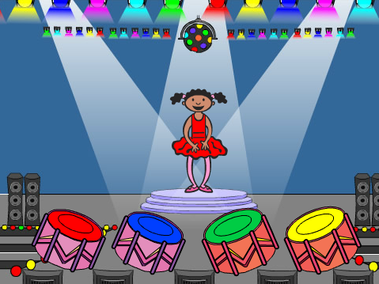
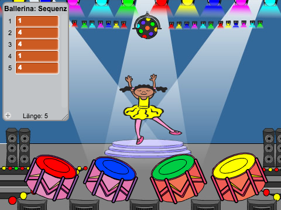
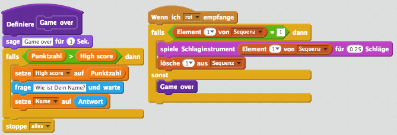

# Einführung { .intro }

In diesem Projekt erstellst Du ein Gedächtnis-Spiel, bei dem man sich eine Folge von zufälligen Farben merken und wiederholen muss!

<div class="scratch-preview">
  <iframe allowtransparency="true" width="485" height="402" src="https://scratch.mit.edu/projects/embed/34874510/?autostart=false" frameborder="0"></iframe>
  
</div>

# Schritt 1: Zufällige Farben { .aktivität}

Lass uns zunächst einen Charakter erstellen, der eine zufällige Reihenfolge an unterscheidlichen Farben annehmen kann, die sich der Spieler merken muss.

## Arbeitsschritte { .kontrolle }

+ Starte ein neues Scratch-Projekt und lösche die Katzenfigur, so dass Dein Projekt leer ist. Du findest das Scratch-Bearbeitungsprogramm online auf jumpto.cc/scratch-new.

+ Füge eine neue Figur, sowie den passeden Bühnenhintergrund hinzu. Dein Charakter muss keine Person sein, aber er muss verschiedene Farben annehmen können.

	

+ Du wirst im Spiel unterschiedliche Zahlen für die jeweiligen Farben benutzen:

	+ 1 = rot
	+ 2 = blau
	+ 3 = grün
	+ 4 = gelb

	Gib Deinem Charakter vier unterschiedlich farbige Kostüme in den obigen Farben. Stelle sicher, dass die Farben der Kostüme richtig geordnet sind.

	

+ Um eine zufällige Reihenfolge zu erstellen, benötigst Du eine __Liste__. Eine Liste ist lediglich eine Variable, die viele Daten __in Reihenfolge__ speichert. Erstelle unter 'Daten'  eine neue Liste namens `Sequenz` {.blockdata}. Da nur Dein Charakter die Liste sehen muss, können wir auf 'Nur für diese Figur' klicken.

	

	Du solltest nun sowohl Deine leere Liste in der oberen linken Ecke Deiner Bühne sehen, als auch eine Menge neuer Bausteine für die Verwendung der Liste.

	

+ Füge diesen Code hinzu, um der Liste 5 Mal nacheinander eine zufällige Nummer zu vergeben (und so das entsprechende Kostüm anzuzeigen):

	```blocks
Wenn die grüne Flagge angeklickt
lösche (alles v) aus [Sequenz v]
wiederhole (5) mal
   füge (Zufallszahl von (1) bis (4)) zu [Sequenz v] hinzu
   wechsle zu Kostüm (Element (last v) von [Sequenz v])
   warte (1) Sek.
Ende
	```

	Beachte, dass Du die Anfangsliste leerst, um zu beginnen.

## Herausforderung: Geräusche hinzufügen {.herausforderung}
Teste Dein Projekt einige Male. Du stellst möglicherweise fest, dass manchmal die gleiche Zahl zweimal (oder mehrmals) nacheinander ausgewählt wird, was es schwieriger macht sich die Reihenfolge zu merken. Kannst Du jedes Mal, wenn das Kostüm wechselt ein Trommel-Geräusch spielen?

Kannst Du jeweils ein anderes Trommel-Geräusch machen, abhängig von der Zufallszahl, die ausgewählt wird? Dies wird _sehr_ ähnlich zu dem Code sein, der für das Verändern des Kostüms des Charakters verantwortlich ist.

## Speichere Dein Projekt { .save }

# Schritt 2: Reihenfolge wiederholen { .activity }

Lass uns vier Tasten hinzufügen, damit man die gemerkte Reihenfolge der Farben abspielen kann.

## Arbeitsschritte { .check }

+ Füge Deinem Projekt vier Figuren hinzu, die die Tasten darstellen werden. Bearbeite Deine Figuren so, dass jeweils eine Taste eine der vier Farben repräsentiert.

	

+ Wenn die rote Taste angeklickt  wird, musst Du Deinem Charakter mitteilen, dass die rote Taste gedrückt wurde. Füge diesen Code Deiner roten Trommel hinzu:

	```blocks
Wenn ich angeklickt werde
sende [rot v] an alle
	```

+ Wenn dein Charakter diese Nachricht empfängt, sollte er prüfen, ob die Nummer 1 am Anfang der Liste steht (was bedeutet, dass Rot die nächste Farbe in der Reihenfolge ist). Wenn ja, kann die Nummer aus der Liste entfernt werden, da sie richtig erraten worden ist. Ansonsten ist das Spiel vorbei!

	```blocks
Wenn ich [rot v] empfange
falls <(Element (1 v) von [Sequenz v]) = [1]> dann
   lösche (1 v) aus [Sequenz v]
sonst
   sage [Game over!] für (1) Sek.
   stoppe [alles v]
Ende
	```

+ Du kannst auch ein paar blinkende Lichter anzeigen, sobald die Liste leer ist, da es bedeutet, dass die komplette Reihenfolge der Farben richtig erraten worden ist. Fügen diesen Code an das Ende des `wenn Fahne geklickt` {.blockevents}-Skripts Deines Charakters hinzu:

	```blocks
warte bis <(Länge von [Sequenz v]) = [0]>
sende [gewonnen v] an alle und warte
	```

+ Klicke auf die Bühne und füge diesen Code hinzu, um die Farbe des Hintergrundes wechseln zu lassen, sobald der Spieler gewonnen hat.

	```blocks
Wenn ich [gewonnen v] empfange
spiele Klang [cheer v]
wiederhole (50) mal
   ändere [Farbe v]-Effekt um (25)
   warte (0.1) Sek.
Ende
schalte Grafikeffekte aus
	```

## Herausforderung: Vier Tasten erstellen {.challenge}
Wiederhole die oben beschriebenen Schritte für Deine blauen, grünen und gelben Tasten. Welcher Code bleibt gleich, und welcher Code verändert sich für jede der Tasten?

Du kannst auch Geräusche hinzufügen, wenn die Tasten gedrückt werden.

Denke daran, den Code, den Du hinzugefügt hast, zu testen! Kannst Du Dir eine Folge von 5 Farben merken? Ist die Reihenfolge jedes Mal anders?

## Speichere Dein Projekt { .save }

# Schritt 3: Mehrere Ebenen { .activity .new-page }

Bisher muss sich der Spieler nur 5 Farben merken. Lass uns Dein Spiel verbessern, so dass die Länge der Farbenfolge erhöht wird.

## Arbeitsschritte { .check }

+ Erstelle eine neue Variable namens `Punktzahl` {.blockdata}.

	

+ Diese `Punktzahl` {.blockdata} wird dafür verwendet, um über die Länge Sequenz zu entscheiden, die sich der Spieler merken muss. Um mit der Punktzahl (und der Länge der Sequenz) zu beginnen, setze diese auf 3. Füge diesen Code an das Ende des `wenn Fahne geklickt` {.blockevents}-Skripts Deines Charakters hinzu:

	```blocks
setze [Punktzahl v] auf [3]
	```

+ Anstatt immer eine Folge von 5 Farben zu haben, möchtest Du, dass nun die `Punktzahl` {.blockdata}, die Sequenzlänge bestimmt. Ändere die `wiederholen` {.blockcontrol}-Schleife deines Charakters (für die Erstellung der Sequenz) zu:

	```blocks
wiederhole (Punktzahl) mal
Ende
	```

+ Wird die Reihenfolge der Farben richtig wiedergegeben, solltest Du 1 zu der Punktzahl hinzufügen, um die Länge der Sequenz zu erhöhen.

	```blocks
ändere [Punktzahl v] um (1)
	```

+ Schließlich musst Du eine `auf ewig` {.blockcontrol}-Schleife dem Code hinzufügen, so dass eine neue Sequenz für jede Spiel-Stufe erstellt wird. So sollte der Code Deines Charakters aussehen:

	```blocks
Wenn die grüne Flagge angeklickt
setze [Punktzahl v] auf [3]
wiederhole fortlaufend
   lösche (alles v) aus [Sequenz v]
   wiederhole (Punktzahl) mal
      füge (Zufallszahl von (1) bis (4)) zu [Sequenz v] hinzu
      wechsle zu Kostüm (Element (letztes v) von [Sequenz v])
      warte (1) Sek.
   Ende
   warte bis <(Länge von [Sequenz v]) = [0]>
   sende [gewonnen v] an alle und warte
   ändere [Punktzahl v] um (1)
Ende
	```

+ Lass Deine Familie oder Freunde das Spiel testen. Denke daran die `Sequenz` {.blockdata}-Liste auszublenden, bevor sie das Spiel starten!

## Speichere Dein Projekt { .save }

# Schritt 4: Höchstpunktestand { .activity }

Lass uns den Höchstpunktestand bzw. High score speichern, damit Du gegen Deine Freunde antreten kannst.

## Arbeitsschritte { .check }

+ Füge Deinem Projekt die 2 neuen Variablen `High score` {.blockdata} und `Name` {.blockdata} hinzu.

+ Wann immer das Spiel beendet wird (durch Drücken des falschen Knopfes), musst Du prüfen, ob das Ergebnis des Spielers höher ist als der aktuelle Höchstpunktestand. Ist dies der Fall, musst Du sowohl die Punktzahl des neuen High scores, als auch den Namen des Spielers speichern. So sollte der Code Deines roten Knopfes aussehen:

	```blocks
Wenn ich [rot v] empfange
falls <(Element (1 v) von [Sequenz v]) = [1]> dann
   lösche (1 v) aus [Sequenz v]
sonst
   sage [Game over!] für (1) Sek.
   falls <(Punktzahl) > (High score)> dann
      setze [High score v] auf (Punktzahl)
      frage [High score! Wie ist Dein Name?] und warte
      setze [Name v] auf (Antwort)
   Ende
   stoppe [alles v]
Ende
	```

+ Du musst diesen neuen Code zu den anderen 3 Tasten hinzufügen! Ist Dir aufgefallen, dass der 'Game over'-Code in jeder der vier Tasten genau der selbe ist?

	

+ Wenn Du jemals einen dieser Codes ändern musst, zum Beispiel um ein Geräusch hinzuzufügen oder die 'Game over'´-Nachricht zu ändern, müsstest Du ganze 4 Mal die gleiche Änderung vornehmen! Das könnte lästig werden und viel Zeit verschwenden.

+ Stattdessen kannst Du Deine eigenen Bausteine definieren, und diese in Deinem Projekt wiederverwenden! Um dies zu tun, klicke auf `Weitere Blöcke` {.blockmoreblocks} und dann 'Neuer Block'. Benenne diesen neuen Block 'Game over'.

	

+ Füge den Code aus dem `sonst` {.blockcontrol}-Block von der roten Taste zu dem neu erschienen Block hinzu:

	

+ Du hast nun eine neue _Funktion_ namens `Game over` {.blockmoreblocks} erstellt, die Du überall verwenden kannst. Ziehe Deinen neuen `Game over` {.blockmoreblocks}-Block auf die 4 Skripte der Tasten.

	

+ Füge als Nächstes ein Geräusch hinzu, wenn die falsche Taste gedrückt wird. Du musst diesen Code nur _einmal_ im `Game over` {.blockmoreblocks}-Block hinzufügen, anstatt 4 Mal für jede einzelne Farbe! Praktisch, oder?

	

## Herausforderung: Erstelle mehr Blöcke {.challenge}
Ist Dir ein anderer Code aufgefallen, der für alle vier Tasten gleich ist?


Kannst Du einen anderen benutzerdefinierten Block erstellen, der von jeder Taste verwendet wird?

## Speichere Dein Projekt { .save }

## Herausforderung: Ein weiteres Kostüm {.challenge}
Hast Du bemerkt, dass das Spiel damit beginnt, dass Dein Charakter eine der 4 Farben zeigt, und dass das Kostüm immer die letzte Farbe anzeigt, die in der Reihenfolge auftaucht, während der Spieler die Farben wiederholt?

Kannst Du dem Charakter ein anderes komplett weißes Kostüm geben, welches zu Beginn des Spiels angezeigt wird, und wenn der Spieler versucht, die Sequenz zu wiederholen?


## Speichere Dein Projekt { .save }

## Herausforderung: Schwierigkeitsgrad {.challenge}
Kannst Du dem Spieler die Möglichkeit geben zwischen einem "Einfach-Modus " (mit nur der roten und der blauen Trommel) und einem "Normal-Modus" (alle vier 4 Trommeln) wählen zu lassen?

Du könntest sogar einen "Schwierig-Modus" hinzufügen, wo eine fünfte Trommel verwendet wird!

## Speichere Dein Projekt { .save }

## Community Contributed Translation { .challenge .pdf-hidden }

This project was translated by Anastasia Heilmann and Cat Handleigh. Our amazing translation volunteers help us give children around the world the chance to learn to code.  You can help us reach more children by translating a Code Club project via [Github](https://github.com/CodeClub/curriculum_documentation/blob/master/contributing.md) or by getting in touch with us at hello@codeclubworld.