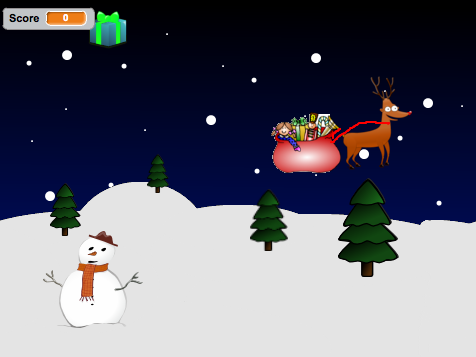

---
title: Christmas Capers
level: Additional Projects
language: en-GB
stylesheet: scratch
embeds: "*.png"
materials: ["*.sb2", "Resources/*.png", "Resources/*.mp3"]
...

# Introduction { .intro}

__In this project we’ll create a game with scrolling backgrounds, scoring and a festive game over screen.__

A disaster in a toy factory has sent presents flying into the sky, help Rudolph to save Christmas by catching the presents!



# Step 1: Make Rudolph fly {.activity}

## Activity Checklist { .check}

+ Start a new Scratch project. Delete the cat by right-clicking it and selecting Delete
+ Replace the background with **SkyBackground.png**.
+ Add the Rudolph sprite to the project (use the **resources/Rudolph.png** file)
+ Make Rudolph follow the mouse by using the following script:
```blocks
    when FLAG clicked
        go to front
        forever
            go to [mouse-pointer v]
```

## Test Your Project { .flag}

__Click the green flag and move the mouse__, does Rudolph follow the mouse?

## Save your project { .save}

+ To make the game more interesting we will add some moving snowy hills to make it look like Rudolph is flying. Add the Snow sprite to the project (use the __SnowHills.png__ file).
+ Rename the sprite to __Snow1__.
+ Create a new variable by clicking the *Data* tab and then **make a variable**. Call it `ScrollX`{.blockorange} and make it for all sprites, then uncheck the box next to it to remove it from the stage. This will be used to control how the hills move.
+ Add the following script to make the hills move:
```blocks
    when FLAG clicked
        set y to (0)
        forever
            set x to (ScrollX)
            change [ScrollX v] by (-1)
            if <(ScrollX) < (-480)> then
                set [ScrollX v] to [0]
```

## Test Your Project { .flag}

__Click the green flag__, do the hills move? What happens as the hills move to the side of the screen?

## Save your project { .save}

+ Let’s fix the issue with the snowy hills flickering when they reach the right of the screen. Add more hills to the stage use the __new sprite from file__ button to add the Snow sprite to the project again (use the **SnowHills.png** file).
+ Rename the sprite to __Snow2__.
+ Add the following script to the Snow2 sprite to allow the 2nd set of hills to follow closely behind the first:
```blocks
    when FLAG clicked
        set y to (0)
        forever
            set x to <(ScrollX) + [479]>
```

## Test Your Project { .flag}

__Click the green flag__, do the hills move? Has the issue with the flickering trees been fixed?

## Save your project { .save}

# Step 2: Falling Presents { .activity .new-page }

## Activity Checklist { .check}

+ We now need to add in the presents for Rudolph to collect. Add the **Present** sprite to the project (use the **Present.png** file).
+ __Create a new variable__ by clicking the `Data`{.blocklightgrey}  tab and then **make a variable**. Call it `Finish`{.blockorange} and make it for this sprite only, then uncheck the box next to it to remove it from the stage. This will be used to control when the present should be removed from the game.
+ __Create another variable__ and call it `Speed`{.blockorange} and make it for this sprite only, then uncheck the box next to it to remove it from the stage. This will be used to control the speed that the present falls down the screen.
+ Add the following script to the **Present** sprite to allow it to fall from the sky. Note that we will use `pick random`{.blockgreen} to make the present appear in a different place each time.
+ By using the `touching [ Rudolph ]`{.blocklightblue} block we can make the present disappear when touched, we can use this later to keep a score.
```blocks
    when FLAG clicked
        forever
            set [Finish v] to [0]
            go to x: <pick random (-230) to (230)> y: <pick random (50) to (170)>
            set [Speed v] to [-1]
            repeat until <(Finish) = [1]>
                change y  by (Speed)
                if <(y position) < [-160]> then
                    set (Finish) to [1]
                end
                if <touching [Rudolph v]?> then
                    set (Finish) to [1]
```

## Test Your Project { .flag}

__Click the green flag,__ do the presents fall from the sky? Do they disappear when Rudolph touches them or they hit the ground?

## Save your project { .save}

+ Let’s make the game more interesting by changing the colour of the presents each time they fall. Do this by using the `change colour`{.blockpurple} block.
+ Change the speed of each present by replacing `set Speed to -1`{.blockorange} with the `pick random`{.blockgreen} block, try different values such as **-10** to **-1**. Your script should now look like this.
```blocks
    when FLAG clicked
        forever
            set [Finish v] to [0]
            go to x: <pick random (-230) to (230)> y: <pick random (50) to (170)
            change [color v] effect by <pick random (1) to (-160)>
            set [Speed v] to <pick random (-10) to (-1)
            repeat until <(Finish) = [1]>
                change y  by (Speed)
                if <(y position) < [-160]> then
                    set (Finish) to [1]
                end
                if <touching [Rudolph v]?> then
                    set (Finish) to [1]
```

## Test Your Project { .flag}

__Click the green flag,__ do the presents fall at different speeds and colours?

## Save your project { .save}

# Step 3: Scoring and Sound Effects { .activity}

## Activity Checklist { .check}

+ __Let’s change our script to keep track of a score within the game.__ We can then use this later to work out when the game over message should appear.
+ Create a new variable. Call it `Score`{.blockorange} and make it for all sprites. Leave this variable ticked so it appears on the screen.
+ Change the script behind the **Present** sprite to look like this. Note we have both added sound effects with the `play drum`{.blockpink} command and also `change [ score ] by 1`{.blockorange} when Rudolph touches the present.
```blocks
    when FLAG clicked
        forever
            set [Finish v] to [0]
            go to x: <pick random (-230) to (230)> y: <pick random (50) to (170)
            change [color v] effect by <pick random (1) to (-160)>
            set [Speed v] to <pick random (-10) to (-1)
            repeat until <(Finish) = [1]>
                change y  by (Speed)
                if <(y position) < [-160]> then
                    play drum [57 v] for (0.25) beats
                    set (Finish) to [1]
                end
                if <touching [Rudolph v]?> then
                    play drum [39 v] for (0.25) beats
                    set (Finish) to [1]
                    change [Score v] by [1]
```

Let’s add some music to the game:

+ Import the sound file **Jingle_Bells.mp3** to the __Stage__.

+ Add the following script to the __Stage__, this will `set score to 0`{.blockorange} when the game is started. It will also play Jingle Bells while the game is being played.
+ 
```blocks
    when FLAG clicked
        set [ScrollX v] to [0]
        set [Score v] to [0]
        play sound [Jingle_Bells v]
```

Note, if at first the music sounds ‘choppy’ save your project, close Scratch and then open your project again.

## Test Your Project { .flag}

__Click the green flag,__ does the score change when Rudolph touches a present?

## Save your project { .save}

# Step 4: Game over { .activity}

+ __Let’s change our script to keep track of a score within the game.__ We can then use this later to work out when the game over message should appear.
+ Change the script on the __Stage__ so when the `Score`{.blockorange} reaches **10** we will `broadcast`{.blockyellow} a __GameOver__ message.
```blocks
    when FLAG clicked
        set [ScrollX v] to [0]
        set [Score v] to [0]
        play sound [Jingle_Bells v]
        forever
        if <(score) = [10]> then
            broadcast [GameOver v] and wait
```

+ We now need to add in our GameOver message. Add the __GameOver__ sprite to the project (use the **GameOver.png** file).
+ __Add the following script to the GameOver sprite.__ This will `hide`{.blockpurple} the picture when the game starts and `show`{.blockpurple} it when the GameOver message is received.
```blocks
    when FLAG clicked
        hide

        when I receive [GameOver v]
            go to front
            show
            stop [all v]
```

## Test Your Project { .flag}

__Click the green flag,__ does the score change when Rudolph touches a present?

## Save your project { .save}

##Challenge: Make the game harder { .challenge}

* Can you make the presents wobble on their way down the screen?
* Can you add more than one present to the game at the same time?
* Change the game over message to appear after 20 presents are collected.
* Can you reduce the score by 1 when a present hits the ground?

## Save your project { .save}

Well done, you’ve finished! Now you can enjoy your game!

Don’t forget you can share your game with all your friends and family by clicking on **Share** on the menu bar! Have a very Merry Christmas!
