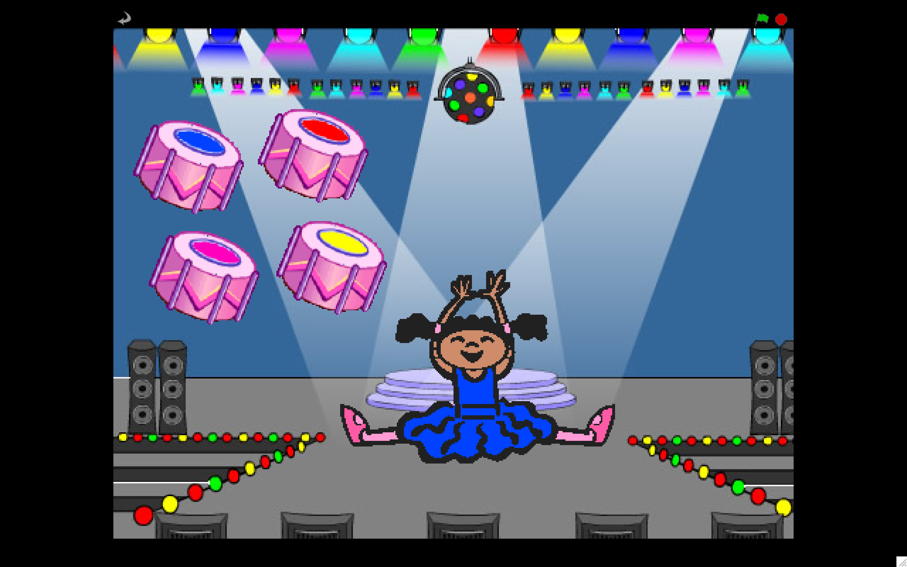
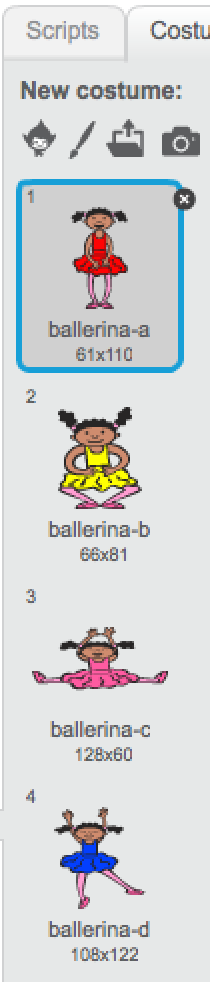
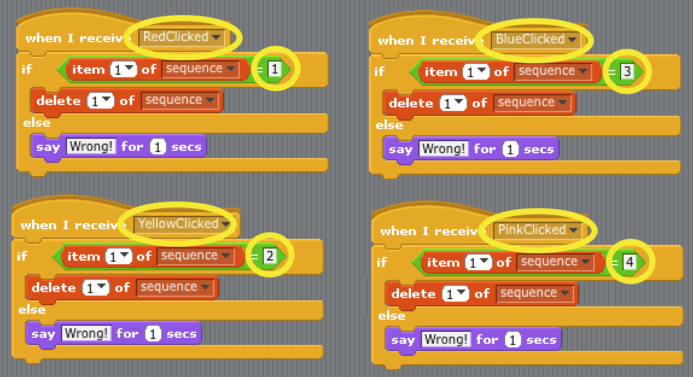

---
title: Simone Ballerina
level: Level 3
language: en-GB
stylesheet: scratch
embeds: "*.png"
...

# Introduction { .intro }

In this project, you will create a memory game where you have to memorise and repeat a sequence of random colours!

This project makes use a list variable to store the random sequence.



# Step 1: Getting started { .activity }

Before we start coding, let's create the main character and background.

## Activity Checklist { .check }

+ Start a new Scratch project.
+ Delete the cat sprite and replace the backdrop of the Stage with the **Indoors/spotlight-stage**.
+ Add a new sprite using the `Choose sprite from library` {.blockgrey} button (use **People/Ballerina**). If you really don't want a ballerina then choose something else. It doesn't have to be a person, but it needs to be able to show different colours.
+ Go to the `Costumes` {.blockgrey} tab and edit the main colours of them using the `Color a shape` tool so they are obviously different colours.



**Note:** Each costume has a number. These will become important later on when we map our buttons to costume colours, so remember where you can reference them.

## Save your project { .save }

# Step 2: Create a random colour sequence { .activity }

Now we can start to code. We are going to use a list variable. These are like ordinary variables, but they can hold more than one number at a time. This is ideal for storing a sequence of numbers, as we will see.

## Activity Checklist { .check }

+ With **Simone** selected, in the **Data** section, select `Make a List` {.blockgrey} and call it `sequence` {.blockorange} `For this sprite only`.

+ Add the following code:

    ```blocks
        when FLAG clicked
        delete (all v) of [sequence v]
        repeat (4)
            add (pick random (1) to (4)) to [sequence v]
            switch to costume (item (last v) of [sequence v]
            wait (1) secs
        end
    ```

## Test Your Project { .flag }

Click the green flag.

+ Does the dress change colour 4 times?
+ Is the sequence different each time?
+ Is it hard to tell when you get the same colour twice in the sequence?

## Things to try { .try }

+ Try playing a sound after each costume change, so that you can tell if it is the same colour twice in a row.

## Save your project { .save }

# Step 3: Add buttons to input the sequence guess { .activity }

Now we need to add some coloured drums so you can enter in your guess at the sequence.

## Activity Checklist { .check }

+ Add a new sprite **Things/drum2** from the library.
+ Make the sprite a bit smaller by clicking on the `Shrink` {.blockgrey} icon and then on the drum several times.
+ Rename the sprite *DrumBlue*.
+ Using the `Color a shape` tool again, edit the costume so that the drum looks blue.
+ Add the following code to send a message to Ballerina:

    ```blocks
        when this sprite clicked
        broadcast [BlueClicked v]
    ```

+ Duplicate the drum sprite 3 times.
+ Edit the colour of each drum and rename it after its colour.
+ Create a new broadcast message for each one.

## Save your project { .save }

# Step 4: Check if the guess is correct { .activity }

Now we need to return to the `Ballerina` sprite, and add some code to receive the messages and check our guesses against the sequence.

```blocks
when I receive [BlueClicked v]
if <(item (1 v) of [sequence v])=[1]>
    delete (1 v) of [sequence v]
else
    say [Wrong!] for (1) secs
```

The code checks that your guess matches the first item in the sequence. If your guess is correct, it removes that item from the list. The remaining items all move up one position, so that the second item moves to the top of the list.

You will need 4 copies of the above script, one for each colour message. Remember the numbers to use to compare with the list item can be seen by looking at the `Costumes`, and seeing the numbers you have for each colour.



## Test Your Project { .flag }

Click the green flag.

+ Can you get the sequence right?
+ Do all the buttons work as expected?
+ When you make an incorrect guess, does the ballerina say "Wrong!"?

## Things to try { .try }

+ It is slightly too easy to remember the last colour in the sequence as the ballerina remains in that colour dress. Can you make the ballerina change to a white dress when she has finished the sequence?
+ When you make a correct guess, it sometimes feels like nothing is happening. Can you play a sound when you click on a drum? or maybe a different sound for each drum?

## Save your project { .save }

# Step 5: Let's celebrate success { .activity }

If you get the sequence correct, it would be nice if the game did something exciting! Let's add the following script to the **Stage**

```blocks
when I receive [Won v]
play sound [Eggs v]
repeat (90)
    change [color v] effect by (25)
    wait (0.1) secs
end
clear graphic effects
```

You can see what it does by double clicking on it. Disco!

When you get tired of that excitment, let's move on. We need to create a way to detect if we've completed the sequence and broadcast the `Won` message. Add the following code to the Ballerina sprite.

```blocks
when I receive [CorrectGuess v]
delete (1 v) of [sequence v]
if <(length of [sequence v])=[0]>
    broadcast [Won v]
```

And we need to edit each of the 4 receiver codes to broadcast CorrectGuess rather than delete an item from `sequence` {.blockorange}.

```blocks
when I receive [BlueClicked v]
if <(item (1 v) of [sequence v])=[1]>
    broadcast [CorrectGuess v]
else
    say [Wrong!] for (1) secs
```

## Test Your Project { .flag }

Click the green flag.

+ When you get the sequence right, do you get the flashing lights?

## Save your project { .save}

## Things to try { .try}

__Well done you’ve finished the basic game. There are more things you can do to your game though. Have a go at these challenges!__

+ __Make the game start again after you win__
+ __Make the sequence get longer each time__
+ __Can you make the game end if you make an incorrect guess, and display a final score?__
