---
title: Space Junk
level: Scratch +
language: en-GB
stylesheet: scratch
embeds: "*.png"
materials: ["Club Leader Resources/*.*"]
...

# Introduction { .intro }

Help the Scratch mascot avoid the space junk and return safely back to Earth!

<div class="scratch-preview">
	<iframe allowtransparency="true" width="485" height="402" src="http://scratch.mit.edu/projects/embed/59295958/?autostart=false" frameborder="0"></iframe>
	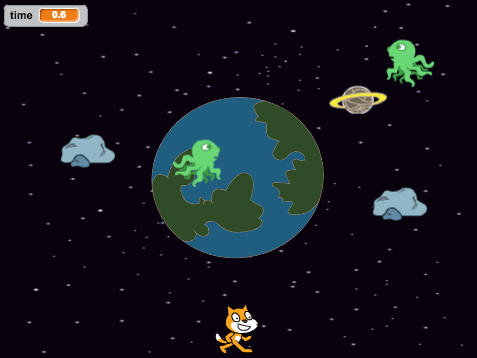
</div>

# Step 1: Controlling the cat { .activity }

Let's allow the player to control the cat with the arrow keys.

## Activity Checklist { .check }

+ Start a new Scratch project. You can find the online Scratch editor at <a href="http://jumpto.cc/scratch-new">jumpto.cc/scratch-new</a>.

+ Click the 'Shrink' button and then click on the cat a few times to make it a little smaller.

	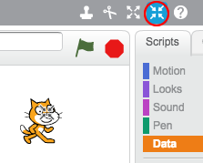

+ To add a background, click 'Choose backdrop from library' and select the 'Stars' backdrop.

	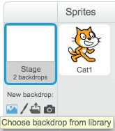

	This is how your stage should look:

	

+ Let's move the cat to the left when the left arrow key is pressed. 

	Click on your cat sprite, and add the following code:

	```scratch
	when [left arrow v] key pressed?
	change x by (-10)
	```

	Notice that you need to change the x coordinate to move the cat to the left.

	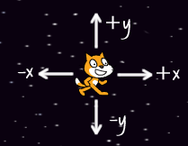

+ Test out your cat by pressing the left arrow key. You should see your cat move towards the left of the stage.

+ To move the cat upwards when the up arrow key is pressed, you'll need to add some more code:

	```scratch
	when [up arrow v] key pressed?
	change y by (10)
	```

+ Test your project again to make sure that your new code works!

## Save your project { .save }

## Challenge: More movement {.challenge}
Can you add more code to your cat sprite, so that it moves up, down, left and right?

## Save your project { .save }

# Step 2: Space junk! { .activity }

Let's add some space junk for the cat to avoid.

## Activity Checklist { .check }

+ Click 'Add new sprite from library' and add the 'Planet2' sprite to your stage. You can change the size of the planet if you want to.

	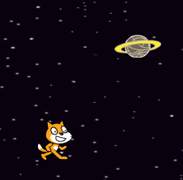

+ Add this code to make the planet move around the stage forever:

	```scratch
	when flag clicked
	forever
		move (2) steps
		if on edge, bounce
	end
	```

+ Click the green flag to test our your new planet. It should move left and right across the stage.

	Have you noticed that your planet turns upside-down (rotates) when it hits the edge of the screen? To fix this, just add this code to your planet sprite:

	```scratch
	set rotation style [don't rotate v]
	```

+ The game should end when the planet touches the cat, so let's add this code __inside__ the planet's `forever` {.blockcontrol} loop:

	```scratch
	if <touching [Cat1 v]?> then
		stop [all v]
	end
	```

	Here's how your planet's code should look:

	```scratch
	when flag clicked
	forever
		move (2) steps
		if on edge, bounce
		if <touching [Cat1 v]?> then
			stop [all v]
		end
	end
	```

+ Test your game again - does the game end when the planet hits the cat?

## Save your project { .save }

## Challenge: Changing your planet's orbit {.challenge}
Can you change the way your planet moves? You can use these blocks to help you, as well as any other blocks you like.

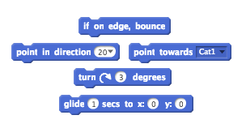

## Save your project { .save }

# Step 3: Getting back to Earth { .activity }

Can you avoid the space junk for 30 seconds, and get back to Earth safely?

## Activity Checklist { .check }

+ Firstly, let's add the Earth sprite to the center of your stage.

	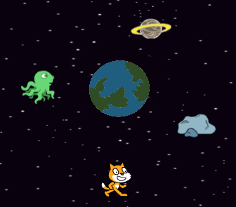

+ Add this code to your Earth sprite, so that it starts off very small and slowly get's bigger and bigger:

	```scratch
	when flag clicked
	set size to (10) %
	forever
		change size by (0.3)
	end
	```

+ Test out your Earth sprite. It should look as if your cat is slowly floating towards Earth!

	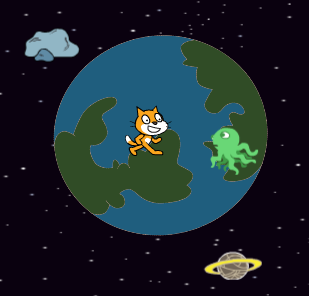

+ Click on your stage, and create a new variable to store the time.

	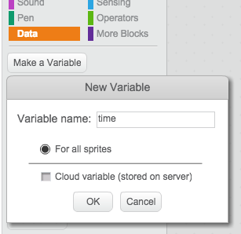

	You should now see your timer in the top-left of the stage.

	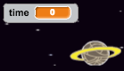

+ Add this code to your stage, so that the timer counts up forever:

	```scratch
	when flag clicked
	forever
		wait (0.1) secs
		change [time v] by (0.1)
	end
	```

+ Click the green flag and you should see your timer start to count up!

	

+ The game is won if the cat can avoid the space junk for 30 seconds.

	For this to work, you just need to set your timer to 0 at the start of the game, and then wait until the timer gets to 30.

	Click on your cat sprite, and add this script:

	```scratch
	when flag clicked
	set [time v] to [0]
	wait until <(time) > [30]>
	say [I made it!] for (2) secs
	stop [all v]
	```

## Save your project { .save }

## Challenge: More space junk {.challenge}
Can you add more enemy sprites to your game, for the cat to avoid? You could add rocks, aliens, or anything else you like!

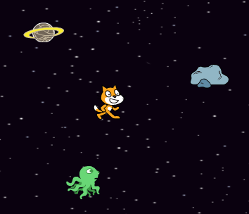

See if you can make each sprite moves differently.

## Save your project { .save }

## Challenge: 2 players {.challenge}
Can you improve your game, so that one of your enemy sprites is controlled by another player? They could use the w, a, s and d keys to control the enemy.

You could even let one of your players use the mouse to control their character. Here are some blocks that may help you:

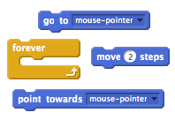

## Save your project { .save }