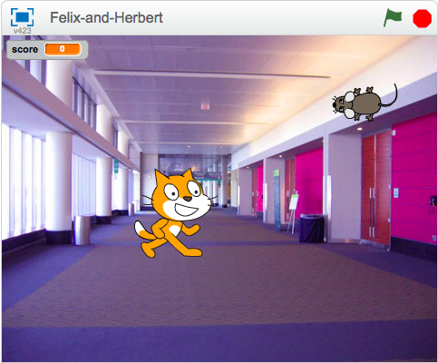

---
title: Felix and Herbert
level: Scratch 2
language: en-GB
stylesheet: scratch
embeds: "*.png"
materials: ["Felix-and-Herbert.sb2"]
...

# Introduction { .intro }

We are going to make a game of catch with __Felix the cat__ and __Herbert__ the mouse. You control Herbert with the mouse and try to avoid getting caught by Felix. The longer you avoid him the more points you score, but don’t get caught because your score will go down!



# Step 1: Felix follows the mouse pointer { .activity }

## Activity Checklist { .check }

+ Start a new project.
+ Click on the **stage** next to the sprite and switch to the `Backdrops` tab, and then click the `Choose Backdrop from library` button and choose the backdrop indoors/hall. Delete the original blank backdrop.
+ Click on the sprite, and then click on the `i` button to the top left of the Sprite. Change the name of the sprite to **Felix**.
+ Make sure Felix only points left-right by clicking this button: 
+ Create this script:
```blocks
    when FLAG clicked
    forever
        point towards [mouse-pointer v]
        move (10) steps
        next costume
        play drum (3 v) for (0.3) beats
    end
```

## Test your project { .flag }

Click the green flag.

+ Does Felix follow the mouse pointer?
+ Does it look like he’s walking when he moves?
+ Does he move at the right speed?

## Save your project { .save }


# Step 2: Felix chases Herbert { .activity }

Next, we want Felix to chase Herbert the mouse, rather than the mouse pointer.

## Activity Checklist { .check }

+ Create another sprite using the `choose sprite from library` { .blockgrey } button and selecting **animals/mouse1**.
+ Change the name of the sprite to **Herbert**.
+ Switch to the __Costumes__ tab, then click on the costume in the Paint Editor. A box will appear around the costume. Drag a corner of the box to make Herbert smaller than Felix.
+ Make sure Herbert only points left-right by clicking this button: 

+ **Give Herbert this script:**
```blocks
    when FLAG clicked
    forever
        go to [mouse-pointer v]
        point towards [Felix v]
    end
```

## Test your project { .flag }

Click the green flag.

+ Does Herbert move with the mouse pointer?
+ Does Felix chase Herbert?

## Save your project { .save }

# Step 3: Felix says when he’s caught Herbert { .activity }

We want Felix to know when he’s caught Herbert, and tell us.

## Activity Checklist { .check }

+ Change Felix’s script to be this:
```blocks
    when FLAG clicked
    forever
        point towards [mouse-pointer v]
        move (10) steps
        next costume
        play drum (3 v) for (0.3) beats
        if <touching [herbert v]?>
            say [Caught you!] for (1) secs
        end
    end
```

## Test your project { .flag }

Click the green flag.

+ Does Felix say when he’s caught Herbert?

## Save your project { .save }

# Step 4: Herbert turns into a ghost when he’s caught { .activity }

Instead of Felix saying something, we want Herbert to turn into a ghost when he’s caught.

## Activity Checklist { .check }

+ Change Felix’s script to send this message when he catches Herbert:
```blocks
    when FLAG clicked
    forever
        point towards [mouse-pointer v]
        move (10) steps
        move (20) steps
        next costume
        play drum [3 v] for (0.3) beats
        if <touching [herbert v]?> then
            broadcast [caught v]
            play drum [17 v] for (0.2) beats
            wait (1) secs
        end
    end
```
+ Add a new costume into Herbert by selecting Herbert, going into the Costumes section, and clicking the `Choose costume from Library button ` { .blocklightgrey }. Select the **fantasy/ghost2-a** costume.
+ Make the costume smaller by clicking on it in the Paint Editor, and dragging the box that appears, to resize it.
+ Change the names of Herbert’s costumes so the mouse costume is called ‘alive’ and the ghost costume is called ‘dead’.
+ Create a new script for Herbert to turn him into a ghost:
```blocks
    when I receive [caught v]
        switch costume to [dead v]
        wait (1) secs
        switch costume to [alive v]
```

## Test your project { .flag }

Click the green flag.

+ Does Herbert turn into a ghost when he’s caught?
+ Does Felix play the right sounds at the right time?
+ Does Felix still stay still for long enough for Herbert to get away?

## Save your project { .save }

# Step 5:  Keep score { .activity }

Let’s add a score so we know how well we do at keeping Herbert alive.

We’ll start the score at zero and increase it by one every second. If Felix catches Herbert, we’ll reduce the score by one hundred.

## Activity Checklist { .check }

+ Make a variable, for all sprites, called Score. Click on `Data` { .blockorange } in the top menu, make a variable and name it `score` { .blockorange }, ensuring that "For all sprites" is selected.
+ On the stage, create these two scripts:
```blocks
    when gf clicked
        set [score v] to [0]
        forever
            change [score v] by (1)
            wait (1) secs
        end

    when I receive [caught v]
        change [score v] by (-100)
```

## Test your project { .flag }

Click the green flag.

+ Does the score go up by one every second?
+ Does the score go down by one hundred when Herbert is caught?
+ What happens when Herbert is caught before score reaches one hundred? Does the score go back to zero when you start a new game?

## Save your project { .save }

Well done, you’ve finished! Now you can enjoy your game!

Don’t forget you can share your game with all your friends and family by clicking on **Share** on the menu bar!
