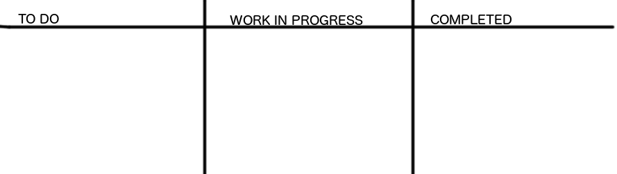
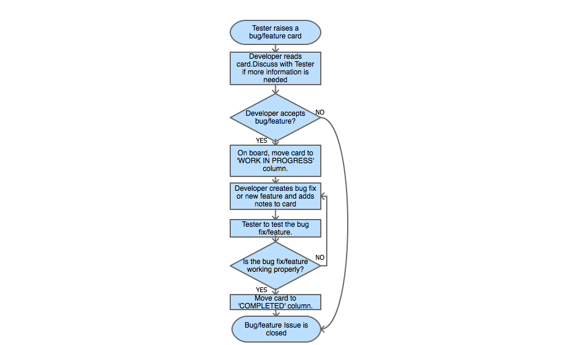

---
title: Devs and Testers
level: Scratch +
language: en-GB
stylesheet: scratch
embeds: "*.png"
...

# Introduction { .intro }

This is a group activity, where two teams will be working together, to improve a project:
    - Testers: run the software and test it for things that don't work properly (bugs) and suggest improvements (features)
    - Developers: change the code to fix bugs, and writing code to add features

You should have done some Code Club projects or have written your own.

You will also need one large whiteboard, and some cards (20 or more) to write on. Of course you'll need some whiteboard markers for the whiteboard , normal pens for the cards, and tape or magnets to stick cards to the whiteboard.

# Step 1: Choose Teams and a Project { .activity }

In this step, we will choose a Scratch project, and decide who is on the Developers team and who is on the Testers team.

## Activity Checklist { .check }

+ Decide who will be in the Developers team. It doesn't matter who goes first as people can swap teams later on.  If you are using a project written by a student in your Code Club, they should be on this  team.

+ Now decide who will be in the Testers team. The testers need to be able to test the project, find bugs, and suggest new features to improve the project. There must be at least two people in the Testers team, with more people in the Developers team.

+ Your teams must first pick a project to use. Make sure it is one that everyone knows well enough to add to. It could be a Code Club project, like Clone Wars or Create Your Own World, or one that a student has written.

# Step 2: Share the Code { .activity .new-page }

In this step, we will make sure that both teams have the same version of the code.

## Activity Checklist { .check }

+ Once your teams have decided which project to use, members of both teams will need a copy of the code. If you have an online Scratch account, just share your project and tell the rest of the team the link, so they can remix. To do this, click on __See inside__ in the top right corner, then click on the __Remix__ button.

+ If your Code Club uses Scratch offline, you'l need to share the `.sb2` file with your other team members. Select `File`>`Save as` to save the file with another name, so that you don't overwrite your original file.

# Step 3: Prepare the issue tracker board { .activity .new-page }

In this step, we need to set up a way to keep track of bugs that the Testers team find and features that they suggest. The Developers will need a way to record the changes they made to the code, and will need the Testers to test any changes before they are marked as _completed_.

## Activity Checklist { .check }

+ Draw two lines down the whiteboard, so that it is divided into three columns.

+ At the top of the board, label the first column from the left, __TO DO__, label the middle column __WORK IN PROGRESS__, and label the last column, __COMPLETED__. It should look like the image below.

+ Take the cards and put them near the Tester team. The Tester team will use these to let the Developer team know when they have found a bug or have a new feature suggestion.

## Ready to Start { .flag }

You are now ready to begin improving your project!

# Step 4: Begin the process { .activity .new-page }

This is where the real fun begins. The Testers team get to test the project and start giving the Developers bugs to fix and features to add. Remember to use _one card per bug or feature._

## Activity Checklist { .check }
+ The Testers should run the project by pressing the _Green flag_ and start looking for bugs. When a tester finds a bug, they will need to grab a card and write a description of the bug, and their name. The description should include how to find the bug and what is going wrong. It should be as clear as possible for the Developers to understand.

An example bug card could be:

    BUG:
    The sprites end up in the wrong places when the game restarts

    How to See the Bug:
    Re-start the game and after the first run, the balloon sprite is always stuck at the right side of the screen. The position of the balloon stops the player from being able to play the game without using the mouse to move it back before running.
    
    Fix:
    Set the sprite position at the start of every game.

+ The Testers should also look for ways that the project can be improved with new features. When they think of a good feature, they should grab a card and write a description of the new feature, adding their name to the card. If they know how, they can suggest how it could be done.

An example of a feature card could be:

    FEATURE:
    Convert a single player game to double player
    
    Description:
    Add another balloon with different controls, so 2 players can race each other at the same time.
    
    How to Make it:
    Duplicate the balloon sprite and scripts, then change the keys to control the second sprite. Change the 2nd sprite to another colour. If player 1 gets to the end first, end the game and display "Player 1 wins!" or if player 2 gets to the end first display "Player 2 wins!".
    
+ Once a bug or a feature card is written up, stick it in the __TO DO__ column. The Developers choose a card each, and move it to the __WORK IN PROGRESS__ column. They should talk to the Tester who created the card, to get more information. The developer should take notes in point form.

+ Then the developer needs to work on fixing the bug or adding the feature. Before moving the card to the __COMPLETED__ column, it must be tested by the tester. If the tester is happy then the card is completed and the developer can grab another card to work with. The whole process is shown below.

## Challenge: Release the New Version {.challenge}
Once a few bugs and features have been completed, create a new version of the project, and add all the fixes and features. You can call it 'version 2' if the first was version 1. Once this is done and the Testers team is happy with it, try swapping people across to different teams and do it again!
