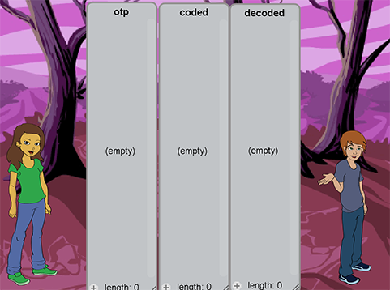
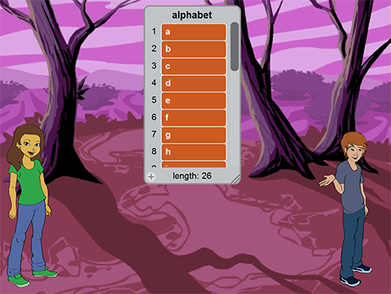
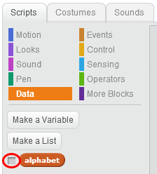
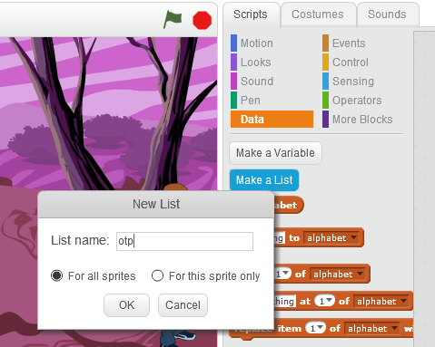
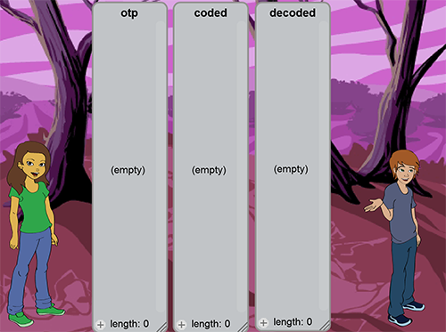
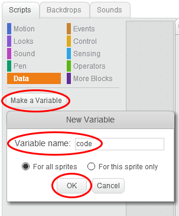
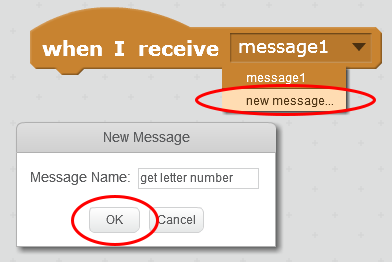

# Introduction { .intro }

In this project you will learn how to make an uncrackable code to send short messages between two secret agents! You will learn how to make the code known as a __one-time-pad__, how to encode a short message so that it looks like gibberish to any spy looking at it, and how to decode the message at the other end.

<div class="scratch-preview">
  <iframe allowtransparency="true" width="485" height="402" src="https://scratch.mit.edu/projects/114265027/?autostart=true" frameborder="0"></iframe>
  
</div>

# Step 1: Load the starting project { .activity }

The starting project is there to save a little time getting started.

## Activity Checklist { .check }

+ Open the 'Secret Agents' Scratch project. Your club leader will give you a copy of this project, or you can open it online at <a href="http://jumpto.cc/secretagents-resources" target="_blank">jumpto.cc/secretagents-resources</a>.

	

+ There are two Sprites: Alex on the left who works in London and Dee on the right who is in another country.

+ You will also see an __alphabet__ list in the centre of the screen. This contains the letters a to z and will be used to convert a letter into a number. You will need to scroll it up and down to check all the letters. For example, __a = 1__, __z = 26__, __e = 5__.

+ We don't need to see the alphabet list as it won't change. Put the mouse cursor over the word __alphabet__ at the top of the list, __right-click__ and choose __Hide__ from the list of choices.

	

## Save your project { .save }

# Step 2: Lists { .activity }

We will need to add three more lists to the Alex sprite.

## Activity Checklist { .check }

+ Go to the 'Data blocks' { .blockdata } and click the _Make a List_ button.

+ Set the name to __otp__ then click OK.

	

	This is the __one-time-pad__ which will be used to turn the message into code.

+ Add two more lists called __coded__ and __decoded__ in the same way.

	The __coded__ list will contain the message after Alex has coded it (the gibberish).

	The __decoded__ list will contain the original message after Dee has decoded it.

+ Move the three lists so that they are laid out on the stage something like this, make them as narrow as you can.

	

## Save your project { .save }

# Step 3: Make sure the three new lists are empty { .activity }

This step is to make sure that when you run the program you can be sure that the three lists (__otp__, __coded__, and __decoded__) are empty.

## Activity Checklist { .check }

+ Add this code to the Alex sprite:

	```blocks
		when green flag clicked
		delete (all v) of [otp v]
		delete (all v) of [coded v]
		delete (all v) of [decoded v]
	```

	Be careful __not__ to empty the alphabet list as well ;-)

## Save your project { .save }

# Step 4: Make the One-Time-Pad (OTP) { .activity }

The one-time-pad tells you how much to add to each letter of your message to turn it into code which looks like gibberish. For instance, if you add 1 to the letter _a_, this would be coded as _b_ and if you add 8 to the letter _m_, this would be coded as _u_.

So you can see what is happening more easily, the messages you turn into code can only be up to 10 letters __a-z__. This means you __can't__ use numbers, except by spelling them out (_one_, _two_, etc.) or any symbols include spaces. So if Alex wanted to say hello to Dee then the message would be "__hellodee__" and Dee has to use his common sense to work out where the spaces are.

## Activity Checklist { .check }

+ Add this code to the Alex sprite (join it to what you have written already):

	```blocks
		repeat (10) 
	  		add (pick random (1) to (26)) to [otp v]
		end
	```

## Save your project { .save }

## Test your project { .flag }

You should find that the otp has 10 numbers between 1 and 26. If you run it again, you will get a different set of numbers - they are random. __Note__ that the one-time-pad is called this because you use it __only once__ - you __never__ use the same code again.

## Challenge: Coding a short message { .challenge }

Alphabet: __A B C D E F G H I J K L M N O P Q R S T U V W X Y Z__

Suppose I want to send the message __at__ and the first two lines of the otp are 8 and 11.

Take the letter __a__ and move along the alphabet 8 letters. I have put the alphabet above to make this a little easier for you. Then __a__ -> b, c, d, e, f, g, h, __i__. So Alex would write down __i__ as the first letter of the coded message (__at__).

Take the second letter __t__ and move along the alphabet 11 letters. Hang on, I have got to z! Just go back to a and continue counting so __t__ -> u, v, w, x, y, z, a, b, c, d, __e__. So Alex would write down __e__.

The message __at__ would be sent in code as __ie__.

Don't worry, Scratch will do these sums for you but you need to know roughly how it works so you can make sure that it is doing it right!

## Challenge: How do you decode the gibberish? { .challenge }

Both Alex and Dee have to be using the __same__ one-time-pad (otp). Dee needs to decode the encoded message, which looks like gibberish, and turn it back into the original message. All he has apart from this is the otp (he has no idea what the message says).

Using my example above, the otp says 8 and 11 and the "gibberish" received is __ie__. How do you get back to __at__?

Don't worry, Scratch will do these sums for you but you need to know roughly how it works so you can make sure that it is doing it right!

# Step 5: Create a message { .activity }

This step will ask you to type in the message you want to send. It will need to include a '_prompt_' to remind you what is allowed.

## Activity Checklist { .check }

+ Go to the 'Data blocks' { .blockdata } and click the _Make a Variable_ button.

+ Give it the name __message__ then click _OK_.

	

+ Hide the __message__ variable as you don't need to be able to see it on the stage.

+ Add these blocks to the Alex sprite to ask what message Alex needs to send and put it into the __message__ variable (join it to what you have written already):

	```blocks
		ask [What is your message (max 10 letters a-z, no spaces, no symbols)?] and wait
		set [message v] to (answer)
	```

# Step 6: Turn your message into letters { .activity }

A different code is used for each letter in your message, so this step is to break up your message into single letters.

## Activity Checklist { .check }

+ Make two new variables for the Alex sprite called __pointer__ and __letter__.

+ Hide both of them.

+ Add this code to the Alex sprite (join it to what you have written already):

	```blocks
		set [pointer v] to [1]
		repeat (length of (message)) 
		  	set [letter v] to (letter (pointer) of (message))
		  	say (letter) for (2) secs
		  	change [pointer v] by (1)
		end
	```

+ Check your program looks like this so far:

	```blocks
		when green flag clicked
		delete (all v) of [otp v]
		delete (all v) of [coded v]
		delete (all v) of [decoded v]
		repeat (10) 
		  	add (pick random (1) to (26)) to [otp v]
		end
		ask [What is your message (max 10 letters a-z, no spaces, no symbols)?] and wait
		set [message v] to (answer)
		set [pointer v] to [1]
		repeat (length of (message)) 
			set [letter v] to (letter (pointer) of (message))
			say (letter) for (2) secs
			change [pointer v] by (1)
		end
	```

## Save your project { .save }

## Test your project { .flag }

## Activity Checklist { .check }

+ Check that you see Alex saying each letter of your message?

# Step 7: Turn a letter into a number { .activity }

You can probably make sense of what I mean by _a + 3 = d_, but a computer doesn't! This step uses the alphabet list to turn a letter into a number - for example a -> 1, d -> 4 etc. It will be needed by both Alex for encoding and Dee for decoding.

## Activity Checklist { .check }

+ Make two new variables for the Alex sprite called __line__ and __letter number__.

+ Hide both of them.

+ Add this block to the Alex sprite but __keep it separate to what you have written already__.

	```blocks
		when I receive [get letter number v]
	```

	You will need to make a new message by clicking the down arrow and choosing __new message__. Type in __get letter number__ then press __OK__.

	

+ Add the remaining blocks underneath:

	```blocks
		when I receive [get letter number v]
		set [line v] to [1]
		repeat (26) 
			if <(item (line) of [alphabet v] :: list) = (letter)> then 
		    		set [letter number v] to (line)
				say (letter number) for (2) secs
		  	end
		  	change [line v] by (1)
		end
	```

# Step 8: Turn each letter of your message into a number { .activity }

## Activity Checklist { .check }

+ Remove the '__say__ block' { .blocklooks }:

	```blocks
		say (letter) for (2) secs
	```
+ Replace it with this '__broadcast get and wait__ block' { .blockevents }:

	```blocks
		broadcast [get letter number v] and wait
	```

+ Check that the two programs look like this:

	```blocks
		when green flag clicked
		delete (all v) of [otp v]
		delete (all v) of [coded v]
		delete (all v) of [decoded v]
		repeat (10) 
		  	add (pick random (1) to (26)) to [otp v]
		end
		ask [What is your message (max 10 letters a-z, no spaces, no symbols)?] and wait
		set [message v] to (answer)
		set [pointer v] to [1]
		repeat (length of (message)) 
		  	set [letter v] to (letter (pointer) of (message))
		  	broadcast [get letter number v] and wait
		  	change [pointer v] by (1)
		end
		
		when I receive [get letter number v]
		set [line v] to [1]
		repeat (26) 
		  	if <(item (line) of [alphabet v] :: list) = (letter)> then 
		    		set [letter number v] to (line)
				say (letter number) for (2) secs
		  	end
		  	change [line v] by (1)
		end
	```

## Save your project { .save }

## Test your project { .flag }

## Activity Checklist { .check }

+ Type in the message __abcde__ and check that Alex says __1__, __2__, __3__, __4__, __5__

+ Type in a short message of your choice and see if you agree with the numbers Alex is saying. Remember that a=1, z=26, e=5 etc.

# Step 9 Remove the Say block { .activity }

## Activity Checklist { .check }

+ Remove the '__say__ block' { .blocklooks }

	```blocks
		say (letter number) for (2) secs
	```

+ Check that this part of the program looks like this:

	```blocks
		when I receive [get letter number v]
		set [line v] to [1]
		repeat (26) 
		  	if <(item (line) of [alphabet v] :: list) = (letter)> then 
		    	set [letter number v] to (line)
		  end
		  change [line v] by (1)
		end
	```

## Save your project { .save }

# Step 10 Code one letter { .activity }

## Activity Checklist { .check }

+ Make a Variable for the Alex sprite called __code__ and hide it.

+ Put these blocks by themselves on the Alex sprite:

	```blocks
		set [code v] to ((item (pointer) of [otp v] :: list) + (letter number))
		if <(code) > [26]> then 
			set [code v] to ((code) - (26))
		end
		add (item (code) of [alphabet v] :: list) to [coded v]
	```

+ Put this new group into the '__repeat__ block' { .blockcontrol } just before the '__change__ block' { .blockdata } at the bottom. I have shown where to add it but you need to join the program up.

	```blocks
		when green flag clicked
		delete (all v) of [otp v]
		delete (all v) of [coded v]
		delete (all v) of [decoded v]
		repeat (10) 
			add (pick random (1) to (26)) to [otp v]
		end
		ask [What is your message (max 10 letters a-z, no spaces, no symbols)?] and wait
		set [message v] to (answer)
		set [pointer v] to [1]
		repeat (length of (message)) 
			set [letter v] to (letter (pointer) of (message))
			broadcast [get letter number v] and wait

			set [code v] to ((item (pointer) of [otp v] :: list) + (letter number))
			if <(code) > [26]> then 
				set [code v] to ((code) - (26))
			end
			add (item (code) of [alphabet v] :: list) to [coded v]

			change [pointer v] by (1)
		end
	```

## Save your project { .save }

## Test your project { .flag }

## Activity Checklist { .check }

+ Run the program and enter the message __abcde__ as you did before.

+ Check that the __coded__ list in the centre of the stage shows 5 letters which are "gibberish". This is the coded message which Alex would send to Dee and need to decode back to __abcde__.

+ Run the program again and enter the same message __abcde__ and check that the __coded__ message is different this time. This is because a new one-time-pad is made every time you run the program, so the encoding is different.

+ Run the program again and type in your own message and check what the __coded__ message looks like.

## Challenge: More than 10 letters in a message? { .challenge }

## Activity Checklist { .check }

+ Run the program and type in a message which is longer than 10 letters, I suggest __abcdefghijkl__ which is 12 letters long.

+ Check the __coded__ list and it should look like gibberish, but what about the last two letters? You should find these are __kl__ so have not been changed. Do you know why?

+ What __single__ change do you need to make to allow for a message of up to 12 letters so that __abcdefghijkl__ is encoded properly?

# Step 11 Finish Alex's program { .activity }

## Activity Checklist { .check }

+ Add these two blocks to the end of the main program

	```blocks
		say (coded :: list)
		broadcast [message1 v]
	```

+ Check that the Alex sprite has these two sets of blocks:

	```blocks
		when green flag clicked
		delete (all v) of [otp v]
		delete (all v) of [coded v]
		delete (all v) of [decoded v]
		repeat (10) 
		  	add (pick random (1) to (26)) to [otp v]
		end
		ask [What is your message (max 10 letters a-z, no spaces, no symbols)?] and wait
		set [message v] to (answer)
		set [pointer v] to [1]
		repeat (length of (message)) 
		  	set [letter v] to (letter (pointer) of (message))
		  	broadcast [get letter number v] and wait
		  	set [code v] to ((item (pointer) of [otp v] :: list) + (letter number))
		  	if <(code) > [26]> then 
		    		set [code v] to ((code) - (26))
		  	end
		  	add (item (code) of [alphabet v] :: list) to [coded v]
		  	change [pointer v] by (1)
		end
		say (coded :: list)
		broadcast [message1 v]

		when I receive [get letter number v]
		set [line v] to [1]
		repeat (26) 
		  	if <(item (line) of [alphabet v] :: list) = (letter)> then 
		    		set [letter number v] to (line)
		  	end
		  	change [line v] by (1)
		end
	```

## Save your project { .save }

## Test your project { .flag }

## Activity Checklist { .check }

+ When you run the program now, it will end with Alex saying the encoded message (the gibberish). The '__broadcast__ block' { .blockevents } will be used to tell Dee to start decoding the message.

# Step 12 Decode the message { .activity }

## Activity Checklist { .check }

+ Add these blocks to the __Dee__ sprite, which will start when it receives the message sent by Alex:

	```blocks
		when I receive [message1 v]
		say (coded :: list)
		set [pointer v] to [1]
		repeat (length of [coded v] :: list) 
		end
		say (decoded :: list)
	```

+ Make these blocks by themselves which do the actual decoding:

	```blocks
		set [letter v] to (item (pointer) of [coded v] :: list)
  		broadcast [get letter number v] and wait
  		set [code v] to ((letter number) - (item (pointer) of [otp v] :: list))
  		if <(code) < [1]> then 
    			set [code v] to ((code) + (26))
  		end
  		add (item (code) of [alphabet v] :: list) to [decoded v]
  		change [pointer v] by (1)
	```

+ When you are sure that these two sections are correct, put the second one inside the "jaws" of the '__repeat__ block' { .blockcontrol }. I have left a space to show where it needs to go, you need to join it all up.

	```blocks
		when I receive [message1 v]
		say (coded :: list)
		set [pointer v] to [1]
		repeat (length of [coded v] :: list) 

		set [letter v] to (item (pointer) of [coded v] :: list)
  		broadcast [get letter number v] and wait
  		set [code v] to ((letter number) - (item (pointer) of [otp v] :: list))
  		if <(code) < [1]> then 
    			set [code v] to ((code) + (26))
  		end
  		add (item (code) of [alphabet v] :: list) to [decoded v]
  		change [pointer v] by (1)

		end
		say (decoded :: list)
	```

## Save your project { .save }

## Test your project { .flag }

The program is complete. Now you need to run it and see if all the bits work.

## Activity Checklist { .check }

+ Click the green flag to start the program.

+ Type in the message __abcde__ and press ENTER.

+ It should run very quickly and when it is finished, does the __decoded__ list contain the original message __abcde__?

+ Does Dee also say it?

+ If it doesn't work, check your program with the listing below and when you find something wrong and fix it, do the test above again.

__Alex Sprite__:

	```blocks
		when green flag clicked
		delete (all v) of [otp v]
		delete (all v) of [coded v]
		delete (all v) of [decoded v]
		repeat (10) 
		  	add (pick random (1) to (26)) to [otp v]
		end
		ask [What is your message (max 10 letters a-z, no spaces, no symbols)?] and wait
		set [message v] to (answer)
		set [pointer v] to [1]
		repeat (length of (message)) 
		  	set [letter v] to (letter (pointer) of (message))
		  	broadcast [get letter number v] and wait
		  	set [code v] to ((item (pointer) of [otp v] :: list) + (letter number))
		  	if <(code) > [26]> then 
		    		set [code v] to ((code) - (26))
		  	end
		  	add (item (code) of [alphabet v] :: list) to [coded v]
		  	change [pointer v] by (1)
		end
		say (coded :: list)
		broadcast [message1 v]

		when I receive [get letter number v]
		set [line v] to [1]
		repeat (26) 
		  	if <(item (line) of [alphabet v] :: list) = (letter)> then 
		    		set [letter number v] to (line)
		  	end
		  	change [line v] by (1)
		end
	```

__Dee Sprite__:

	```blocks
		when I receive [message1 v]
		say (coded :: list)
		set [pointer v] to [1]
		repeat (length of [coded v] :: list) 
		  	set [letter v] to (item (pointer) of [coded v] :: list)
		  	broadcast [get letter number v] and wait
		  	set [code v] to ((letter number) - (item (pointer) of [otp v] :: list))
		  	if <(code) < [1]> then 
		    		set [code v] to ((code) + (26))
		  	end
		  	add (item (code) of [alphabet v] :: list) to [decoded v]
		  	change [pointer v] by (1)
		end
		say (decoded :: list)
	```

+ Run the program again and try it with messages of your own and check that it is decoded by Dee. Be careful to make sure that you type in a message which is allowed - 10 letters a-z maximum, no spaces or symbols.