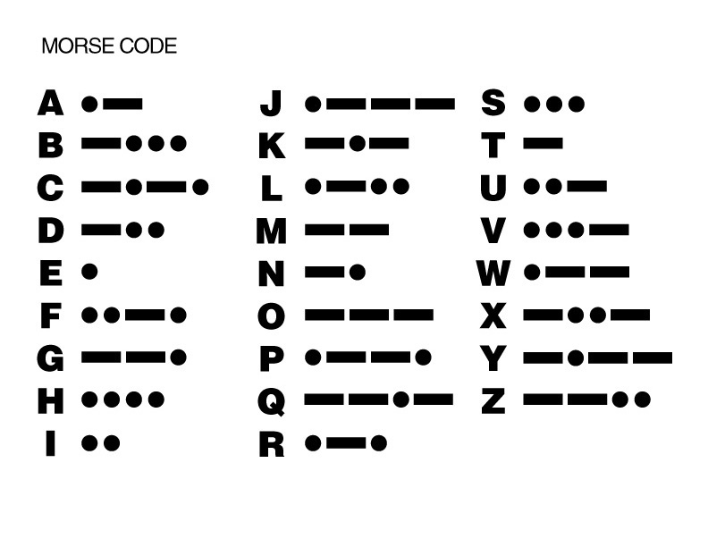
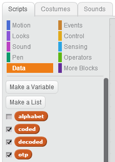
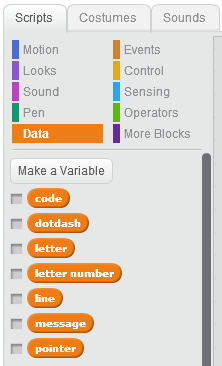

# Introduction { .intro }

In this project you will learn how to make an uncrackable code to send short messages between two secret agents! You will learn how to make the code known as a __one-time-pad__, how to __encode__ a short message so that it looks like gibberish, how to turn the encoded message into __Morse Code__, and how to __decode__ the message at the other end.

The image below shows the __Morse Code__, which was invented by Samuel Morse in 1832 to send messages on telegraph lines, which existed before telephones were invented and which only allowed a simple tone to be sent (like a piano with only one key). The Morse Code defined a pattern of beeps which could be understood at both ends of the line by skilled people. It includes both letters and numbers, but our __otp__ code will only be using letters.



The Morse Code is not secret, like our One Time Pad code, but used internationally to turn letters into a series of dots and dashes. A dot is a short "dit" and a dash a longer "d a h". In our project, the encoded message can be sent using Morse Code because even if someone else picks it up it doesn't make sense. 

Warships still Morse Code today to transmit messages using a bright light over short distances. Radio amateurs also use it to communicate over very long distances with each other - even when very faint and crackly the morse code beeps can still be picked out. The distress call made from the sinking __RMS Titanic__ in 1912 was sent by radio using Morse Code.

<div class="scratch-preview">
  <iframe allowtransparency="true" width="485" height="402" src="https://scratch.mit.edu/projects/114265027/?autostart=true" frameborder="0"></iframe>
  
</div>

# Step 1: Getting Started { .activity }

There is a starting project to save you a little time getting started.

## Activity Checklist { .check }

+ Open the 'Secret Agents' Scratch project. Your club leader will give you a copy of this project, or you can open it online at <a href="http://jumpto.cc/secretagents-resources" target="_blank">jumpto.cc/secretagents-resources</a>.

	

+ There are two Sprites on the stage: __Alex__ on the left who works in London and __Dee__ on the right who is a secret agent in another country.

+ You will also see a third Sprite called __Radio__ which has a lightning symbol. You can't see this on the stage because we will only use it to write some blocks in.

+ There is an __alphabet__ list on the stage. This contains the letters a to z and will be used to convert a letter into a number. You will need to scroll it up and down if you want to check all the letters. For example, __a = 1__, __z = 26__, and __e = 5__.

+ Next to this is a __morse__ list. This contains the __Morse Code__ for each letter, for example the first letter (a) is **._** a short "dit" followed by a "dah".

+ We don't need to see either of these two lists as they won't change. Go to the 'Data blocks' { .blockdata } in the centre of the screen and you will see the two lists with a tick next to them. Click on the tick to turn each one __off__ and this will them on the stage.

	

## Save your project { .save }

# Step 2: Create Lists { .activity }

You have already looked at two lists, the __alphabet list__ and the __morse list__. A __list__ is used to store multiple pieces of information together, so the alphabet list has 26 pieces of information which are the 26 letters of the alphabet, and the morse list the 26 letters of the Morse Code.

For this project, you will need to add three more lists to the Alex sprite.

## Activity Checklist { .check }

+ Go to the 'Data blocks' { .blockdata } and click the _Make a List_ button.

+ Set the name to __otp__ then click OK.

	

	This is the __one-time-pad__ which is defines the code.

+ Add two more lists called __coded__ and __decoded__ in the same way.

	The __coded__ list will contain the message after Alex has encoded it (into gibberish) and which can be safely transmitted to Dee in Morse Code.

	The __decoded__ list will contain the message after Dee has decoded what he was sent.

+ Check that you have the three new lists plus alphabet and morse set like this:

	

	You will see that there is a tick next to the three new lists because we want to see these on the stage - but not alphabet and morse.

+ Move the three lists so that they are laid out on the stage something like this, make them as narrow as you can.

	

## Save your project { .save }

# Step 3: Make Sure the Three New Lists are Empty { .activity }

This step is to make sure that when you run the program you can be sure that the three lists (__otp__, __coded__, and __decoded__) are empty. 

## Activity Checklist { .check }

+ Add this code to the Alex sprite:

	```blocks
		when green flag clicked
		delete (all v) of [otp v]
		delete (all v) of [coded v]
		delete (all v) of [decoded v]
	```

	Be careful __not__ to empty the alphabet or morse lists as well ;-)

## Save your project { .save }

# Step 4: Create Variables { .activity }

A variable contains one piece of information which you can change. They are like lists, except lists can hold more than one piece of information.

## Activity Checklist { .check }

+ Go to the 'Data blocks' { .blockdata } and click the _Make a Variable_ button.

+ Set the name to __code__ then click OK.

	

+ Add five more variables in the same way: __dotdash__, __letter__, __letter number__, __line__, __message__, and __pointer__.

+ Check that you can see these seven variables then hide them by removing the ticks, like you did for the alphabet list.

	

	__code__ is to encode and decode one letter of the message

	__dotdash__ is to hold the morse code for one letter of the encoded message

	__letter__ is to hold one letter of the message

	__letter number__ is to hold the number of the letter in the __letter__ variable (e.g. "e" = 5)

	__line__ is to _point_ to a line in the alphabet list

	__message__ is to hold the original message written by Alex

	__pointer__ is to _point_ to a letter in a message

	When I say _point_ this means it contains a number, not a letter. So if message was "hello" and pointer was 2, then this is pointing to "e".

## Save your project { .save }

# Step 5: Make the One-Time-Pad (OTP) { .activity }

Alphabet: __a b c d e f g h i j k l m n o p q r s t u v w x y z__

The one-time-pad tells you how much to add to each letter of your message to encode it so it looks like gibberish. For instance, if you add 1 to the letter _a_ this would be coded as _b_. If you add 8 to the letter _m_, this would be coded as _u_.

It is called a one-time-pad because you use it __only once__ - you __never__ use the same code again. Provided that your enemy does not have the otp, they will not be able to make sense of your encoded message.

## Activity Checklist { .check }

+ Add this code to the Alex sprite (join it to what you have written already):

	```blocks
		repeat (10) 
	  		add (pick random (1) to (26)) to [otp v]
		end
	```

## Save your project { .save }

## Test your project { .flag }

+ Run the program. Does the otp list contain 10 numbers between 1 and 26? 

+ Run it again and you will get a different set of numbers - they are random so each otp is different.

## Challenge: Encoding a Short Message { .challenge }

Alphabet: __a b c d e f g h i j k l m n o p q r s t u v w x y z__

Suppose I want to send the message __at__ and the first two lines of the otp are 8 and 11.

+ Take the letter __a__ and move along the alphabet 8 letters. I have put the alphabet above to make this a little easier for you. Then __a__ -> b, c, d, e, f, g, h, __i__. So Alex would write down __i__ as the first letter of the coded message (__at__).

+ Take the second letter __t__ and move along the alphabet 11 letters. Hang on, I have got to z! Just go back to a and continue counting so __t__ -> u, v, w, x, y, z, a, b, c, d, __e__. So Alex would write down __e__. Therefore The message __at__ would be sent in code as __ie__.

## Challenge: How do you Decode the Gibberish? { .challenge }

Both Alex and Dee must have the __same__ one-time-pad (otp). Dee needs to decode the message, which looks like gibberish, and turn it back into what Alex wrote. All he has apart from this is the otp (he has no idea what the message says).

+ Using my example above, the otp says 8 and 11 and the "gibberish" received is __ie__. How do you get back to __at__?

__Hint__ it is very similar to how the message was coded in the first place.

Don't worry, Scratch will do these sums for you!

# Step 6: Create a Message { .activity }

This step will ask you to type in the message you want to send.

Your message can only be up to 10 letters __a-z__. This means you __can't__ use numbers, except by spelling them out (_one_, _two_, etc.) or any symbols include spaces. So if Alex wanted to say hello to Dee then the message would be "__hellodee__" and Dee has to use his common sense to work out where the spaces are.

## Activity Checklist { .check }

+ Add these blocks to the Alex sprite to ask what message Alex needs to send and put it into the __message__ variable (join it to what you have written already):

	```blocks
		ask [What is your message?] and wait
		set [message v] to (answer)
	```

## Challenge: Making Sense of Decoded Messages { .challenge }

Imagine you are a secret agent and have received a message which you decoded to be "__englandexpectsthateverymanwilldohisduty__".

+ What are the __words__ in this message - remember spaces are not allowed?

+ This is a famous message sent in 1805. Do you know where and/or by whom?

# Step 7: Turn your Message into Letters { .activity }

The __OTP__ code encodes one letter of the message at a time. This step is to get each letter of your message.

## Activity Checklist { .check }

+ Add this code to the Alex sprite (join it to what you have written already):

	```blocks
		set [pointer v] to [1]
		repeat (length of (message)) 
		  	set [letter v] to (letter (pointer) of (message))
		  	say (letter) for (2) secs
		  	change [pointer v] by (1)
		end
	```

	See how the __repeat__ is used to run the same blocks as many times as the length of the message. e.g. "hello" has a length of 5 so the repeat would be done 5 times for this message.

	The __pointer__ variable points at each letter so has to be set to 1 at the start then have 1 added to it each time.

	The __say__ is only there so you can test if it is working.

+ Check your program looks like this so far:

	```blocks
		when green flag clicked
		delete (all v) of [otp v]
		delete (all v) of [coded v]
		delete (all v) of [decoded v]
		repeat (10) 
		  	add (pick random (1) to (26)) to [otp v]
		end
		ask [What is your message?] and wait
		set [message v] to (answer)
		set [pointer v] to [1]
		repeat (length of (message)) 
			set [letter v] to (letter (pointer) of (message))
			say (letter) for (2) secs
			change [pointer v] by (1)
		end
	```

## Save your project { .save }

## Test your project { .flag }

+ Run the program by clicking the green flag.

+ Type in a message and press enter.

+ Check that you can see Alex saying each letter of your message? In other words, if your message was "hello" then Alex should say "h", "e", "l", "l", "o" every 2 seconds.

# Step 8: Turn a Letter into its Number in the Alphabet { .activity }

You can probably make sense of what I mean by _a + 3 = d_, but a computer doesn't! This step is to turn each letter into its number in the __alphabet list__. e.g. a -> 1, d -> 4 etc. Both Alex and Dee need to do this, so you will write this part so that both sprites can use it.

## Activity Checklist { .check }

+ Add this block to the Alex sprite but __keep it separate to what you have written already__.

	```blocks
		when I receive [get letter number v]
	```

	You will need to __make a new message__ by clicking the down arrow and choosing __new message__. Type in __get letter number__ then press __OK__.

	

+ Add the remaining blocks underneath:

	```blocks
		when I receive [get letter number v]
		set [line v] to [1]
		repeat (26) 
			if <(item (line) of [alphabet v] :: list) = (letter)> then 
		    		set [letter number v] to (line)
				say (letter number) for (2) secs
		  	end
		  	change [line v] by (1)
		end
	```

	This goes through the letters in the alphabet until it finds one the same as the current letter. It then sets the variable __letter number__ to its number value from the __alphabet list__ (a=1, z=26, e=5 etc).

# Step 9: Turn each Letter of your Message into a Number { .activity }

## Activity Checklist { .check }

+ Go back to the main set of blocks you were making.

+ __Remove__ the '__say__ block' { .blocklooks } as this was only there to help with testing:

	```blocks
		say (letter) for (2) secs
	```
+ Replace it with this '__broadcast get and wait__ block' { .blockevents }:

	```blocks
		broadcast [get letter number v] and wait
	```

	This will "kick off" your other set of blocks. You have to wait until this is finished (otherwise the __letter number__ variable will not be set yet).

	Be careful to use the block with __wait__ on it.

+ Check that Alex's code looks like this so far:

	```blocks
		when green flag clicked
		delete (all v) of [otp v]
		delete (all v) of [coded v]
		delete (all v) of [decoded v]
		repeat (10) 
		  	add (pick random (1) to (26)) to [otp v]
		end
		ask [What is your message?] and wait
		set [message v] to (answer)
		set [pointer v] to [1]
		repeat (length of (message)) 
		  	set [letter v] to (letter (pointer) of (message))
		  	broadcast [get letter number v] and wait
		  	change [pointer v] by (1)
		end
		
		when I receive [get letter number v]
		set [line v] to [1]
		repeat (26) 
		  	if <(item (line) of [alphabet v] :: list) = (letter)> then 
		    		set [letter number v] to (line)
				say (letter number) for (2) secs
		  	end
		  	change [line v] by (1)
		end
	```

## Save your project { .save }

## Test your project { .flag }

+ Type in the message __abcde__ and check that Alex says __1__, __2__, __3__, __4__, __5__.

+ Type in a short message of your choice and see if you agree with the numbers Alex is saying. Remember that a=1, z=26, e=5 etc.

# Step 10 Remove the Say Block { .activity }

Go back to the second set of blocks. The __say__ block was only there to help with testing so can now be taken out.

## Activity Checklist { .check }

+ Remove the '__say__ block' { .blocklooks }

	```blocks
		say (letter number) for (2) secs
	```

+ Check that this part of the program looks like this:

	```blocks
		when I receive [get letter number v]
		set [line v] to [1]
		repeat (26) 
		  	if <(item (line) of [alphabet v] :: list) = (letter)> then 
		    		set [letter number v] to (line)
		  	end
		  	change [line v] by (1)
		end
	```

## Save your project { .save }

# Step 11 Code One Letter { .activity }

The way that the otp code works is by each letter in your message having some number added to it. If my message is "help" then I will add the first number of the otp to "h", the second number to "e" and so on. Unless you have the otp you __cannot__ decode the message.

## Activity Checklist { .check }

+ Put these blocks by themselves on the Alex sprite - beware that when you add the __broadcast__ block you will need to define a new message __transmit__.

	```blocks
		set [code v] to ((item (pointer) of [otp v] :: list) + (letter number))
		if <(code) > [26]> then 
			set [code v] to ((code) - (26))
		end
		add (item (code) of [alphabet v] :: list) to [coded v]
	  	say (coded :: list)
  		broadcast [transmit v] and wait
	```

	First __code__ is set to letter number + the otp code. If you have gone past z then you take 26 off (to go back to a).

	Now the new number can be changed back into a letter of the alphabet and added to the encoded message.

	Alex says the encoded message so far then broadcasts a transmit message and waits. This broadcast doesn't do anything __yet__.

+ Put this new group into the '__repeat__ block' { .blockcontrol }. I have shown where to add it by the spaces but you need to join the program up.

	```blocks
		when green flag clicked
		delete (all v) of [otp v]
		delete (all v) of [coded v]
		delete (all v) of [decoded v]
		repeat (10) 
			add (pick random (1) to (26)) to [otp v]
		end
		ask [What is your message?] and wait
		set [message v] to (answer)
		set [pointer v] to [1]
		repeat (length of (message)) 
			set [letter v] to (letter (pointer) of (message))
			broadcast [get letter number v] and wait

			set [code v] to ((item (pointer) of [otp v] :: list) + (letter number))
			if <(code) > [26]> then 
				set [code v] to ((code) - (26))
			end
			add (item (code) of [alphabet v] :: list) to [coded v]
	  		say (coded :: list)
  			broadcast [transmit v] and wait

			change [pointer v] by (1)
		end
	```

## Save your project { .save }

## Test your project { .flag }

+ Run the program and enter the message __abcde__ as you did before.

+ Check that the __coded__ list in the centre of the stage shows 5 letters which are "gibberish". This is the coded message which Alex would send to Dee and need to decode back to __abcde__.

+ Run the program again and enter the same message __abcde__ and check that the __coded__ message is different this time. This is because a new one-time-pad is made every time you run the program, so the encoding is different.

+ Run the program again and type in your own message and check what the __coded__ message looks like.

## Challenge: Security of a One Time Pad Code { .challenge }

An otp code is impossible to crack, which means you cannot work out what the letters in the original message are if you only have the encoded version. Only the two people with the otp can decode it because the contents are random.

+ You are a secret agent working in an enemy country. You have hidden your radio and your otp. If the enemy capture your radio, does this matter? 

+ What about if they find the otp?

__Hint__ What do you need to decode the message?

# Step 12 Finish Alex's program { .activity }

When Alex finishes encoding a message and sending it, she needs to tell Dee it is finished so he can start decoding it.

## Activity Checklist { .check }

+ Add this block to the end of the main program

	```blocks
		broadcast [message1 v]
	```

+ Check that the Alex sprite has these two sets of blocks:

	```blocks
		when green flag clicked
		delete (all v) of [otp v]
		delete (all v) of [coded v]
		delete (all v) of [decoded v]
		repeat (10) 
		  	add (pick random (1) to (26)) to [otp v]
		end
		ask [What is your message?] and wait
		set [message v] to (answer)
		set [pointer v] to [1]
		repeat (length of (message)) 
		  	set [letter v] to (letter (pointer) of (message))
		  	broadcast [get letter number v] and wait
		  	set [code v] to ((item (pointer) of [otp v] :: list) + (letter number))
		  	if <(code) > [26]> then 
		    		set [code v] to ((code) - (26))
		  	end
		  	add (item (code) of [alphabet v] :: list) to [coded v]
		  	say (coded :: list)
	  		broadcast [transmit v] and wait
		  	change [pointer v] by (1)
		end
		broadcast [message1 v]

		when I receive [get letter number v]
		set [line v] to [1]
		repeat (26) 
		  	if <(item (line) of [alphabet v] :: list) = (letter)> then 
		    		set [letter number v] to (line)
		  	end
		  	change [line v] by (1)
		end
	```

## Save your project { .save }

## Challenge: More than 10 Letters in a Message? { .challenge }

+ Run the program and type in a message which is longer than 10 letters, I suggest __abcdefghijkl__ which is 12 letters long.

+ Check the __coded__ list and it should look like gibberish, but what about the last two letters? You should find these are __kl__ so have not been changed. What __single__ change would you need to make to allow for a message of up to 12 letters so that __abcdefghijkl__ is encoded properly?

# Step 13 Decode the Message { .activity }

Decoding is the process of turning the received message, which looks like gibberish, back into the original message.

## Activity Checklist { .check }

+ Add these blocks to the __Dee__ sprite:

	```blocks
		when I receive [message1 v]
		say (coded :: list)
		set [pointer v] to [1]
		repeat (length of [coded v] :: list) 
		end
		say (decoded :: list)
	```

	Note that these blocks will start when Alex transmits "message1".

	__pointer__ is used to get each letter of the message received.

	The __repeat__ block is run as many times as the length of the received message. At the moment there is nothing inside it.

+ Make these blocks by themselves which do the actual decoding:

	```blocks
		set [letter v] to (item (pointer) of [coded v] :: list)
  		broadcast [get letter number v] and wait
  		set [code v] to ((letter number) - (item (pointer) of [otp v] :: list))
  		if <(code) < [1]> then 
    			set [code v] to ((code) + (26))
  		end
  		add (item (code) of [alphabet v] :: list) to [decoded v]
  		change [pointer v] by (1)
	```

	__letter__ holds the current coded letter

	The second line turns this into a number reusing the code you wrote for Alex.

	__code__ is calculated now by subtracting the otp value then adding 26 if it has gone past a.

	Finally the decoded letter is added to the decoded list.

+ When you are sure that these two sections are correct, put the second one inside the "jaws" of the '__repeat__ block' { .blockcontrol }. I have left a space to show where it needs to go, you need to join it all up.

	```blocks
		when I receive [message1 v]
		say (coded :: list)
		set [pointer v] to [1]
		repeat (length of [coded v] :: list) 

		set [letter v] to (item (pointer) of [coded v] :: list)
  		broadcast [get letter number v] and wait
  		set [code v] to ((letter number) - (item (pointer) of [otp v] :: list))
  		if <(code) < [1]> then 
    			set [code v] to ((code) + (26))
  		end
  		add (item (code) of [alphabet v] :: list) to [decoded v]
  		change [pointer v] by (1)

		end
		say (decoded :: list)
	```

## Save your project { .save }

## Test your project { .flag }

The main parts of the program are complete. Now you need to run it and see if all the bits work.

+ Click the green flag to start the program.

+ Type in the message __abcde__ and press ENTER.

+ It should run very quickly and when it is finished, does the __decoded__ list contain the original message __abcde__?

+ Does Dee also say it?

+ If it doesn't work, check your program with the listing below and when you find something wrong and fix it, do the test above again.

__Alex Sprite__:

	```blocks
		when green flag clicked
		delete (all v) of [otp v]
		delete (all v) of [coded v]
		delete (all v) of [decoded v]
		repeat (10) 
		  	add (pick random (1) to (26)) to [otp v]
		end
		ask [What is your message?] and wait
		set [message v] to (answer)
		set [pointer v] to [1]
		repeat (length of (message)) 
		  	set [letter v] to (letter (pointer) of (message))
		  	broadcast [get letter number v] and wait
		  	set [code v] to ((item (pointer) of [otp v] :: list) + (letter number))
		  	if <(code) > [26]> then 
		    		set [code v] to ((code) - (26))
		  	end
		  	add (item (code) of [alphabet v] :: list) to [coded v]
		  	say (coded :: list)
	  		broadcast [transmit v] and wait
		  	change [pointer v] by (1)
		end
		broadcast [message1 v]

		when I receive [get letter number v]
		set [line v] to [1]
		repeat (26) 
		  	if <(item (line) of [alphabet v] :: list) = (letter)> then 
		    		set [letter number v] to (line)
		  	end
		  	change [line v] by (1)
		end
	```

__Dee Sprite__:

	```blocks
		when I receive [message1 v]
		say (coded :: list)
		set [pointer v] to [1]
		repeat (length of [coded v] :: list) 
		  	set [letter v] to (item (pointer) of [coded v] :: list)
		  	broadcast [get letter number v] and wait
		  	set [code v] to ((letter number) - (item (pointer) of [otp v] :: list))
		  	if <(code) < [1]> then 
		    		set [code v] to ((code) + (26))
		  	end
		  	add (item (code) of [alphabet v] :: list) to [decoded v]
		  	change [pointer v] by (1)
		end
		say (decoded :: list)
	```

+ Run the program again and try it with messages of your own and check that it is decoded by Dee. Be careful to make sure that you type in a message which is __allowed__ - 10 letters a-z maximum, no spaces or symbols.

# Step 14 Transmit the Message using Morse Code { .activity }

The encoding and decoding works while Alex and Dee are next to each other. But when Dee is in another country, Alex needs to send the encoded message to him by radio using Morse Code.

## Activity Checklist { .check }

+ Add these blocks to the __Radio__ sprite:

	```blocks
		when I receive [transmit v]
		set [letter v] to (item (code) of [alphabet v] :: list)
		broadcast [get letter number v] and wait
		set [code v] to (item (letter number) of [morse v] :: list)
		set [letter v] to [1]
		repeat (length of (code)) 
		  set [dotdash v] to (letter (letter) of (code))
		  if <(dotdash) = [.]> then 
		    play note (72 v) for (0.1) beats
		  else 
		    play note (72 v) for (0.3) beats
		  end
		  rest for (0.1) beats
		  change [letter v] by (1)
		end
		rest for (0.3) beats
	```

	These blocks will start when Alex broadcasts the message "transmit". 

	First Alex needs to get the current letter of the message and turn it into a letter number, which is then turned into a Morse Code letter (which contains dots and dashes). 

	Because there are multiple dots and dashes, these have to be looked at one at a time so that a short tone can be played for a dot (0.1 beats) and a longer one for a dash (0.3 beats). 

	Between each dot and dash there needs to be a slight gap (0.1 beats), and between each complete letter a longer gap (0.3 beats).

## Save your project { .save }

## Test your project { .flag }

Check to see if the morse code part works. As Alex encodes each letter, the morse code for the encoded letter can be heard before Dee starts to decode it.

+ Click the green flag to start the program.

+ Type in the message __abcde__ and press ENTER.

+ As each letter is encoded and appears in the coded list, you should hear the morse code of the __encoded__ letter for each one. Check a few of these with the Morse Code table below and check they are correct.


+ If it doesn't work or is giving the wrong answers, check the blocks for the Radio sprite below. Correct any mistakes you find and do the test again.

	```blocks
		when I receive [transmit v]
		set [letter v] to (item (code) of [alphabet v] :: list)
		broadcast [get letter number v] and wait
		set [code v] to (item (letter number) of [morse v] :: list)
		set [letter v] to [1]
		repeat (length of (code)) 
		  set [dotdash v] to (letter (letter) of (code))
		  if <(dotdash) = [.]> then 
		    play note (72 v) for (0.1) beats
		  else 
		    play note (72 v) for (0.3) beats
		  end
		  rest for (0.1) beats
		  change [letter v] by (1)
		end
		rest for (0.3) beats
	```

+ I have picked a note for the Morse Code "beeps" but you can change this to a different sound if you wish (but the same note should be used for both dots and dashes).
