---
title: ChatBot
level: Scratch 1
language: en-GB
stylesheet: scratch
embeds: "*.png"
materials: ["Club Leader Resources/*.*"]
...

# Introduction { .intro }

You are going to learn how to program your own talking robot!

<div class="scratch-preview">
	<iframe allowtransparency="true" width="485" height="402" src="http://scratch.mit.edu/projects/embed/26762091/?autostart=true" frameborder="0"></iframe>
	
</div>

# Step 1: Your chatbot { .activity }

## Activity Checklist { .check }

+ Before you start making your chatbot, you need to decide on their personality.
	+ What is their name?
	+ Where do they live?
	+ Are they happy? serious? funny? shy? friendly?

+ Start a new project, and delete the cat sprite, so that your project is empty.

+ Choose one of these character sprites, and add them to your project:

	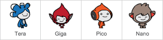

+ Choose a backdrop that fits your chatbot's personality. Here's an example, although yours doesn't have to look like this:

	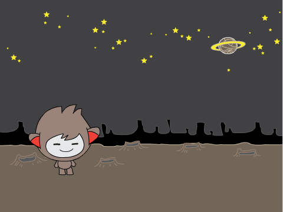

## Save your project { .save }

# Step 2: A talking chatbot { .activity }

Now that you have a chatbot with a personality, let's program it to talk to us.

## Activity Checklist { .check }

+ Click on your chatbot character, and add this code:

	```blocks
		when this sprite clicked
		ask [Hey! What's your name?] and wait
		say [What a lovely name!] for (2) secs
	```

+ Click your chatbot to test it out. After you are asked your name, type it into the box along the bottom of the stage, and click the tick (or press return).

	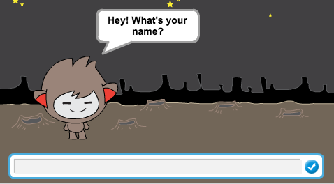

+ Your chatbot simply replies "What a lovely name!" every time. You can personalise your chatbot's reply, by making use of the user's answer. Change the chatbot's code, so that it looks like this:

	```blocks
		when this sprite clicked
		ask [Hey! What's your name?] and wait
		say <join [Hi] (answer)> for (2) secs
	```

	To create the last block, you'll need to first drag on a green `join` {.blockoperators} block, and drag it on to the `say` {.blocklooks} block.

	

	You can then change the text "hello" to say "Hi", and drag the light blue `answer` {.blocksensing} block (from the 'Sensing' section) onto the text "world".

	

+ Test out this new program. Does it work as you expected? Can you fix any problems that you can see? (Hint: you can try adding in a space somewhere!)

+ It may be that you want to store the user's name in a variable, so that you can use it again later. Create a new variable called 'name'. If you've forgotten how to do this, the previous 'Balloons' project will help you.

+ The information that you entered is already stored in a special variable called 'answer'. Go to the Sensing group of blocks and click the answer block so that a tick appears. The current value in 'answer' should then be shown on the top-left of the stage.

+ Once you've created your new variable, make sure that your chatbot's code looks like this:

	```blocks
		when this sprite clicked
		ask [Hey! What's your name?] and wait
		set [name v] to (answer)
		say <join [Hi ] (name)> for (2) secs
	```

+ If you test your program again, you'll notice that the answer is stored in the 'name' variable, and is shown in the top-left of the stage. The 'name' variable should now contain the same value as the 'answer' variable.

	

	If you'd rather not see the variable on your stage, you can click the tick next to the variable name in the 'Scripts' tab to hide it.

## Save your project { .save }

## Challenge: More questions { .challenge }

Program your chatbot to ask another question. Can you store their answer in a variable?

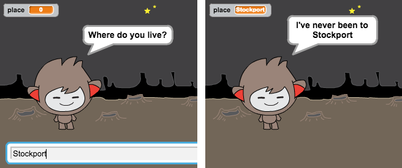

## Save your project { .save }

# Step 3: Making decisions { .activity }

You can program your chatbot to decide what to do, based on the user's responses.

## Activity Checklist { .check }

+ Let's get your chatbot to ask the user a question which has a 'yes' or 'no' answer. Here's an example, but you can change the question if you like:

	```blocks
		when this sprite clicked
		ask [Hey! What's your name?] and wait
		set [name v] to (answer)
		say <join [Hi ] (name)> for (2) secs
		ask <join [Are you OK ] (name)> and wait
		if ((answer)=[yes]) then
			say [That's great to hear!] for (2) secs
		end
	```

	Notice that now you've stored the user's name in a variable, you can use it as much as you like.

+ To test this program properly, you'll need to test it twice - once typing 'no' as your answer, and once typing 'yes'. You should only get a response from your chatbot `if` {.blockcontrol} you answer 'yes'.

+ The trouble with your chatbot is that it doesn't give a reply if the user answers 'no'. You can fix this, by changing the `if` {.blockcontrol} block to an `if/else` {.blockcontrol} block, so that your code now looks like this:

	```blocks
		when this sprite clicked
		ask [Hey! What's your name?] and wait
		set [name v] to (answer)
		say <join [Hi ] (name)> for (2) secs
		ask <join [Are you OK ] (name)> and wait
		if ((answer)=[yes]) then
			say [That's great to hear!] for (2) secs
		else
			say [Oh no!] for (2) secs
		end
	```

+ If you test your code, you'll now see that you get a response when you answer 'yes' or 'no'. Your chatbot should reply with "That's great to hear!" when you answer 'yes', but will reply with "Oh no!" if you type anything other than yes (`else` {.blockcontrol} means 'otherwise').

	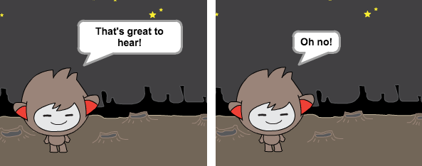

+ You can put any code inside an `if` {.blockcontrol} or `else` {.blockcontrol} block, not just code to make your chatbot speak. For example, you can change the chatbot's costume to match the response.

	If you have a look at your chatbot's costumes, you may see that there is more than one. (If not, you can always add more yourself!)

	

	You can use these costumes as part of your chatbot's response, by using this code:

	```blocks
		when this sprite clicked
		switch costume to [nano-a v]
		ask [Hey! What's your name?] and wait
		set [name v] to (answer)
		say <join [Hi ] (name)> for (2) secs
		ask <join [Are you OK ] (name)> and wait
		if ((answer)=[yes]) then
			switch costume to [nano-c v]
			say [That's great to hear!] for (2) secs
		else
			switch costume to [nano-d v]
			say [Oh no!] for (2) secs
		end
	```

+ Test out your program, and you should see your chatbot's face change depending on the answer you give.

	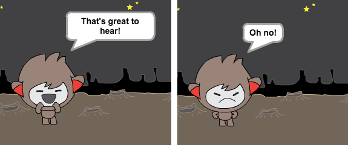

## Save your project { .save }

## Challenge: More decisions { .challenge }

Program your chatbot to ask another question - something with a 'yes' or 'no' answer. Can you make your chatbot respond to the answer?

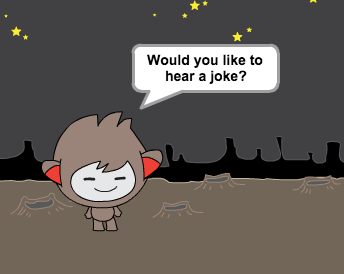

## Save your project { .save }

# Step 4: Changing location { .activity }

You can also program your chatbot to change its location.

## Activity Checklist { .check }

+ Add another backdrop to your stage, and make sure that it has a useful name (for example 'bedroom2').

	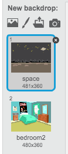

+ You can now program your chatbot to change location, by adding this code to your chatbot:

	```blocks
		ask [I'm going home, do you want to come with me?] and wait
		if ((answer) = [yes]) then
			switch backdrop to [bedroom2 v]
		end
	```

+ You also need to make sure that your chatbot is outside when you start talking to it. Add this block to the top of your chatbot code:

	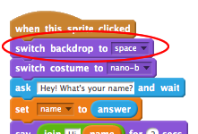

+ Test your program, and answer 'yes' when asked if you want to go home. You should see that the chatbot's location has changed.

	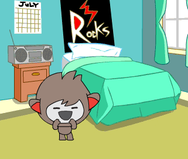

+ Does your chatbot change location if you type 'no'? What about if you type 'I'm not sure'?

## Save your project { .save }

## Challenge: Make your own chatbot {.challenge}
Use what you've learnt to finish creating your interactive chatbot. Here are some ideas:

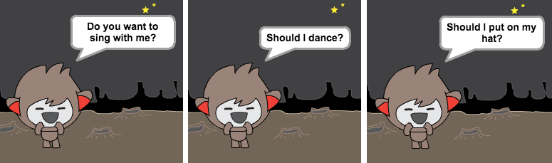

Once you've finished making your chatbot, get your friends to have a conversation with it! Do they like your character? Did they spot any problems?

## Save your project { .save }
