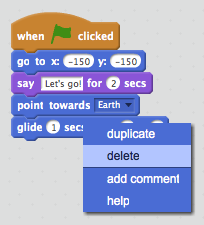
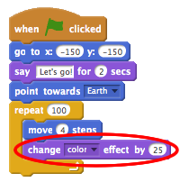
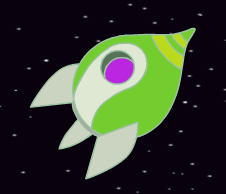
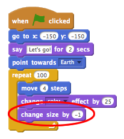
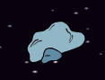
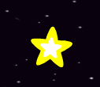

---
title: Lost in Space
level: Scratch 1
language: en-GB
stylesheet: scratch
embeds: "*.png"
materials: ["Club Leader Resources/*"]
...

# Introduction { .intro }

You are going to learn how to program your own animation!

<div class="scratch-preview">
	<iframe allowtransparency="true" width="485" height="402" src="http://scratch.mit.edu/projects/embed/26818098/?autostart=false" frameborder="0"></iframe>
	
</div>

# Step 1: Animating a spaceship { .activity .new-page}

Let's make a spaceship that flies towards the Earth!

## Activity Checklist { .check }

+ Start a new Scratch project, and delete the cat sprite so that your project is empty. You can find the online Scratch editor at <a href="http://jumpto.cc/scratch-new">jumpto.cc/scratch-new</a>.

+ Add 'Spaceship' and 'Earth' sprites to your stage. You should also add the 'Stars' backdrop to your stage. This is how your stage should look:
  
	

+ Click on your new spaceship sprite, and click the 'Costumes' tab.

	

+ Use the arrow tool to select the image. Then click on the circular rotate handle, and rotate the image until it is on its side.

	

+ Add this code to your spaceship sprite:

	
	
	Change the numbers in the code blocks, so that the code is exactly the same as in the image above.

+ If you click on the code blocks to run the code, you should see the spaceship speak, turn and move towards the centre of the stage.

	
	
	The screen position `x:(0) y:(0)` {.blockmotion} is the center of the stage. A position like `x:(-150) y:(-150)` {.blockmotion} is towards the bottom-left of the stage, and a position like `x:(150) y:(150)` {.blockmotion} is near the top-right.
	
	
	
	If you need to know the coordinates of a position on the stage, move the mouse to the position you want and make a note of the coordinates, which are displayed below the stage.
	
	

+ Try out your animation, by clicking on the green flag just above the stage.

	

## Challenge: Improving your animation {.challenge}
Can you change the numbers in your animation code, so that:
+ The spaceship moves until it touches the Earth?
+ The spaceship moves more slowly towards the Earth?

You'll need to change the numbers in this block:

```blocks
	glide (1) secs to x:(0) y:(0)
```

## Save your project { .save }

# Step 2: Animating using loops { .activity .new-page }

Another way of animating the spaceship is to tell it to move a small amount, lots of times.

## Activity Checklist { .check }

+ Delete the `glide` {.blockmotion} block from your code, by right-clicking on the block and clicking 'delete'. You can also delete code by dragging it off the script area, back into the code blocks area.

	

+ Once you've removed your code, add this code instead:

	
	
	The `repeat` {.blockcontrol} block is used to repeat something lots of times, and is also known as a __loop__.

+ If you click the flag to try out this new code, you'll see that it does pretty much the same thing as before.

+ You can add more code to your loop, to do interesting things. Add the `change color effect by 25` {.blocklooks} block into the loop (from the 'Looks' section), to repeatedly change the colour of the spaceship as it moves:

	

+ Click the flag to see your new animation.

	

+ You can also make your spaceship get smaller as it moves towards the Earth.

	

+ Test out your animation. What happens if you click the flag a second time? Does your spaceship start off the right size? Can you use this block to fix your animation:

	```scratch
		set size to (100) %
	```

## Save your project { .save }

# Step 3: Floating Monkey { .activity .new-page }

Let's add monkey to your animation, who's lost in space! 

## Activity Checklist { .check }

+ Start by adding in the monkey sprite from the library.

	

+ If you click on your new monkey sprite and then click 'Costumes', you can edit how the monkey looks. Click the 'Ellipse' tool, and draw a white space helmet around the monkey's head.

	

+ Now click 'Scripts', and add this code to the monkey, so that it spins slowly in a circle forever:

	```blocks
		when FLAG clicked
		forever
		turn right (1) degrees
		end
	```

	The `forever` {.blockcontrol} block is another loop, but this time one that never ends.

+ Click the flag to test your monkey. You'll have to click the stop button (next to the flag) to end this animation.

	

# Step 4: Bouncing Asteroids { .activity .new-page }

Let's add some floating space-rock to your animation.

## Activity Checklist { .check }

+ Add a 'rock' sprite to your animation.

	

+ Add this code to your rock, to make it bounce around the stage:

	```scratch
		when flag clicked
		point towards [Earth v]
		forever
		move (2) steps
		if on edge, bounce
	```

+ Click the flag to test your rock. Does it bounce around the stage?

# Step 5: Shining Stars { .activity .new-page }

Let's combine loops to make a shining star.

## Activity Checklist { .check }

+ Add a 'star' sprite to your animation

	

+ Add this code to your star:

	

+ Click the flag to test out this star animation. What does this code do? Well, the star is made slightly bigger 20 times, and then made slightly smaller 20 times, back to it's original size. These 2 loops are inside a `forever` {.blockcontrol} loop, so the animation keeps repeating.

## Save your project { .save }

## Challenge: Make your own animation {.challenge}
Stop your space animation, and click 'File' and then 'New', to start a new project.

Use what you've learnt in this project to make your own animation. It can be anything you like, but try to make your animation match the setting. Here are some examples:


## Save your project { .save }
