---
title: Lost in Space
level: Scratch 1
language: en-GB
stylesheet: scratch
embeds: "*.png"
materials: ["LostInSpace.sb2"]
beta: true
...

# Introduction { .intro }

You are going to learn how to program your own animation!

<div class="scratch-preview">
	<iframe allowtransparency="true" width="485" height="402" src="http://scratch.mit.edu/projects/embed/26818098/?autostart=true" frameborder="0"></iframe>
	
</div>

# Step 1: Sprites { .activity }

## Activity Checklist { .check }

+ First, make sure that you have opened up the <a href="http://scratch.mit.edu/projects/editor/" target="_blank">Scratch editor</a>. It should look something like this:
    
	

+ Before you can start animating, you'll need to add in a 'thing' to animate. In Scratch, these 'things' are called 'sprites'. The cat that you can see is a sprite called Felix, who is the Scratch mascot. Let's get rid of him for now, by right-clicking on him, and clicking 'delete'.
	    
	

+ Next, click 'Choose sprite from library' to open up a list of all the available Scratch sprites.
	    
	

+ Scroll down until you see a spaceship sprite. Click on the spaceship, and click 'OK' to add it to your animation.
	    
	

+ Click on your new spaceship sprite, and click the 'Costumes' tab.

	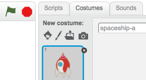

+ Use the arrow tool to select the image. Then click on the circular rotate handle, and rotate the image until it is on its side.

	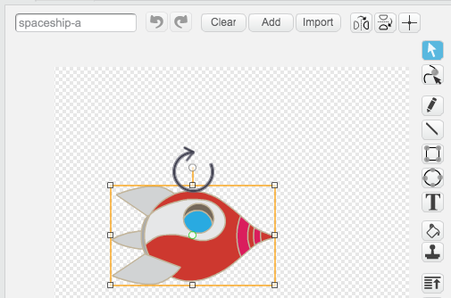

+ You should now have a big spaceship on your 'stage'. The 'stage' is the area on the left, and is where your animation will happen. Think of it as a performance area, just like a real stage! You can drag the spaceship around the stage to move it.
	    
	At the moment, the stage is white, and looks pretty boring! Let's add a backdrop to the stage, by clicking on the 'Stage' icon, and then clicking 'Choose backdrop from library'.

	

+ Click 'Space' on the left, and then click the 'Stars' backdrop and click 'OK' to add it to the stage. 

	

	Your stage should now look like this:

	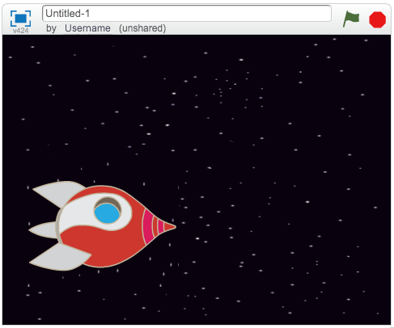    

##Challenge: Adding another sprite { .challenge }
Can you add another sprite (the Earth) to your stage, so that it looks like this:


## Save your project { .save }
You should save your work regularly, so that you don't lose it. First, give your program a name, by typing one into the text box above the stage. You can then click 'File' and then 'Save now' to save your project.  

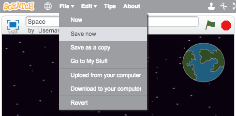

If you're using Scratch online, clicking 'Save' adds your program to your 'stuff', which is an online folder that you can access from anywhere, even from home. You can access your stuff by clicking 'File', and then clicking 'Go to My Stuff'.


This shows you a list of all your projects. Click 'See inside' to continue programming your animation.

If you're using Scratch online and don't have a username, you can click 'Download to your computer' to save your project.

# Step 2: Animating your sprites { .activity .new-page}

Now that you have some sprites, let's add code to animate them!

## Activity Checklist { .check }

+ Let's create a script for the spaceship, by using code blocks. You can find the blocks in the 'Scripts' tab, and they are all colour-coded! Drag these 2 blocks into the code area to the right, making sure that they are connected together (like Lego blocks).

	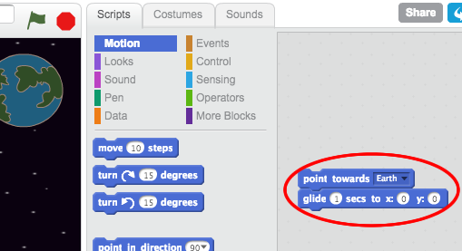

	Change the numbers in the code blocks, so that the code is exactly the same as in the image above. Here is the code that you should add:

	```blocks
		point towards [Earth v]
		glide (1) secs to x:(0) y: (0)
	```

	To make the `point towards Earth` {.blockmotion} block, you'll have to drag on the block, and then click the down arrow to select your 'Earth' sprite.

	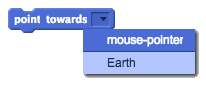

+ If you click on the code blocks to run the code, you should see the spaceship turn and move towards the centre of the stage.

	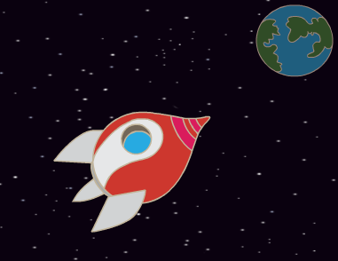

	The screen position `x:(0) y:(0)` {.blockmotion} is the center of the stage. A position like `x:(-150) y:(-150)` {.blockmotion} is towards the bottom-left of the stage, and a position like `x:(150) y:(150)` {.blockmotion} is near the top-right.

	

	If you need to know the coordinates of a position on the stage, move the mouse to the position you want and make a note of the coordinates, which are displayed below the stage.

	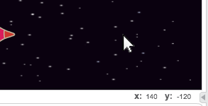

+ If you try to click the code again, to run it a second time, nothing happens! That's because the spaceship is already at the position it's been told to glide to. Let's improve your animation, by telling the spaceship to start at the bottom-left of the stage, and point upwards to begin with. 

+ Add some more blocks to your animation, adding them on top of the blocks you already have. Your code should now look like this:

	```blocks
		point in direction (0 v)
		go to x:(-150) y:(-150)
		wait (1) secs
		point towards [Earth v]
		glide (1) secs to x:(0) y: (0)
	```

	You'll find the `wait (1) secs` {.blockcontrol} block by clicking on the orange `Control` {.blockcontrol} blocks section. 

+ Your spaceship now moves _every_ time you run your code. Try it!

+ You can also attach your animation code to an 'event'. This means that the code will run when something happens, such as when the green flag is clicked, a key is pressed or a sprite is clicked.

	

	Drag an event onto the start of your code, so that your animation starts when the green flag is clicked. This is how your code should look:

	```blocks
		when FLAG clicked
		point in direction (0 v)
		go to x:(-150) y:(-150)
		wait (1) secs
		point towards [Earth v]
		glide (1) secs to x:(0) y: (0)
	```

+ Try out your animation a few times, by clicking on the green flag just above the stage.

	

## Challenge: Improving your animation {.challenge}
Can you change the numbers in your animation code, so that:
+ The spaceship moves until it touches the Earth?
+ The spaceship moves more slowly towards the Earth?

You'll need to change the numbers in this block:

```blocks
	glide (1) secs to x:(0) y:(0)
```

## Save your project { .save }

# Step 3: Animating using loops { .activity }

## Activity Checklist { .check }

+ Another way of animating the spaceship is to tell it to move a small amount (say 4 steps), lots of times. Delete the `glide` {.blockmotion} block from your code, by right-clicking on the block and clicking 'delete'. You can also delete code by dragging it off the script area, back into the code blocks area. 

+ Once you've removed your code, add this code instead:

	```blocks
		when FLAG clicked
		point in direction (0 v)
		go to x:(-150) y:(-150)
		wait (1) secs
		point towards [Earth v]
		repeat (100)
		    move (4) steps
		end
	```

+ The `repeat` {.blockcontrol} block is used to repeat something lots of times, and is also known as a 'loop'. If you click the flag to try out this new code, you'll see that it does pretty much the same thing as before. 

+ Using a loop to move the spaceship means that you can add more code inside the `repeat (100)` {.blockcontrol} loop to do interesting things. Add the `change color effect by 25` {.blocklooks} block into the loop (from the 'Looks' section), to repeatedly change the colour of the spaceship as it moves:

	```blocks
		when FLAG clicked
		point in direction (0 v)
		go to x:(-150) y:(-150)
		wait (1) secs
		point towards [Earth v]
		repeat (100)
		    move (4) steps
		    change [color v] effect by (25)
		end
	```

+ Click the flag to see your new animation.

+ You can also improve your animation, by making the spaceship get smaller as it moves towards the Earth. Remember to also add code to the top of your animation, to make your spaceship full size to start with.

	```blocks
		when FLAG clicked
		set size to (100)%
		point in direction (0 v)
		go to x:(-150) y:(-150)
		wait (1) secs
		point towards [Earth v]
		repeat (100)
		    move (4) steps
		    change [color v] effect by (25)
		    change size by (-1)
		end
	```

+ If you try out your animation now, you'll see that it looks much better than before!

## Save your project { .save }

# Step 4: More loops { .activity }

## Activity Checklist { .check }

+ Let's add monkey to your animation, who's lost in space! Start by adding in the monkey sprite from the library.

	

+ If you click on your new monkey sprite and then click 'Costumes', you can edit how the monkey looks. Click the 'Ellipse' tool, and draw a white space helmet around the monkey's head.

	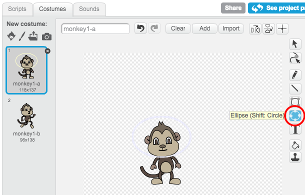

+ Now click 'Scripts', and add this code to the monkey, so that it spins slowly in a circle forever:

	```blocks
		when FLAG clicked
		forever
		    turn right (1) degrees
		end
	```

	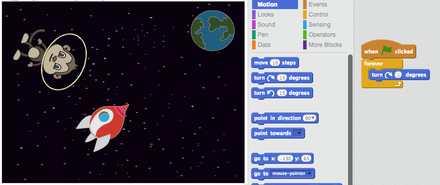

	The `forever` {.blockcontrol} block is another loop, but this time one that never ends. You'll have to click the stop button (next to the flag) to end this animation.

+ You can also combine loops. Add a 'star' sprite to your animation, and add this code to it:

	```blocks
		when FLAG clicked
		forever
		  repeat(20)
		    change size by (2)
		  end
		  repeat(20)
		    change size by (-2)
		  end
		end
	```

	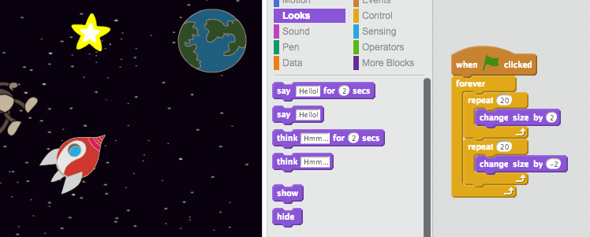

+ Click the flag to test out this star animation. What does this code do? Well, the star is made slightly bigger 20 times, and then made slightly smaller 20 times, back to it's original size. These 2 loops are inside a `forever` {.blockcontrol} loop, so the animation keeps repeating.

## Save your project { .save }

## Challenge: Make your own animation {.challenge}
Stop your space animation, and click 'File' and then 'New', to start a new project. Use what you've learnt in this project to make your own animation. It can be anything you like, but try to make your animation match the setting. Here are some examples:


## Save your project { .save }

Well done! You've now completed your first Scratch project. If you are using the online editor, you can let others see your animation by clicking 'Share' in the top-right of the Scratch editor!

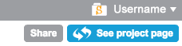
