---
title: (Beta) Paint Box
level: Term 1
language: en-GB
stylesheet: scratch
embeds: "*.png"
materials: ["PaintBox.sb2","Resources/*.*"]
...

#Heads Up! { .beta}
This project is in Beta. That means we're still testing it, and there's a small chance there could be some bugs or typos. If you're a club leader trying out this project, please complete <a href="https://docs.google.com/forms/d/15QLeJ_aDklioXl5cUyUK1KqZ7lUhCiewl3qiwXOg41M/viewform?usp=send_form" target="_blank">this short questionnaire</a> (or email projects@codeclub.org.uk) to let us know how it went!

# Introduction { .intro }

In this project, you will be making your own paint program!

<div class="scratch-preview">
	<iframe allowtransparency="true" width="485" height="402" src="http://scratch.mit.edu/projects/embed/28541444/?autostart=true" frameborder="0"></iframe>
	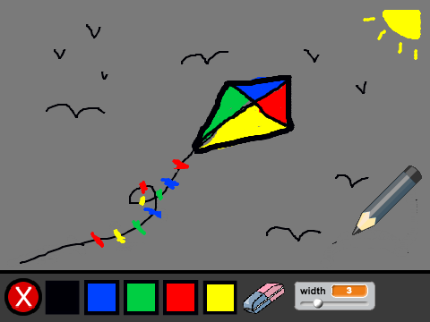
</div>

# Step 1: Making a pen { .activity }

Let's start by making a pen, that can be used to draw on the stage.

## Activity Checklist { .check }

+ Start a new project, and delete the cat sprite, so that your project is empty.

+ For this project, you should have a 'Resources' folder, containing all of the images you'll need. Make sure that you can find this folder, and ask your club leader if you can't find it.

	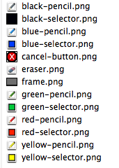

+ Let's add the drawing canvas image to your stage. Click the stage, and then click 'Upload backdrop from file'.

	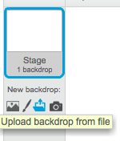

+ Find your 'Resources folder', and choose the file called 'frame.png'. Your stage should now look like this:

	

+ Let's also add a pen to your project. Click 'Upload sprite from file' and choose the image called 'blue-pencil.png' from your resources folder. Click the `i` {.blockmotion} icon, and name this sprite 'Pen'.

	

+ As you'll be using the mouse to draw, you'll want the pen to always follow the mouse. Add this code to your pen sprite:

	```blocks
		when flag clicked
		forever
		  go to [mouse pointer v]
		end
	```

+ Test out this code by clicking the flag and then moving the mouse around the stage. Does this work as you expected?

+ Have you noticed that it's the center of the pen, and not the tip, that follows the mouse pointer? 

	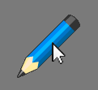

	To fix this, click on the 'blue-pencil' costume of your pen sprite, and click 'Set costume center'. 

	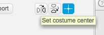

+ You should notice that a crosshair appears on the costume. You can now click just below the tip of the pen, to set this point as the costume center.

	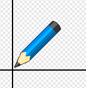

+ Click the 'Scripts' tab, and then test out your pen again - does it work better than it did before?

+ Next, let's make your pen draw whenever the mouse has been clicked. Add this code to your pen sprite:

	```blocks
		when flag clicked
		forever
		  go to [mouse pointer v]
		  if <mouse down?> then
		    pen down
		  else
		    pen up
		  end
		end
	```

	As well as using a `forever` {.blockcontrol} loop to make the pen follow the mouse, you've now also used an `if` {.blockcontrol} statement to draw on the stage if the mouse button is being held down.

+ Test your code again. This time, move the pen around the stage and hold down the mouse button. Can you draw with your pen?

	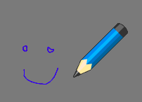

+ There's one more problem with the pen - you can draw anywhere on the stage, including the bit below the drawing surface!

	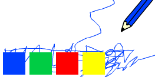

	To fix this, you have to tell the pen only to draw if the mouse is clicked _and_ if the y-position of the mouse is greater than -110 (`mouse y`{.blocksensing}`> -110` {.blockoperators}). Change your pen's `if` {.blockcontrol} statement to look like this:

	```blocks
		when flag clicked
		forever
		  go to [mouse pointer v]
		  if < <mouse down?> and < (mouse y) > (-110) > > then
		    pen down
		  else
		    pen up
		  end
		end
	```

+ Test your project; you now shouldn't be able to draw below the drawing surface.

	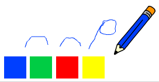

## Save your project { .save }

# Step 2: Coloured pens { .activity }

Let's add different colour pens to your project, and allow the user to choose between them!

## Activity Checklist { .check }

+ First, let's add another green pen costume to your pen sprite. Click on your pen sprite, and click 'Upload costume from file' and select the 'green-pencil.png' image to add it to your sprite. Remember to set the center of your new costume.

	

+ You also need to add two sprites, that will be used to select the colour of the pen. Click 'Upload sprite from file' to add both the 'blue-selector.png' and 'green-selector.png' images as separate sprites.

	Your stage should now look like this:

	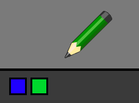

+ When the green selector icon is clicked, you need to `broadcast` {.blockevents} a message to the pen sprite, telling it to change its costume and pen colour. To do this, firstly add this code to the green selector icon:

	```blocks
		when this sprite clicked
		broadcast [green v]
	```

	To create the `broadcast` {.blockevents} block, click the down arrow and select 'new message...'. 

	

	You can then type 'green' to create your new message.

	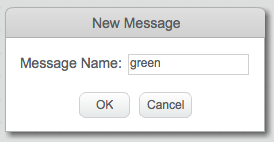

+ You now need you tell your pen sprite what to do when it receives the message. Add this code to your pen sprite:

	```blocks
		when I receive [green v]
		switch costume to [green-pencil v]
		set pen color to [#00FF00]
	```

	To set the pen to colour to green, click the coloured box in the `set color` {.blockpen} block, and click on the green selector icon to choose green as your pen colour.

+ You can now do the same for the blue pen icon, adding this code to the blue selector sprite:

	```blocks
		when this sprite clicked
		broadcast [blue v]
	```

	...and adding this code to the pen sprite:

	```blocks
		when I receive [blue v]
		switch costume to [blue-pencil v]
		set pen color to [#0000FF]
	```

+ Finally, you need to tell your pen sprite what costume and pen colour to choose, as well as clearing the screen, when your project is started. Add this code to the beginning of the pen's `when flag clicked` {.blockevents} code (before the `forever` {.blockcontrol} loop):

	```blocks
		clear
		switch costume to [blue-pencil v]
		set pen color to [#0000FF]
	```

	If you prefer, you can start with a different colour pen!

+ Test out your project. Can you switch between blue and green pens?

	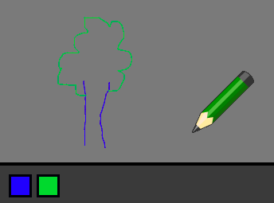

## Save your project { .save }

# Step 3: Making mistakes { .activity }

Sometimes mistakes happen, so let's add a 'clear' button and an eraser to our project!

## Activity Checklist { .check }

+ As well as clearing the canvas when your project is started, let's add a button to clear the canvas as well. To do this, add a new sprite using the 'cancel-button.png' image in your 'Resources' folder.

	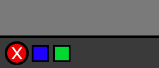

+ Add code to this new cancel button to clear the canvas when it's clicked. 

	```blocks
		when this sprite clicked
		clear
	```

	Notice that you don't need to send a message to clear the canvas, as any sprite can do it!

+ You can also create an eraser. To do this, add the 'eraser.png' image as a new costume to your pen sprite (remember to set the costume center) _and_ as a new selector sprite.

	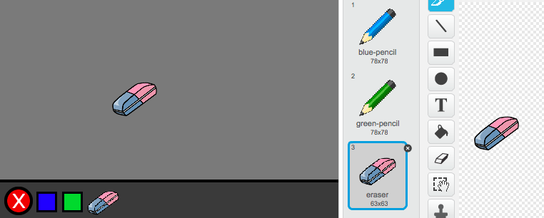 

+ You can then add code to the eraser selector sprite, to tell the pen to switch to an eraser.

	```blocks
		when this sprite clicked
		broadcast [eraser v]
	```

+ When the pen recieves this message, you can create an eraser by switching the pen costume to the eraser, and switching the pen colour to the same colour as the canvas!

	```blocks
		when I receive [eraser v]
		switch costume to [eraser v]
		set pen color to [#8d8d8d]
	```

+ Test your project, to see if you can clear and erase on the canvas.

	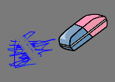

# Step 4: Changing the pen width { .activity }

Let's allow the user to draw using a range of different pen sizes.

## Activity Checklist { .check }

+ First, add a new variable called 'width'. If you're not sure how to do this, the 'Balloons' project will help you.

+ Add this line _inside_ the `forever` {.blockcontrol} loop of your pen's code:

	```blocks
		set pen size to (width)
	```

	Your pen width will now repeatedly be set to the value of your 'width' variable.

+ You can change the number stored in this variable by right-clicking on your variable (on the stage) and clicking 'slider'.

	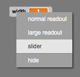

	You can now drag the slider below the variable to change its value.

	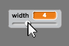

+ Test your project, and see if you can modify the pen width.

	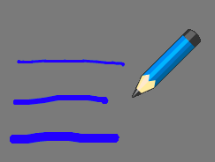

	If you prefer, you can set the minimum and maximum value of 'width' that's allowed. To do this, right-click on your variable again and click 'set slider min and max'. Set the minimum and maximum values of your variable to something more sensible, like 1 and 20.

	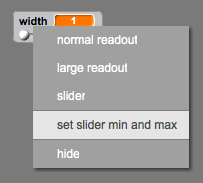

	Keep testing your 'width' variable until you're happy.

## Save your project { .save }

## Challenge: Shortcuts {.challenge}
Can you create keyboard shortcuts for your commands? For example:
+ b = Switch to blue pen
+ g = switch to green pen
+ e = switch to eraser
+ c = clear screen

You could even allow the user to change the pen width with the arrow keys!

## Save your project { .save }

## Challenge: More pens {.challenge}
Can you add red, yellow and black pens to your paint program? You'll find all of the images you need in your 'Resources' folder. Remember to add keyboard shortcuts for these new pens! 

Can you use your pens to draw a picture?


## Save your project { .save }