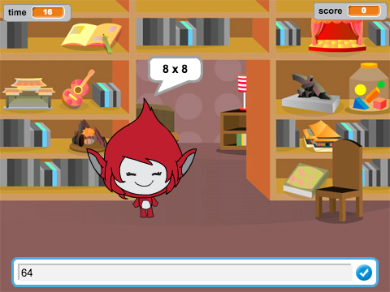
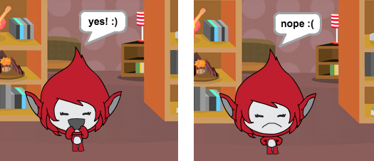
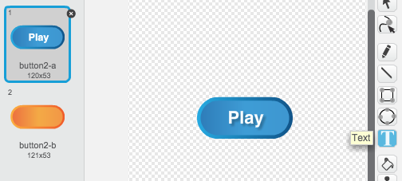
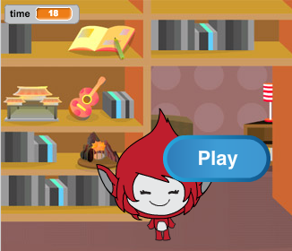
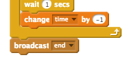
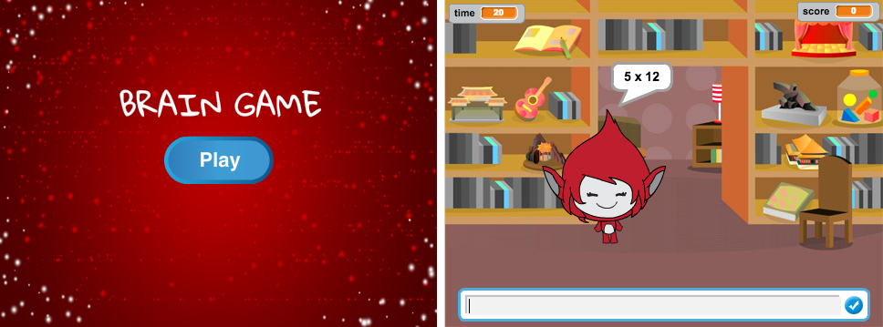
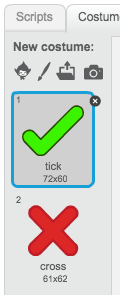
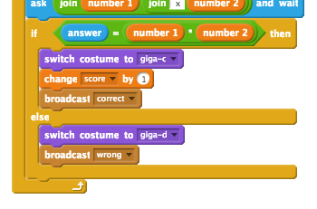
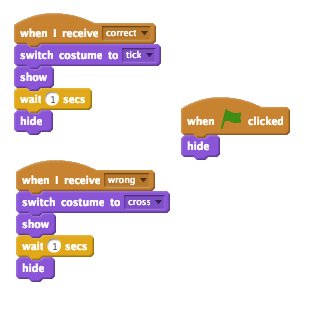
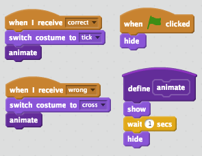

---
title: Brain Game
level: Scratch 2
language: en-GB
stylesheet: scratch
embeds: "*.png"
materials: ["Club Leader Resources/*"]
...

# Introduction { .intro }

In this project you'll learn how to create a times table quiz, in which you have to get as many answers correct as you can in 30 seconds.

<div class="scratch-preview">
  <iframe allowtransparency="true" width="485" height="402" src="http://scratch.mit.edu/projects/embed/42225768/?autostart=false" frameborder="0"></iframe>
  
</div>

# Step 1: Creating questions { .activity }

Let's start by creating random questions for the player to answer.

## Activity Checklist { .check }

+ Start a new Scratch project, and delete the cat sprite so that your project is empty. You can find the online Scratch editor at <a href="http://jumpto.cc/scratch-new">jumpto.cc/scratch-new</a>.

+ Choose a character and a backdrop for your game. You can choose any you like! Here's an example:

		

+ Create 2 new variables called `number 1` {.blockdata} and `number 2` {.blockdata}. These variables will store the 2 numbers that will be multiplied together.

	

+ Add code to your character, to set both of these variables to a `random` {.blockoperators} number between 2 and 12.

	```blocks
		when flag clicked
		set [number 1 v] to (pick random (2) to (12))
		set [number 2 v] to (pick random (2) to (12))
	```

+ You can then ask the player for the answer, and let them know if they were right or wrong.

	```blocks
		when flag clicked
		set [number 1 v] to (pick random (2) to (12))
		set [number 2 v] to (pick random (2) to (12))
		ask (join (number 1)(join [ x ] (number 2))) and wait
		if <(answer) = ((number 1)*(number 2))> then
			say [yes! :)] for (2) secs
		else
			say [nope :(] for (2) secs
		end
	```

+ Test your project fully, by answering one question correctly and one with the wrong answer.

+ Add a `forever` {.blockcontrol} loop around this code, so that the player is asked lots of questions.

+ Create a countdown timer on the stage, using a variable called `time` {.blockdata}. The 'Balloons' project has instructions for making a timer (in step 6) if you need help!

+ Test your project again - you should be able to continue asking questions until the time runs out.

## Save your project { .save }

## Challenge: Changing costumes {.challenge}
Can you change your character's costumes, so that they respond to the player's answer?



## Challenge: Adding a score {.challenge}
Can you add a score to your game? You can add a point for every correct answer. If you're feeling mean, you could even reset the player's score to 0 if they get a question wrong!

## Save your project { .save }

# Step 2: Multiple games { .activity .new-page}

Let's add a 'play' button to your game, so that you can play lots of times.

## Activity Checklist { .check }

+ Create a new 'Play' button sprite, which your player will click to start a new game. You can draw it yourself, or edit a sprite from the Scratch library.

	

+ Add this code to your new button.

	```blocks
		when flag clicked
		show

		when this sprite clicked
		hide
		broadcast [start v]
	```

	This code shows the play button when your project is started. When the button is clicked, it is hidden and then broadcasts a message that will start the game.

+ You'll need to edit your character's code, so that the game starts when they receive the `start` {.blockevents} message, and not when the flag is clicked.

	Replace the `when flag clicked` {.blockevents} code with `when I receive start` {.blockevents}.

	

+ Click the green flag and then click your new play button to test it. You should see that the game doesn't start until the button is clicked.

+ Did you notice that the timer starts when the green flag is clicked, and not when the game starts? 

	

	Can you fix this problem?

+ Click on the stage, and replace the `stop all` {.blockcontrol} block with an `end` {.blockevents} message.

	

+ You can now add code to your button, to show it again at the end of each game.

	```blocks
		when I receive [end v]
		show
	```

+ You'll also need to stop your character asking questions at the end of each game:

	```blocks
		when I receive [end v]
		stop [other scripts in sprite v]
	```

+ Test your play button by playing a couple of games. You should notice that the play button shows after each game. To make testing easier, you can shorten each game, so that it only lasts a few seconds.

	```blocks
		set [time v] to [10]
	```

+ You can even change how the button looks when the mouse hovers over it.

	```blocks
		when flag clicked
		show
		forever
		if <touching [mouse-pointer v]?> then
			set [fisheye v] effect to (30)
		else
			set [fisheye v] effect to (0)
		end
		end
	```

	

## Save your project { .save }

## Challenge: Start screen {.challenge}
Can you add another backdrop to your stage, which will become your game's start screen? You can use the `when I receive start` {.blockevents} and `when I receive end` {.blockevents} blocks to switch between backdrops.

You can also show and hide your character, and even show and hide your timer by using these blocks:

```blocks
show variable [time v]
```
```blocks
hide variable [time v]
```



## Save your project { .save }

# Step 3: Adding graphics { .activity .new-page}

Instead of your character just saying `yes! :)` or `nope :(` to the player, let's add some graphics that will let the player know how they are doing.

+ Create a new sprite called 'Result', containing both a 'tick' and a 'cross' costume.

	

+ Change your character's code, so that instead of telling the player how they did, it broadcasts `correct` {.blockevents} and `wrong` {.blockevents} messages instead.

	

+ You can now use these messages to show the 'tick' or 'cross' costume. Add this code to your new 'Result' sprite:

		

+ Test out your game again. You should see a tick whenever you get a question correct, and a cross whenever you get one wrong!

	

+ Have you noticed that the code for `when I receive correct` {.blockevents} and `when I receive wrong` {.blockevents} is nearly identical? Let's create a function to make it easier for you to make changes to your code.

	On your 'Result' sprite, click `More Blocks` {.blockmoreblocks}, and then 'Make a Block'. Create a new function called `animate` {.blockmoreblocks}.

	

+ You can then add the animation code into your new animation function, and then just use the function twice:

	

+ Now, if you want to show the tick and the cross for a longer or shorter time, you only need to make one change to your code. Try it!

+ Instead of just showing and hiding the tick and the cross, you could change your animation function, so that the graphics fade in.

	```blocks
		define [animate]
		set [ghost v] effect to (100)		
		show
		repeat (25)
			change [ghost v] effect by (-4)
		end
		hide
	```

## Save your project { .save }

## Challenge: Improved animation {.challenge}
Can you improve the animation of your graphics? You could code the tick and cross so that they fade out as well as fade in. Or, you could use other cool effects:


## Save your project { .save }

## Challenge: Sound and music {.challenge}
Can you add sound effects and music to your game? For example:

+ Playing a sound when the player gets an answer right or wrong;
+ Adding a ticking sound to your countdown timer;
+ Playing a sound when the time is up;

	```blocks
		play drum (10 v) for (0.1) beats
	```

+ You could also constantly play music on a loop (if you're not sure how to do this, step 4 of the 'Rock Band' project will help you). 

## Save your project { .save }

## Challenge: Race to 10 points {.challenge}
Can you change your game, so that instead of answering as many questions as they can in 30 seconds, the player has to see how quickly they can get 10 questions correct?

To do this, you'll only need to change your timer code. Can you see what needs to be changed?

```blocks
	when I receive [start v]
	set [time v] to (30)
	repeat until <(time) = [0]>
		wait (1) secs
		change [time v] by (-1)
	end
	broadcast [end v]
```

## Save your project { .save }

## Challenge: Instruction screen {.challenge}
Can you add an instructions screen to your game, telling your player how to play the game? You'll need an 'Instructions' button, and another stage background.


You may also need a 'Back' button to take you to the main menu.

```blocks
	broadcast [main menu v]
```

## Save your project { .save }
