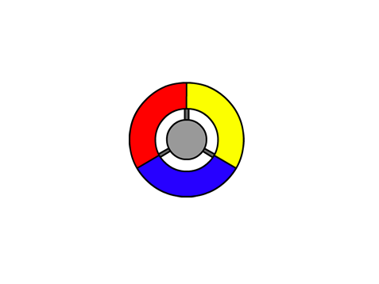
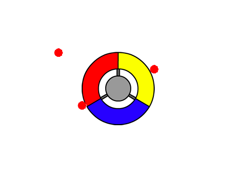
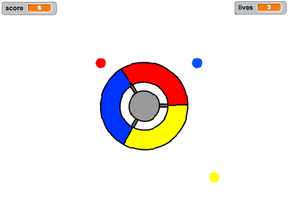
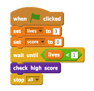

---
title: Catch the Dots
level: Scratch 2
language: en-GB
stylesheet: scratch
embeds: "*.png"
materials: ["Club Leader Resources/*", "Project Resources/*"]
beta: true
...

# Introduction { .intro }

In this project you'll learn how to create a game, in which you have to match up coloured dots with the correct part of the controller.

<div class="scratch-preview">
  <iframe allowtransparency="true" width="485" height="402" src="http://scratch.mit.edu/projects/embed/44942820/?autostart=false" frameborder="0"></iframe>
  
</div>

# Step 1: Creating a controller { .activity }

Let's start by creating a controller, that will be used to collect dots.

## Activity Checklist { .check }

+ Start a new Scratch project, and delete the cat sprite so that your project is empty. You can find the online Scratch editor at <a href="http://jumpto.cc/scratch-new">jumpto.cc/scratch-new</a>.

+ If your club leader has given you a 'Resources' folder, click 'Upload sprite from file' and add the 'controller.svg' image. You should move this sprite to the center of the stage.

	
	
	If you don't have this image, you can draw it yourself!
	
+ Turn your controller to the right when the right arrow key is pressed:

	```blocks
		when flag clicked
		forever
			if <key [right arrow v] pressed?> then
				turn right (3) degrees
			end
		end
	```
+ Test out your controller -- it should spin to the right.

## Save your project { .save }

## Challenge: Spinning left {.challenge}
Can you make your controller spin to the left when the left arrow key is pressed?

## Save your project { .save }

# Step 2: Collecting dots { .activity }

Let's add some dots for the player to collect with their controller.

## Activity Checklist { .check }

+ Create a new sprite called 'red'. This sprite should be a small red dot.

	

+ Add this script to your 'red' dot sprite, to create a new dot clone every few seconds:

	```blocks
		when flag clicked
		wait (2) secs
		forever
			create clone of [myself v]
			wait (pick random (5) to (10)) secs
		end
	```

+ When each clone is created, you want it to appear in one of the 4 corners of the stage.

	

	To do this, first create a new list variable called `start positions` {.blockdata} and click the `(+)` to add in the values `-180` and `180`.

	

+ You can use these 2 list items to pick a random corner of the stage. Add this code to the 'dot' sprite, so that each new clone moves to a random corner and then slowly moves towards the controller.

	```blocks
		when I start as a clone
		go to x: (item (random v) of [start positions v]) y: (item (random v) of [start positions v])
		point towards [controller v]
		show
		repeat until <touching [controller v]?>
			move (1) steps
		end
	```

	The code above chooses either `-180` or `180` for the x _and_ y positions, meaning that each clone starts in one corner of the stage.

+ Test your project. You should see lots of red dots appear in each corner of the screen, and move slowly towards the controller.

	

+ Create 2 new variables called `lives` {.blockdata} and `score` {.blockdata}.

+ Add code to your stage to set the `lives` {.blockdata} to 3 and the `score` {.blockdata} to 0 at the start of the game.

+ You need to add code to the end of your red dot's `when I start as a clone` {.blockcontrol} code, so that either 1 is added to the player's `score` {.blockdata} if the colours match, or 1 is taken from the player's `lives` {.blockdata} if the colours don't match.

	```blocks
		move (5) steps
		if <touching color [#FF0000]?> then
			change [score v] by (1)
			play sound [pop v]
		else
			change [lives v] by (-1)
			play sound [laser1 v]
		end
		delete this clone
	```

+ Add this code to the end of your stage's script, so that the game ends when the player loses all of their lives:

	```blocks
		wait until <(lives) < [1]>
		stop [all v]
	```

+ Test your game to make sure this code works as expected.

## Save your project { .save }

## Challenge: More dots {.challenge}
Duplicate your 'red' dot sprite twice, and name the two new sprites 'yellow' and 'blue'.


Edit these sprites (including their code), so that each coloured dot has to match the correct colour on the controller. Remember to test your project, making sure you gain points and lose lives at the right times, and that your game isn't too easy or too hard!



## Save your project { .save }

# Step 3: Increasing the difficulty { .activity .new-page}

Let's make the game get more difficult the longer the player survives, by slowly reducing the delay between dots appearing.

## Activity Checklist { .check }

+ Create a new variable called `delay` {.blockdata}.

+ On your stage, create a new script that sets the delay to a high number, and then slowly reduces the delay time.

	```blocks
		when flag clicked
		set [delay v] to (8)
		repeat until < (delay) = (2)>
			wait (10) secs
			change [delay v] by (-0.5)
		end
	```

	Notice that this is very similar to how a game timer works!

+ Finally, you can use this `delay` {.blockdata} variable in your red, yellow and blue dots' scripts. Remove the code that waits a random number of seconds between creating clones, and replace it with your new `delay` {.blockdata} variable:

	```blocks
		wait (delay) secs
	```

+ Test your new `delay` {.blockdata} variable, and see whether the delay between dots reduces slowly. Does this work for all 3 coloured dots? Can you see the value of the `delay` {.blockdata} variable reducing?

## Save your project { .save }

## Challenge: Faster moving dots {.challenge}
Can you improve your game by adding a `speed` {.blockdata} variable, so that the dots start off moving 1 step at a time, and steadily get faster and faster? This will work in a very similar way to the `delay` {.blockdata} variable used above, and you can use this code to help you.

## Save your project { .save }

# Step 4: High score { .activity }

Let's save the high score, so that players can see how well they're doing.

## Activity Checklist { .check }

+ Create a new variable called `high score` {.blockdata}.

+ Click on your stage, and create a new custom block called `check high score` {.blockmoreblocks}.

	

+ Just before the end of the game, add in your new custom block.

	

+ Add code to your custom block to store the current `score` {.blockdata} as the `high score` {.blockdata} `if` {.blockcontrol} it's the highest score so far:

	```blocks
		define [check high score]
		if <(score) > (high score)> then
			set [high score v] to (score)
		end
	```

+ Test the code you've added. Play your game to check whether the `high score` {.blockdata} is updated correctly.

## Save your project { .save }

## Challenge: Improve your game! {.challenge}
Can you think of ways to improve your game? For example, you could create special dots that:

+ double your score;
+ slow down the dots;
+ hide all the other dots on the screen!

## Save your project { .save }

## Challenge: Game menu {.challenge}
Can you add a menu (with buttons) to your game? You could add an instructions screen, or a separate screen for showing the high score. If you need help with this, the 'Brain Game' project will help you.
