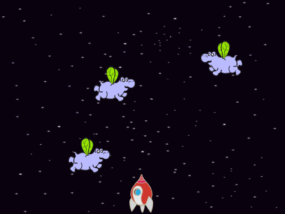
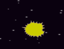
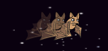
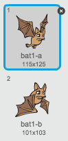

---
title: Clone Wars
level: Scratch 2
language: en-GB
stylesheet: scratch
embeds: "*.png"
materials: ["Club Leader Resources/*"]
beta: true
...

## Community Contributed Project { .challenge .pdf-hidden }
This project was created with Erik. If you'd like to contribute a project of your own, then [get in touch with us on Github](https://github.com/CodeClub).

# Introduction { .intro }

In this project you'll learn how to create a game in which you have to save the Earth from space monsters.

<div class="scratch-preview">
  <iframe allowtransparency="true" width="485" height="402" src="http://scratch.mit.edu/projects/embed/46018140/?autostart=false" frameborder="0"></iframe>
  
</div>

# Step 1: Making a Spaceship { .activity }

Let's make a spaceship that will defend the Earth!

## Activity Checklist { .check }

+ Start a new Scratch project and delete the cat sprite so that your project is empty. You can find the online Scratch editor at <a href="http://jumpto.cc/scratch-new">jumpto.cc/scratch-new</a>.

+ Add the 'stars' backdrop and the 'Spaceship' sprite to your project. Shrink the spaceship and move it near the bottom of the screen.

	

+ Add code to move your spaceship to the left when the left arrow key is pressed. You'll need to use these blocks:

	```blocks
		when flag clicked
		forever
			if <key [left arrow v] pressed?> then
				change x by (-4)
			end
		end
	```

+ Add code to move your spaceship to the right when the right arrow key is pressed.

+ Test your project to see whether you can control your spaceship with the arrow keys.

## Save your project { .save }

# Step 2: Lightning bolts { .activity }

Let's give the spaceship the ability to fire lightning bolts!

## Activity Checklist { .check }

+ Add the 'Lightning' sprite from the Scratch library. Click the sprite's costume and turn the lightning upside-down.

	

+ When the game is started, the lightning should be hidden until the spaceship fires its laser cannons.

	```blocks
		when flag clicked
		hide
	```

+ Add the following code **to the Spaceship** to create a new lightning bolt whenever the space key is pressed.


	```blocks
		when flag clicked
		forever
			if <key [space v] pressed?> then
				create clone of [Lightning v]
			end
		end
	```

+ Whenever a new clone is created, it should start in the same place as the spaceship, and then move up the stage until it touches the edge. Add the following code **to the Lightning sprite**:

	```blocks
		when I start as a clone
		go to [Spaceship v]
		show
		repeat until <touching [edge v] ?>
			change y by (10)
		end
		delete this clone
	```

Note: We move the new clone to the spaceship while it is still hidden, before then showing it. This just looks nicer.

+ Test your lightning, by pressing the space key.

## Save your project { .save }

## Challenge: Fixing the lightning {.challenge}
What happens if you keep the space key held down? Can you use a `wait` {.blockcontrol} block to fix this?

## Save your project { .save }

# Step 3: Flying Space-hippos { .activity }

Let's add lots of flying hippos that are trying to destroy your spaceship.

## Activity Checklist { .check }

+ Create a new sprite from the 'Hippo1' image in the Scratch library.

	

+ Set its rotation style to be left-right only, and add the following code to hide the sprite when the game starts:

	```blocks
		when flag clicked
		hide
	```

+ Create a new variable called `speed` {.blockdata}, that is for the hippo sprite only.

	

	You'll know if you've done this correctly because the variable will have the name of the sprite next to it, like this:

	

+ The following code will create a new hippo every few seconds. **The Stage** is a good place for this code to live:

	```blocks
		when flag clicked
		forever
			wait (pick random (2) to (4)) secs
			create clone of [Hippo1 v]
		end
	```

+ When each hippo clone starts, make it move around the stage (at a random speed) until it gets hit by the lightning. Add this code **to the hippo** sprite:

	```blocks
		when I start as a clone
		set [speed v] to (pick random (2) to (4))
		go to x: (pick random (-220) to (220)) y: (150)
		show
		repeat until <touching [lightning v] ?>
			move (speed) steps
			turn right (pick random (-10) to (10)) degrees
			if on edge, bounce
		end
		delete this clone
	```

+ Test out your hippo code. You should see a new hippo clone appear every few seconds, each moving at its own speed.

	

+ Test your laser cannon. If you hit a hippo, does it vanish?

+ When a hippo touches your spaceship, we need to make the spaceship explode! To do this, first make sure that your spaceship has 2 costumes called 'normal' and 'hit'.

	

	The spaceship's 'hit' costume can be made by importing the 'Sun' image from the Scratch library, and using the 'Color a shape' tool to change its colour.

	

+ Add this code to your spaceship so that it switches costume whenever it collides with a flying hippo:

	```blocks
		when flag clicked
		forever
			switch costume to [normal v]
			wait until <touching [Hippo1 v]>?
			switch costume to [hit v]
			broadcast [hit v]
			wait (1) secs
		end
	```

+ Did you notice that you have broadcast a 'hit' message in the code above? You can use this message to make all of the hippos disappear when the spaceship is hit.

	Add this code to your hippo:

	```blocks
		when I receive [hit v]
		delete this clone
	```

+ Test out this code by starting a new game and colliding with a hippo. 

	

## Save your project { .save }

## Challenge: Lives and Score {.challenge}
Can you add a `lives` {.blockdata}, `score` {.blockdata} or even a `highscore` {.blockdata} to your game? You can use the 'Catch the Dots' project to help you.

## Save your project { .save }

# Step 4: Fruit Bats! { .activity }

Let's make a fruit bat that throws oranges at your spaceship.

## Activity Checklist { .check }

+ Firstly, make a new bat sprite that will `move` {.blockmotion} across the top of the stage `forever` {.blockcontrol}. Remember to test out your code.

	

+ If you look at the bat's costumes, you'll see that it already has 2:

	

	Use the `next costume` {.blocklooks} block to make the bat flap its wings as it moves.

+ Create a new 'Orange' sprite from the Scratch library

	


+ Add code to your bat, so that it creates a new orange clone every few seconds.

	```blocks
		when flag clicked
		forever
			wait (pick random (5) to (10)) secs
			create clone of [Orange v]
		end
	```

+ Click on your orange sprite and add this code to make each orange clone drop down the stage from the bat towards the spaceship:

	```blocks
		when flag clicked
		hide

		when I start as a clone
		go to [Bat1 v]
		show
		repeat until <touching [edge v]?
			change y by (-4)
		end
		delete this clone

		when I receive [hit v]
		delete this clone
	```

+ In your spaceship sprite, you'll need to modify your code so that you are hit if you touch a hippo or an orange:

	```blocks
		wait until < <touching [Hippo1 v]?> or <touching [Orange v]?>>
	``` 

+ Test your game. What happens if you get hit by a falling orange?

## Save your project { .save }

# Step 5: Game over { .activity }

Let's add a 'game over' message at the end of the game.

## Activity Checklist { .check }

+ If you haven't already, create a new variable called `lives` {.blockdata}. Your spaceship should start with 3 lives and lose a life whenever it collides with an enemy. Your game should also stop when you run out of lives. If you need help, you can use the 'Catch the Dots' project to help you.

+ Draw a new sprite called 'Game Over', using the text tool.

	

+ On your stage, broadcast a `game over` {.blockevents} message just before the game ends.

	```blocks
		broadcast [game over v] and wait
	```

+ Add this code to your 'Game Over' sprite, so that the message shows at the end of the game:

	```blocks
		when flag clicked
		hide

		when I receive [game over v]
		show
	```

	Because you've used a `broadcast [game over] and wait` {.blockevents} block on your stage, it will wait for the 'Game Over' sprite to be displayed before ending the game.

+ Test your game. How many points can you score? Can you think of ways to improve your game if it is too easy or too hard?

## Save your project { .save }

## Challenge: Improve your game {.challenge}
What improvements can you make to your game? Here are some ideas:
+ Add health packs that you can collect to gain extra lives;


+ Add floating rocks that your spaceship must avoid;
	


+ Make more enemies appear when your score gets to 100.

```blocks
	wait until <(score) = [100]>
```

## Save your project { .save }