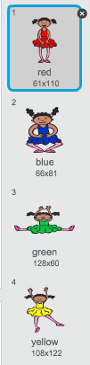
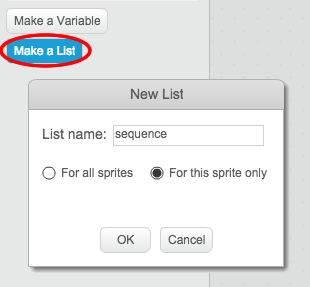
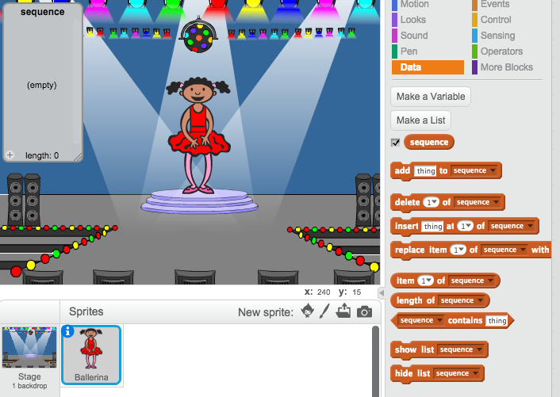
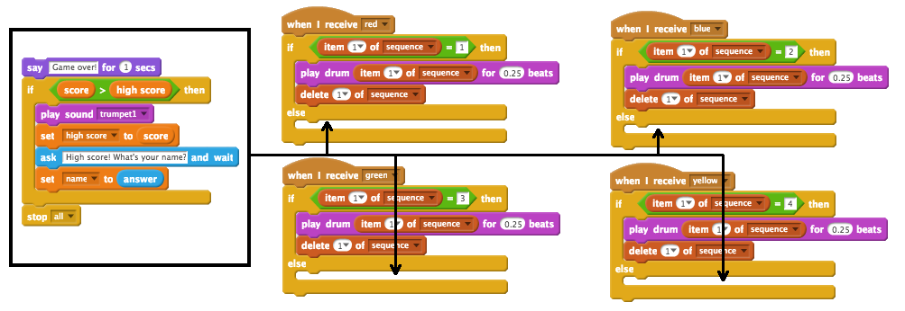
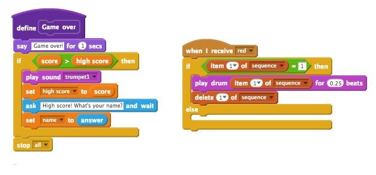
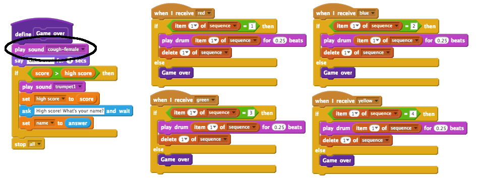

---
title: Memory
level: Scratch 2
language: en-GB
stylesheet: scratch
embeds: "*.png"
materials: ["Club Leader Resources/*"]
...

## Community Contributed Project { .challenge .pdf-hidden }
This project was created with Erik and his daughter Ruth. If you'd like to contribute a project of your own, then [get in touch with us on Github](https://github.com/CodeClub).

# Introduction { .intro }

In this project, you will create a memory game where you have to memorise and repeat a sequence of random colours!

<div class="scratch-preview">
  <iframe allowtransparency="true" width="485" height="402" src="http://scratch.mit.edu/projects/embed/34874510/?autostart=false" frameborder="0"></iframe>
  
</div>

# Step 1: Random colours { .activity }

First, let's create a character that can change to a random sequence of colours for the player to memorise.

## Activity Checklist { .check }

+ Start a new Scratch project, and delete the cat sprite so that your project is empty. You can find the online Scratch editor at <a href="http://jumpto.cc/scratch-new">jumpto.cc/scratch-new</a>.

+ Choose a character and a backdrop. Your character doesn't have to be a person, but it needs to be able to show different colours.

	

+ In your game, you'll use a different number to represent each colour:

	+ 1 = red;
	+ 2 = blue;
	+ 3 = green;
	+ 4 = yellow.

	Give your character 4 different colour costumes, one for each of the 4 colours above. Make sure that your coloured costumes are in the right order.

	

+ To create a random sequence, you need to create a __list__. A list is just a variable that stores lots of data __in order__. Create a new list called `sequence` {.blockdata}. As only your character needs to see the list, we can also click 'For this sprite only'.

	

	You should now see your empty list in the top-left of your stage, as well as lots of new blocks for using lists.

	

+ Add this code to your character, to add a random number to your list (and show the correct costume) 5 times:

	```blocks
		when flag clicked
		delete (all v) of [sequence v]
		repeat (5)
			add (pick random (1) to (4)) to [sequence v]
			switch costume to (item (last v) of [sequence v]
			wait (1) secs
		end
	```

	Notice that you have also emptied the list to begin with.

## Challenge: Adding sound {.challenge}
Test your project a few times. You may notice that sometimes the same number is chosen twice (or more) in a row, making the sequence harder to memorise. Can you make a drum sound play each time the character changes costume?

Can you make a different drum sound play depending on the random number chosen? This will be _very_ similar to your code to change the character's costume.

## Save your project { .save }

# Step 2: Repeating the sequence { .activity }

Let's add 4 buttons, for the player to repeat the sequence they've remembered.

## Activity Checklist { .check }

+ Add 4 sprites to your project, that will become buttons. Edit your 4 sprites, so that there's 1 for each of the 4 colours.

	

+ When the red drum is clicked, you'll need to broadcast a message to your character, letting them know that the red button has been clicked. Add this code to your red drum:

	```blocks
		when this sprite clicked
		broadcast [red v]
	```

+ When your character receives this message, they should check whether the number 1 is at the start of the list (which means that red is the next colour in the sequence). If it is, you can remove the number from the list, as it's been guessed correctly. Otherwise it's game over!

	```blocks
		when I receive [red v]
		if <(item (1 v) of [sequence v])=[1]> then
			delete (1 v) of [sequence v]
		else
			say [Game over!] for (1) secs
			stop [all v]
		end
	```

+ You could also display some flashing lights once the list is empty, as it means the entire sequence has been guessed correctly. Add this code to the end of your character's `when flag clicked` {.blockevents} script:

	```blocks
		wait until < (length of [sequence v]) = [0]>
		broadcast [won v] and wait
	```

+ Click on your stage, and add this code to make the backdrop change colour once the player has won.

	```blocks
		when I receive [won v]
		play sound [drum machine v]
		repeat (50)
			change [color v] effect by (25)
			wait (0.1) secs
		end
		clear graphic effects
	```

## Challenge: Creating 4 buttons {.challenge}
Repeat the steps above for your blue, green and yellow buttons. Which code will stay the same, and which code will change for each button?

You can also add sounds for when the buttons are pressed.

Remember to test the code you've added! Can you memorise a sequence of 5 colours? Is the sequence different each time?

## Save your project { .save }

# Step 3: Multiple levels { .activity .new-page }

So far, the player only has to remember 5 colours. Let's improve your game, so that the length of the sequence increases.

## Activity Checklist { .check }

+ Create a new variable called `score` {.blockdata}.

	

+ This `score` {.blockdata} will be used to decide on the length of the sequence the player has to memorise. So, to begin with the score (and the sequence length) is 3. Add this code block to the start of your character's `when flag clicked` {.blockevents} code:

	```blocks
		set [score v] to [3]
	```

+ Instead of always creating a sequence of 5 colours, you now want the `score` {.blockdata} to determine the sequence length. Change your character's `repeat` {.blockcontrol} loop (for creating the sequence) to:

	```blocks
		repeat (score)
		end
	```

+ If the sequence is guessed correctly, you should add 1 to the score, to increase the length of the sequence.

	```blocks
		change [score v] by (1)
	```

+ Finally, you need to add a `forever` {.blockcontrol} loop around the code to generate the sequence, so that a new sequence is created for each level. This is how your character's code should look:

	```blocks
		when flag clicked
		set [score v] to [3]
		forever
			delete (all v) of [sequence v]
			repeat (score)
				add (pick random (1) to (4)) to [sequence v]
				switch costume to (item (last v) of [sequence v]
				wait (1) secs
			end
			wait until < (length of [sequence v]) = [0]>
			broadcast [won v] and wait
			change [score v] by (1)
		end
	```

+ Get your friends to test out your game. Remember to hide the `sequence` {.blockdata} list before they play it!

## Save your project { .save }

# Step 4: High score { .activity }

Let's save the high score, so that you can play against your friends.

## Activity Checklist { .check }

+ Add 2 new variables to your project, called `high score` {.blockdata} and `name` {.blockdata}.

+ If ever the game ends (by pressing the wrong button), you need to check whether the player's score is higher than the current high score. If it is, you need to save the score as the high score, and store the name of the player. Here's how your red button should look:

	```blocks
		when I receive [red v]
		if <(item (1 v) of [sequence v])=[1]> then
			delete (1 v) of [sequence v]
		else
			say [Game over!] for (1) secs
			if < (score) > (high score) > then
				set [high score v] to (score)
				ask [High score! What is your name?] and wait
				set [name v] to (answer)
			end
			stop [all v]
		end
	```

+ You'll need to add this new code to the other 3 buttons too! Have you noticed that the 'Game over' code in each of the 4 buttons is exactly the same?

	

+ If ever you need to change any of this code, such as adding a sound or changing the 'Game over!' message, you'd have to change it 4 times! That could get annoying, and waste a lot of time.

	Instead, you can define your own blocks, and reuse them in your project! To do this, click `more blocks` {.blockmoreblocks}, and then 'Make a block'. Call this new block 'Game over'.

	

+ Add the code from the `else` {.blockcontrol} block from the red button to the new block that appears:

	

+ You've now made a new _function_ called `Game over` {.blockmoreblocks}, which you can use anywhere you like. Drag your new `Game over` {.blockmoreblocks} block onto the 4 scripts for the buttons.

	

+ Now add a sound for when the wrong button is pressed. You only need to add this code _once_ in the `Game over` {.blockmoreblocks} block that you made, and not 4 separate times!

	

## Challenge: Making more blocks {.challenge}
Do you notice any other code that is the same for all 4 buttons?


Can you make another custom block, that is used by each button?

## Save your project { .save }

## Challenge: Another costume {.challenge}
Have you noticed that your game starts with your character showing one of the 4 colours, and that they always display the last colour in the sequence while the player is repeating the sequence?

Can you add another plain white costume to your character, which is displayed at the start of your game, and when the player is trying to copy the sequence?


## Save your project { .save }

## Challenge: Difficulty level {.challenge}
Can you allow your player to choose between 'easy mode' (using just the red and blue drums) and 'normal mode' (which uses all 4 drums)?

You could even add a 'hard' mode, which makes use of a 5th drum!

## Save your project { .save }
