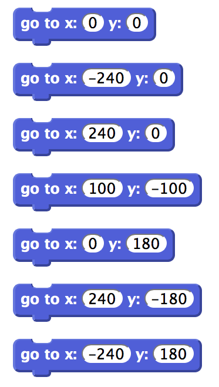
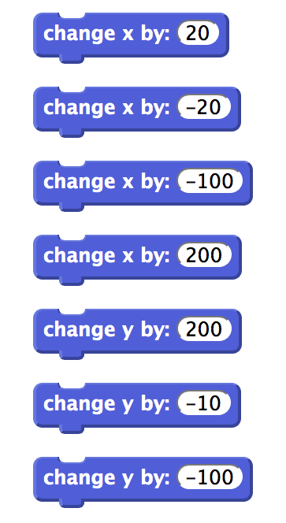
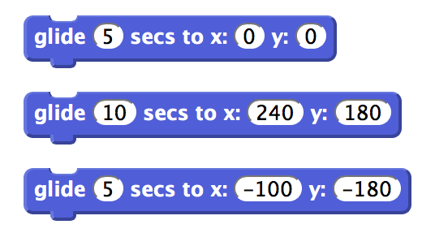
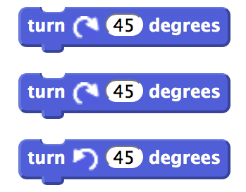
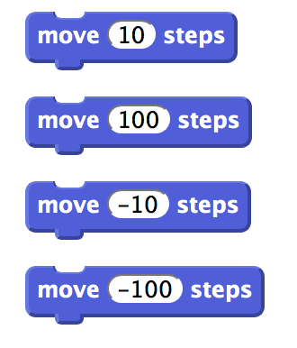

# Interactive Role Play - Coordinates

## Introduction

The idea of this role play is to help the children understand the coordinate system used by scratch.  With a strong understanding of `x` and `y` coordinates as well as an understanding the concept of the direction the sprite is pointing in children can commend great control over the movement of sprites.

When the class reaches the exercises in term one's fireworks project might provide a nice opportunity to run this role play.

This requires a solid understanding of negative numbers and for the children to remember that x is left and right, and y is up and down.

## Basic Premise

Layout a stage onto the floor and give the children paper motions scripts getting them to move around the stage.

## Concepts Covered

This role play should help with the understanding of

1. What a sprite is
2. What the stage is
3. How to control sprite position using absolute coordinates (goto x,y, or glide to x,y)
4. How to control spite position using change (change x by 10, change y by -20)
5. An understanding of how this relates to "Move 10 steps"
6. The difference between goto and glide to

## What to do.

On paper no smaller than A4 print in large the letters 5 co-ordinate locations for the 4 corners of the stage and the centre:

*	`0 x 0`
* `-240 x 180`
* `240 x 180`
* `240 x -180`
* `-240 x -180`

Lay these out on the floor.

Either print out, or write out, lots of goto commands onto separate pieces of paper. If you print them out so they look like scratch I think it's easier to relate back to scratch.  

Arrange the children into a queue of children, and "deal" out pieces of paper one by one, starting with a few concepts and building up. Ask them to hand the pieces of paper back as they go round.

You can use the great [http://blob8108.github.io/scratchblocks2](http://blob8108.github.io/scratchblocks2) web page to render scratch blocks for you.

	go to x:(0) y:(0)

	go to x:(-240) y:(0)

	go to x:(240) y:(0)

	go to x:(100) y:(-100)

	go to x:(0) y:(180)

	go to x:(240) y:(-180)

	go to x:(-240) y:(180)

	change x by: (20)

	change x by: (-20)

	change x by: (-100)

	change x by: (200)

	change y by: (200)

	change y by: (-10)

	change y by: (-100)

	glide (5) secs to x:(0) y:(0)

	glide (10) secs to x:(240) y:(180)

	glide (5) secs to x:(-100) y:(-180)

	turn cw (45) degrees

	turn cw (45) degrees

	turn ccw (45) degrees

	move (10) steps

	move (100) steps

	move (-10) steps

	move (-100) steps

